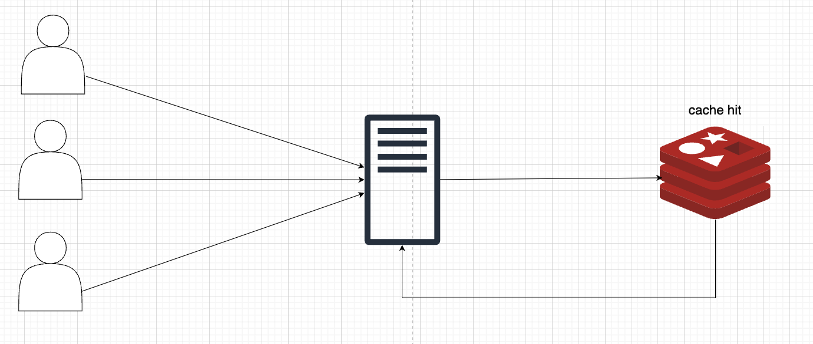
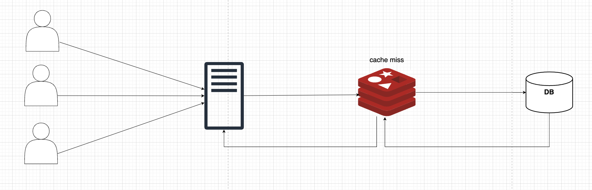
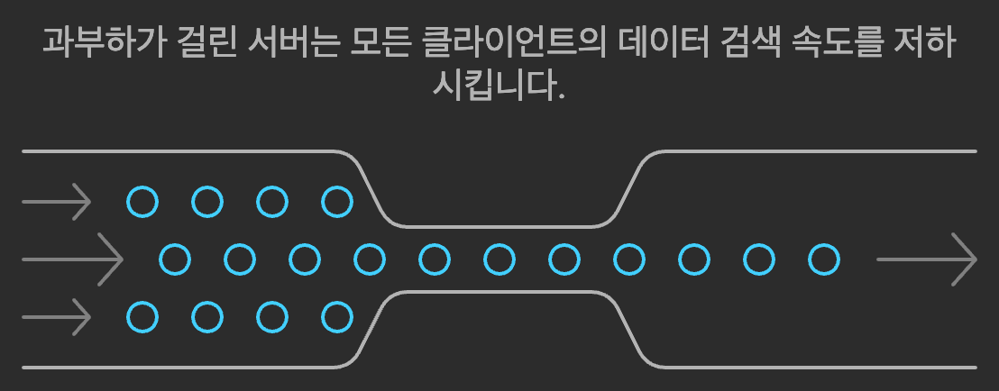
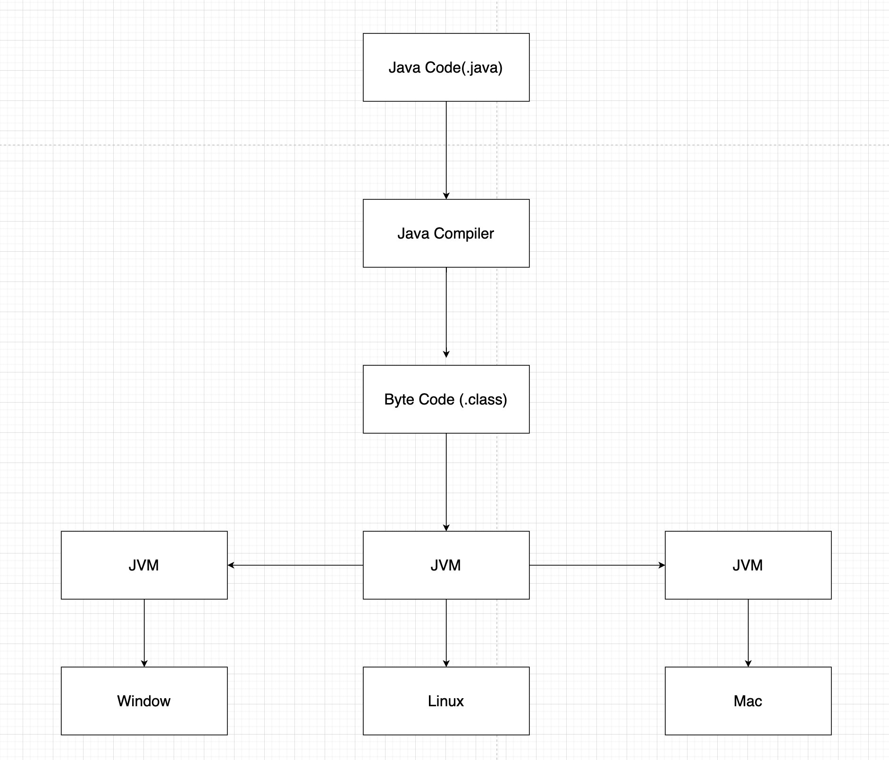
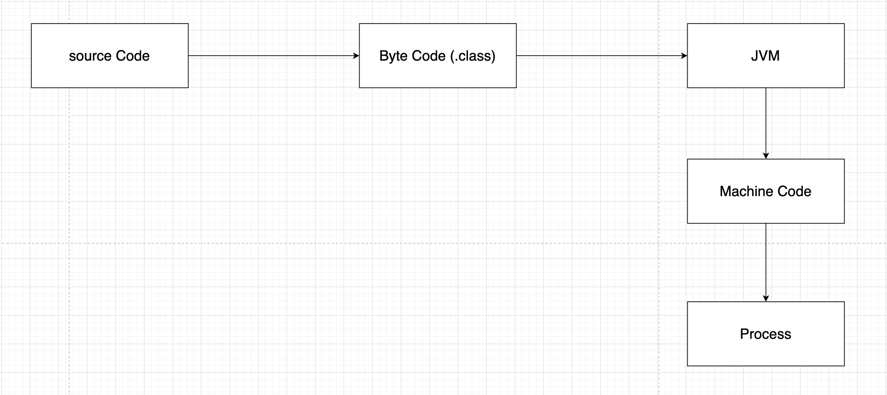

오늘은 if(kakao)에서 들은 캐시 스템피드에 대한 내용을 정리하도록 하겠습니다.

일반적으로 레디스에 원하는 캐시가 있을 시 아래 그림과 같이 데이터를 IMDB에서 가져오게 됩니다.



캐시에 데이터가 없다면 DB에서 조회 후 캐시에 저장한 다음 데이터를 제공합니다.



보통 캐시를 저장할 때 일관적인 시간 데이터 기준으로 데이터를 저장하기 때문에 사용자의 요청 + 다량의 캐시 갱신으로 인해 서버의 부하가 발생될 수 있는데, 이것을 캐시 스템피드 현상이라고 합니다. 실시간 데이터를 중요시하는 서비스일수록 이러한 현상으로 인해 사용자에게 안 좋은 이미지를 전달할 수 있습니다.

> 💡 스템피드는 "동물 무리가 한 방향으로 몰려가는 현상"을 의미합니다. 마치 많은 동물들이 갑자기 놀라서 한 방향으로 무질서하게 몰려가듯이, 캐시가 만료되었을 때 다수의 클라이언트 요청이 동시에 캐시를 갱신하려고 몰리면서 원본 서버에 과부하가 발생하는 현상을 가리킵니다.



해결책으로는 다음과 같은 방식이 있습니다.

1. Lock 방식

    DB 분산락

    장점: 캐시 만료 시점에 단일 요청만 처리하여 DB 부하 감소
    단점: 락 획득 실패한 요청들은 대기 시간 발생으로 응답 지연 문제 존재

2. 캐시 웜업
    - 의미: 애플리케이션 시작 시나 특정 시점에 캐시를 미리 채워 놓는 방식.
    - 방법: 배치 작업을 통해 자주 사용되는 데이터를 미리 캐시에 적재.
    - 문제점:
        - 리모트 캐시 서버 부하로 인한 응답 지연 가능성
        - 캐시 웜업 대상 누락 시 기존 문제(Stampede)가 재발생할 수 있음.

캐시 웜업의 단점(리모트 캐시 서버의 부하)을 보완하고 빠르게 데이터를 제공하기 위해 하이브리드 캐시를 도입합니다.

**하이브리드 캐시**

- 빈번히 사용되고 변화가 많이 없는 데이터는 로컬 캐시로 저장하고 유저들에게 제공해 줍니다.
    - (마케팅 카드, 내비게이터, 리뷰 등)
- 이외의 데이터는 리모트 캐시를 사용하여 리모트 캐시의 부하를 줄입니다.

하이브리드 캐시를 도입하면서 고려해야 될 점은 다음과 같습니다.

- 하이브리드 캐시는 로컬 캐시를 사용하기 때문에 서버가 여러 개일 경우 데이터가 동일하지 않은 경우가 발생할 수 있습니다. 때문에 이를 해결하기 위해 Zookeeper의 Watch를 사용하여 최신 데이터인지 확인하고, 각각의 서버에서 최신 데이터가 아닐 경우 업데이트해주는 방식을 도입합니다.
    - 데이터 수정 발생 시 Zookeeper 노드 값을 현재 시간으로 변경
    Zookeeper가 각 서버에 변경 이벤트 전달
    각 서버는 해당하는 로컬 캐시 데이터 만료 처리

추가적으로 어떤 경우에 캐시 스템피드 현상이 발생되고, 많이 사용되는지 찾아보았습니다.

1. Spring Boot는 서버가 실행된 후, 혹은 서버의 요청이 없는 첫 번째 요청에 대하여 응답 시간이 매우 느리고, 이 현상을 Spring Boot의 Cold Start 문제라고 확인하였습니다.
2. 일괄적으로 캐시가 만료되면서 [사용자의 요청 + 다량의 캐시 갱신]으로 인해 서버의 부하가 발생되고 캐시 스템피드 현상이 발생된다고 확인하였습니다.

[https://www.youtube.com/watch?v=BUV4A2F9i7w&t=1490s](https://www.youtube.com/watch?v=BUV4A2F9i7w&t=1490s)

그렇다면 Spring Boot의 Cold Start는 왜 발생하는지에 대해 확인해 보도록 하겠습니다.

---

### C언어의 동작 방식

C 언어는 컴파일 언어로, 소스 코드를 **기계어**로 직접 변환하여 실행 파일을 생성합니다. 이는 플랫폼 종속적이며, 운영 체제와 하드웨어에서 직접 실행됩니다.


- 예: `hello.c` → 컴파일러 (`gcc`) → 실행 파일 (`hello.exe` 또는 `a.out`)

**주요 단계**

- **소스 코드 작성:** `.c` 파일에 작성
- **컴파일:** 소스 코드를 **기계어**로 변환
- **링킹:** 라이브러리와 연결하여 실행 가능한 바이너리 생성
- **실행:** OS가 바이너리를 로드하고 CPU가 직접 실행

**운영 체제 및 하드웨어 의존성**

C 언어로 작성된 프로그램은 특정 운영 체제와 CPU 아키텍처에 맞게 컴파일됩니다. 즉, Linux에서 컴파일된 바이너리는 Windows에서 실행되지 않으며, x86 CPU용으로 컴파일된 바이너리는 ARM CPU에서 실행되지 않습니다.

---

### JVM(Java Virtual Machine)의 동작 방식

**인터프리터와 JIT 컴파일의 특징**

JVM은 *인터프리터*와 *JIT(Just-In-Time) 컴파일러*를 활용하여 Java 소스 코드를 실행합니다. Java는 **바이트코드**라는 중간 형태로 컴파일된 뒤, JVM이 이 바이트코드를 실행합니다.

- 예: `HelloWorld.java` → 컴파일러 (`javac`) → 바이트코드 (`HelloWorld.class`) → JVM 실행



자바 애플리케이션을 실행한다면, Java 코드를 컴파일을 통해서 바이트 코드로 변환합니다. 바이트 코드는 간결하지만 0과 1만 읽을 수 있는 컴퓨터는 읽을 수 없습니다. 때문에 바이트 코드는 JVM을 위한 중간 코드이고, JVM은 이를 활용하여 바이트 코드를 읽어 기계어로 변환합니다.

하지만 실행 시 바이트 코드를 기계어로 번역하는 작업은 실행 속도가 느리고, 이를 해결하기 위해 JIT(Just-In-Time)을 도입하였습니다.



---

### JIT(Just-In-Time)

JIT(Just-In-Time) 컴파일러는 JVM(Java Virtual Machine)에서 **성능 최적화**를 위해 사용하는 중요한 컴포넌트입니다. 기본적으로 JIT는 바이트코드를 실행 시점에 네이티브 기계어로 컴파일하여 프로그램의 실행 속도를 크게 향상시킵니다.

**왜 필요한가?**

JVM은 바이트코드를 기본적으로 **인터프리터**를 통해 한 줄씩 해석하며 실행합니다. 이는 플랫폼 독립성을 제공하지만 실행 속도가 느립니다. JIT는 이러한 문제를 해결하기 위해, 자주 실행되는 코드를 네이티브 코드로 변환하여

**인터프리터 과정을 생략**하고 더 빠르게 실행할 수 있게 합니다.

> 💡 인터프리터 언어의 느린 실행을 보완하고 성능을 최적화하기 위해 JIT을 도입하였습니다.

## **2. JIT의 동작 방식**

### **2.1. 바이트코드 로드**

- JVM이 바이트코드를 로드하여 실행을 준비합니다.
- 처음에는 바이트코드가 JVM의 **인터프리터**를 통해 한 줄씩 해석됩니다.

### **2.2. 프로파일링 (Profiling)**

- JVM의 **HotSpot** 기술이 자주 실행되는 "핫스팟(Hot Spot)" 코드를 탐지합니다.
    - **핫스팟 코드**: 반복적으로 호출되거나 실행 시간이 긴 코드(예: 루프, 함수).
- 프로파일링 결과를 기반으로, 실행 빈도가 높은 코드를 최적화 대상으로 선정합니다.

### **2.3. 네이티브 코드 변환**

- JIT 컴파일러는 프로파일링 데이터를 기반으로 핫스팟 코드(바이트코드)를 네이티브 코드(기계어)로 변환합니다.
- 변환된 네이티브 코드는 **캐시에 저장**되며 이후에는 인터프리터가 아닌 네이티브 코드로 실행됩니다.

### **2.4. 런타임 최적화**

- JIT는 실행 중에도 코드를 **동적으로 최적화**합니다. 주요 최적화 기법은 다음과 같습니다:
    - **인라인 캐싱**: 자주 호출되는 메서드를 인라인화하여 호출 비용을 줄임.
    - **루프 최적화**: 루프 내에서 불필요한 연산 제거.
    - **데드 코드 제거**: 사용되지 않는 코드를 제거.
    - **브랜치 예측**: 분기 조건을 분석해 실행 경로를 미리 최적화.

## **3. JIT의 최적화 전략**

JIT는 여러 최적화 기법을 사용하여 성능을 개선합니다. 대표적인 최적화 기법은 아래와 같습니다:

### **3.1. 인라인화 (Inlining)**

- 자주 호출되는 메서드를 호출하지 않고 호출 위치에 메서드의 내용을 직접 삽입.
    - 호출 오버헤드 감소.
    - 예: 호출 코드 → **인라인화 결과**

```java
public int add(int a, int b) {
    return a + b;
}
```

```java
int result = add(3, 5);
```

```java
int result = 3 + 5;
```

### **3.2. 루프 최적화 (Loop Optimization)**

- 루프 안에서 변경되지 않는 변수를 루프 밖으로 이동하거나, 반복 연산을 제거.

```java
for (int i = 0; i < array.length; i++) {
    int length = array.length; // 반복적으로 계산
    // 최적화 후: length를 루프 밖으로 이동
}
```

### **3.3. 코드 경로 최적화 (Branch Prediction)**

- 조건문 실행 패턴을 학습하여 가장 자주 실행되는 분기를 우선적으로 실행.

```java
if (a > b) {
    // 예상 경로
} else {
    // 비예상 경로
}
```

### **3.4. 정적 분석과 동적 분석**

- JIT는 런타임에 코드 실행 패턴을 **동적으로 분석**하여 최적화를 수행합니다.
- 이와 동시에 바이트코드의 정적 구조를 분석하여 최적화 가능한 부분을 미리 탐지합니다.

---

## **Cold Start의 주요 원인**

### **1.1. JVM 초기화**

- **JVM이 실행될 때 JIT 컴파일링과 클래스 로딩** 작업이 이루어집니다.
    - JIT 컴파일러는 실행 중에 자주 사용하는 코드를 네이티브 코드로 변환하지만, **`Cold Start 시점에서는 아직 최적화된 네이티브 코드가 생성되지 않아 느립`**니다.

때문에 이를 해결하기 위하여

1. **`애플리케이션이 구동된 후에 'Warm-up'을 수행하여 JIT의 캐시에 저장될 수 있게 호출`**합니다.
2. C1, C2 Compile Count를 통해 제일 최적화될 수 있는 범위로 Warm-up 카운트를 설정합니다.

아래 동영상은 프로젝트를 배포했을 때 발생한 응답 지연에 대한 설명과 그에 따른 Warm-up 해결 방법에 대해 설명해 주었습니다.

[https://www.youtube.com/watch?v=CQi3SS2YspY](https://www.youtube.com/watch?v=CQi3SS2YspY)

오늘은 if(kakao)에서 들은 캐시 스템피드로 인해 발생되는 문제와 해결 방법, 그리고 캐시 스템피드와 유사한 Spring Boot Cold Start에 대한 내용을 정리하였습니다. 실무에서도 충분히 발생될 수 있는 문제로 생각되며, 유사한 현상이 발생될 때 빠르게 대처하기 위해 정리하였습니다. 감사합니다.

- 참고

[[JVM] JIT 컴파일러(Just-In Time Compiler)의 최적화 과정 자세히 살펴보기](https://mangkyu.tistory.com/345)

[JVM warm up / if(kakao)2022](https://www.youtube.com/watch?v=CQi3SS2YspY)

[대용량 트래픽 아니면 안 보셔도 됩니다! 선물하기 서비스 캐싱 전략 / if(kakaoAI)2024](https://www.youtube.com/watch?v=BUV4A2F9i7w&t=1490s)
