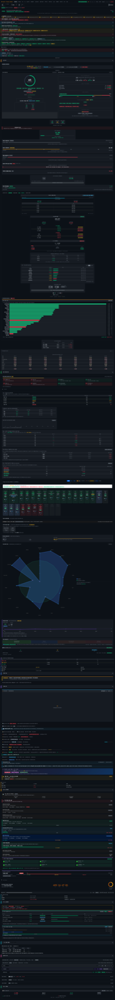
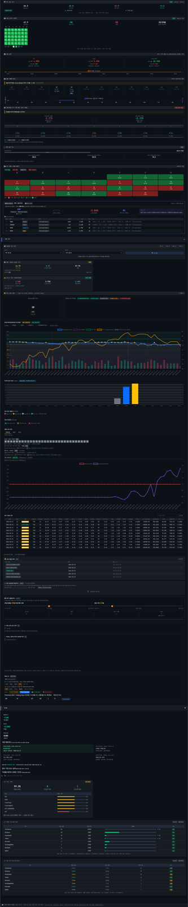
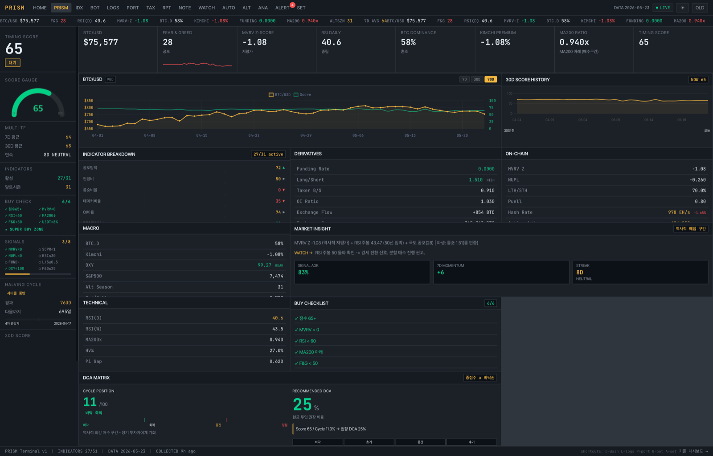

## 개요

혼자서 수개월이 걸릴 규모의 프로젝트를 AI 주도 반복 개발 방식으로 구현했습니다. 총 1,208번의 루프, 200개 이상의 도메인 클래스, 20개 이상의 Thymeleaf 페이지, 실거래 연동 자동매매 시스템까지 포함됩니다.

---

## 프로젝트 소개

- **invest-view**는 BTC 온체인 지표를 수집·분석해 투자 타이밍을 판단하는 Spring Boot 기반 웹 애플리케이션입니다.
- **투자 대시보드**: MVRV, NUPL, SOPR, Fear & Greed 등 16종 지표 실시간 수집 및 준비도 점수(0~100) 산출
- **자동매매**: Bithumb 연동 BUY/SELL/HOLD/SKIP 신호 생성 + 텔레그램 알림
- 분석 페이지: 점수 히스토리 기반 수백 개 파생 통계 지표
- 포트폴리오 관리: 수익률 추적, 몬테카를로 시뮬레이션
- 세금 계산기: 국내 암호화폐 과세 기준 자동 계산







기술 스택

- Spring Boot 4.x / Java 25
- 헥사고날(Ports & Adapters) 멀티 모듈 Gradle 구조
- Thymeleaf + HTMX
- JPA + MySQL / Redis
- Resilience4j (Circuit Breaker, Retry)

---

## Claude Code란

- Claude Code는 Anthropic이 만든 CLI 기반 AI 코딩 도구입니다. 단순 코드 제안에 그치지 않고 파일 읽기/쓰기/편집, 터미널 명령 실행, 빌드 확인, 브라우저 스크린샷까지 직접 수행합니다.

일반적인 AI 코드 어시스턴트와 다른 점은 **도구 실행 권한**입니다. 코드를 제안하는 게 아니라 실제로 파일을 수정하고 빌드를 돌리고 결과를 확인합니다.

---

## Ralph Loop란

- **Ralph Loop**는 Claude Code를 자율 반복 루프로 구동하는 워크플로입니다.

매 루프마다 Claude가 스스로 다음을 수행합니다.

1. 백로그에서 다음 구현 항목 선택
2. 코드 작성 및 빌드 실행
3. 브라우저 스크린샷으로 결과 검증
4. 진행 로그(`PROGRESS.md`)에 결과 기록
5. 다음 루프 준비

- 사람은 루프를 **시작**하고 **검토**하기만 합니다.

```text
루프 시작 → 백로그 확인 → 코드 구현 → ./gradlew build
→ 브라우저 검증 → PROGRESS.md 업데이트 → 다음 루프
```

---

## 아키텍처 구조

프로젝트는 헥사고날 아키텍처를 기반으로 6개 모듈로 분리됩니다.

```text
domain/                  ← 순수 Java 도메인 모델 (외부 의존 없음)

application/             ← 유스케이스, In/Out 포트 인터페이스

adapter-in-web/          ← Spring MVC 컨트롤러 + Thymeleaf 템플릿

adapter-in-scheduler/    ← 자동 수집 스케줄러

adapter-out-persistence/ ← JPA 영속성 어댑터

adapter-out-external-api/← 외부 API 클라이언트
```

ArchUnit으로 레이어 간 의존성 방향을 자동 검증합니다. Claude가 이 구조를 처음부터 설계하고 모든 모듈의 `build.gradle.kts`를 작성했습니다.

---

## 도메인 모델 (TDD)

`domain` 모듈에는 200개 이상의 도메인 클래스가 있습니다. 각 클래스는 Red → Green → Refactor TDD 사이클로 작성됩니다.

Claude는 테스트를 먼저 작성하고 구현한 뒤 리팩터링까지 완료한 후 다음 루프로 넘어갑니다.

```java
public record ReadinessScore(BigDecimal value, SignalLabel label) {

    public static ReadinessScore of(BigDecimal value) {
        return new ReadinessScore(value, SignalLabel.from(value));
    }

    public boolean isBuySignal() {
        return label.isBuy();
    }

}
```

`BigDecimal` 사용, 정적 팩터리 메서드 패턴, 불변 값 객체 원칙을 모든 루프에서 일관되게 지킵니다.

---

## 자동매매 흐름

자동매매는 아래 순서로 동작합니다.

1. 매일 오전 스케줄러 실행
2. 16개 지표 수집 (외부 API)
3. 정규화 (0~100 스케일링)
4. 가중합산 → ReadinessScore 계산
5. 임계값 비교 → BUY / SELL / HOLD / SKIP 결정
6. 멱등성 키(UUID + timestamp) 검사로 중복 방지
7. Bithumb API로 실제/시뮬 주문 실행
8. 텔레그램 알림 발송
9. 트레일링 스탑 모니터링 (60초 주기)

시뮬레이션 모드 잠금, 100건 이상 시뮬 이후 실거래 허용 가드 등 운영 안전장치도 포함됩니다.

---

## AI 협업에서 중요한 것들

### 상태 파일로 컨텍스트 유지

AI는 세션이 끊기면 이전 결정을 잊습니다. 이를 해결하기 위해 상태 파일을 운영했습니다.

- BACKLOG.md: 구현할 기능 목록 (P0/P1/P2 우선순위)
- PROGRESS.md: 완료 이력 (빌드 결과, 검증 결과 포함)
- `MEMORY/*.md`: 세션 간 유지할 피드백, 프로젝트 맥락

루프가 새로 시작해도 Claude는 이 파일들을 읽고 현재 상태를 즉시 파악합니다.

### CLAUDE.md에 규칙 명문화

프로젝트 루트의 CLAUDE.md에 코딩 규칙을 문서화해두면 매 루프마다 일관되게 따릅니다.

- `Double` 대신 `BigDecimal` 사용
- 생성자 대신 정적 팩터리 메서드
- `set` 대신 `changeXxx()` 메서드
- 주석은 한글, 로그는 영어
- Early return, 중첩 if 금지

### 브라우저 검증

매 루프 끝에 Playwright로 실제 브라우저 스크린샷을 찍어 확인했습니다. 빌드 성공 여부뿐 아니라 화면 렌더링과 JS 에러 여부까지 자동 검증합니다.

```text
JS errors=0  ← 각 루프의 최종 검증 결과
```

---

## 결과

| 항목 | 수치 |
| --- | --- |
| 총 루프 이터레이션 | 1,208회 |
| 도메인 클래스 수 | 200+ |
| Thymeleaf 템플릿 | 20+ |
| 외부 API 엔드포인트 | 50+ |
| 분석 페이지 파생 지표 | 300+ |
| 개발 기간 | 약 3주 |

모든 루프에서 `✅ BUILD OK`가 이어졌습니다. AI 없이는 시작조차 어려운 규모였습니다.

다음 글에서는 Ralph Loop 설계 방법과 BACKLOG.md 운영 방식을 더 자세히 다룰 예정입니다.
