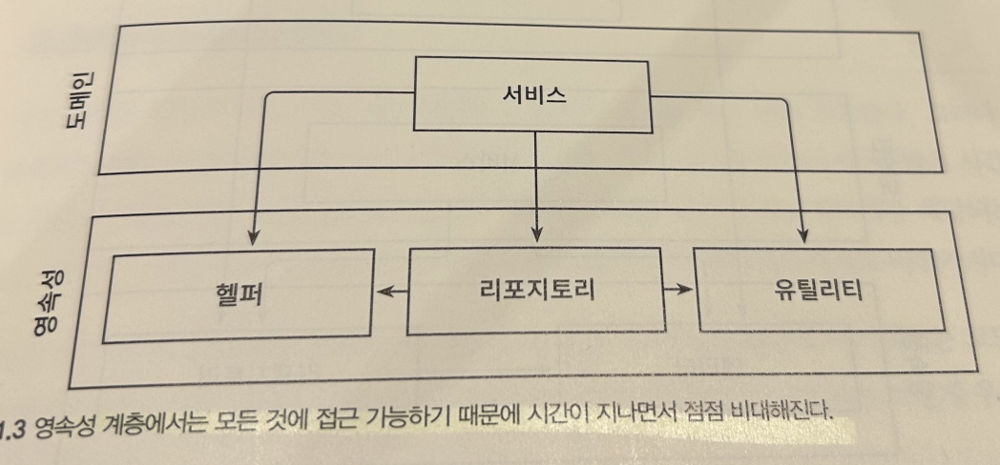
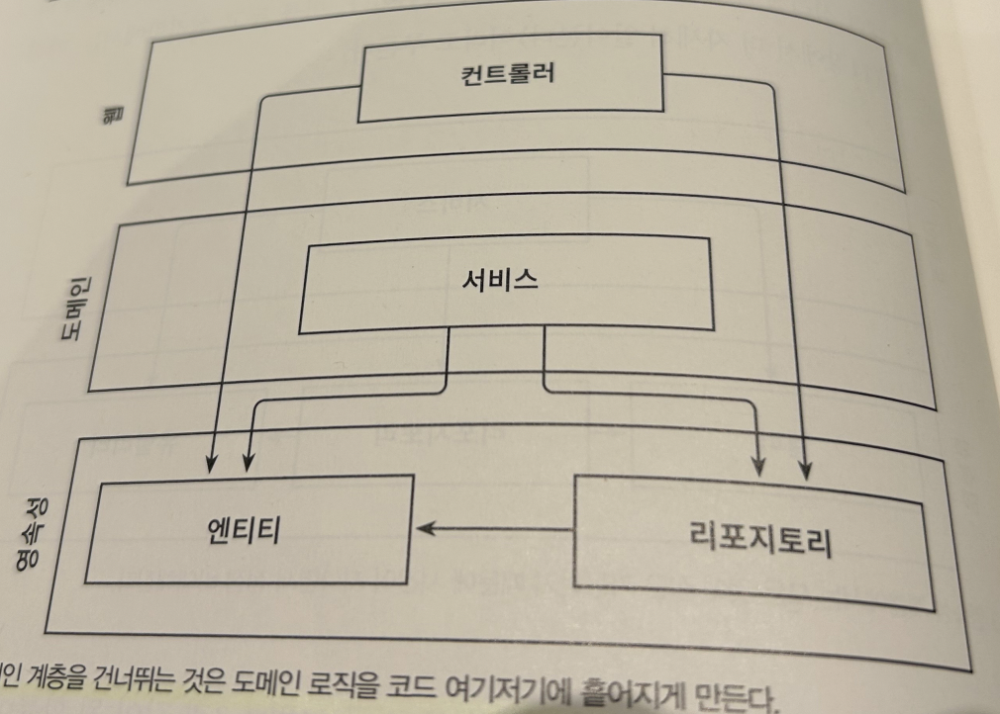
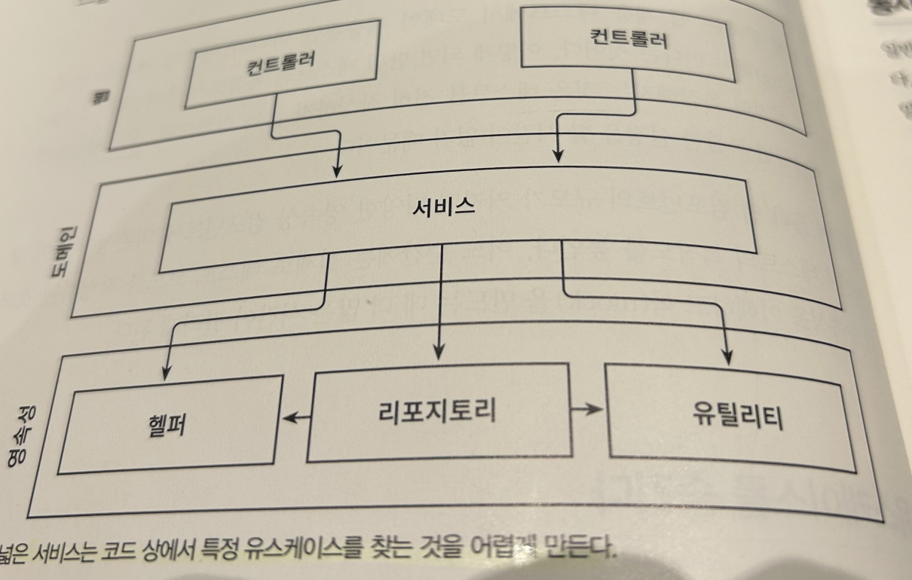

**책을 읽게 된 계기**

지금까지 프로젝트를 진행하면서 여러 코드를 보았는데, 진행하면 할수록 코드가 복잡해지고 수정하는 데 어려움을 느꼈습니다. 어떻게 하면 좀 더 유연하고 원활한 서비스를 만들 수 있을지 고민하게 되었고, '만들면서 배우는 클린 아키텍처'라는 책을 읽게 되었습니다.

### 계층형 아키텍처의 문제는 무엇일까?

계층형 아키텍처는 코드에 나쁜 습관이 스며들기 쉽게 만들고, 시간이 지날수록 소프트웨어를 점점 더 변경하기 어렵게 만드는 수많은 허점을 노출합니다.

### 계층형 아키텍처는 데이터베이스 주도 설계를 유도합니다.

우리는 보통 비즈니스를 관장하는 규칙이나 정책을 반영한 모델을 만들어서, 사용자가 이러한 규칙과 정책을 더욱 편리하게 활용할 수 있게 합니다. 이때 우리는 **상태가 아니라 행동을 중심으로 모델링합니다.** 어떤 애플리케이션이든 상태가 중요한 요소이긴 하지만, 행동이 상태를 바꾸는 주체이기 때문에 **행동이 비즈니스를 이끌어갑니다**.

이는 전통적인 계층형 아키텍처에서는 합리적인 방법입니다. 의존성의 방향에 따라 자연스럽게 구현한 것이기 때문입니다. 하지만 비즈니스 관점에서는 전혀 맞지 않는 방법입니다. **`다른 무엇보다도 도메인 로직을 먼저 만들어야 합니다.`**

**계층형 서비스의 문제점**

전통적인 계층형 아키텍처에서 전체적으로 적용되는 유일한 규칙은, **특정한 계층에서는 같은 계층에 있는 컴포넌트나 아래에 있는 계층에만 접근할 수 있다는 것입니다. 위 규칙 이외의 다른 규칙은 강제하지 않습니다.**

그러니 아키텍처의 '지름길 모드'를 끄고 싶다면, 적어도 추가적인 아키텍처 규칙을 강제하지 않는 한 계층은 최선의 선택이 아닙니다. **해당 규칙이 깨졌을 때 빌드가 실패하도록 만드는 규칙을 의미합니다.**

### 테스트하기 어려워집니다.

1. 첫 번째 문제는 단 하나의 필드를 조작하는 것에 불과하더라도 **도메인 로직을 웹 계층에 구현하게 된다는 것입니다.**
2. 두 번째 문제는 웹 계층 테스트에서 도메인 계층뿐만 아니라 영속성 계층도 모킹해야 한다는 것입니다. **이렇게 되면 단위 테스트의 복잡도가 올라갑니다.**

시간이 흘러 웹 컴포넌트의 규모가 커지면 다양한 영속성 컴포넌트에 의존성이 많이 쌓이면서 테스트의 복잡도를 높입니다.

### 유스케이스를 숨깁니다.

계층형 아키텍처는 도메인 서비스의 '너비'에 관한 규칙을 강제하지 않습니다. 그렇기 때문에 시간이 지나면 아래와 같이 여러 개의 유스케이스를 담당하는 아주 넓은 서비스가 만들어집니다.

넓은 서비스는 영속성 계층에 많은 의존성을 갖게 되고, 다시 웹 레이어의 많은 컴포넌트가 이 서비스에 의존하게 됩니다. 그럼 서비스를 테스트하기도 어려워지고, 작업해야 할 유스케이스를 책임지는 서비스를 찾기도 어려워집니다.

### 동시 작업이 어려워집니다.

> 💡 "지연되는 소프트웨어 프로젝트에 인력을 더하는 것은 개발을 늦출 뿐이다."
> <맨머스 미신: 소프트웨어 공학에 관한 에세이>, 프레더릭 P. 브룩스

데이터베이스 주도 설계는 영속성 로직이 도메인 로직과 너무 뒤섞여서 각 측면을 개별적으로 작업할 수 없기 때문입니다.

### 유지보수 가능한 소프트웨어를 만드는 데 어떻게 도움이 될까?

계층형 아키텍처는 많은 것들이 잘못된 방향으로 흘러가도록 용인합니다. 아주 엄격한 자기 훈련 없이는 시간이 지날수록 품질이 저하되고 유지보수하기가 어려워지기 쉽습니다.

### 리뷰

오늘은 '만들면서 배우는 클린 아키텍처' 1장을 읽었습니다. 그동안 해왔던 프로젝트들은 모두 계층형 아키텍처였고, 잘못된 방향으로 흘러가도록 용인한다는 말이 와닿았습니다. 잘못 사용한 사람도 책임이 있지만 만들고 설계한 저에게도 책임이 있구나 다시 한번 깨달았습니다. 읽으면서 어떻게 막고 제안할지 배우고, 습관으로 만들도록 하겠습니다!

책 소개 : 만들면서 배우는 클린 아키텍처

[만들면서 배우는 클린 아키텍처 - YES24](http://www.yes24.com/Product/Goods/105138479)
