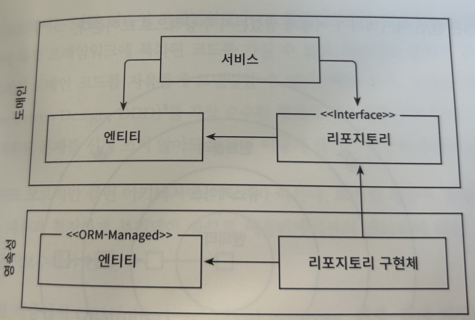
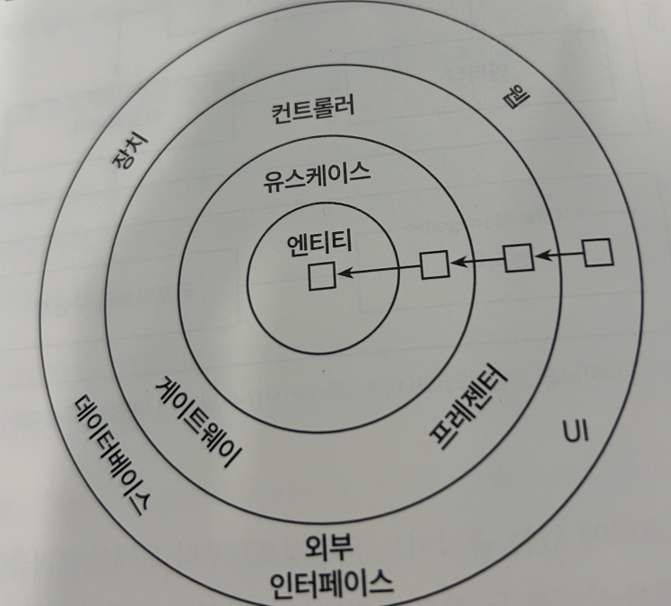
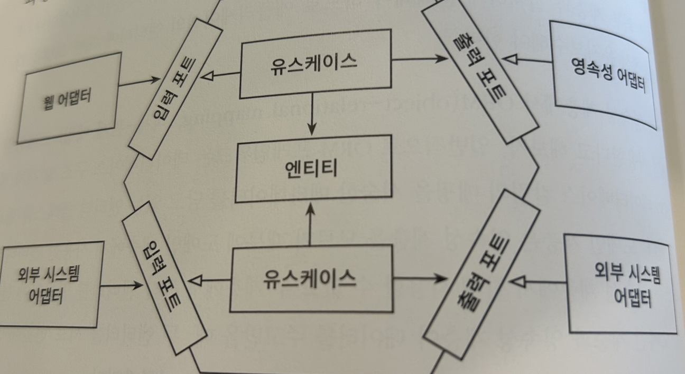

### 단일 책임의 원칙 (SRP)

> 컴포넌트를 변경하는 이유는 오직 하나뿐이어야 합니다.

아마도 단일 책임 원칙을 '단일 변경 이유 원칙'으로 바꿔야 할지도 모르겠습니다.

만약 **컴포넌트를 변경할 이유가 한 가지라면 우리가 어떤 다른 이유로 소프트웨어를 변경하더라도 이 컴포넌트에 대해서는 전혀 신경 쓸 필요가 없습니다**. 안타깝게도 변경할 이유라는 것은 컴포넌트 간의 의존성을 통해 너무도 쉽게 전파됩니다.

많은 코드는 단일 책임 원칙을 위반하기 때문에 시간이 갈수록 변경하기가 더 어려워지고, 그로 인해 변경 비용도 증가합니다.

### 의존성 역전 원칙 (DIP)

계층형 아키텍처에서 계층 간 의존성은 항상 다음 계층인 아래 방향을 가리킵니다.

그러므로 **영속성 계층에 대한 도메인 계층의 의존성 때문에 영속성 계층을 변경할 때마다 잠재적으로 도메인 계층도 변경해야 합니다. `그러나 도메인 코드는 애플리케이션에서 가장 중요한 코드입니다. 영속성 코드가 바뀐다고 해서 도메인 코드까지 바꾸고 싶지는 않습니다.`**

해결 방법은 도메인 계층에 리포지토리에 대한 인터페이스를 만들고, 실제 리포지토리는 영속성 계층에서 구현하게 하는 것입니다. 결과는 아래와 같습니다. **`숨막히는 의존성으로부터 도메인 로직을 해방시켰습니다.`**

### 클린 아키텍처

클린 아키텍처에서는 설계가 비즈니스 규칙의 테스트를 용이하게 하고, 비즈니스 규칙은 프레임워크, 데이터베이스, UI 기술, 그 밖의 외부 애플리케이션이나 인터페이스로부터 독립적일 수 있다고 이야기합니다.

이는 도메인 코드가 바깥으로 향하는 어떤 의존성도 없어야 함을 의미합니다. **`대신 의존성 역전 원칙의 도움으로 모든 의존성이 도메인 코드를 향하고 있습니다.`**

가령 영속성 계층에서 ORM 프레임워크를 사용한다고 해보겠습니다. 도메인 계층은 영속성 계층을 모르기 때문에 도메인 계층에서 사용한 엔티티 클래스를 영속성 계층에서 함께 사용할 수 없고, 두 계층에서 각각 엔티티를 만들어야 합니다. 즉, **`도메인 계층과 영속성 계층이 데이터를 주고받을 때, 두 엔티티를 서로 변환해야 한다는 뜻입니다.`**

### 육각형 아키텍처(헥사고날 아키텍처)

육각형에서 외부로 향하는 의존성이 없기 때문에 마틴이 클린 아키텍처에서 제시한 의존성 규칙이 그대로 적용된다는 점에 주목해야 합니다. 대신 모든 의존성은 코어를 향합니다.

### 유지보수 가능한 소프트웨어를 만드는 데 어떻게 도움이 될까?

의존성을 역전시켜 도메인 코드가 다른 바깥쪽 코드에 의존하지 않게 함으로써, 영속성과 UI에 특화된 모든 문제로부터 도메인 로직의 결합을 제거하고 코드를 변경할 이유의 수를 줄일 수 있습니다.

### 리뷰

오늘은 2장 '의존성 역전하기'를 읽었습니다. 의존성을 코어의 방향으로만 작성하고 영속성과 분리함으로써 코드를 유연하게 변경할 수 있다는 것을 알 수 있었습니다. 아직은 글만 읽었기 때문에 어떤 이야기인지 자세하게 와닿지는 않지만, 뒤에서 작성하는 코드를 통해 자세하게 적어보도록 하겠습니다.

01 [만들면서 배우는 클린 아키텍처] 계층형 아키텍처의 문제는 무엇일까?

03 [만들면서 배우는 클린 아키텍처] 코드 구성하기

책 소개 : 만들면서 배우는 클린 아키텍처

[만들면서 배우는 클린 아키텍처 - YES24](http://www.yes24.com/Product/Goods/105138479)
