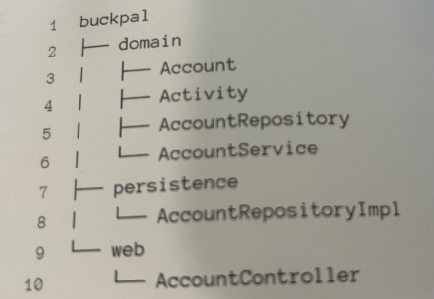
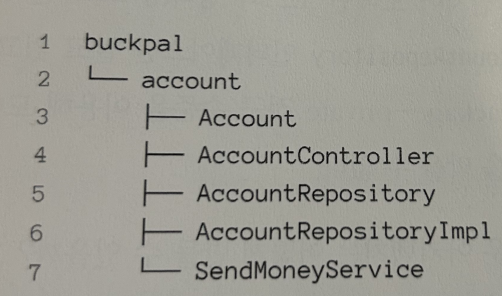
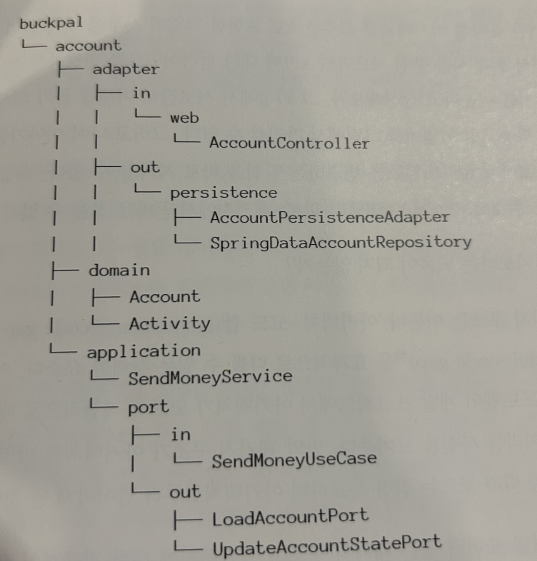

### 계층으로 구성하기

코드를 구조화하는 첫 번째 접근법은 계층을 이용하는 것으로, 다음과 같이 코드를 구성할 수 있습니다.

그러나 적어도 세 가지 이유로 이 패키지 구조는 최적의 구조가 아닙니다.

첫 번째로, 애플리케이션의 기능 조각이나 특성을 구분 짓는 패키지 경계가 없습니다. 사용자를 관리하는 기능을 추가해야 한다면 web 패키지에 UserController를 추가하고, domain 패키지에 UserService, UserRepository, User를 추가하고, persistence 패키지에 UserRepositoryImpl을 추가하게 될 것입니다. 추가적인 구조가 없다면, 아주 빠르게 서로 연관되지 않은 기능들끼리 예상하지 못한 부수 효과를 일으킬 수 있는 클래스들의 엉망진창 묶음으로 변모할 가능성이 큽니다.

두 번째로, 애플리케이션이 어떤 유스케이스들을 제공하는지 파악할 수 없습니다. AccountService와 AccountController가 어떤 유스케이스를 구현했는지 파악할 수 있을까요?

### 기능으로 구성하기

'계층으로 구성하기' 방법의 몇 가지 문제를 해결해 보겠습니다.

다음 접근법은 예제 코드를 기능으로 구성한 것입니다.

가장 본질적인 변경은 계좌와 관련된 모든 코드를 최상위의 account 패키지에 넣었다는 것입니다.

**장점**

각 기능을 묶은 새로운 그룹은 account와 같은 레벨의 새로운 패키지로 들어가고, 패키지 외부에서 접근되면 안 되는 클래스들에 대해 **package-private 접근 수준을 이용해 경계를 강화할 수 있습니다.**

AccountService의 책임을 좁히기 위해 SendMoneyService로 클래스명을 바꿨습니다. 이제 **'송금하기' 유스케이스를 구현한 코드는 클래스명만으로 찾을 수 있게 됐습니다.**

**단점**

사실 계층에 의한 패키징 방식보다 **아키텍처의 가시성을 훨씬 더 떨어뜨립니다.** 어댑터를 나타내는 패키지명이 없고, 인커밍 포트, 아웃고잉 포트를 확인할 수 없습니다. 도메인 코드와 영속성 코드 간의 의존성을 역전시켜 SendMoneyService가 AccountRepository 인터페이스만 알고 구현체는 알 수 없도록 했음에도 불구하고, package-private 접근 수준을 이용해 도메인 코드가 실수로 영속성 코드에 의존하는 것을 막을 수는 없습니다.

### 아키텍처적으로 표현력 있는 패키지 구조

육각형 아키텍처에서 구조적으로 핵심적인 요소는 엔티티, 유스케이스, 인커밍/아웃고잉 포트, 인커밍/아웃고잉 어댑터입니다.

이 패키지에 들어 있는 모든 클래스는 application 패키지 내에 있는 포트 인터페이스를 통하지 않고는 바깥에서 호출되지 않기 때문에 package-private 접근 수준으로 둬도 됩니다. 그러므로 **`애플리케이션 계층에서 어댑터 클래스로 향하는 우발적인 의존성은 있을 수 없습니다.`**

### 리뷰

오늘은 클린 아키텍처의 패키지 구조에 대해 알게 됐습니다. 계층형보다는 아키텍처적으로 표현이 되어 있는 패키지를 통해 우발적인 의존성을 제거하고, 좀 더 원활하게 서비스를 찾을 수 있게 구성해야 한다는 것을 알 수 있었습니다. 좀 더 많은 내용이 있지만 9장과 다음 장에서 코드를 통해 전달한다고 하니, 그 부분에서 좀 더 자세하게 작성하겠습니다.

02 [만들면서 배우는 클린 아키텍처] 의존성 역전하기

04 [만들면서 배우는 클린 아키텍처] 유스케이스 구현하기

책 소개 : 만들면서 배우는 클린 아키텍처

[만들면서 배우는 클린 아키텍처 - YES24](http://www.yes24.com/Product/Goods/105138479)
