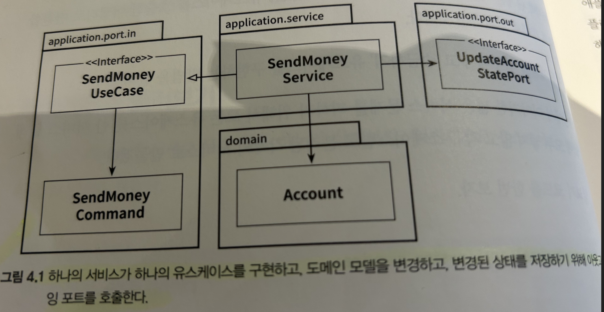
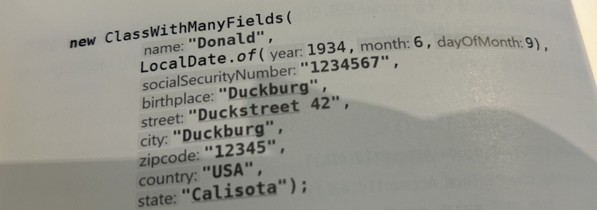

### 도메인 모델 구현하기

```java
package io.reflectoring.buckpal.account.domain;

import java.time.LocalDateTime;
import java.util.Optional;

import lombok.AccessLevel;
import lombok.AllArgsConstructor;
import lombok.Getter;
import lombok.Value;

@AllArgsConstructor(access = AccessLevel.PRIVATE)
public class Account {


	@Getter private final AccountId id;

	@Getter private final Money baselineBalance;

	@Getter private final ActivityWindow activityWindow;

	public static Account withoutId(
					Money baselineBalance,
					ActivityWindow activityWindow) {
		return new Account(null, baselineBalance, activityWindow);
	}

	public static Account withId(
					AccountId accountId,
					Money baselineBalance,
					ActivityWindow activityWindow) {
		return new Account(accountId, baselineBalance, activityWindow);
	}

	public Optional<AccountId> getId(){
		return Optional.ofNullable(this.id);
	}

	public Money calculateBalance() {
		return Money.add(
				this.baselineBalance,
				this.activityWindow.calculateBalance(this.id));
	}

	public boolean withdraw(Money money, AccountId targetAccountId) {

		if (!mayWithdraw(money)) {
			return false;
		}

		Activity withdrawal = new Activity(
				this.id,
				this.id,
				targetAccountId,
				LocalDateTime.now(),
				money);
		this.activityWindow.addActivity(withdrawal);
		return true;
	}

	private boolean mayWithdraw(Money money) {
		return Money.add(
				this.calculateBalance(),
				money.negate())
				.isPositiveOrZero();
	}

	public boolean deposit(Money money, AccountId sourceAccountId) {
		Activity deposit = new Activity(
				this.id,
				sourceAccountId,
				this.id,
				LocalDateTime.now(),
				money);
		this.activityWindow.addActivity(deposit);
		return true;
	}

	@Value
	public static class AccountId {
		private Long value;
	}

}
```

`Account` 엔티티는 실제 계좌의 현재 스냅숏을 제공합니다. `Account`에 대한 모든 입금과 출금은 `Activity` 엔티티에 포착됩니다. 한 계좌에 대한 모든 활동을 항상 메모리에 올리는 것은 현명한 방법이 아닙니다. `Account` 엔티티는 `ActivityWindow` 값 객체에서 포착한 지난 며칠 혹은 몇 주간의 활동만 보관합니다.

계좌를 계산하기 위해 `Account` 엔티티는 활동창(`ActivityWindow`)의 첫 번째 활동 바로 전의 잔고를 표현하는 `baselineBalance` 속성을 가지고 있습니다. 따라서 총 잔고는 기준 잔고 + 활동창의 모든 잔고를 더한 값이 됩니다.

이 모델 덕분에 입금과 출금은 `withdraw()`와 `deposit()` 메서드에 추가하는 것에 불과합니다.

이제 입금과 출금을 할 수 있는 `Account` 엔티티가 있으므로 이를 중심으로 유스케이스를 구현하기 위해 바깥 방향으로 나아갈 수 있습니다.

### 유스케이스 둘러보기

일반적으로 유스케이스는 다음과 같은 단계를 따릅니다.

1. 입력을 받습니다.
2. 비즈니스 규칙을 검증합니다.
3. 모델 상태를 조작합니다.
4. 출력을 반환합니다.

유스케이스는 인커밍 어댑터로부터 입력을 받습니다.

유스케이스는 **비즈니스 규칙(business rule)**을 검증할 책임이 있습니다.

비즈니스 규칙을 충족하면 유스케이스는 입력을 기반으로 어떤 방법으로든 모델의 상태를 변경합니다. 일반적으로 도메인 객체의 상태를 바꾸고 영속성 어댑터를 통해 구현된 포트로 이 상태를 전달해서 저장될 수 있게 합니다.

'송금하기' 유스케이스를 구현하는 방법을 보겠습니다.

**넓은 서비스 문제를 피하기 위해서 모든 유스케이스를 한 서비스 클래스에 모두 넣지 않고 각 유스케이스별로 분리된 각각의 서비스로 만들겠습니다.**

```java
package io.reflectoring.buckpal.account.application.service;

import io.reflectoring.buckpal.account.application.port.in.SendMoneyCommand;
import io.reflectoring.buckpal.account.application.port.in.SendMoneyUseCase;
import io.reflectoring.buckpal.account.application.port.out.AccountLock;
import io.reflectoring.buckpal.account.application.port.out.LoadAccountPort;
import io.reflectoring.buckpal.account.application.port.out.UpdateAccountStatePort;
import io.reflectoring.buckpal.common.UseCase;
import io.reflectoring.buckpal.account.domain.Account;
import io.reflectoring.buckpal.account.domain.Account.AccountId;
import lombok.RequiredArgsConstructor;

import javax.transaction.Transactional;
import java.time.LocalDateTime;

@RequiredArgsConstructor
@UseCase
@Transactional
public class SendMoneyService implements SendMoneyUseCase {

	private final LoadAccountPort loadAccountPort;
	private final AccountLock accountLock;
	private final UpdateAccountStatePort updateAccountStatePort;
	private final MoneyTransferProperties moneyTransferProperties;

	@Override
	public boolean sendMoney(SendMoneyCommand command) {

		checkThreshold(command);

		LocalDateTime baselineDate = LocalDateTime.now().minusDays(10);

		Account sourceAccount = loadAccountPort.loadAccount(
				command.getSourceAccountId(),
				baselineDate);

		Account targetAccount = loadAccountPort.loadAccount(
				command.getTargetAccountId(),
				baselineDate);

		AccountId sourceAccountId = sourceAccount.getId()
				.orElseThrow(() -> new IllegalStateException("expected source account ID not to be empty"));
		AccountId targetAccountId = targetAccount.getId()
				.orElseThrow(() -> new IllegalStateException("expected target account ID not to be empty"));

		accountLock.lockAccount(sourceAccountId);
		if (!sourceAccount.withdraw(command.getMoney(), targetAccountId)) {
			accountLock.releaseAccount(sourceAccountId);
			return false;
		}

		accountLock.lockAccount(targetAccountId);
		if (!targetAccount.deposit(command.getMoney(), sourceAccountId)) {
			accountLock.releaseAccount(sourceAccountId);
			accountLock.releaseAccount(targetAccountId);
			return false;
		}

		updateAccountStatePort.updateActivities(sourceAccount);
		updateAccountStatePort.updateActivities(targetAccount);

		accountLock.releaseAccount(sourceAccountId);
		accountLock.releaseAccount(targetAccountId);
		return true;
	}

	private void checkThreshold(SendMoneyCommand command) {
		if(command.getMoney().isGreaterThan(moneyTransferProperties.getMaximumTransferThreshold())){
			throw new ThresholdExceededException(moneyTransferProperties.getMaximumTransferThreshold(), command.getMoney());
		}
	}

}
```

1. 서비스는 인커밍 포트 인터페이스인 SendMoneyUseCase를 구현합니다.
2. 계좌를 불러오기 위해 아웃고잉 포트 인터페이스 LoadAccountPort를 호출합니다.
3. 데이터베이스의 계좌 상태를 변경하기 위해 UpdateAccountStatePort를 호출합니다.



그림처럼 하나의 서비스가 하나의 유스케이스를 구현하고, 도메인 모델을 변경하고, 변경된 상태를 저장하기 위해 아웃고잉 포트를 호출합니다.

### 입력 유효성 검증

호출하는 어댑터가 유스케이스에 입력을 전달하기 전에 입력 유효성을 검증하면 어떨까요? 과연 유스케이스에서 필요로 하는 것을 호출자가 모두 검증했다고 믿을 수 있을까요?

애플리케이션 계층에서 입력 유효성을 검증하는 이유는, 그렇게 하지 않을 경우 코어의 바깥쪽으로부터 유효하지 않은 입력값을 받게 되고, 모든 상태를 해칠 수 있기 때문입니다.

입력 모델(input model)이 이 문제를 다루도록 해보겠습니다. '송금하기' 유스케이스에서 입력 모델은 SendMoneyCommand 클래스입니다. SendMoneyCommand의 필드에 final을 지정해 불변 필드로 만들었습니다.

SendMoneyCommand는 유스케이스 API의 일부이기 때문에 인커밍 포트 패키지에 위치합니다. 자바 세계에는 Bean Validation API가 이러한 작업을 위한 사실상의 표준 라이브러리입니다. 필요한 유효성 규칙들을 필드와 애너테이션으로 표현할 수 있습니다.

```java
package io.reflectoring.buckpal.account.application.port.in;

import io.reflectoring.buckpal.account.domain.Account.AccountId;
import io.reflectoring.buckpal.account.domain.Money;
import io.reflectoring.buckpal.common.SelfValidating;
import lombok.EqualsAndHashCode;
import lombok.Value;

import javax.validation.constraints.NotNull;

@Value
@EqualsAndHashCode(callSuper = false)
public
class SendMoneyCommand extends SelfValidating<SendMoneyCommand> {

    @NotNull
    private final AccountId sourceAccountId;

    @NotNull
    private final AccountId targetAccountId;

    @NotNull
    private final Money money;

    public SendMoneyCommand(
            AccountId sourceAccountId,
            AccountId targetAccountId,
            Money money) {
        this.sourceAccountId = sourceAccountId;
        this.targetAccountId = targetAccountId;
        this.money = money;
        this.validateSelf();
    }
}
```

입력 모델에 있는 유효성 검증 코드를 통해 유스케이스 구현체 주위에 사실상 오류 방지 계층을 만들었습니다.

### 생성자의 힘

예제 코드의 생성자에는 3개의 파라미터만 있습니다. 파라미터가 더 많다면 어떻게 해야 할까요? 빌더(Builder) 패턴을 활용하면 더 편하게 사용할 수 있지 않을까요? 긴 파라미터 리스트를 받아야 하는 생성자를 private으로 만들고 빌더의 build() 메서드 내부에 생성자 호출을 숨길 수 있습니다. **`하지만 이는 유효하지 않은 상태의 불변 객체를 만들려는 시도에 대해서 경고해주지 못합니다.`**

생성자를 직접 사용했다면 새로운 필드를 추가하거나 필드를 삭제할 때마다 컴파일 에러를 따라 나머지 코드에 변경 사항을 반영할 수 있을 것입니다.



파라미터들을 헷갈리지 않도록 IDE가 파라미터명 힌트를 보여줍니다.

### 비즈니스 규칙 검증하기

비즈니스 규칙은 애플리케이션의 핵심이기에 적절하게 잘 다뤄야 합니다. 그런데 언제 입력 유효성을 검증하고 언제 비즈니스 규칙을 검증해야 할까요?

둘 사이의 아주 실용적인 구분점은 **비즈니스 규칙을 검증하는 것은 도메인 모델의 현재 상태에 접근해야 하는 반면, 입력 유효성 검증은 그럴 필요가 없다**는 것입니다.

`입력 유효성`을 검증하는 것은 구문상의(syntactical) 유효성을 검증하는 것이고,

`비즈니스 규칙`은 유스케이스의 맥락 속에서 의미적인(semantical) 유효성을 검사하는 것입니다.

예시)

"출금 계좌는 초과 출금되어서는 안 된다." 정의에 따르면 이 규칙은 출금 계좌와 입금 계좌가 존재하는지 확인하기 위해 모델의 현재 상태에 접근해야 합니다. → **비즈니스 규칙**

"송금되는 금액은 0보다 커야 한다." 모델에 접근하지 않습니다. → **유효성 검증**

그러면 비즈니스 규칙 검증은 어떻게 구현할까요?

가장 좋은 방법은 앞에서 "출금 계좌는 초과 인출되어서는 안 된다." 규칙에서처럼 **`비즈니스 규칙을 도메인 엔티티 안에 넣는 것입니다.`**

```java
package io.reflectoring.buckpal.account.domain;

import java.time.LocalDateTime;
import java.util.Optional;

import lombok.AccessLevel;
import lombok.AllArgsConstructor;
import lombok.Getter;
import lombok.Value;

@AllArgsConstructor(access = AccessLevel.PRIVATE)
public class Account {

	// ..

	public boolean withdraw(Money money, AccountId targetAccountId) {

		if (!mayWithdraw(money)) {
			return false;
		}

		Activity withdrawal = new Activity(
				this.id,
				this.id,
				targetAccountId,
				LocalDateTime.now(),
				money);
		this.activityWindow.addActivity(withdrawal);
		return true;
	}

	private boolean mayWithdraw(Money money) {
		return Money.add(
				this.calculateBalance(),
				money.negate())
				.isPositiveOrZero();
	}

	// ..

}
```

만약 도메인 엔티티에서 비즈니스 규칙을 검증하기가 여의치 않다면 **유스케이스 코드에서 도메인 엔티티를 사용하기 전에 해도 됩니다.**

```java
package io.reflectoring.buckpal.account.application.service;

import io.reflectoring.buckpal.account.application.port.in.SendMoneyCommand;
import io.reflectoring.buckpal.account.application.port.in.SendMoneyUseCase;
import io.reflectoring.buckpal.account.application.port.out.AccountLock;
import io.reflectoring.buckpal.account.application.port.out.LoadAccountPort;
import io.reflectoring.buckpal.account.application.port.out.UpdateAccountStatePort;
import io.reflectoring.buckpal.common.UseCase;
import io.reflectoring.buckpal.account.domain.Account;
import io.reflectoring.buckpal.account.domain.Account.AccountId;
import lombok.RequiredArgsConstructor;

import javax.transaction.Transactional;
import java.time.LocalDateTime;

@RequiredArgsConstructor
@Transactional
public class SendMoneyService implements SendMoneyUseCase {

	//..

	@Override
	public boolean sendMoney(SendMoneyCommand command) {
		requireAccountExists(command.getSourceAccountId());
		requireAccountExists(command.getTargetAccountId());
	}

}
```

유효성을 검증하는 코드를 호출하고, 유효성 검증이 실패할 경우 유효성 검증 전용 예외를 던집니다.

도메인 모델을 로드해야 한다면 앞에서 "출금 계좌는 초과 출금되어서는 안 된다." 규칙을 다뤘을 때처럼 도메인 엔티티 내에 비즈니스 규칙을 구현해야 합니다.

### 유스케이스마다 다른 출력 모델

입력과 비슷하게 출력도 가능하면 각 유스케이스에 맞게 구체적일수록 좋습니다. 출력은 **`호출자에게 꼭 필요한 데이터만 들고 있어야 합니다.`** 유스케이스를 가능한 구체적으로 유지하기 위해서는 계속 질문해야 합니다. **만약 의심스럽다면 가능한 적게 반환합시다.**

유스케이스들 간에 같은 출력 모델을 공유하게 되면 유스케이스들도 강하게 결합됩니다. 한 유스케이스에서 출력 모델에 새로운 필드가 필요해지면 이 값과 관련이 없는 다른 유스케이스에서도 이 필드를 처리해야 합니다. 때문에 **단일 책임 원칙을 적용하고 모델을 분리해서 유지하는 것은 유스케이스의 결합을 제거하는 데 도움이 됩니다.**

### 읽기 전용 유스케이스는 어떨까

UI에서 계좌의 잔액을 표시해야 한다고 가정해보겠습니다. 이를 위한 새로운 유스케이스를 구현해야 할까요?

프로젝트 맥락에서 유스케이스로 간주되지 않는다면 실제 유스케이스와 구분하기 위해 쿼리로 구현할 수 있습니다.

이 책의 아키텍처 스타일에서 이를 구현하는 한 가지 방법은 쿼리를 위한 인커밍 전용 포트를 만들고 이를 '쿼리 서비스'에 구현하는 것입니다.

```java
package io.reflectoring.buckpal.account.application.service;

import java.time.LocalDateTime;

import io.reflectoring.buckpal.account.application.port.in.GetAccountBalanceQuery;
import io.reflectoring.buckpal.account.application.port.out.LoadAccountPort;
import io.reflectoring.buckpal.account.domain.Account.AccountId;
import io.reflectoring.buckpal.account.domain.Money;
import lombok.RequiredArgsConstructor;

@RequiredArgsConstructor
class GetAccountBalanceService implements GetAccountBalanceQuery {

	private final LoadAccountPort loadAccountPort;

	@Override
	public Money getAccountBalance(AccountId accountId) {
		return loadAccountPort.loadAccount(accountId, LocalDateTime.now())
				.calculateBalance();
	}
}
```

서비스는 아웃고잉 포트로 쿼리를 전달하는 것 외에 다른 일을 하지 않습니다. 여러 계층에 걸쳐 같은 모델을 사용한다면 지름길을 써서 클라이언트가 아웃고잉 포트를 직접 호출하게 할 수도 있습니다. 이 부분은 11장에서 자세하게 다룹니다.

### 유지보수 가능한 소프트웨어를 만드는 데 어떻게 도움이 될까

이 책의 아키텍처에서는 도메인 로직을 우리가 원하는 대로 구현할 수 있도록 허용하지만, 입출력 모델을 독립적으로 모델링한다면 원치 않는 부수 효과를 피할 수 있습니다. 물론 유스케이스 간에 모델을 공유하는 것보다는 더 많은 작업이 필요합니다. 각 유스케이스별로 별도의 모델을 만들어야 하고, 이 모델과 엔티티를 매핑해야 합니다.

그러나 유스케이스별로 모델을 만들면 유스케이스를 명확하게 이해할 수 있고, 장기적으로 유지보수하기도 더 쉽습니다.

꼼꼼한 입력 유효성 검증, 유스케이스별 입출력 모델은 지속 가능한 코드를 만드는 데 큰 도움이 됩니다.

### 리뷰

오늘 4장 유스케이스에 대해 읽었습니다. 유스케이스와 도메인 작성법에 대해 배울 수 있었고, 특히 각 유스케이스마다 별도의 모델을 만들어야 하고, 매핑해야 한다는 대목이 눈에 띄었습니다. 좀 더 많은 클래스를 만들어야 하지만, 하나의 유스케이스를 명확하게 이해하는 데 좋고, 다른 사람들도 보기 편하다는 것입니다. **책을 다 읽고 한번 위와 같은 형식의 코드를 짜보는 것도 해봐야겠습니다.**

03 [만들면서 배우는 클린 아키텍처] 코드 구성하기

05 [만들면서 배우는 클린 아키텍처] 웹 어댑터 구현하기

책 소개 : 만들면서 배우는 클린 아키텍처

[만들면서 배우는 클린 아키텍처 - YES24](http://www.yes24.com/Product/Goods/105138479)
