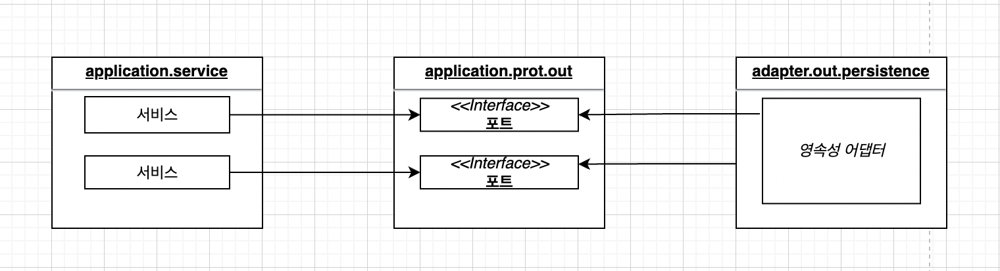
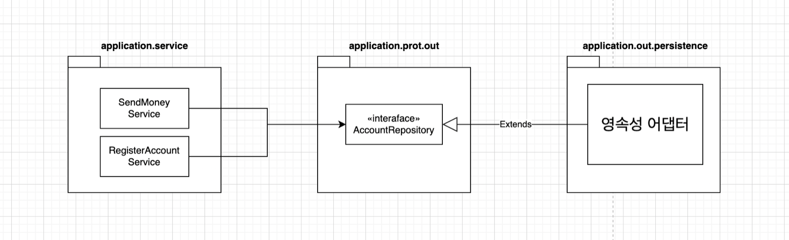
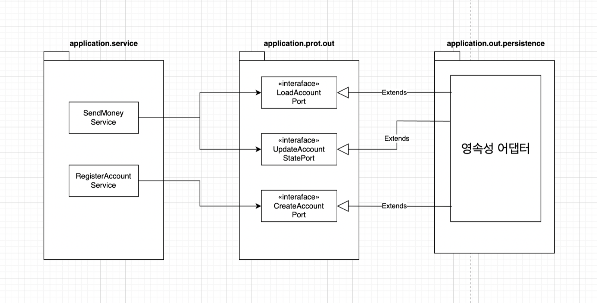
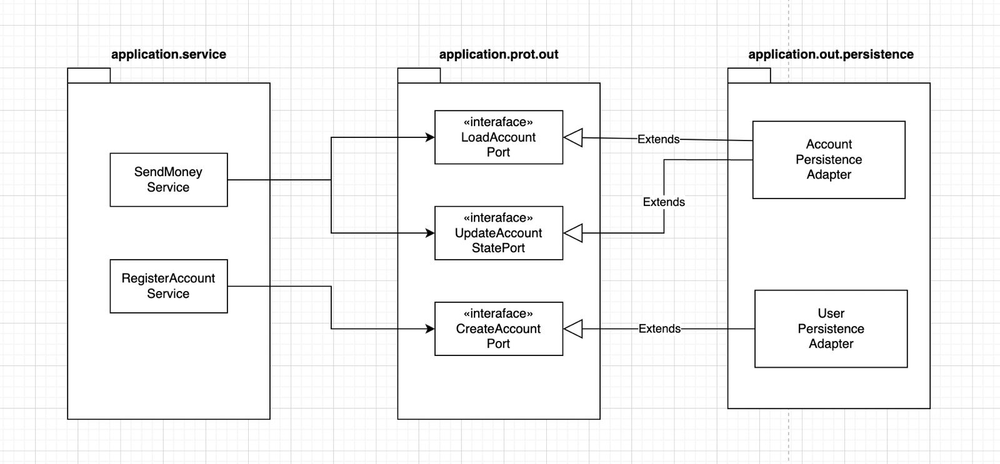
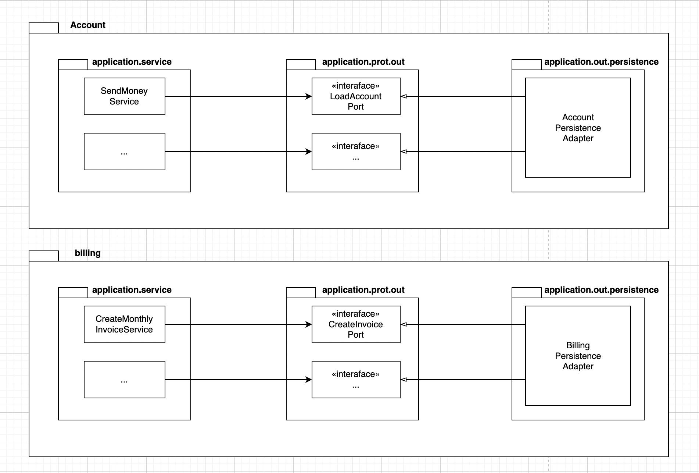

### 의존성 역전

---

그림 6.1 영속성 어댑터가 애플리케이션 서비스에 영속성 기능을 제공하기 위해 어떻게 의존성 역전 원칙을 적용할 수 있을지 보여줍니다.



육각형 아키텍처에서 영속성 어댑터는 '주도되는' 혹은 '아웃고잉' 어댑터입니다. 애플리케이션에 의해 호출될 뿐, 애플리케이션을 호출하지는 않기 때문입니다.

포트는 사실상 애플리케이션 서비스와 영속성 코드 사이의 간접적인 계층입니다. 영속성 문제에 신경 쓰지 않고 도메인 코드를 개발하기 위해, 즉 영속성 계층에 대한 코드 의존성을 없애기 위해 이러한 간접 계층을 추가하고 있다는 사실을 잊지 말아야 합니다.

### 영속성 어댑터의 책임

---

1. 입력을 받습니다.
2. 입력을 데이터베이스 포맷으로 매핑합니다.
3. 입력을 데이터베이스로 보냅니다.
4. 데이터베이스 출력을 애플리케이션 포맷으로 매핑합니다.
5. 출력을 반환합니다.

핵심은 영속성 어댑터의 입력 모델이 영속성 어댑터 내부에 있는 것이 아니라 애플리케이션 코어에 있기 때문에 영속성 어댑터 내부를 변경하는 것이 코어에 영향을 미치지 않는다는 것입니다.

다음으로 영속성 어댑터는 데이터베이스에 쿼리를 날리고 쿼리 결과를 받아옵니다. 마지막으로, 데이터베이스 응답을 포트에 정의된 출력 모델로 매핑해서 반환합니다. **다시 한번 말하지만, 출력 모델이 영속성 어댑터가 아니라 애플리케이션 코어에 위치하는 것이 중요합니다.**

입출력 모델이 영속성 어댑터가 아니라 애플리케이션 코어에 있다는 점을 제외하면 책임은 전통적인 영속성 계층의 책임과 크게 다르지 않습니다.

### 포트 인터페이스 나누기

---

아래 그림처럼 특정 엔티티가 필요로 하는 모든 데이터베이스 연산을 하나의 리포지토리 인터페이스에 넣어 두는 게 일반적인 방법입니다.



하나의 아웃고잉 포트 인터페이스에 모든 데이터베이스 **연산을 모아두면 모든 서비스가 실제로는 필요하지 않은 메서드에 의존하게 됩니다.**

> 💡 필요 없는 화물을 운반하는 무언가에 의존하고 있으면 예상하지 못했던 문제가 생길 수 있습니다.
> 로버트 C. 마틴

인터페이스 분리 원칙(ISP)은 이 문제의 답을 제시합니다. 클라이언트가 오로지 자신이 필요로 하는 메서드만 알면 되도록 넓은 인터페이스를 특화된 인터페이스로 분리해야 한다고 설명합니다.



이제 각 서비스는 실제로 필요한 메서드에만 의존합니다. 나아가 포트의 이름이 포트의 역할을 명확하게 잘 표현하고 있습니다.

이렇게 매우 좁은 포트를 만드는 것은 코딩을 플러그 앤드 플레이 경험으로 만듭니다. 서비스 코드를 짤 때는 필요한 포트에 그저 '꽂기만' 하면 됩니다. 운반할 다른 화물이 없는 것입니다.

물론 모든 상황에 '포트 하나당 하나의 메서드'를 적용하지는 못할 것입니다. 응집성이 높고 함께 사용될 때가 많기 때문에 하나의 인터페이스에 묶고 싶은 데이터베이스 연산들이 있을 수 있습니다.

### 영속성 어댑터 나누기

---



하나의 애그리거트당 하나의 영속성 어댑터를 만들어서 여러 개의 영속성 어댑터를 만들 수도 있습니다.

이렇게 하면 영속성 어댑터들은 각 영속성 기능을 이용하는 도메인 경계를 따라 자동으로 나뉩니다.

도메인 코드는 영속성 포트에 의해 정의된 명세를 어떤 클래스가 충족시키는지에 관심이 없다는 사실을 기억해야 합니다. 모든 포트가 구현돼 있기만 한다면 영속성 계층에서 하고 싶은 어떤 작업이든 해도 됩니다.



바운디드 컨텍스트 간의 경계를 명확하게 구분하고 싶다면 각 바운디드 컨텍스트가 영속성 어댑터를 가지고 있어야 합니다.

### 스프링 데이터 JPA 예제

---

```java
package io.reflectoring.buckpal.account.domain;

import java.time.LocalDateTime;
import java.util.Optional;

import lombok.AccessLevel;
import lombok.AllArgsConstructor;
import lombok.Getter;
import lombok.Value;

@AllArgsConstructor(access = AccessLevel.PRIVATE)
public class Account {

	@Getter private final AccountId id;

	@Getter private final Money baselineBalance;

	@Getter private final ActivityWindow activityWindow;

	
	public static Account withoutId(
					Money baselineBalance,
					ActivityWindow activityWindow) {
		return new Account(null, baselineBalance, activityWindow);
	}

	public static Account withId(
					AccountId accountId,
					Money baselineBalance,
					ActivityWindow activityWindow) {
		return new Account(accountId, baselineBalance, activityWindow);
	}

	public Optional<AccountId> getId(){
		return Optional.ofNullable(this.id);
	}

	public Money calculateBalance() {
		return Money.add(
				this.baselineBalance,
				this.activityWindow.calculateBalance(this.id));
	}

	public boolean withdraw(Money money, AccountId targetAccountId) {

		if (!mayWithdraw(money)) {
			return false;
		}

		Activity withdrawal = new Activity(
				this.id,
				this.id,
				targetAccountId,
				LocalDateTime.now(),
				money);
		this.activityWindow.addActivity(withdrawal);
		return true;
	}

	private boolean mayWithdraw(Money money) {
		return Money.add(
				this.calculateBalance(),
				money.negate())
				.isPositiveOrZero();
	}

	public boolean deposit(Money money, AccountId sourceAccountId) {
		Activity deposit = new Activity(
				this.id,
				sourceAccountId,
				this.id,
				LocalDateTime.now(),
				money);
		this.activityWindow.addActivity(deposit);
		return true;
	}

	@Value
	public static class AccountId {
		private Long value;
	}

}
```

Account 클래스는 getter와 setter만 가진 간단한 데이터 클래스가 아니며 최대한 불변성을 유지하려 한다는 사실을 상기해야 합니다.

데이터베이스와 통신에 스프링 데이터 JPA를 사용할 것이므로 계좌의 데이터베이스 상태를 표현하는 `@Entity` 애너테이션이 추가된 클래스도 필요합니다.

```java
package io.reflectoring.buckpal.account.adapter.out.persistence;

import javax.persistence.Entity;
import javax.persistence.GeneratedValue;
import javax.persistence.Id;
import javax.persistence.Table;

import lombok.AllArgsConstructor;
import lombok.Data;
import lombok.NoArgsConstructor;

@Entity
@Table(name = "account")
@Data
@AllArgsConstructor
@NoArgsConstructor
class AccountJpaEntity {

	@Id
	@GeneratedValue
	private Long id;

}
```

다음은 activity 테이블을 표현하기 위한 코드입니다.

```java
package io.reflectoring.buckpal.account.adapter.out.persistence;

import javax.persistence.Column;
import javax.persistence.Entity;
import javax.persistence.GeneratedValue;
import javax.persistence.Id;
import javax.persistence.Table;

import java.time.LocalDateTime;

import lombok.AllArgsConstructor;
import lombok.Data;
import lombok.NoArgsConstructor;

@Entity
@Table(name = "activity")
@Data
@AllArgsConstructor
@NoArgsConstructor
class ActivityJpaEntity {

	@Id
	@GeneratedValue
	private Long id;

	@Column
	private LocalDateTime timestamp;

	@Column
	private Long ownerAccountId;

	@Column
	private Long sourceAccountId;

	@Column
	private Long targetAccountId;

	@Column
	private Long amount;

}
```

다음으로 기본적인 CRUD 기능과 데이터베이스에서 활동(activity)들을 로드하기 위한 커스텀 쿼리를 제공하는 리포지토리 인터페이스를 생성하기 위해 스프링 데이터를 사용합니다.

```java
package io.reflectoring.buckpal.account.adapter.out.persistence;

import java.time.LocalDateTime;
import java.util.List;

import org.springframework.data.jpa.repository.JpaRepository;
import org.springframework.data.jpa.repository.Query;
import org.springframework.data.repository.query.Param;

interface ActivityRepository extends JpaRepository<ActivityJpaEntity, Long> {

	@Query("select a from ActivityJpaEntity a " +
			"where a.ownerAccountId = :ownerAccountId " +
			"and a.timestamp >= :since")
	List<ActivityJpaEntity> findByOwnerSince(
			@Param("ownerAccountId") Long ownerAccountId,
			@Param("since") LocalDateTime since);

	@Query("select sum(a.amount) from ActivityJpaEntity a " +
			"where a.targetAccountId = :accountId " +
			"and a.ownerAccountId = :accountId " +
			"and a.timestamp < :until")
	Long getDepositBalanceUntil(
			@Param("accountId") Long accountId,
			@Param("until") LocalDateTime until);

	@Query("select sum(a.amount) from ActivityJpaEntity a " +
			"where a.sourceAccountId = :accountId " +
			"and a.ownerAccountId = :accountId " +
			"and a.timestamp < :until")
	Long getWithdrawalBalanceUntil(
			@Param("accountId") Long accountId,
			@Param("until") LocalDateTime until);

}
```

스프링 부트는 이 리포지토리를 자동으로 찾고, 스프링 데이터는 실제로 데이터베이스와 통신하는 리포지토리 인터페이스 구현체를 제공하는 마법을 부립니다.

```java
package io.reflectoring.buckpal.account.adapter.out.persistence;

import javax.persistence.EntityNotFoundException;

import java.time.LocalDateTime;
import java.util.List;

import io.reflectoring.buckpal.account.application.port.out.LoadAccountPort;
import io.reflectoring.buckpal.account.application.port.out.UpdateAccountStatePort;
import io.reflectoring.buckpal.account.domain.Account;
import io.reflectoring.buckpal.account.domain.Account.AccountId;
import io.reflectoring.buckpal.account.domain.Activity;
import io.reflectoring.buckpal.common.PersistenceAdapter;
import lombok.RequiredArgsConstructor;

@RequiredArgsConstructor
@PersistenceAdapter
class AccountPersistenceAdapter implements
		LoadAccountPort,
		UpdateAccountStatePort {

	private final SpringDataAccountRepository accountRepository;
	private final ActivityRepository activityRepository;
	private final AccountMapper accountMapper;

	@Override
	public Account loadAccount(
					AccountId accountId,
					LocalDateTime baselineDate) {

		AccountJpaEntity account =
				accountRepository.findById(accountId.getValue())
						.orElseThrow(EntityNotFoundException::new);

		List<ActivityJpaEntity> activities =
				activityRepository.findByOwnerSince(
						accountId.getValue(),
						baselineDate);

		Long withdrawalBalance = orZero(activityRepository
				.getWithdrawalBalanceUntil(
						accountId.getValue(),
						baselineDate));

		Long depositBalance = orZero(activityRepository
				.getDepositBalanceUntil(
						accountId.getValue(),
						baselineDate));

		return accountMapper.mapToDomainEntity(
				account,
				activities,
				withdrawalBalance,
				depositBalance);

	}

	private Long orZero(Long value){
		return value == null ? 0L : value;
	}

	@Override
	public void updateActivities(Account account) {
		for (Activity activity : account.getActivityWindow().getActivities()) {
			if (activity.getId() == null) {
				activityRepository.save(accountMapper.mapToJpaEntity(activity));
			}
		}
	}

}
```

### 데이터베이스 트랜잭션은 어떻게 해야 할까?

---

트랜잭션 경계는 어디에 위치시켜야 할까요?

영속성 어댑터는 어떤 데이터베이스 연산이 같은 유스케이스에 포함되는지 알지 못하기 때문에 언제 트랜잭션을 열고 닫을지 결정할 수 없습니다. 이 책임은 영속성 어댑터 **호출을 관장하는 서비스에 위임**해야 합니다.

```java
@Transactional
public class SendMoneyService implements SendMoneyUseCase {
	...
}
```

만약 서비스가 `@Transactional` 애너테이션으로 오염되지 않고 깔끔하게 유지되길 원한다면 AspectJ 같은 도구를 이용해 관점 지향 프로그래밍으로 트랜잭션 경계를 코드에 위빙할 수 있습니다.

### 유지보수 가능한 소프트웨어를 만드는 데 어떻게 도움이 될까?

---

도메인 코드에 플러그인처럼 동작하는 영속성 어댑터를 만들면 도메인 코드가 영속성과 관련된 것들로부터 분리되어 풍부한 도메인 모델을 만들 수 있습니다.

좁은 포트 인터페이스를 사용하면 포트마다 다른 방식으로 구현할 수 있는 유연함이 생깁니다. 심지어 포트 뒤에서 애플리케이션이 모르게 다른 영속성 기술을 사용할 수도 있습니다. 포트의 명세만 지켜진다면 영속성 계층 전체를 교체할 수도 있습니다.

05 [만들면서 배우는 클린 아키텍처] 웹 어댑터 구현하기

08 [만들면서 배우는 클린 아키텍처] 경계 간 매핑하기

[만들면서 배우는 클린 아키텍처 - YES24](http://www.yes24.com/Product/Goods/105138479)
