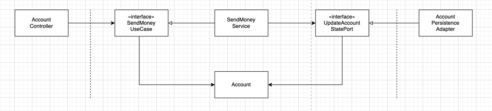
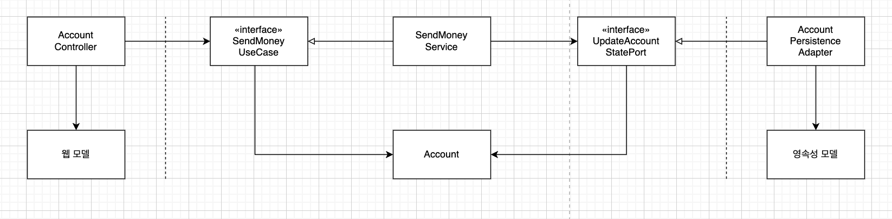
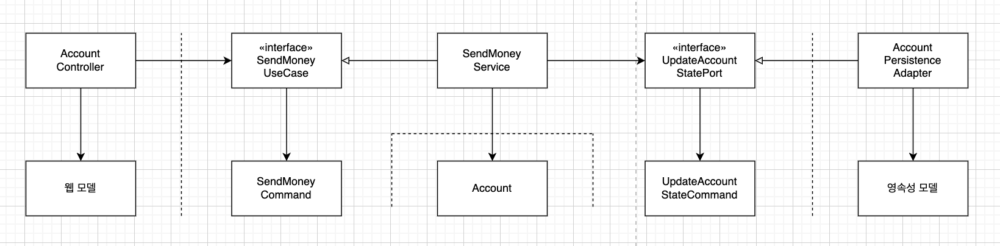
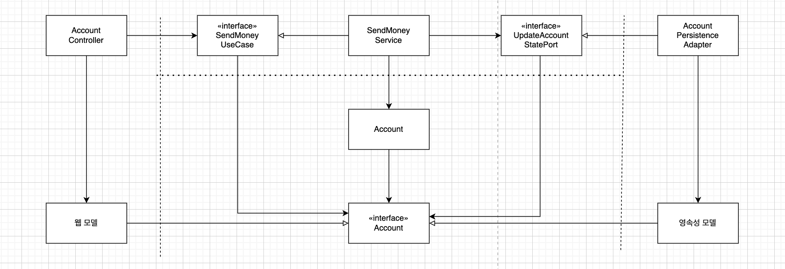

### 경계 간 매핑하기

---

매퍼 구현을 피하기 위해 두 계층에서 같은 모델을 사용한 것에 대해 논의해 본 적이 있을 것입니다.

아마 논쟁은 이런 식으로 진행됐을 것입니다.

**매핑에 찬성하는 개발자**

두 계층 간에 매핑하지 않으면 양 계층에서 같은 모델을 사용해야 하는데 이렇게 하면 두 계층이 강하게 결합하게 됩니다.

**매핑에 반대하는 개발자**

하지만 두 계층 간에 매핑을 하게 되면 보일러플레이트 코드를 너무 많이 만들게 됩니다. 많은 유스케이스들이 오직 CRUD만 수행하고 계층에 걸쳐 같은 모델을 사용하기 때문에 계층 사이의 매핑은 과합니다.

두 개발자 모두 일정 부분 맞습니다. 개발자들이 결정하는 데 도움이 되도록 몇 가지 매핑 전략을 장단점과 함께 알아보겠습니다.

### ‘매핑하지 않기’ 전략

---

웹 계층에서는 웹 컨트롤러가 ‘SendMoneyUseCase’ 인터페이스를 호출해서 유스케이스를 실행합니다. 이 인터페이스는 Account 객체를 인자로 가집니다. 즉, 웹 계층과 애플리케이션 계층 모두 Account 클래스에 접근해야 한다는 것을 의미합니다.

반대쪽 영속성 계층과 애플리케이션 계층도 같은 관계입니다. 모든 계층이 같은 모델을 사용하니 계층 간 매핑을 전혀 할 필요가 없습니다.

**단점**

웹 계층에서 REST로 모델을 노출시켰다면 모델을 JSON으로 직렬화하기 위한 애너테이션을 모델 클래스의 특정 필드에 부여야 할 수도 있습니다. 영속성 계층도 마찬가지입니다. ORM 프레임워크를 사용한다면 데이터베이스 매핑을 위한 특정 애너테이션이 필요할 것입니다.

Account 클래스는 웹, 애플리케이션, 영속성 계층과 관련된 이유로 인해 변경돼야 하기 때문에 단일 책임 원칙을 위반합니다.

그럼 ‘매핑하지 않기’ 전략을 절대로 쓰면 안 된다는 뜻일까요?

간단한 CRUD 유스케이스를 생각해 보겠습니다. 같은 필드를 가진 웹 모델을 도메인 모델로, 혹은 도메인 모델을 영속성 모델로 매핑할 필요가 있을까요? 그럴 필요는 없습니다.

모든 계층이 정확히 같은 구조의, 정확히 같은 정보를 필요로 한다면 ‘매핑하지 않기’ 전략은 완벽한 선택지입니다.

### ‘양방향’ 매핑 전략

---

각 어댑터가 전용 모델을 가지고 있어 해당 모델을 도메인 모델로, 도메인 모델을 해당 모델로 매핑할 책임을 가지고 있습니다.

웹 계층에서는 웹 모델을 인커밍 포트에서 필요한 도메인 모델로 매핑하고, 인커밍 포트에 의해 반환된 도메인 객체를 다시 웹 모델로 매핑합니다.

영속성 계층은 아웃고잉 포트가 사용하는 도메인 모델과 영속성 모델 간의 매핑과 유사한 매핑을 담당합니다. 두 계층 모두 양방향으로 매핑하기 때문에 ‘양방향’ 매핑이라고 부릅니다.

**장점**

1. 각 계층이 전용 모델을 가지고 있는 덕분에 각 계층이 전용 모델을 변경하더라도 다른 계층에는 영향이 없습니다.
2. 웹이나 영속성 관심사로 오염되지 않는 깨끗한 도메인 모델로 이어집니다. JSON이나 ORM 매핑 애너테이션도 없어도 됩니다. 단일 책임 원칙을 만족합니다.
3. ‘매핑하지 않기’ 전략 다음으로 간단한 전략입니다.

**단점**

1. 너무 많은 보일러플레이트 코드(별 수정 없이 반복적으로 사용되는 코드)가 생깁니다.
2. 도메인 모델이 계층 경계를 넘어서 통신하는 데 사용되고 있습니다.
    1. 인커밍 포트와 아웃고잉 포트는 도메인 객체를 입력 파라미터와 반환값으로 사용합니다. 도메인 모델은 도메인 모델의 필요에 의해서만 변경되는 것이 이상적이지만 바깥쪽 계층의 요구에 따른 변경에 취약해집니다.
3. 아주 간단한 C/R/U/D 유스케이스에서조차 전체 코드에 걸쳐 준수해야 하는 신성한 법칙으로 봅니다.

> 💡 어떤 매핑 전략도 철칙처럼 여겨져서는 안 됩니다. 그 대신 **각 유스케이스마다 적절한 전략을 택할 수 있어야 합니다.**

### ‘완전’ 매핑 전략

---

이 매핑 전략에서는 각 연산마다 별도의 입출력 모델을 사용합니다. 계층 경계를 넘어 통신할 때 도메인 모델을 사용하는 대신 그림과 같이 SendMoneyUseCase 포트의 입력 모델로 동작하는 SendMoneyCommand처럼 각 작업에 특화된 모델을 사용합니다.

웹 계층은 입력을 애플리케이션 계층의 커맨드 객체로 매핑할 책임을 갖고 있습니다. 각 유스케이스 전용 필드와 유효성 검증 로직을 가진 전용 커맨드를 가집니다.

애플리케이션 계층은 커맨드 객체를 유스케이스에 따라 도메인 모델을 변경하기 위해 필요한 무언가로 매핑할 책임을 가집니다.

한 계층을 다른 여러 개의 커맨드로 매핑하는 데는 하나의 웹 모델과 도메인 모델 간의 매핑보다 더 많은 코드가 필요합니다. 하지만 이렇게 매핑하면 여러 유스케이스의 요구사항을 함께 다뤄야 하는 매핑에 비해 구현하고 유지보수하기 훨씬 쉽습니다.

이 매핑 전략을 전역 패턴으로 추천하지 않습니다.

연산의 입력 모델에 대해서만 이 매핑을 사용하고, 도메인 객체를 그대로 출력 모델로 사용하는 것도 좋습니다. SendMoneyUseCase가 업데이트된 잔고를 가진 채로 Account 객체를 그대로 반환하는 것처럼 말입니다.

### ‘단방향’ 매핑 전략

---

이 전략에서는 모든 계층의 모델들이 같은 인터페이스를 구현합니다. 이 인터페이스는 관련 있는 특성에 대한 getter 메서드를 제공해서 도메인 모델의 상태를 캡슐화합니다.

도메인 모델 자체는 풍부한 행동을 구현할 수 있고, 애플리케이션 계층 내의 서비스에서 이러한 행동에 접근할 수 있습니다. 도메인 객체를 바깥 계층으로 전달하고 싶으면 매핑 없이 할 수 있습니다. 왜냐하면 도메인 객체가 인커밍/아웃고잉 포트가 기대하는 대로 상태 인터페이스를 구현하고 있기 때문입니다.

바깥 계층에서 애플리케이션 계층으로 전달하는 개체들도 이 상태 인터페이스를 구현하고 있습니다. 애플리케이션 계층에서는 이 객체를 실제 도메인 모델로 매핑해서 도메인 모델의 행동에 접근할 수 있게 됩니다.

이 전략에서 매핑 책임은 명확합니다. 만약 한 계층이 다른 계층으로부터 객체를 받으면 해당 계층에서 이용할 수 있도록 다른 무언가로 매핑하는 것입니다. 그러므로 각 계층은 한 방향으로만 매핑합니다. 그래서 ‘단방향’ 매핑 전략인 것입니다.

**단점**

매핑이 계층을 넘나들며 퍼져 있기 때문에 이 전략은 다른 전략에 비해 개념적으로 어렵습니다.

**이 전략은 계층 간의 모델이 비슷할 때 가장 효과적입니다.** 예를 들면, 읽기 전용 연산의 경우 상태 인터페이스가 필요한 모든 정보를 제공하기 때문에 웹 계층에서 전용 모델로 매핑할 필요가 전혀 없습니다.

### 언제 어떤 매핑 전략을 사용할 것인가?

---

‘그때그때 다르다’

- 특정 작업에 최선의 패턴이 아님에도 그저 깔끔하게 느껴진다는 이유로 선택해버리는 것은 참으로 무책임한 처사입니다.
- 고정된 매핑 전략으로 계속 유지하기보다는 **빠르게 코드를 짤 수 있는 간단한 전략으로 시작해서 계층 간 결합을 떼어내는 데 도움이 되는 복잡한 전략으로 갈아타는 것도 괜찮은 방법입니다.**
- 어떤 전략을 사용할지 결정하려면 팀 내에서 **합의할 수 있는 가이드라인**을 정해둬야 합니다.

### 유지보수 가능한 소프트웨어를 만드는 데 어떻게 도움이 될까?

---

계층 사이 문지기처럼 동작하는 인커밍 포트와 아웃고잉 포트는 서로 다른 계층이 어떻게 통신해야 하는지를 정의합니다. 여기에는 계층 사이에 매핑을 수행할지 여부와 어떤 매핑 전략을 선택할지가 포함됩니다.

각 유스케이스에 대한 좁은 포트를 사용하면 유스케이스마다 다른 매핑 전략을 사용할 수 있고, 다른 유스케이스에 영향을 미치지 않으면서 코드를 개선할 수 있기 때문에 특정 상황, 특정 시점에 최선의 전략을 선택할 수 있습니다.

06 [만들면서 배우는 클린 아키텍처] 영속성 어댑터 구현하기

[만들면서 배우는 클린 아키텍처 - 예스24](https://www.yes24.com/Product/Goods/105138479)
