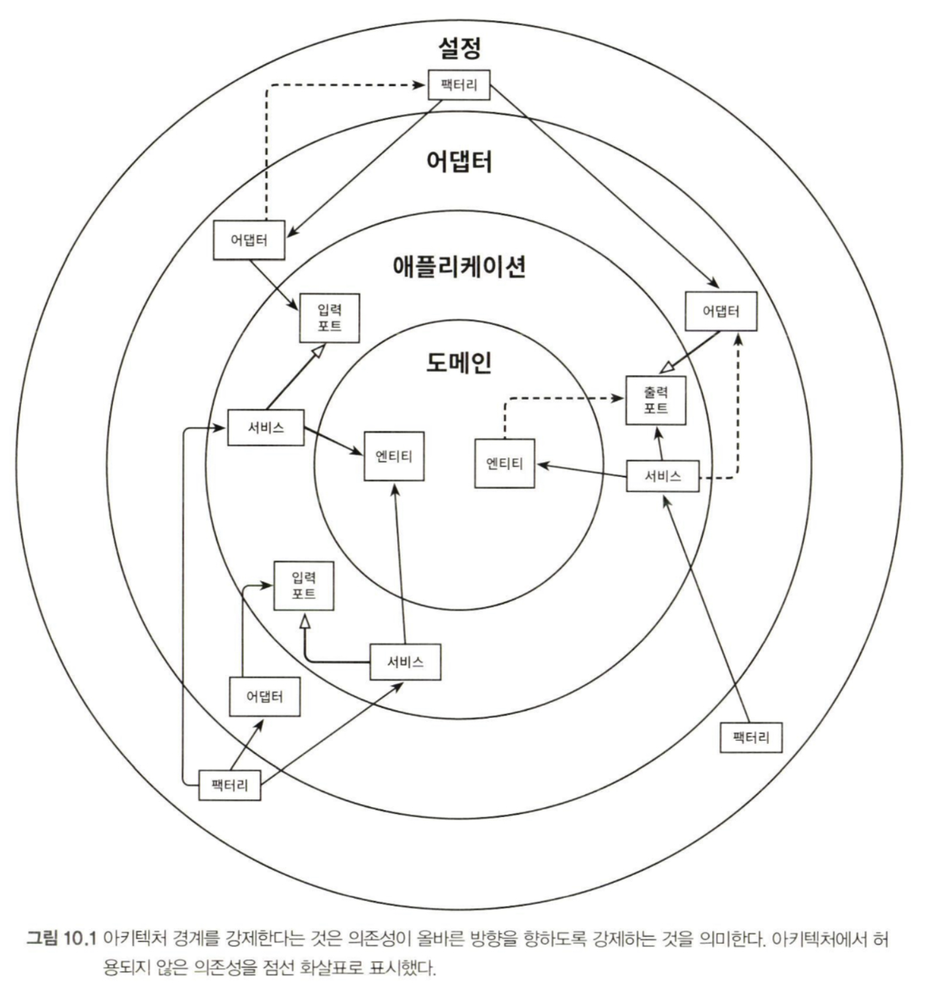
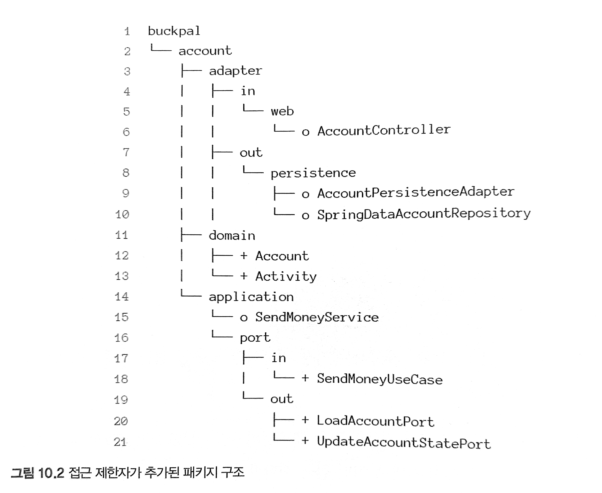

### 경계와 의존성

---

- 도메인 엔티티
    - 가장 안쪽에 있는 엔티티
- 애플리케이션
    - 애플리케이션 서비스 안에서 유스케이스를 구현하기 위해 도메인 엔티티에 접근
- 어댑터
    - 인커밍 포트를 통해 접근되며, 반대로 서비스는 아웃고잉 포트를 통해 어댑터에 접근한다
- 설정
    - 어댑터와 서비스 객체를 생성할 팩터리를 포함하고 있고, 의존성 주입 메커니즘을 제공한다

각 계층 사이, 안쪽 인접 계층과 바깥쪽 인접 계층 사이에 경계가 있습니다. 의존성 규칙에 따르면 계층 경계를 넘는 의존성은 항상 안쪽 방향으로 향해야 합니다.

### 접근 제한자

---

경계를 강제하기 위해 자바에서 제공하는 가장 기본적인 도구인 접근 제한자부터 시작해 보겠습니다.

- package-private(혹은 'default')
    - 자바 패키지를 통해 클래스들을 응집적인 '모듈'로 만들어 주기 때문에, 이러한 모듈 내에 있는 클래스들은 서로 접근 가능하지만 패키지 바깥에서는 접근할 수 없습니다. 모듈의 진입점으로 활용될 클래스들만 골라서 public으로 만들면 됩니다. 이렇게 하면 **`의존성이 잘못된 방향을 가리켜서 의존성 규칙을 위반할 위험이 줄어듭니다.`**

접근 제한자를 염두에 두고 패키지 구조를 다시 보겠습니다.

- persistence 패키지에 있는 클래스들은 외부에서 접근할 필요가 없기 때문에 package-private('o')로 표기합니다.
    - 영속성 어댑터는 자신이 구현하는 출력 포트를 통해 접근됩니다.
    - SendMoneyService를 package-private으로 만듭니다.
    - 이 방법을 사용하려면 클래스패스 스캐닝을 이용해야만 합니다.
- 나머지 클래스는 public('+'로 표시)으로 둡니다.
    - domain 패키지는 다른 계층에서 접근 가능해야 합니다.
    - application 계층은 web 어댑터와 persistence 어댑터에서 접근 가능해야 합니다.

### 빌드 아티팩트

---

1. 기본적인 3개의 모듈 빌드 방식
2. 애플리케이션 모듈로 나누기

핵심은 모듈을 더 세분화할수록 모듈 간 의존성을 더 잘 제어할 수 있게 된다는 것입니다. 하지만 더 작게 분리할수록 모듈 간에 매핑을 더 많이 수행해야 합니다. 8장에서 소개한 매핑 전략들 중 하나를 선택해야 합니다.

### 유지보수 가능한 소프트웨어를 만드는 데 어떻게 도움이 될까

---

기본적으로 소프트웨어 아키텍처는 아키텍처 요소 간의 의존성을 관리하는 게 전부입니다.

→ 때문에 아키텍처를 잘 유지해나가고 싶다면 의존성이 올바른 방향으로 가리키고 있는지 확인해야 합니다.

[만들면서 배우는 클린 아키텍처 - YES24](http://www.yes24.com/Product/Goods/105138479)
