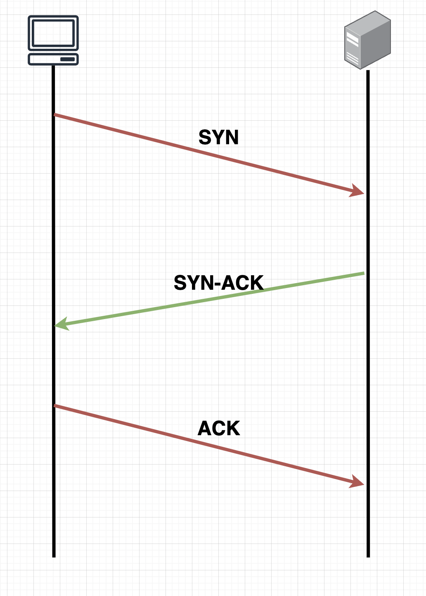
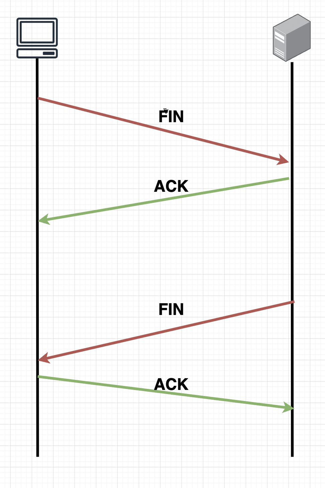
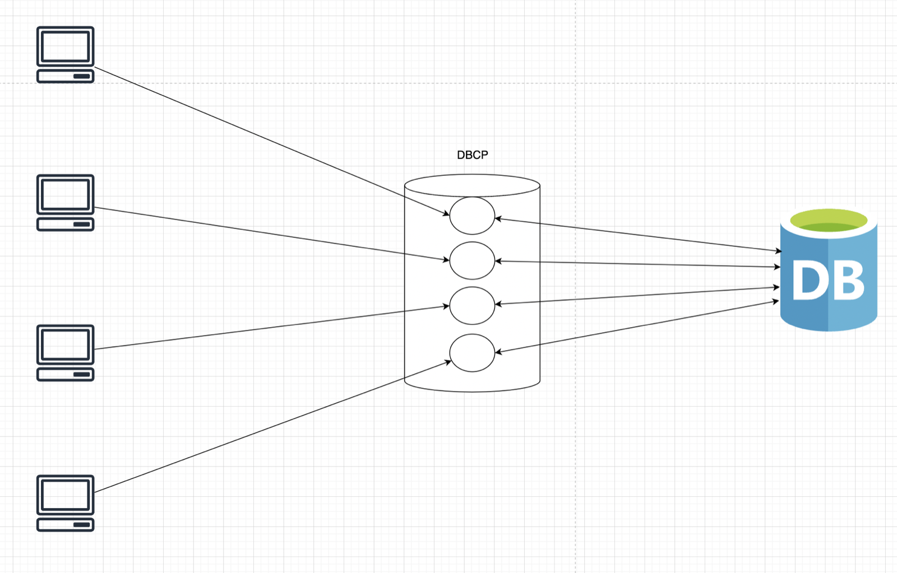

오늘은 DBCP에 대해 정리하도록 하겠습니다.

DBCP는 (DataBase Connection Pool)의 약자로 클라이언트 서버에서 요청이 왔을 때 Database와의 연결을 효율적으로 관리하기 위해 사용하는 기술입니다.

그렇다면 어떻게 효율적으로 Database의 연결을 관리하는지 알아보도록 하겠습니다.

### DBCP가 없고 일반적으로 Database에 조회하는 경우

1. 클라이언트가 API 조회
2. 애플리케이션을 통하여 DB에 접근하기 위해 TCP 통신
    1. TCP 통신은 연결을 맺기 위해 3way handShake 방식으로 연결을 함
3. TCP통신을 통해 애플리케이션과 연결이 되었다면 DB 조회 후 클라이언트에게 정보를 제공
4. TCP 통신을 연결 해제하기 위해 4way handShake 방식으로 TCP 연결을 해제합니다.

### TCP 통신의 3way handShake

- 클라이언트가 서버에게 연결 요청(`SYN`)을 보냅니다.
- 서버가 이 요청을 받고, 요청을 수락(`SYN-ACK`)합니다.
- 클라이언트가 서버에게 연결 수락 확인(`ACK`)을 보냅니다.

이 과정을 통해 양쪽 호스트는 데이터를 전송하기 전에 서로의 상태를 확인하고, 안정적인 연결을 설정할 수 있습니다.

### TCP해제의 4way handShake

- 한쪽(클라이언트 또는 서버)에서 연결을 종료하겠다는 `FIN` 패킷을 보냅니다.
- 상대방은 이 요청을 확인하고, `ACK` 패킷으로 응답합니다.
- 상대방도 자신의 데이터 전송이 완료되면 `FIN` 패킷을 보내 연결 종료를 요청합니다.
- 첫 번째로 `FIN` 요청을 보낸 쪽이 이 `FIN`을 확인하고, 마지막 `ACK` 패킷을 보내면서 연결이 종료됩니다.

위와 같이 API 호출 한 번에 TCP통신의 연결을 맺고 끊는 것에 너무 많은 시간이 소요될 것이고, 사용자는 느린 응답값에 지치게 될 것입니다.

이를 해결하고자 DBCP가 나왔습니다.

### DBCP 연결풀

DBCP는 데이터베이스 연결 객체들을 미리 생성하여 풀 안에 보관하고, 애플리케이션에서 데이터베이스에 상호작용을 할 때마다 Pool에서 Connection을 빌려 재사용하는 것으로, 기존의 3way HandShake와 4way HandShake를 사용하는 번거로움을 없앴습니다. 이로 하여금 사용자는 더 빠르게 정보를 제공받을 수 있습니다.

### 그렇다면 이렇게 미리 만들어 넣는 DBCP에서 개발자는 무엇을 잘 해야 되는가?

### DB 서버설정

1. **MaxConnections**

    현재 MySQL의 `MaxConnections` 수가 4이고, DBCP에서 설정된 커넥션 수가 4개라면 원활하게 작동할 수 있습니다. 그러나 유저 유입이 증가하고 클라이언트 요청이 많아져 **애플리케이션 서버를 증설하더라도,** `MaxConnections` 수가 4로 제한되어 있기 때문에 부하가 줄어들지 않습니다. 따라서 개발자는 `MaxConnections` 수를 적절히 설정하고, 안정적인 운영을 위해 이를 어떻게 관리할지 알고 있어야 합니다.

2. **wait_timeout**

    애플리케이션과 MySQL이 정상적으로 연결되어 데이터를 주고받다가, 특정 문제로 인해 애플리케이션이 종료 신호를 보내지 못하면, 데이터베이스는 해당 연결이 여전히 사용 중이라고 인식하여 점유 상태로 유지하게 됩니다. 이러한 연결이 하나라면 큰 문제가 없겠지만, 여러 개의 연결이 발생하면 시스템 성능에 심각한 영향을 미칠 수 있습니다.

    이를 방지하기 위해 `wait_timeout` 설정을 지정할 수 있습니다. `wait_timeout`은 데이터베이스에서 유휴 상태로 있는 연결이 일정 시간 동안 아무런 활동이 없을 경우, 해당 연결을 자동으로 종료하여 재사용할 수 있도록 합니다. 이를 통해 불필요한 연결이 장시간 점유되는 것을 방지하고, 시스템의 안정성을 유지할 수 있습니다.

### DBCP의 설정

1. **minimumIdle**
    - HikariCP가 데이터베이스에 대해 항상 유지하려고 하는 최소한의 유휴 연결 수
    - 만약 현재 풀의 유휴 연결 수가 `minimumIdle`보다 적으면, HikariCP는 비동기적으로 새로운 연결을 생성하여 유휴 연결 수를 유지합니다. 이렇게 함으로써, 데이터베이스 요청이 발생했을 때 대기 시간을 최소화할 수 있습니다.
2. **maximumPoolSize**
    - HikariCP가 동시에 열 수 있는 연결의 최대 수

개발자가 알아두어야 할 점은 `minimumIdle`과 `maximumPoolSize`의 상관관계입니다.

- `minimumIdle`은 항상 유지해야 하는 최소 유휴 연결 수를 설정합니다.
- `maximumPoolSize`에 도달하면, HikariCP는 더 이상의 연결을 생성하지 않고 대기하게 됩니다.

따라서, 이 두 값을 적절히 설정하여 시스템의 성능과 안정성을 유지하는 것이 중요합니다.

추가적으로 HikariCP에서는 `minimumIdle`과 `maximumPoolSize`의 수를 **동일하게 사용**하라고 권장하고 있습니다. 이유는 급작스러운 클라이언트 요청에 minimumIdle의 수를 맞추기 위해 TCP 연결 방법을 사용하다 보면 트래픽을 전부 처리할 수 없기 때문입니다.

> **Idle**
>
> 커넥션이 연결되어 있지만, 어떠한 작업을 하지 않고 대기 중인 Connection

3. **maxLifetime**
    - `maxLifetime`을 설정하면, 각 연결은 지정된 시간 동안만 유효하며, 이 시간이 지나면 HikariCP는 연결을 닫고 새 연결을 생성합니다.
    - active 즉 connection이 맺고 있는 상태라면 pool로 반환되고 나서 제거됩니다.
    - DB의 wait_timeout 설정보다 2초 정도 작게 설정해줘야 합니다.

        HikariCP에서 `maxLifetime` 설정에 따라 연결이 맺고 있는 동안은 풀로 반환되어야 하지만, 만약 어떤 문제로 인해 연결이 종료되지 않는 상태라면, 데이터베이스에서는 `wait_timeout` 시간이 지나면 해당 연결을 강제로 종료합니다. 이때 클라이언트에서 요청이 다시 들어오면, 이미 종료된 연결로 인해 예외(Exception)가 발생할 수 있습니다.

        DB의 `wait_timeout` 시간과 `maxLifetime` 시간을 동일하게 60초로 설정했을 때, 다음과 같은 상황이 발생할 수 있습니다:

        - 애플리케이션에서 데이터 전송 요청을 59초에 시작했을 때, 전송 과정에서 `wait_timeout` 시간이 60초가 되어 데이터베이스가 연결을 종료할 수 있습니다.
        - 이 경우, 데이터가 전송되는 중간에 연결이 끊어지게 되어 요청이 완전히 처리되지 않고, 예외(Exception)가 발생할 수 있습니다.

        따라서, `wait_timeout`과 `maxLifetime`을 동일하게 설정하는 것은 권장되지 않으며, 두 값을 적절히 조정하여 이러한 문제를 예방해야 합니다.

4. **ConnectionTimeOut**
    - pool에서 connection을 받기 위한 대기 시간
    - Idle 상태가 없고 계속 사용 중인데, 무한정 기다릴 수 없으므로, 적절한 connectionTimeout 설정을 해줘야 됩니다.

결론적으로, 우리는 데이터베이스(DB)의 부하와 애플리케이션의 부하 상태를 면밀히 모니터링하여 DB 설정과 DBCP(데이터베이스 연결 풀)의 설정이 조화롭게 적용되고 있는지를 확인해야 합니다.

1. **부하가 발생하는 경우**:
    - DB와 애플리케이션의 설정이 잘 조화되어 있다면, 장비를 증설하여 부하 문제를 해결할 수 있습니다.
2. **조화롭지 않은 경우**:
    - DB와 DBCP의 설정이 적절하게 조정되어 있지 않다면, 다음과 같은 두 가지 방법으로 문제를 해결해야 합니다:
        - **설정 최적화**: `maximumPoolSize`, `minimumIdle`, `maxLifetime` 및 `wait_timeout` 등 설정 값을 적절히 조정하여 최적의 성능을 이끌어낼 수 있습니다.

이러한 점들을 숙지하고 적절히 대응함으로써, 시스템의 안정성과 성능을 유지할 수 있을 것입니다.

감사합니다.
