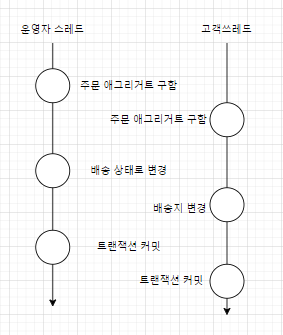
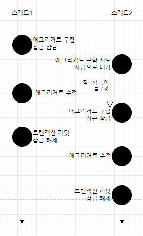
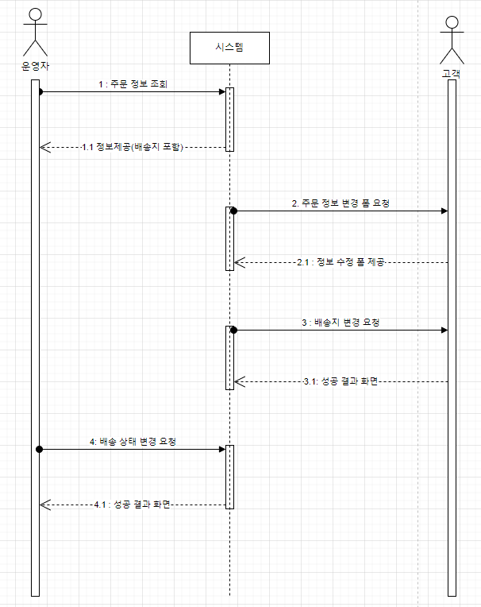
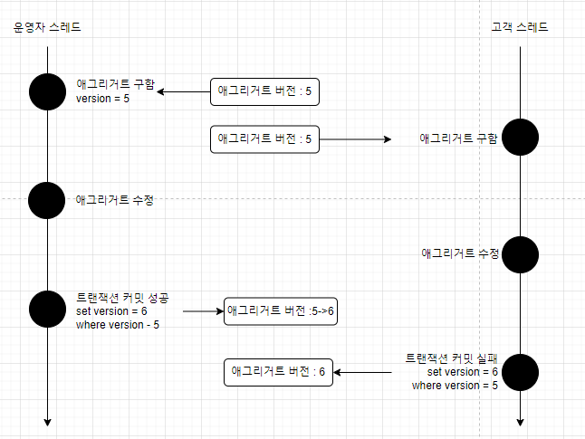
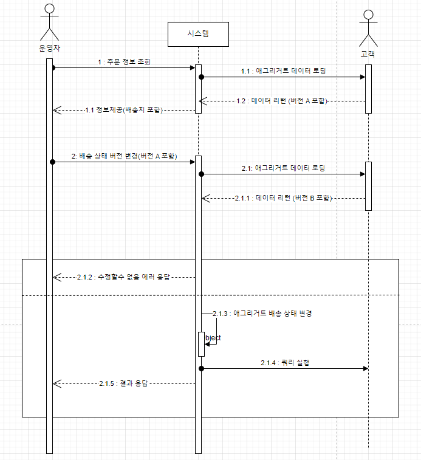
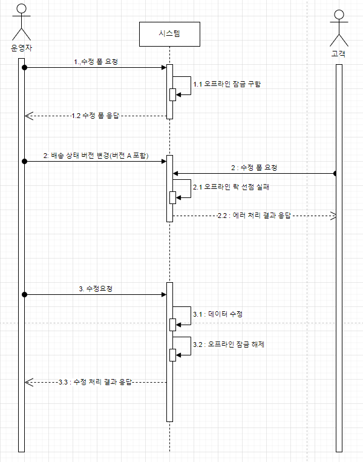

### 애그리거트와 트랜잭션



- 운영자는 기존 배송지 정보를 이용해서 배송 상태를 변경합니다.
- 고객은 배송지 정보를 변경합니다.

**문제**

- 일관성이 깨지는 문제가 발생합니다.

**해결 방법**

- 운영자가 배송지 정보를 조회하고 상태를 변경하는 동안, 고객이 애그리거트를 수정하지 못하게 합니다.
- 운영자가 배송지 정보를 조회한 이후에 고객이 정보를 변경하면, 운영자가 애그리거트를 다시 조회한 뒤 수정하도록 합니다.

> 💡 이 두 가지는 애그리거트에서 대표적으로 사용할 수 있는 트랜잭션 처리 방식인 `선점`, `비선점`입니다.

### 선점 잠금



먼저 애그리거트를 구한 스레드가 애그리거트 사용이 끝날 때까지 다른 스레드가 해당 애그리거트를 수정하지 못하게 막는 방식입니다.

**선점 잠금과 교착상태**

1. 스레드 1 : A 애그리거트에 대한 선점 잠금을 구함
2. 스레드 2 : B 애그리거트에 대한 선점 잠금을 구함
3. 스레드 1 : B 애그리거트에 대한 선점 잠금 시도
4. 스레드 2 : A 애그리거트에 대한 선점 잠금 시도

이 순서에 따르면 **스레드 1은 영원히 B 애그리거트에 대한 선점 잠금을 구할 수 없습니다.** → `교착상태`에 빠지게 됩니다.

**해결 방법**

- 최대 대기 시간을 지정합니다.
- **`@QueryHint(name = "javax.persistence.lock.timeout", value = "3000")`**

```java
public interface MemberRepository extends Repository<Member, MemberId> {
    Optional<Member> findById(MemberId memberId);

    @Lock(LockModeType.PESSIMISTIC_WRITE)
    **@QueryHints({
            @QueryHint(name = "javax.persistence.lock.timeout", value = "3000")
    })**
    @Query("select m from Member m where m.id = :id")
    Optional<Member> findByIdForUpdate(@Param("id") MemberId memberId);
}
```

### 비선점 잠금



1. 운영자는 배송을 위해 주문 정보를 조회합니다. 시스템은 정보를 제공합니다.
2. 고객이 배송지 변경을 위해 변경 폼을 요청합니다. 시스템은 변경 폼을 제공합니다.
3. 고객이 새로운 배송지를 입력하고 폼을 전송하여 배송지를 변경합니다.
4. 운영자가 1번에서 조회한 주문 정보를 기준으로 배송지를 정하고 배송 상태를 변경 요청합니다.

- 동시에 접근하는 것을 막는 대신 **변경한 데이터를 실제 DBMS에 반영하는 시점에 변경 가능 여부를 확인하는 방식**입니다.

**문제 발생**

- 배송 상태 변경 전에 배송지를 한 번 더 확인하지 않으면, 운영자는 다른 배송지로 물건을 발송하게 되고 고객은 배송지를 변경했음에도 불구하고 엉뚱한 곳으로 주문한 물건을 받는 상황이 발생합니다.

**해결 방법**

- 이 문제는 **`선점 잠금`** 방식으로 해결할 수 없습니다.
- 비선점 잠금으로 해결 가능합니다.
- 동시에 접근하는 것을 막는 대신 **변경한 데이터를 실제 DBMS에 반영하는 시점에 변경 가능 여부를 확인하는 방식**입니다.
- 비선점 잠금을 구현하려면 애그리거트에 버전으로 사용할 숫자 타입 프로퍼티를 추가해야 합니다.
    
    ```sql
    UPDATE aggtable SET version = version + 1, colx = ?, coly = ?
    WHERE aggid = ? version = **현재버전**
    ```
    



JPA는 버전을 이용한 비선점 잠금 기능을 지원합니다.

@Version 애너테이션을 붙이고 매핑되는 테이블에 버전을 저장할 컬럼을 추가합니다.

```java
@Entity
@Table(name = "purchase_order")
@Access(AccessType.FIELD)
public class Order {
    @EmbeddedId
    private OrderNo number;

    @Version
    private long version;

...
```

JPA는 엔티티가 변경되어 UPDATE 쿼리를 실행할 때 @Version에 명시한 필드를 이용해 비선점 잠금 쿼리를 실행합니다. → 응용 서비스는 버전에 대해 알 필요가 없습니다. 기능 실행 과정에서 애그리거트 데이터가 변경되면 JPA는 트랜잭션 종료 시점에 비선점 잠금을 위한 쿼리를 실행합니다.

```java
@Service
public class ChangeShippingService {

    @Transactional
    public void changeShipping(ChangeShippingRequest changeReq) {
        Optional<Order> orderOpt = orderRepository.findById(new OrderNo(changeReq.getNumber()));
				chekcNoOrder(order);
        order.changeShippingInfo(changeReq.getShippingInfo());
    }
}
```

쿼리 실행 결과로 수정된 행의 개수가 0이면 이미 누군가 앞서 데이터를 수정했으므로 트랜잭션 충돌 → `OptimisticLockingFailureException`이 발생합니다.

```java
@Controller
public class OrderController {
		private ChangeShippingService changeShippingService;

		@PostMapping("/changeShipping")
		public String changeShipping(changeShippingRequest changeReq) {
				try {
						changeShippingService.changeShipping(changeReq);
						return "changeShippingSucess";
				} catch (OptimisticLockingFailureException ex) {
					// 누군가 먼저 같은 주문 에그리거트를 수정했으므로
					// 트랜잭션이 출동했다는 메시지를 보여주낟.
					return "changeShippingFailct";		
				}
		}
}
```



그림과 같이 비선점 잠금 방식을 여러 트랜잭션으로 확장하려면,

- 애그리거트 정보를 뷰에 함께 전달합니다.

```html
<!-- 애그리거트 정보를 보영줄 때 뷰 코드는 버전 값을 함 께 전송한다. -->
<input type="hidden", name = "version" th:value = "{orderDto.version}"/>
```

응용 서비스가 전달받은 데이터는 다음과 같이 주문번호와 함께 버전을 포함합니다.

```java
public class StartShippingRequest {

		private String orderNumber;
		private long version;
}
```

응용 서비스는 전달받은 버전 값을 이용해 일치하는지 확인합니다.

```java
public void startShipping(StartShippingRequest req) {
        Optional<Order> orderOpt = orderRepository.findById(new OrderNo(req.getOrderNumber()));
        Order order = orderOpt.orElseThrow(() -> new NoOrderException());
        if (!order.matchVersion(req.getVersion())) {
            throw new VersionConflictException();
        }
        order.startShipping();
    }
```

표현 계층은 버전 충돌 익셉션을 사용자에게 제공합니다.

```java
@Controller
public class OrderAdminController {
		private StartShippingService startShippingService;

		@PostMapping("/startShipping")
		public String startShipping(StartShippingRequest startReq) {
				try {
						startShippingService.startShipping(changeReq);
						return "shippingStarted";
				} catch (OptimisticLockingFailureException | VersionConflictExcetpion ex) {
					// 트랜잭션 충돌
					return "startShippingTxConfit";		
				}
		}
}
```

**강제 버전 증가**

**문제 발생**

- 애그리거트에 애그리거트 루트 외에 다른 엔티티가 존재하는데, 기능 실행 도중 루트가 아닌 다른 엔티티의 값만 변경된다고 해보겠습니다. → JPA는 루트 엔티티의 버전 값을 증가시키지 않습니다.

**해결 방법**

- JPA는 이런 문제를 처리할 수 있도록 EntityManager#find() 메서드로 엔티티를 구할 때 강제로 버전 값을 증가시키는 잠금 모드를 지원합니다.

```java
@Repository
public class JpaOrderRepostiory implements OrderRepository {
		@PersistencContext
		private EntitiyManager entitiyManager;

		@Overried
		public Order findByIdOptimisticLockMode(OrderNo id) {
			return entitiyManager.find(Order.class, id, LockModeType.OPTIMISTIC_FORCE_INCREMENT);
		}
}
```

`LockModeType..OPTIMISTIC_FORCE_INCREMENT`를 사용하면 해당 엔티티의 상태가 변경되었는지에 상관없이 트랜잭션 종료 시점에 버전 값 증가 처리를 합니다.

스프링 데이터 JPA를 사용하면 앞서 살펴본 `@Lock` 애너테이션을 이용해서 지정하면 됩니다.

### 오프라인 선점 잠금

- 여러 트랜잭션에 걸쳐 동시 변경을 막습니다.
- 첫 번째 트랜잭션을 시작할 때 오프라인 잠금을 선점하고, 마지막 트랜잭션에서 잠금을 해제합니다. 잠금을 해제하기 전까지 다른 사용자는 잠금을 구할 수 없습니다.



**문제 발생**

- 사용자 A가 과정 3의 수정 요청을 수행하지 않고 프로그램을 종료하면 → 잠금을 해제하지 않으므로 다른 사용자는 영원히 잠금을 구할 수 없는 상황이 발생합니다.
- 사용자 A가 잠금 유효시간이 지난 후 1초 뒤에 3번 과정을 수행하면 → 잠금이 해제된 사용자 A는 수정에 실패합니다.

**해결 방법**

- 잠금 유효 시간을 가지고 유효시간이 지나면 자동으로 잠금을 해제합니다.
- 일정 주기로 유효 시간을 증가시키는 방식이 필요합니다 → 예) 수정 폼에서 1분 단위로 Ajax 호출을 해서 1분씩 증가

**오프라인 선점 잠금을 위한 LockManager 인터페이스와 관련 클래스**

```java
public interface LockManager {
    LockId tryLock(String type, String id) throws LockException;

    void checkLock(LockId lockId) throws LockException;

    void releaseLock(LockId lockId) throws LockException;

    void extendLockExpiration(LockId lockId, long inc) throws LockException;
}
```

1. LockId 클래스

```java
package com.myshop.lock;

public class LockId {
    private String value;

    public LockId(String value) {
        this.value = value;
    }

    public String getValue() {
        return value;
    }
}
```

2. 컨트롤러가 오프라인 선점 잠금 기능을 이용해서 데이터 수정 폼에 동시에 접근하는 것을 제어하는 코드의 예입니다.

```java
public class DataService {
// 서비스 : 서비스는 잠금 ID를 리턴한다.
		public DataAndLcokId getDataWithLock(Long id) {
				// 1. 오프라인 선점 잠금 시도
				LockId lockId = lockManager.tryLock("data", id);
				// 2. 기능 실행
				Data data = someDao.select(id);
				return new DataAndLockId(data, lockId);
		}
}
```

```java

// 서비스가 리턴한 잠금ID를 모델로 뷰에 전달한다.
@RequestMapping("/some/edit/{id}")
public String editForm(@PathVariable("id") Long id, ModelMap model) {
		DataAndLockID dl = dataService.getDataWithLock(id);
		model.addAttribute("data", dl.getData());
		// 잠금 해제에 사용할 LockId를 모델에 추가.
		mdoel.addAttribute("lockId", dl.getLockId());
		return "editForm";
}
```

3. 잠금을 선점하는 데 실패하면 LockException이 발생합니다 → 다른 사용자가 데이터를 수정 중이니 나중에 다시 시도하라는 안내 화면을 보여줍니다.

4. 수정 폼은 LockId를 다시 전송합니다.

```html
<form th:action = "@{/some/edit/{id}{id = ${data.id}}" method = "post">
		...
		<input type = "hidden" name = "lid" th:value = ${lockId.value}>
		...
</form>
```

5. 잠금을 해제하는 코드입니다.

```java
// 서비스 : 잠금을 해제한다.
public void edit(EditRequest editReq, LockId lockId) {
		// 1. 잠금 선점 확인
		lockManager.checkLcok(lockId);
		// 2. 기능 실행
		..
		// 3. 잠금 해제
		lockManager.releaseLock(lockId);
}
```

```java
@RequestMapping(value = "/some/edit/{id}", method = RequestMethod.POST)
public String edit(@PathVariable("id") Long id
			, @ModelAttribute("eitReq") EditRequest editReq
			, @RequestParam("lid") String lockIdValue) {
		editReq.setId(id);
		someEditService.edit(editReq, new LockId(lockIdValue));
		model.addAttribute("data", data);
		return "editSuccess"
}
```

- LockManager#checkLock() 메서드를 가장 먼저 실행합니다 → **반드시 주어진 LockId가 유효한지 체크합니다.**
    - 잠금 유효 시간이 지났으면 이미 다른 사용자가 잠금을 선점합니다.
    - 잠금을 선점하지 않은 사용자가 기능을 실행했다면 기능 실행을 막습니다.

**DB를 이용한 LockManager 구현**

MySQL 기준입니다.

```sql
create table locks (
		`type` varchar(255),
		id varchar(255),
		lockId varchar(255),
		expiration_time dateTime,
		primary key (`type`, id)
) character set utf8;

create unieque index locks_idx ON locks (lockId);
```

- type과 id 칼럼을 주요키로 동시에 사용자가 특정 타입 데이터에 대한 잠금을 구하는 것을 방지합니다.
- lockId 필드를 유니크 인덱스로 설정합니다.
- 유효시간을 보관하기 위해 expiration_time을 사용합니다.

```java
package com.myshop.lock;

public class LockData {
    private String type;
    private String id;
    private String lockId;
    private long timestamp;

    public LockData(String type, String id, String lockId, long timestamp) {
        this.type = type;
        this.id = id;
        this.lockId = lockId;
        this.timestamp = timestamp;
    }

    public String getType() {
        return type;
    }

    public String getId() {
        return id;
    }

    public String getLockId() {
        return lockId;
    }

    public long getTimestamp() {
        return timestamp;
    }

    public boolean isExpired() {
        return timestamp < System.currentTimeMillis();
    }
}
```

`isExpired()` 메서드는 유효 시간이 지났는지 체크합니다.

```java
package com.myshop.lock;

import org.springframework.dao.DuplicateKeyException;
import org.springframework.jdbc.core.JdbcTemplate;
import org.springframework.jdbc.core.RowMapper;
import org.springframework.stereotype.Component;
import org.springframework.transaction.annotation.Propagation;
import org.springframework.transaction.annotation.Transactional;

import java.sql.Timestamp;
import java.util.List;
import java.util.Optional;
import java.util.UUID;

@Component
public class SpringLockManager implements LockManager {
    private int lockTimeout = 5 * 60 * 1000;
    private JdbcTemplate jdbcTemplate;

    private RowMapper<LockData> lockDataRowMapper = (rs, rowNum) ->
            new LockData(rs.getString(1), rs.getString(2),
                    rs.getString(3), rs.getTimestamp(4).getTime());

    public SpringLockManager(JdbcTemplate jdbcTemplate) {
        this.jdbcTemplate = jdbcTemplate;
    }

    @Transactional(propagation = Propagation.REQUIRES_NEW)
    @Override
    public LockId tryLock(String type, String id) throws LockException {
        checkAlreadyLocked(type, id);
        LockId lockId = new LockId(UUID.randomUUID().toString());
        locking(type, id, lockId);
        return lockId;
    }

    private void checkAlreadyLocked(String type, String id) {
        List<LockData> locks = jdbcTemplate.query(
                "select * from locks where type = ? and id = ?",
                lockDataRowMapper, type, id);
        Optional<LockData> lockData = handleExpiration(locks);
        if (lockData.isPresent()) throw new AlreadyLockedException();
    }

    private Optional<LockData> handleExpiration(List<LockData> locks) {
        if (locks.isEmpty()) return Optional.empty();
        LockData lockData = locks.get(0);
        if (lockData.isExpired()) {
            jdbcTemplate.update(
                    "delete from locks where type = ? and id = ?",
                    lockData.getType(), lockData.getId());
            return Optional.empty();
        } else {
            return Optional.of(lockData);
        }
    }

    private void locking(String type, String id, LockId lockId) {
        try {
            int updatedCount = jdbcTemplate.update(
                    "insert into locks values (?, ?, ?, ?)",
                    type, id, lockId.getValue(), new Timestamp(getExpirationTime()));
            if (updatedCount == 0) throw new LockingFailException();
        } catch (DuplicateKeyException e) {
            throw new LockingFailException(e);
        }
    }

    private long getExpirationTime() {
        return System.currentTimeMillis() + lockTimeout;
    }

    @Transactional(propagation = Propagation.REQUIRES_NEW)
    @Override
    public void checkLock(LockId lockId) throws LockException {
        Optional<LockData> lockData = getLockData(lockId);
        if (!lockData.isPresent()) throw new NoLockException();
    }

    private Optional<LockData> getLockData(LockId lockId) {
        List<LockData> locks = jdbcTemplate.query(
                "select * from locks where lockid = ?",
                lockDataRowMapper, lockId.getValue());
        return handleExpiration(locks);
    }

    @Transactional(propagation = Propagation.REQUIRES_NEW)
    @Override
    public void extendLockExpiration(LockId lockId, long inc) throws LockException {
        Optional<LockData> lockDataOpt = getLockData(lockId);
        **LockData lockData =
                lockDataOpt.orElseThrow(() -> new NoLockException());
        jdbcTemplate.update(
                "update locks set expiration_time = ? where type = ? AND id = ?",
                new Timestamp(lockData.getTimestamp() + inc),
                lockData.getType(), lockData.getId());
    }

    @Transactional(propagation = Propagation.REQUIRES_NEW)
    @Override
    public void releaseLock(LockId lockId) throws LockException {
        jdbcTemplate.update("delete from locks where lockid = ?", lockId.getValue());
    }

    public void setLockTimeout(int lockTimeout) {
        this.lockTimeout = lockTimeout;
    }**
}
```

참고

[도메인 주도 개발 시작하기 - 예스24](https://www.yes24.com/Product/Goods/108431347?pid=123487&cosemkid=go16481149689793107&gclid=Cj0KCQjwgNanBhDUARIsAAeIcAvU1218EfnAWaB7jwT88mKqCJ9UJbgjm5qk12G3_kgbQFKtHnPTQaUaArR8EALw_wcB)
