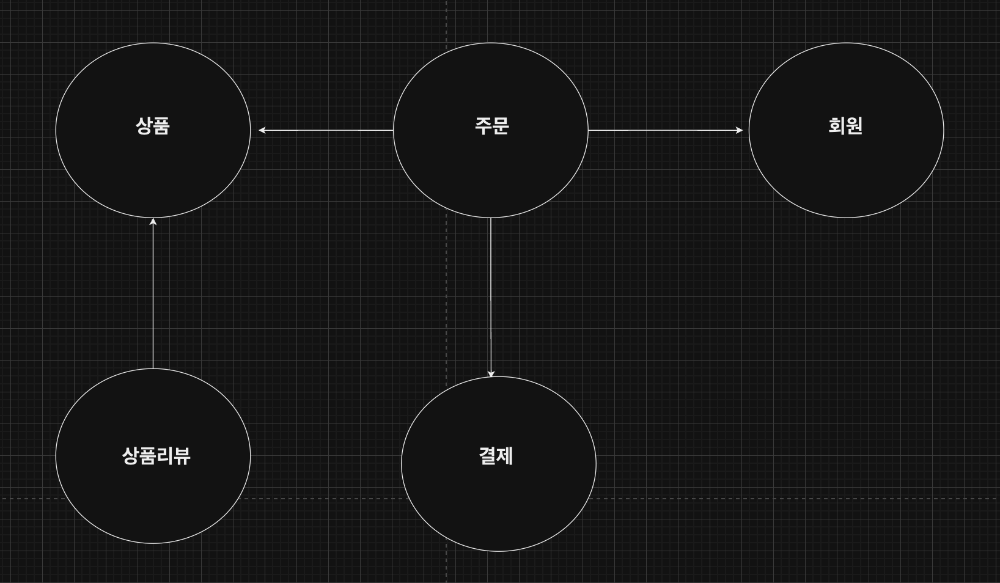
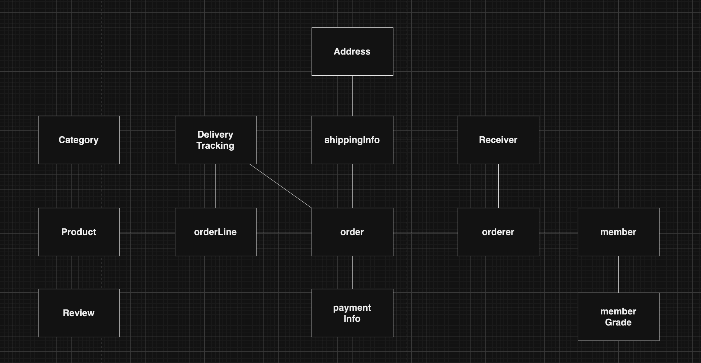
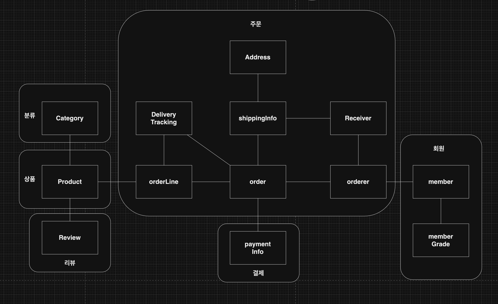
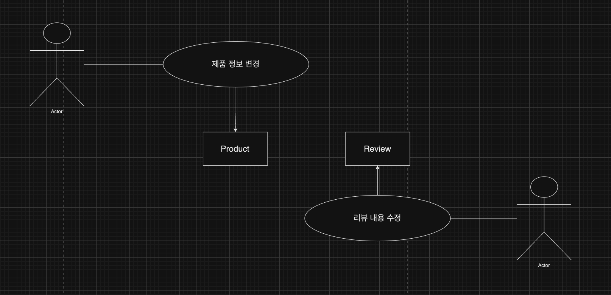
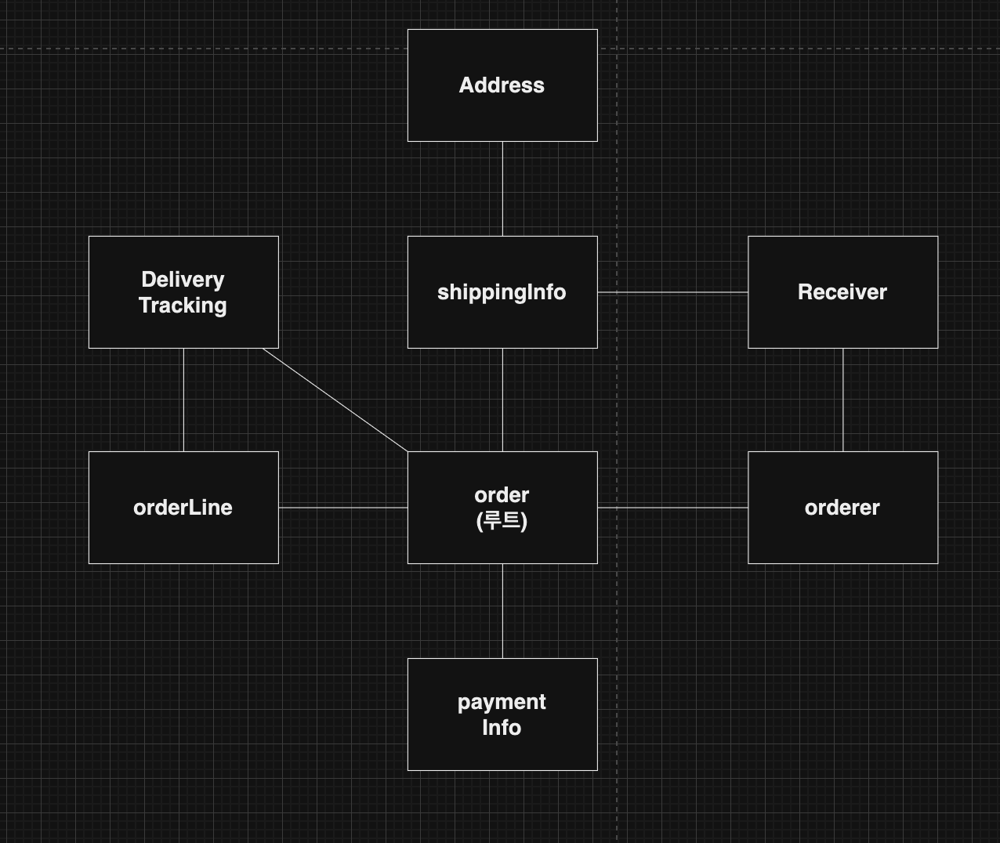
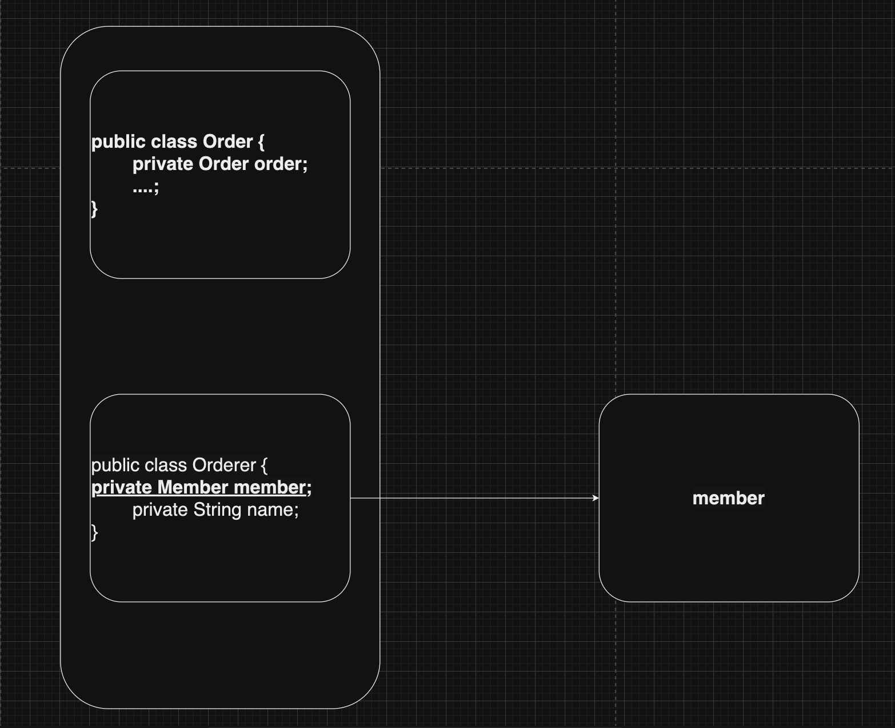
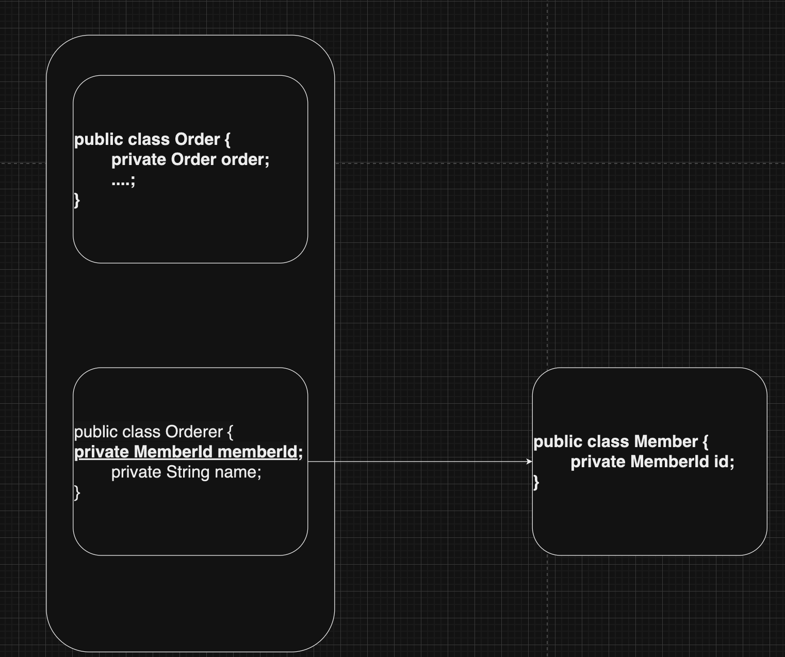
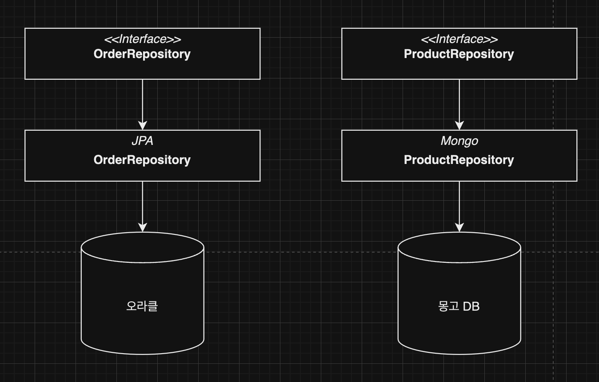

## 애그리거트



그림과 같이 상위 수준 개념을 이용해 전체 모델을 정리하면 직접적인 관계를 이해하는 데 도움이 됩니다.

상위 수준 모델을 개별 객체 단위로 다시 그려보면 아래와 같습니다.



백 개 이상의 테이블을 한 장의 ERD에 모두 표시하면 개별 테이블 간의 관계를 파악하느라 큰 틀에서 데이터 구조를 이해하는 데 어려움을 겪게 되는 것처럼, **도메인 객체 모델이 복잡해지면 개별 구성요소 위주로 모델을 이해하게 되고 전반적인 구조나 큰 수준에서 도메인 간의 관계를 파악하기 어려워집니다.**

⭐️⭐️⭐️  **애그리거트를 사용해서 표현**⭐️⭐️⭐️  

모델을 애그리거트 단위로 묶어서 다시 표현한 것입니다. 동일한 모델이지만 애그리거트를 사용함으로써 모델 관계를 개별 모델 수준과 상위 수준에서 모두 이해할 수 있습니다.



- 애그리거트는 모델을 이해하는 데 도움을 줍니다.
- 일관성을 관리하는 기준이 됩니다.
- 복잡한 도메인을 단순한 구조로 만들어줍니다.
- 관련된 모델을 하나로 모았기 때문에 애그리거트에 속한 객체는 유사하거나 동일한 라이프 사이클을 갖습니다.
- 애그리거트는 경계를 갖습니다. 한 애그리거트에 속한 객체는 다른 애그리거트에 속하지 않습니다.
    - (**경계를 설정할 때 기본이 되는 것은 도메인 규칙과 요구 사항입니다.**)
    - 예) **주문할 상품 개수, 배송지 정보, 주문자 정보는 주문 시점에 함께 생성되므로 이들은 한 애그리거트에 속합니다.**
- 흔히 'A가 B를 갖는다'로 설계할 수 있는 요구사항이 있다면 A와 B를 한 애그리거트로 묶어서 생각하기 쉽습니다. **하지만** 이것이 반드시 A와 B가 한 애그리거트에 속한다는 것을 의미하는 것은 아닙니다.



Review의 변경이 Product에 영향을 주지 않고 반대로 Product의 변경이 Review에 영향을 주지 않기 때문에, 이들은 한 애그리거트에 속하기보다는 그림에서 표현한 것처럼 서로 다른 애그리거트에 속합니다.

⭐️⭐️도메인에 대한 경험이 생기고 **도메인 규칙을 제대로 이해할수록 애그리거트의 실제 크기는 줄어듭니다.**

## 애그리거트 루트

주문 애그리거트는 다음을 포함합니다.

- 총 금액인 totalAmounts를 갖고 있는 Order 엔티티
- 개별 구매 상품의 개수인 quantity와 금액인 price를 갖고 있는 OrderLine 밸류

구매할 상품의 개수를 변경하면 한 OrderLine의 quantity를 변경하고 더불어 Order의 totalAmounts도 변경해야 합니다. 그렇지 않으면 도메인 규칙을 어기고 데이터 일관성이 깨집니다. **애그리거트는 여러 객체로 구성되기 때문에 한 객체만 상태가 정상이면 안 됩니다.**



애그리거트에 속한 모든 객체가 일관된 상태를 유지하려면 애그리거트 전체를 관리할 주체가 필요한데, 바로 애그리거트의 루트 엔티티입니다.

### 도메인 규칙과 일관성

```java
public class Order {

	// 에그리거트 루트는 도메인 규칙을 구현한 기능을 제공한다.
	public void changeShippingInfo(ShippingInfo newShippingInfo) {
		verifyNotYetShipped();
		setShippingInfo(newShippingInfo);
	}
	
	private void verifyNotYetShipped() {
		...
	}
}
```

⭐️⭐️ **애그리거트 외부에서 애그리거트에 속한 객체를 직접 변경하면 안 됩니다! 이것은 애그리거트 루트가 강제하는 규칙을 적용할 수 없어 모델의 일관성을 깨는 원인이 됩니다.**

```java
ShippingInfo si = order.getShippingInfo();
si.setAddress(newAddress);
```

이 코드는 애그리거트 루트인 Order에서 ShippingInfo를 가져와 직접 정보를 변경합니다. 주문 상태에 상관없이 배송지 주소를 변경하는데, 이는 업무 규칙을 무시하고 직접 DB 테이블의 데이터를 수정하는 것과 같은 결과를 만듭니다. **즉 논리적인 데이터 일관성이 깨지게 되는 것입니다.**

**루트를 통해서만 도메인 로직을 구현하려면 도메인 모델에 대해 다음의 두 가지를 습관적으로 적용해야 합니다.**⭐️⭐️ ⭐️⭐️ 

- 단순히 필드를 변경하는 set 메서드를 공개 범위로 만들지 않습니다.
- 밸류 타입은 불변으로 구현합니다.

공개 set 메서드는 도메인의 의미나 의도를 표현하지 못하고 도메인 로직을 도메인 객체가 아닌 응용 영역이나 표현 영역으로 분산시킵니다.

불변 타입으로 구현하면 밸류 객체를 변경할 수 없으며, 애그리거트 루트에서 밸류 객체를 구해도 애그리거트 외부에서 밸류 객체의 상태를 변경할 수 없습니다.

```java
ShippingInfo si = order.getShippingInfo();
si.setAddress(newAddress); // ShippingInfo가 불변이면, 이 코드는 컴파일 에러!.
```

즉 다음과 같이 애그리거트 루트가 제공하는 메서드에 새로운 밸류 객체를 전달해서 값을 변경하는 방법밖에 없습니다.

```java
public class Order {
      private ShippingInfo shippingInfo;
      
      public void changeShippingInfo(ShippingInfo newShippingInfo) {
          verifyNotYetShipping();
          setShippingInfo(newShippingInfo);
      }
      
      // set 메서드의 접근 허용 범위는 private이다.
      private void setShippingInfo(ShippingInfo newShippingInfo) {
          // 밸류가 불변이면 새로운 객체를 할당해서 값을 변경해야 한다.
          // 불변이므로 this.shipping.set()함수를 사용 할 수 없다.
          this.shippingInfo = newShippingInfo;
      }
}
```

### 애그리거트 루트의 기능 구현

애그리거트는 기능 실행을 위임하기도 합니다. 예를 들어 구현 기술의 제약이나 내부 모델링 규칙 때문에 OrderLine 목록을 별도 클래스로 분리했다고 해보겠습니다.

```java
public class OrderLines{
	private List<OrderLine> lines;
	
	public Money getTotalAmounts() {... 구현 ...}
	public void changeOrderLines(List<OrderLine> newLines) {
		this.lines = newLines;
	}
}
```

⭐️⭐️ `getOrderLines`를 제공했을 때 문제점!

OrderLines는 changeOrderLines()와 getTotalAmounts() 같은 기능을 제공하고 있습니다. 만약 Order가 getOrderLines()와 같이 OrderLines를 구할 수 있는 메서드를 제공하면 애그리거트 외부에서 OrderLines의 기능을 실행할 수 있게 됩니다.

```java
OrderLines lines  = order.getOrderLines();

//외부에서 에그리거트 내부 상태 변경!
// order의 totalAmounts가 값이 OrderLines가 일치하지 않게 됨
lines.changeOrderLines(newOrderLines);
```

이 기능은 주문의 OrderLine 목록이 바뀌는데 총합은 계산하지 않는 버그를 만듭니다. **이러한 버그가 생기지 않도록 미리 불변으로 구현하면 됩니다.** 보통 한 애그리거트에 속하는 모델은 한 패키지에 속하기 때문에, 패키지나 **protected 범위를 사용하면 애그리거트 외부에서 상태 변경 기능을 실행하는 것을 방지할 수 있습니다.**

### 트랜잭션 범위

트랜잭션 범위는 작을수록 좋습니다. 한 트랜잭션이 한 개 테이블을 수정하는 것과 **세 개의 테이블을 수정하는 것을 비교하면 성능에서 차이가 발생합니다.**

한 개 테이블을 수정하면 트랜잭션 충돌을 막기 위해 잠그는 대상이 한 개 테이블의 한 행으로 한정되지만, 세 개의 테이블을 수정하면 잠금 대상이 더 많아집니다.

⭐️⭐️⭐️ 한 트랜잭션에서는 한 개의 애그리거트만 수정해야 합니다.

동일하게 **한 트랜잭션에서는 한 개의 애그리거트만 수정해야 합니다**. 한 트랜잭션에서 두 개 이상의 애그리거트를 수정하면 트랜잭션 충돌이 발생할 가능성이 더 높아집니다.

```java
public class Order {
	private Orderer orderer;
	public void shipTo(ShippingInfo newShippingInfo, 
				boolean useNewShippingAddrAsMemberAddr ) {

		verifyNotYetShipped();
		if (useNewShippingAddrAsMemberAddr) {
			// 다른 애그리거트의 상태를 변경하면 안 됨!.
			orderer.getMember().changeAddress(newShippingInfo.getAddress());
		}
	}
}
...
```

위 소스코드는 애그리거트가 자신의 책임 범위를 넘어 다른 애그리거트의 상태까지 관리하는 꼴이 됩니다. 애그리거트는 최대한 서로 독립적이어야 하는데, **한 애그리거트가 다른 애그리거트의 기능에 의존하기 시작하면 애그리거트 간 결합도가 높아집니다. 결합도가 높아지면 수정 비용이 증가하므로 유지보수하는 데 힘들어집니다.**

⭐️⭐️⭐️부득이하게 한 트랜잭션으로 두 개 이상의 애그리거트를 수정해야 한다면 

부득이하게 한 트랜잭션으로 두 개 이상의 애그리거트를 수정해야 한다면, 애그리거트를 직접 수정하지 말고 **응용 서비스에서 두 애그리거트를 수정하도록 합니다.**

```java
public class changeOrderService {
	// 두 개 이상의 애그리거트를 변경해야 한다면
	// 응용 서비스에서 각 애그리거트의 상태를 변경한다.
	@Transcational
	public void changeShippingInfo(OrderId id, ShippingInfo newShippingInfo,
		 boolean useNewShippingAddrAsMemberAddr) {
		Order order = orderRepository.findbyId(id);
		if (order == null) throw new OrderNotFoundException();
		order.shipTo(newShippingInfo);
		if (useNewShippingAddrAsMemberAddr) {
			Member member = findMember(Order.getOrderer());
			member.changeAddress(newShippingInfo.getAddress());
		}
	}
}
```

### 리포지터리와 애그리거트

애그리거트는 개념상 완전한 한 개의 도메인 모델을 표현하므로, 객체의 영속성을 처리할 때 리포지터리는 애그리거트 단위로 존재합니다. 예를 들어 Order 애그리거트와 관련된 테이블이 세 개라면, Order 애그리거트를 저장할 때 애그리거트 루트와 매핑되는 테이블뿐만 아니라 애그리거트에 속한 모든 구성요소에 매핑된 테이블에도 데이터를 저장해야 합니다.

```java
// 리포지터리에 애그리거트를 저장하면 애그리거트 전체를 영속화해야 한다.
orderRepository.save(order);
```

```java
// 리포지터리는 완전한 order를 제공해야 한다.
Order order = orderRepository.findById(orderId);

// order가 온전한 애그리거트가 아니면
// 기능 실행 도중 NullPointException 과 같은 문제가 발생한다.
order.cancel();
```

## ID를 이용한 애그리거트 참조

한 객체가 다른 객체를 참조하는 것처럼 애그리거트도 다른 애그리거트를 참조합니다.



필드를 이용해서 다른 애그리거트를 직접 참조하는 것은 개발자에게 구현의 편리함을 제공해줍니다.

```java
order.getOrder().getMembmer().getId();
```

⭐️⭐️ 하지만 필드를 이용한 애그리거트 참조는 다음 **문제를 야기**할 수 있습니다.

- 편한 탐색 오용
- 성능에 대한 고민
- 확장 어려움

### 편한 탐색 오용

애그리거트 내부에서 다른 애그리거트 객체에 접근할 수 있으면 다음 코드처럼 구현의 편리함 때문에 다른 애그리거트를 수정하고자 하는 유혹에 빠지기 쉽습니다.

```java

public class changeOrderService {
	private Orderer orderer;

	public void changeShippingInfo(OrderId id, ShippingInfo newShippingInfo,
		 boolean useNewShippingAddrAsMemberAddr) {
		... 
		if (useNewShippingAddrAsMemberAddr) {
			// 한 애그리거트 내부에서 다른 애그리거트에 접근할 수 있으면
			// 구현이 쉬워진다는 것 때문에 다른 애그리거트의 상태를 변경하는
			// 유혹에 빠지기 쉽다.
			orderer.getMember().changeAddress(newShippingInfo.getAddress());
		}
	}
}
```

한 애그리거트에서 다른 애그리거트의 상태를 변경하는 것은 애그리거트 간의 의존 결합도를 높여서 결과적으로 애그리거트의 변경을 어렵게 합니다.

### 성능에 대한 고민

애그리거트를 직접 참조하면 성능과 관련된 여러 가지 고민을 해야 합니다. JPA를 사용하면 참조한 객체를 지연 로딩과 즉시 로딩 두 가지 방식으로 로딩할 수 있습니다.

### 확장 어려움

초기에는 단일 서버에 단일 DBMS로 서비스를 제공하는 것이 가능합니다. 문제는 사용자가 몰리기 시작하면서 발생합니다. 트래픽이 몰리면 자연스럽게 부하를 분산하기 위해 도메인별로 시스템을 분리합니다. 서로 다른 DBMS를 사용할 때도 있습니다. **이것은 더 이상 다른 애그리거트 루트를 참조하기 위해 JPA와 같은 단일 기술을 사용할 수 없음을 의미합니다.**

이런 세 가지 문제를 **완화할 때 사용할 수 있는 것이 ID를 이용해서 다른 애그리거트를 참조**하는 것입니다.



ID 참조를 사용하면 모든 객체가 참조로 연결되지 않고 한 애그리거트에 속한 객체들만 참조로 연결됩니다.

```java
public class changeOrderService {
	// 두 개 이상의 애그리거트를 변경해야 한다면
	// 응용 서비스에서 각 애그리거트의 상태를 변경한다.
	@Transcational
	public void changeShippingInfo(OrderId id, ShippingInfo newShippingInfo,
		 boolean useNewShippingAddrAsMemberAddr) {
		Order order = orderRepository.findbyId(id);
		if (order == null) throw new OrderNotFoundException();
		order.shipTo(newShippingInfo);
		if (useNewShippingAddrAsMemberAddr) {
			// ID를 이용해서 참조로하는 애그리거트를 구한다.
			
			Member member = memberRepository.findById(Order.getOrderer().getMemberId());
			member.changeAddress(newShippingInfo.getAddress());
		}
	}
}
```

⭐️ **ID를 이용한 참조 방식을 사용하면** 복잡도를 낮추는 것과 함께 한 애그리거트에서 다른 애그리거트를 수정하는 문제를 근원적으로 방지할 수 있습니다.

애그리거트별로 다른 구현 기술을 사용하는 것도 가능해집니다.



[도메인 주도 개발 시작하기 - 예스24](https://www.yes24.com/Product/Goods/108431347?pid=123487&cosemkid=go16481149689793107&gclid=Cj0KCQjwgNanBhDUARIsAAeIcAvU1218EfnAWaB7jwT88mKqCJ9UJbgjm5qk12G3_kgbQFKtHnPTQaUaArR8EALw_wcB)
