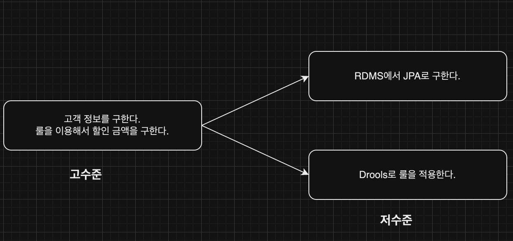
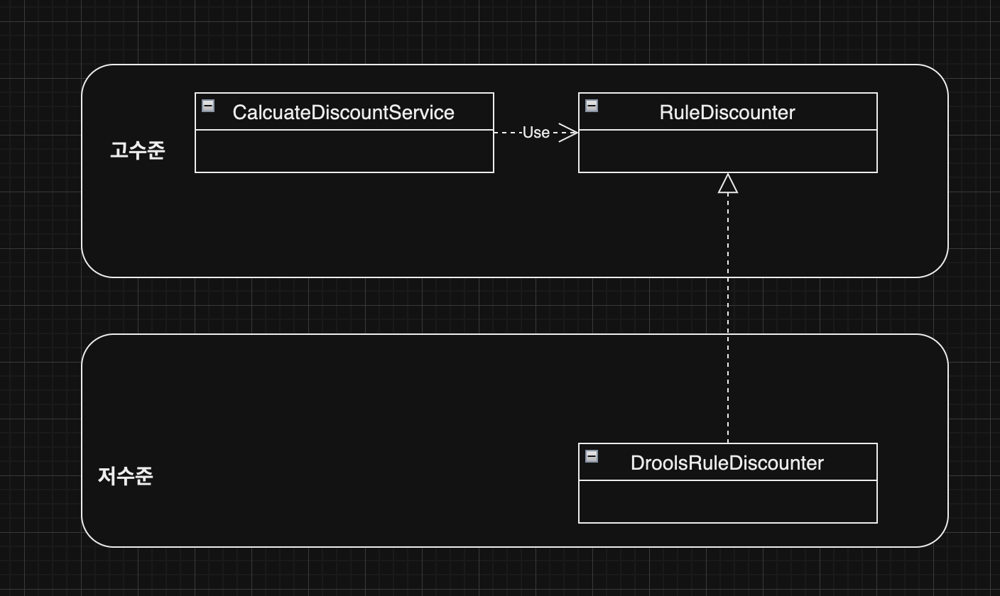
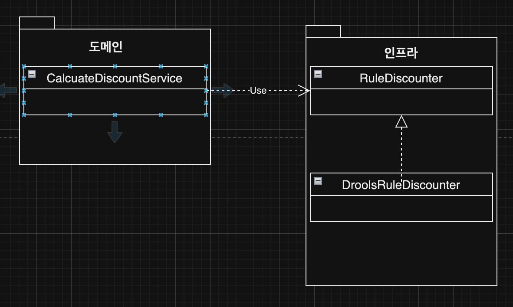
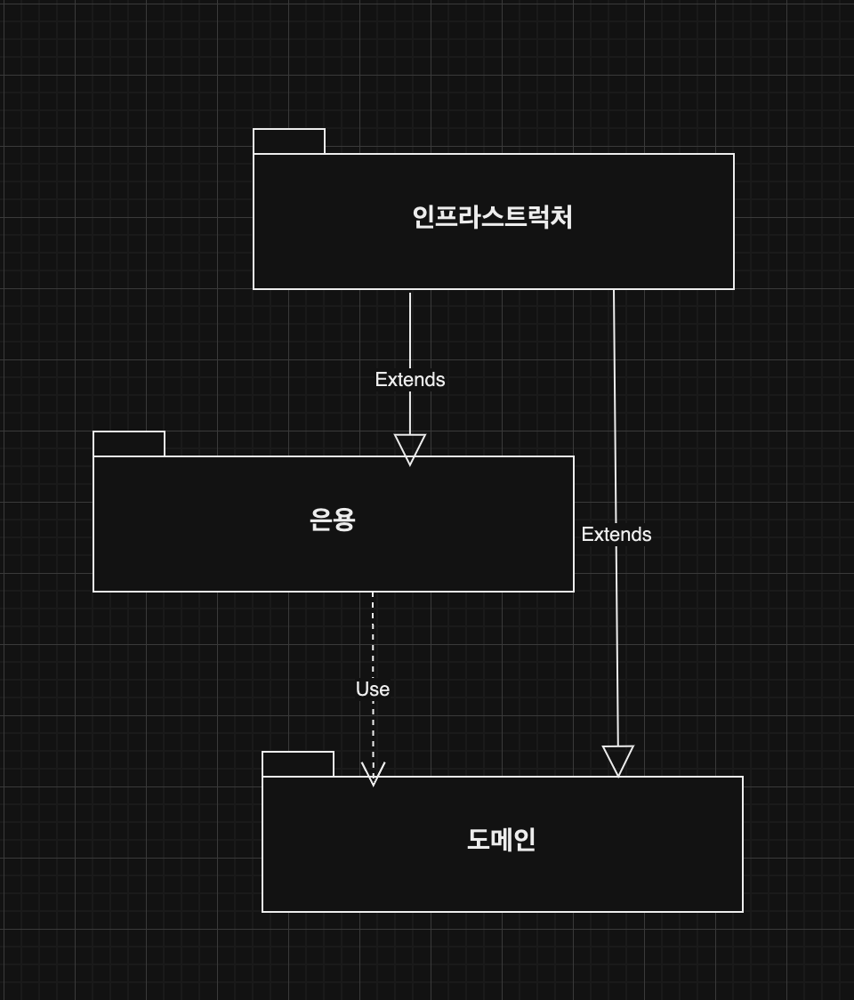
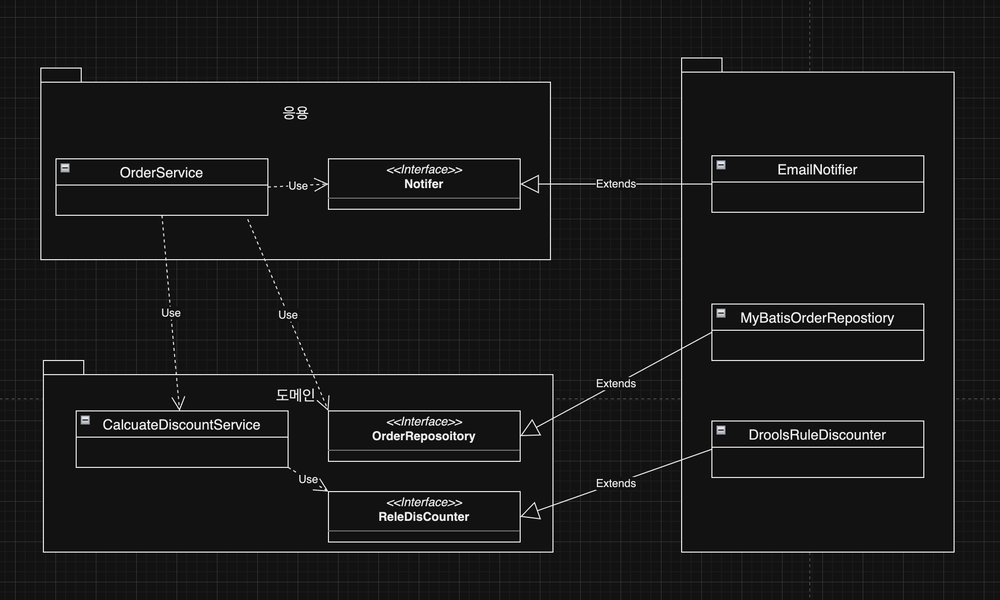
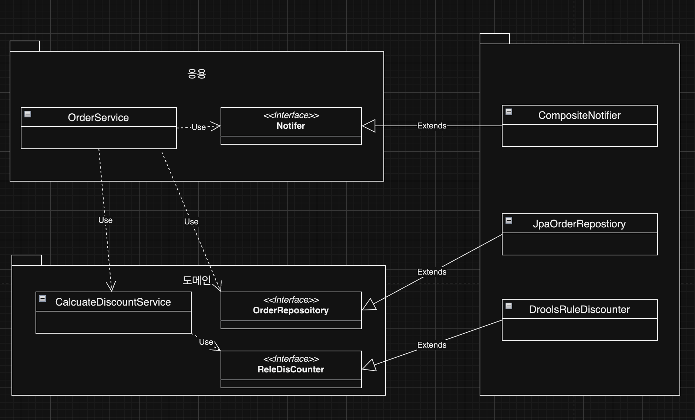
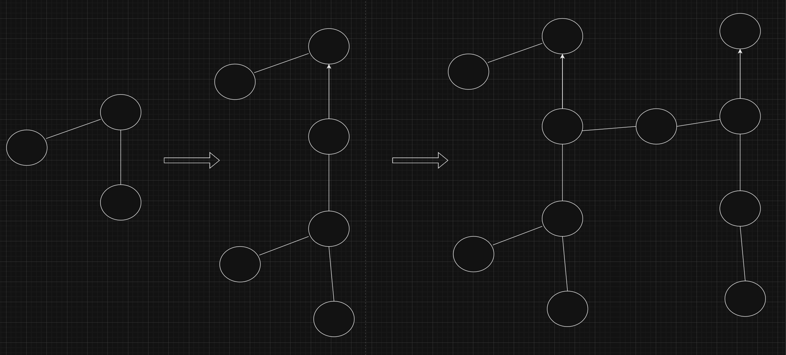
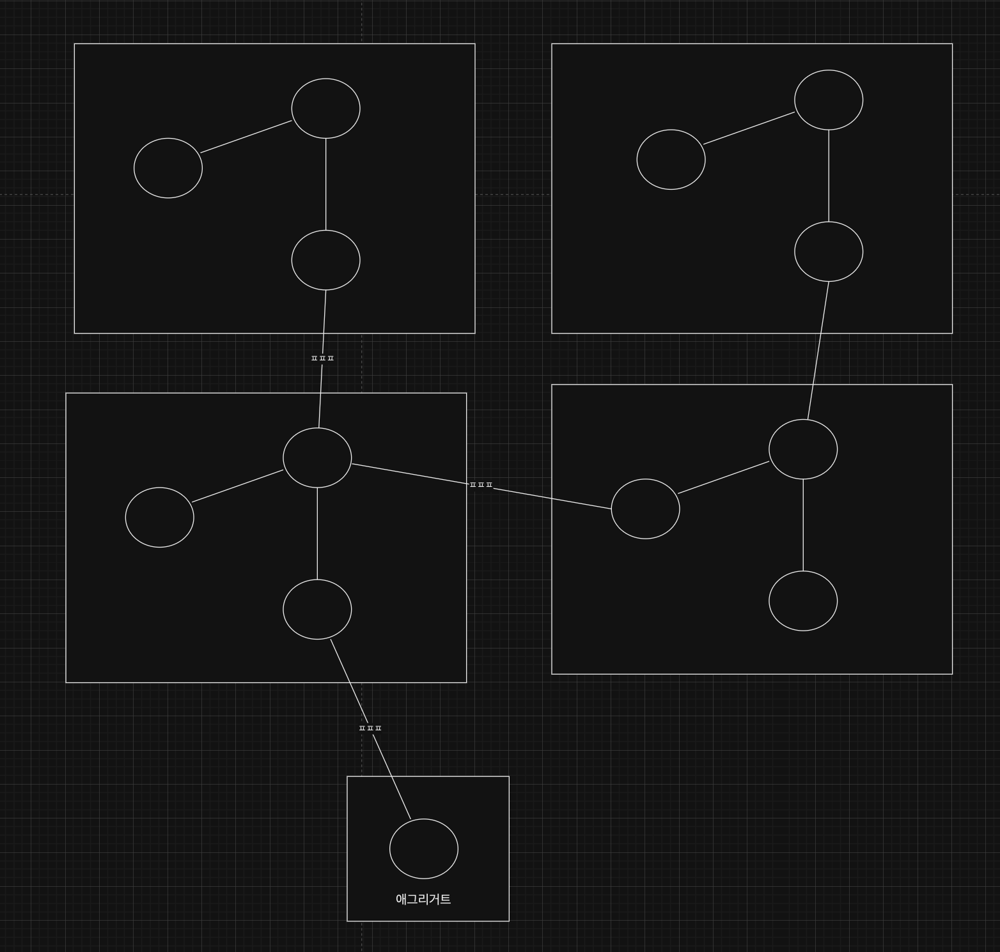
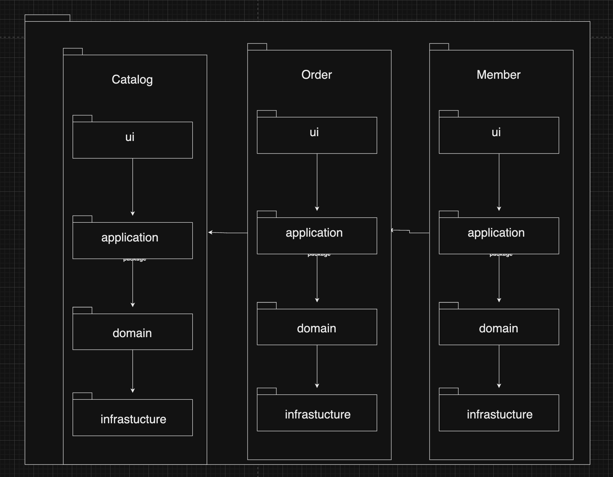
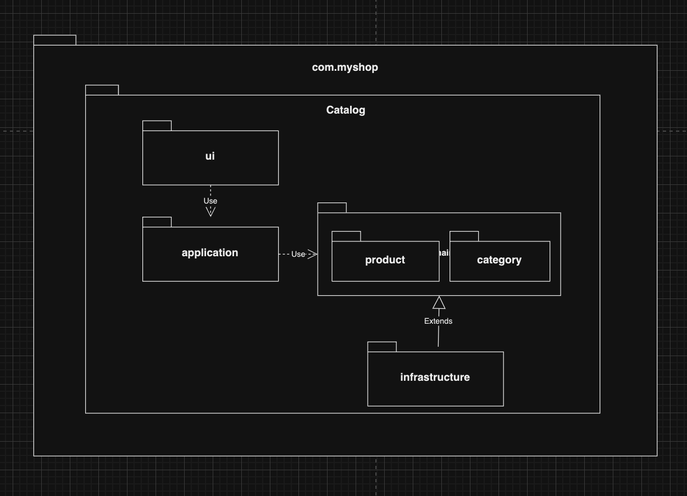

### DIP



CalculateDiscountService는 고수준 모듈입니다. 고수준 모듈은 의미 있는 단일 기능을 제공하는 모듈로, 가격 할인 계산이라는 기능을 구현합니다. **고수준의 기능을 구현하려면 여러 하위 기능이 필요합니다.**

CalculateDiscountService 입장에서는 적용 룰을 Drools로 구현했는지 자바로 직접 구현했는지가 중요하지 않습니다.

```java
public interface RuleDiscounter {
	...
}
```

```java
public class CalcuateDiscountService {
	private RuleDisCounter ruleDisCounter

	public CalcuateDiscountService (RuleDiscounter ruleDiscounter) {
		this.ruleDiscounter = ruleDiscounter;
	}

	public Money calcuateDiscount(List<OrderLine> orderLine, String customerId) {
		Customer customer = findCustomer(customerId);
		return ruleDisCounter.applyRules(customer, orderLine);
	}
}
```



DIP를 적용하면 그림과 같이 저수준 모듈이 고수준 모듈에 의존하게 됩니다. (DIP, 의존 역전 원칙이라고 부릅니다.)

**주의사항**

DIP를 잘못 생각하면 단순히 인터페이스와 구현 클래스를 분리하는 정도로 받아들일 수 있습니다.



위 그림은 잘못된 구조입니다. 이 구조에서 도메인 영역은 구현 기술을 다루는 인프라스트럭처 영역에 의존하고 있습니다. 여전히 고수준 모듈이 저수준 모듈에 의존하고 있는 것입니다. 즉, '할인 금액 계산'을 추상화한 인터페이스는 저수준 모듈이 아닌 고수준 모듈에 위치해야 합니다.

### DIP와 아키텍처



아키텍처 수준에서 DIP를 적용하면 인프라스트럭처 영역이 응용 영역과 도메인 영역에 의존하는 구조가 됩니다.

**DIP를 적용한 구조**



⭐️⭐️⭐️ 중요

이제 **구현체를 변경하면서** 자유롭게 방법을 변경할 수 있습니다.



### 도메인 영역의 주요 구성요소

| 요소 | 설명 |
| --- | --- |
| 엔티티 | 고유 식별자를 갖는 객체로 자신의 라이프 사이클을 갖는다. |
| 밸류 | 고유 식별자를 갖지 않는 객체로 주로 개념적으로 하나인 값을 표현할 때 사용한다. |
| 애그리거트 | 연관된 엔티티와 밸류 객체를 개념적으로 하나로 묶은 것이다. ex) 주문 |
| 리포지토리 | 도메인 모델의 영속성을 처리한다. |
| 도메인 서비스 | 도메인 로직이 여러 엔티티와 밸류를 필요로 하면 도메인 서비스에 로직을 구현한다. |

**애그리거트**

도메인이 커질수록 개발할 도메인 모델도 커지면서 많은 엔티티와 밸류가 출현합니다. 엔티티와 밸류 개수가 많아질수록 모델은 점점 더 복잡해집니다.



**주의 ⭐️⭐️⭐️**

도메인 모델이 복잡해지면 개발자가 전체 구조가 아닌 한 개 엔티티와 밸류에만 집중하는 상황이 발생합니다. 이때 상위 수준에서 모델을 관리하지 않고 **개별 요소에만 초점을 맞추면 전체적인 수준에서 모델을 이해하지 못해 큰 틀에서 모델을 관리할 수 없는 상황에 빠질 수 있습니다.**

도메인 모델에서 전체 구조를 이해하는 데 도움이 되는 것이 바로 **애그리거트**입니다.



### 모듈 구성



도메인이 크면 하위 도메인별로 모듈을 나눕니다.

카탈로그 하위 도메인이 상품 애그리거트와 카테고리 애그리거트로 구성될 경우 아래 그림과 같이 도메인을 두 개의 하위 패키지로 구성할 수 있습니다.



[도메인 주도 개발 시작하기 - 예스24](https://www.yes24.com/Product/Goods/108431347?pid=123487&cosemkid=go16481149689793107&gclid=Cj0KCQjwgNanBhDUARIsAAeIcAvU1218EfnAWaB7jwT88mKqCJ9UJbgjm5qk12G3_kgbQFKtHnPTQaUaArR8EALw_wcB)
