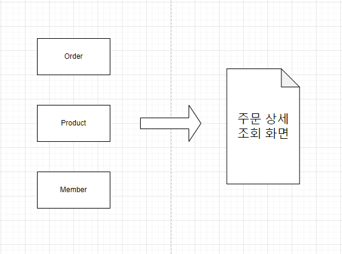
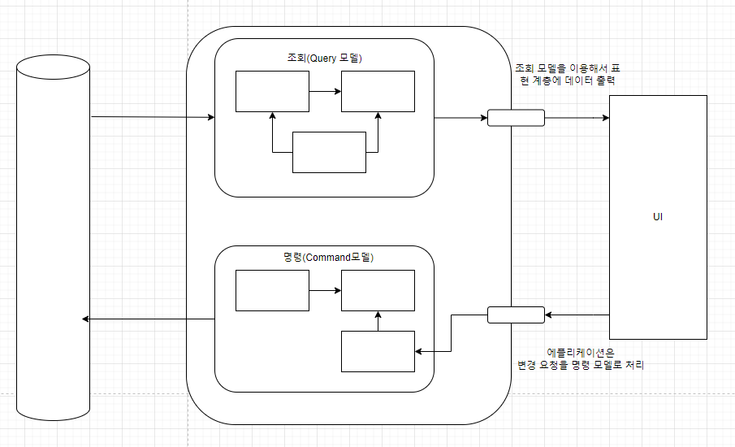
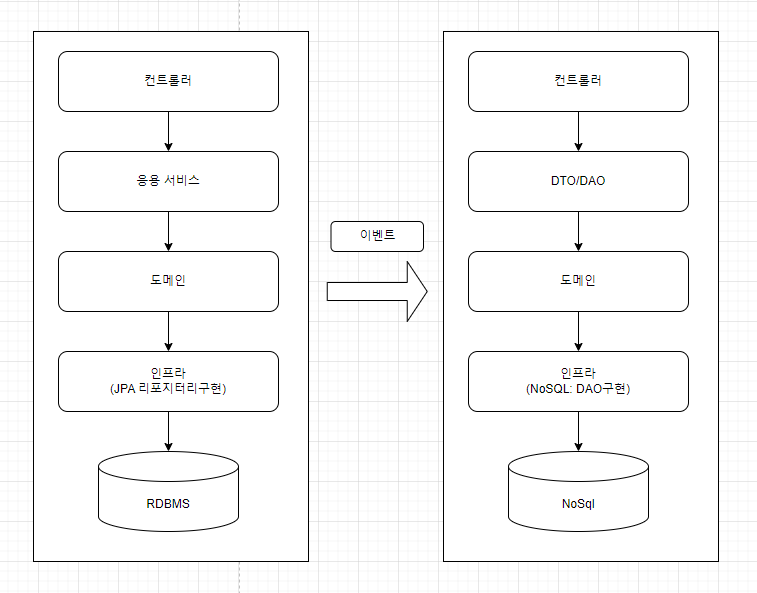

주문 내역 조회 기능을 구현하려면 여러 애그리거트에서 데이터를 가져와야 합니다.

- Order에서 주문 정보
- Product에서 상품 이름
- Member에서 회원 이름과 ID

조회 화면 특성상 조회 속도가 빠를수록 좋은데, 여러 애그리거트의 데이터가 필요하면 구현 방법을 고민해야 합니다.

3장에서 언급한 식별자를 이용해서 애그리거트를 참조하는 방식을 사용하면 즉시 로딩 방식과 같은 JPA의 쿼리 관련 최적화 기능을 사용할 수 없습니다. 이는 **한 번의 Select 쿼리로 조회 화면에 필요한 데이터를 읽어올 수 없어 성능에 문제가 생길 수 있다는 것을 의미합니다.**

**문제 발생 이유**

- 시스템 상태를 변경할 때와 조회할 때 단일 도메인 모델을 사용하기 때문입니다 → ORM 기법은 Order#Cancel()이나 Order#changeShippingInfo() 기능처럼 도메인 상태 변경 기능을 구현하는 데 적합합니다.
- 주문 상세 조회 화면처럼 여러 애그리거트에서 데이터를 가져와 출력하는 기능을 구현하려면 고려할 게 많아서 구현이 복잡해집니다.

**해결 방법**

- **상태 변경을 위한 모델과 조회를 위한 모델을 분리하는 것입니다!**

도메인이 복잡할수록 명령 기능과 조회 기능이 다루는 데이터 범위에 차이가 납니다.

(NoSQL의 경우 메모리 기반이라 조회 성능이 좋습니다.)

**구현 방법**

1. 명령 모델에서 데이터가 변경되면 조회 모델에 반영합니다(동기 이벤트와 글로벌 트랜잭션을 사용). 다만 동기 이벤트와 글로벌 트랜잭션을 사용하면 전반적인 성능이 떨어집니다.
2. 서로 다른 저장소의 데이터를 특정 시간 안에만 동기화합니다 → 예) 통계 데이터처럼 비동기로 데이터를 전송하는 방식입니다.

**CQRS의 장단점**

**장점**

1. 도메인 자체에 집중할 수 있습니다.
    1. 복잡한 도메인은 주로 상태 변경 로직이 복잡한데, 명령 모델과 조회 모델을 구분하면 조회 성능을 위한 코드가 명령 모델에 없으므로 도메인 로직을 구현하는 데 집중할 수 있습니다. 또한 명령 모델에서 조회 관련 로직이 사라져 복잡도가 낮아집니다.
2. 조회 성능을 향상시키는 데 유리합니다.
    1. 조회 단위로 캐시 기술을 적용할 수 있고, 조회에 특화된 쿼리를 마음대로 사용할 수 있습니다.
    2. 조회 전용 저장소를 사용하면 조회 처리량을 대폭 늘릴 수 있습니다.
    3. 조회 전용 모델을 사용하기 때문에 조회 성능을 높이기 위한 코드가 명령 모델에 영향을 주지 않습니다.

**단점**

1. 구현할 코드가 많아집니다.
2. 더 많은 구현 기술이 필요합니다. 또한 데이터 동기화를 위해 메시징 시스템을 도입해야 할 수도 있습니다.
