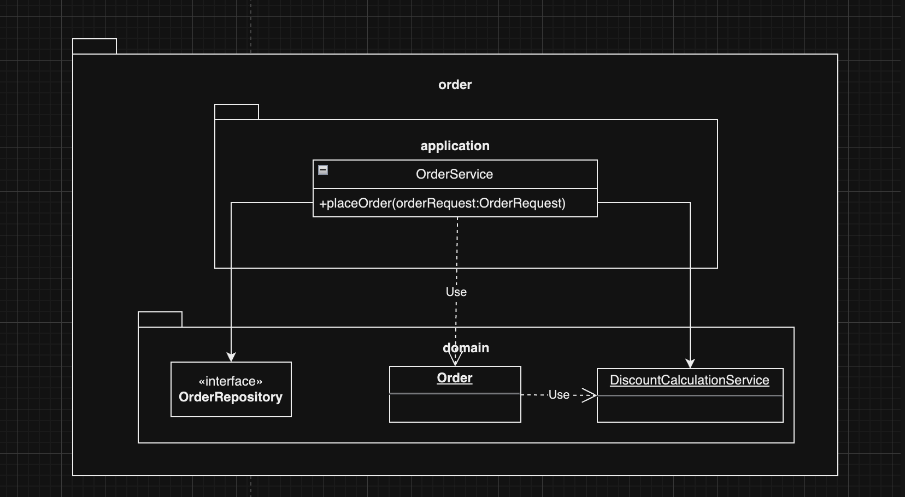
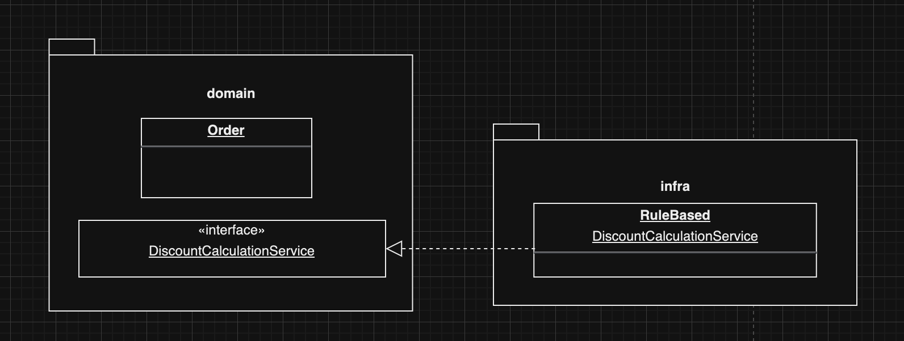

### 여러 애그리거트가 필요한 기능

한 애그리거트로 기능을 구현할 수 없을 때가 있습니다.

- 상품 애그리거트: 구매하는 상품의 가격이 필요합니다. 또한 상품에 따라 배송비가 추가되기도 합니다.
- 주문 애그리거트: 상품별로 구매 개수가 필요합니다.
- 할인 쿠폰 애그리거트: 쿠폰별로 지정한 할인 금액이나 비율에 따라 주문 총 금액을 할인합니다. 할인 쿠폰을 조건에 따라 중복 사용할 수 있다거나 지정한 카테고리의 상품에만 적용할 수 있다는 제약 조건이 있다면 할인 계산이 복잡해집니다.
- 회원 등급 애그리거트: 회원 등급에 따라 추가 할인이 가능합니다.

```java
public class Order {
		...
		private Orderer orderer;
		private List<OrderLine> orderLines;
		private List<Coupon> usedCoupons;

		private Money claculatePayAmounts() {
			Money totalAmounts = calculatetotalAmounts();
			money discount = 
						usedCoupons.stream()
											 .map(coupon -> calculateDiscount(coupon))
										   .reduce(Money(0), (v1,v2) -> v1.add(v2));
			// 회원에 따른 추가 할인을 구한다.
			Money membershipDiscount = 
					calculateDiscount(orderer.getMember().getGrade());
			return totalAmounts.minus(discount).minus(membershipDiscount);
		}
		
		private Money calculateDiscount(Coupon coupon) {
				// orderLines의 각 상품에 대해 쿠폰을 적용해서 할인 금액 계산하는 로직
		}

		private Money ccalculateDiscount(MemberGrade grade) {
			  // ..

		}

}
```

**발생**

- 특별 감사 세일로 전 품목에 2% 추가 할인을 하기로 했다면, 이 로직을 주문 애그리거트가 갖고 있는 것이 맞을까요?

**단점**

- 애그리거트가 자신의 책임 범위를 넘어서는 기능을 구현하게 되면 길이가 길어지고 외부에 대한 의존이 높아집니다.
- 복잡도가 올라갑니다.
- 애그리거트가 넘어서는 도메인 개념이 애그리거트에 숨겨져 명시적으로 드러나지 않게 됩니다.

**해결방법**

- **도메인 기능을 별도 서비스로 구현하는 것입니다.**

### 도메인 서비스

도메인 영역에 위치한 도메인 로직을 표현할 때 사용합니다.

**계산 로직과 도메인 서비스**

할인 금액 계산 로직을 위한 도메인 서비스는 다음과 같이 도메인의 의미가 드러나는 용어를 타입과 메서드 이름으로 갖습니다.

```java
public class DiscountCalculationService {
		
		public Money calculateDiscountAmounts (List<OrderLine> orderLines
																					 , List<Coupon> coupons
																					 , MemberGrade grade) {
			
					Money totalAmounts = calculatetotalAmounts();
					money discount = 
									coupons.stream()
														 .map(coupon -> calculateDiscount(coupon))
													   .reduce(Money(0), (v1,v2) -> v1.add(v2));
					// 회원에 따른 추가 할인을 구한다.
					Money membershipDiscount = 
								calculateDiscount(grade);
					return totalAmounts.minus(discount).minus(membershipDiscount);
		}

		private Money calculateDiscount(Coupon coupon) {
				// orderLines의 각 상품에 대해 쿠폰을 적용해서 할인 금액 계산하는 로직
		}

		private Money ccalculateDiscount(MemberGrade grade) {
			  // ..

		}
}
```

애그리거트의 결제 금액 계산 기능에 전달하면 사용 주체는 애그리거트가 됩니다.

```java
public class Order {

		public void calculateAmounts(DiscountCalculationService disCalSvc, MemberGrade grade) {
			Money totalAmoutns  = getTotalAmounts();
			Money discountAmounts = 
					disCalSvc.calculateDiscountAmounts(this.orderLines, this.coupons, grade);
			this.paymentAmounts = totalAmounts.minus(discountAmounts);
		}

}
```

도메인 서비스 객체 전달은 응용 서비스의 책임입니다.

> 특정 기능이 응용 서비스인지 도메인 서비스인지 감을 잡기 어려울 때는 해당 로직이 애그리거트의 상태를 변경하거나, 애그리거트의 상태 값을 계산하는지 검사해 보면 됩니다. **한 애그리거트에 넣기에 적합하지 않으면** 도메인 서비스로 구현하게 됩니다.

**도메인 서비스의 패키지 위치**



**도메인 서비스와 인터페이스와 클래스**

도메인 로직을 외부 시스템이나 별도 엔진을 이용해서 구현할 때 인터페이스와 클래스를 분리하게 됩니다.



위와 같이 도메인 서비스의 구현이 특정 구현 기술에 의존하거나 외부 시스템의 API를 실행한다면, 도메인 영역의 도메인 서비스는 인터페이스로 추상화해야 합니다. 이를 통해 도메인 영역이 특정 구현에 종속되는 것을 방지할 수 있고, 도메인 영역에 대한 테스트가 쉬워집니다.

[도메인 주도 개발 시작하기 - 예스24](https://www.yes24.com/Product/Goods/108431347?pid=123487&cosemkid=go16481149689793107&gclid=Cj0KCQjwgNanBhDUARIsAAeIcAvU1218EfnAWaB7jwT88mKqCJ9UJbgjm5qk12G3_kgbQFKtHnPTQaUaArR8EALw_wcB)
