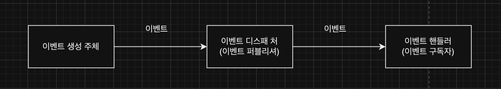
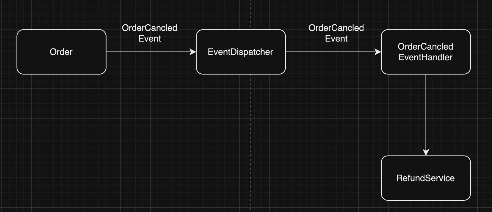
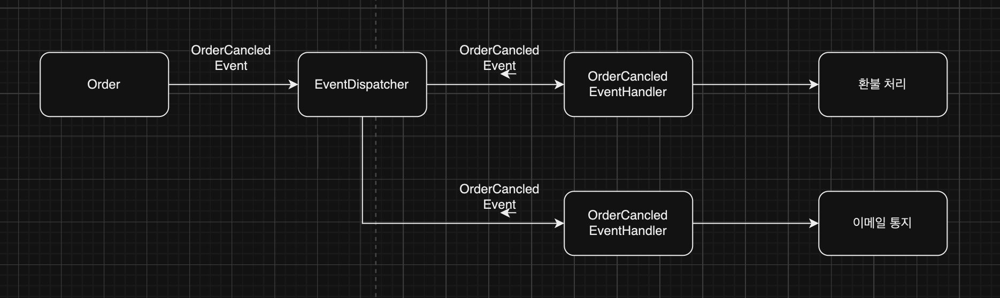
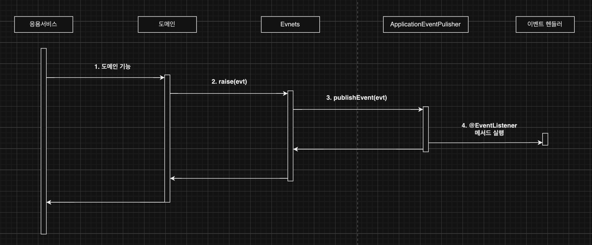
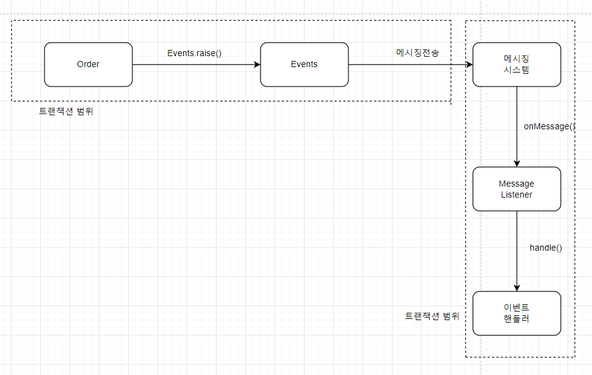
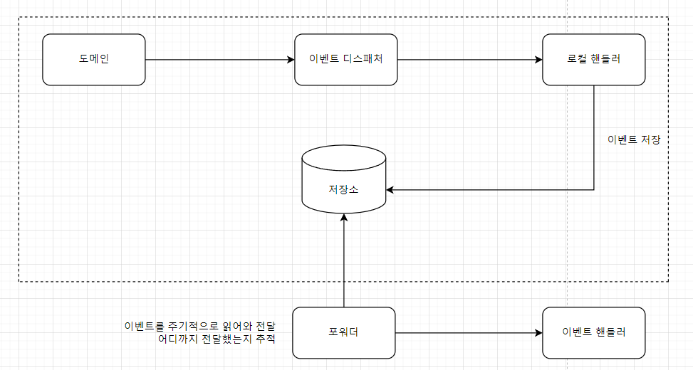
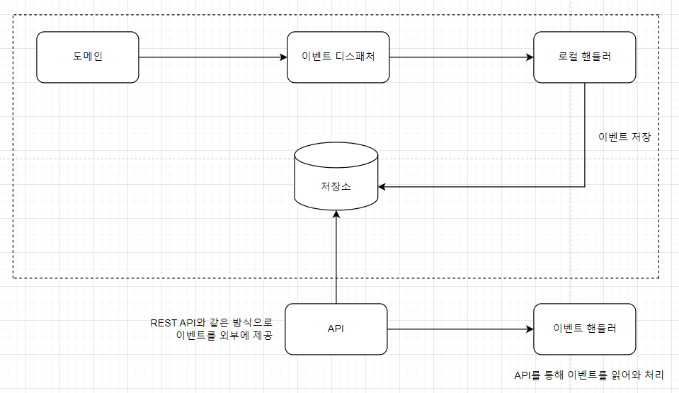
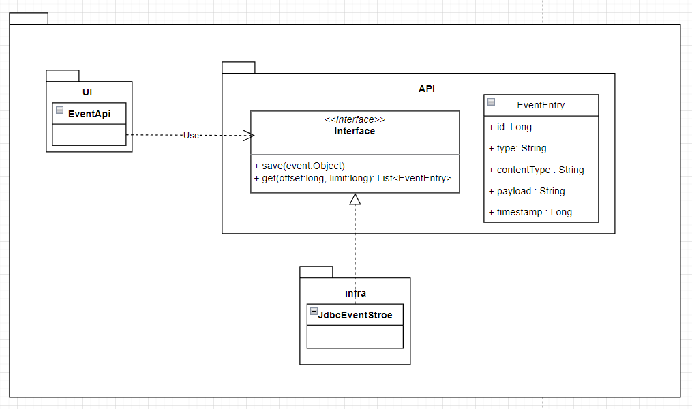
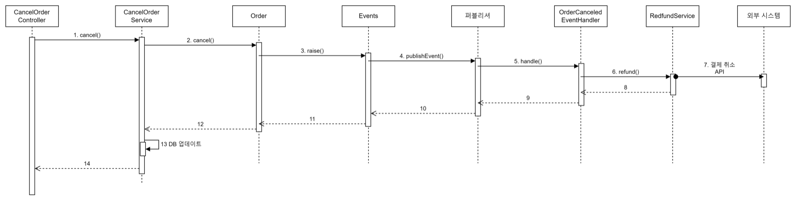
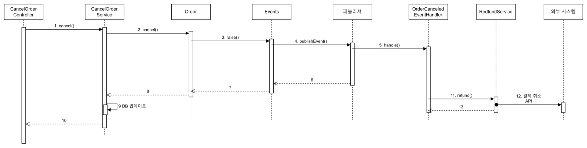

### 시스템 간 강결합 문제

```java
public class Order {
		...
		// 외부 서비스를 실행하기 위해 도메인 서비스를 파라미터로 전달받음
	public void cancel(RefundService refunService) {
			verifyNotYetShipped();
			this.state = OrderState.CANCELD;

			this.refundStatus = State.REFUND_STRTED;
			try {
				**reFundService.refund(getPaymentId());**
				this.refundStatus **=** State.REFUND_COMPLTED;
			} catch (Exception ex) {
				???
			}
	}
}
```

```java
public class CancelOrderService {
		private RefundService refundService;

		@Transcation
		public void cancel(OrderNo orderNo) {
				Order order = findOrder(orderNo);
				order.cancel();

				order.refundStarted();
				try {
					**refundService.refund(order.getPaymentId); // 외부 서비스 성능에 직접 영향을 받는다.**
					order.refundCompleted();
				} catch {
						???
				}
		}
}
```

보통 결제 시스템은 외부에 존재하므로 `RefundService`는 외부에 있는 결제 시스템이 제공합니다.

**문제 발생**

- 외부 서비스가 정상이 아닐 경우 트랜잭션 처리를 어떻게 할지 애매해집니다.
- 환불을 처리하는 외부 시스템 응답 시간이 길어지면 그만큼 대기 시간도 길어집니다.
- 만약 주문을 취소한 뒤에 환불뿐만 아니라 취소했다는 내용을 통지해야 한다면, 파라미터로 통지 서비스를 받도록 구현하면 로직이 섞이는 문제가 발생합니다.

→ **도메인 객체에 서로 다른 도메인 로직이 섞이는 것이 문제입니다 (주문 로직 + 결제 로직이 섞임)**⭐️⭐️

Order는 주문을 표현하는 도메인 객체인데, 결제 도메인의 환불 관련 로직이 섞이게 됩니다. 이것은 환불 기능이 바뀌면 Order도 영향을 받게 된다는 것을 의미합니다.

```java
public class Order {
		// 기능을 추가할 때마다 파라미터가 함께 추가되면
		// 다른 로직이 더 많이 섞이고, 트랜잭션 처리가 더 복잡해진다.
	public void cancel(RefundService refunService, NotiService notiSvc) {
			verifyNotYetShipped();
			this.state = OrderState.CANCELD;

			...  
			// 주문 + 결제 + 통지 로직이 섞임
			// reufndService는 성공하고, notiSvc는 실패하면?
			// refundService와 notiSvc 중 무엇을 먼저 처리하냐?
	}
}
```

이런 강한 결합을 없앨 수 있는 방법이 있습니다. 바로 **⭐️`이벤트`**를 사용하는 것입니다.

### 이벤트 개요

이벤트는 '과거에 벌어진 어떤 것'을 의미합니다.

**이벤트 관련 구성요소**



- 이벤트 생성 주체 : 엔티티, 밸류, 도메인 서비스와 같은 도메인 객체
- 이벤트 핸들러 : 이벤트 핸들러는 생성 주체가 발생한 이벤트를 전달받아 이벤트에 담긴 데이터를 이용해서 원하는 기능을 실행합니다.
- 이벤트 디스패처 : 이벤트 생성 주체와 이벤트 핸들러를 연결해 주는 역할이며, 이벤트 디스패처의 구현 방식에 따라 이벤트 생성과 처리를 동기나 비동기로 실행합니다.

**이벤트의 구성**

- 이벤트 종류 : 클래스 이름으로 이벤트 종류를 표현
- 이벤트 발생 시간
- 추가 데이터 : 주문번호, 신규 배송지 정보 등 이벤트와 관련된 정보

```java
public class ShippingInfoChangedEvent {
		private String orderNumber;
		private long timestamp;
		private ShippingInfo newShippingInfo;

		// 생성자, getter
}
```

- 이벤트는 현재 기준으로 과거에 벌어진 것을 표현하기 때문에 과거 시제를 사용합니다.
- 이벤트를 발생시키는 주체는 Order 애그리거트입니다.

```java
public class Order {
		...
		public void changeShippingInfo(ShippingInfo newShippingInfo) {
        verifyNotYetShipped();
        setShippingInfo(newShippingInfo);
        **Events.raise(new ShippingInfoChangedEvent(number, newShippingInfo));**
    }
		...
}
```

```java
public class ShippingInfoChangedHandler {
		
		@EventsListener(ShippingInfoChangedEvent.class)
		public void handle(ShippingInfoChangedEvent evt) {
				// 이벤트가 필요한 데이터를 담고 있지 않으면,
				// 이벤트 핸들러는 리포지터리, 조회 API, 직접 DB 접근 등의
				// 방식을 통해필요한 데이터를 조회해야 한다.
				shippingInfoSyncronizer.sync(
						evt.getOrderNumber(),
						evt.getShippingInfo());
		}
		...
}
```

**이벤트 용도**

1. 트리거 → 도메인 상태가 바뀔 때 다른 후처리가 필요하면 후처리를 실행하기 위한 트리거로 사용합니다.
    1. 예) 주문에서는 주문 취소 이벤트를 트리거로 사용합니다 → 주문을 취소하면 환불을 처리해야 하는데, 이때 환불 처리를 위한 트리거로 주문 취소 이벤트를 사용합니다.
    
    
    
2. 서로 다른 시스템 간의 데이터 동기화입니다. 배송지를 변경하면 외부 배송 서비스에 바뀐 배송지 정보를 전송해야 합니다. → **현재 제가 맡고 있는 시스템에서 동기화 관련된 외부 API 작업이 많은데, 적용하면 좋을 것으로 생각합니다.**

**이벤트 장점**

서로 다른 도메인 로직이 섞이는 것을 방지할 수 있습니다.

[AS-IS]

```java
public class CancelOrderService {
		private RefundService refundService;

		@Transcation
		public void cancel(OrderNo orderNo) {
				Order order = findOrder(orderNo);
				order.cancel();

				order.refundStarted();
				try {
					**refundService.refund(order.getPaymentId); // 외부 서비스 성능에 직접 영향을 받는다.**
					order.refundCompleted();
				} catch {
						???
				}
		}
}
```

[TO-BE]

```java
public class Order {
		...
		public void cancel() {
        verifyNotYetShipped();
				this.state = OrderState.CANCELED;
        **Events.raise(new OrderCanceledEvent(number.getNumber()));**
    }
		...
}
```

구매 취소에 더 이상 환불 로직이 없습니다 → 이벤트 핸들러를 사용하면 기능 확장도 용이합니다. 구매 취소 시 환불과 함께 이메일로 취소 내용을 보내고 싶다면 이메일 발송을 처리하는 핸들러를 구하면 됩니다.



### 이벤트, 핸들러, 디스패처 구현

- 이벤트 클래스 : 이벤트를 표현합니다.
- 디스패처 : 스프링이 제공하는 ApplicationEventPublisher를 이용합니다.
- Events : 이벤트를 발생시킵니다. 이벤트 발생을 위해 ApplicationEventPublisher를 사용합니다.
- 이벤트 핸들러 : 이벤트를 수신해서 처리합니다.

**이벤트**

```java
public class OrderCanceledEvents {
		// 이벤츠는 핸들러에서 이벤트를 처리하는데 필요한 데이터를 포함한다.
		private String orderNumber;
		
		public OrderCanceledEvent(String number) {
			this.orderNumber = number;
		}
		
		public String getOrderNumber() {return orderNumber;}
}
```

- 모든 이벤트가 공통으로 갖는 프로퍼티가 존재하면 관련 상위 클래스를 만들 수 있습니다.

```java
public abstract class Event {
		private long timestamp;

		public event() {
				this.timestamp = System.currentTimeMillis();
		}

		public long getTimestamp() {
				return this.timestamp;
		}
}
```

**Events 클래스와 ApplicationEventPulisher**

이벤트를 발생과 발행을 위해 `ApplicationEventPulisher`를 사용합니다.

Events 클래스를 알아보겠습니다.

```java
public class Events {
		private static ApplicationEventsPublisher publisher;

		static void setPulisher(ApplicationEventsPublisher publisher) {
				Events.publisher = publisher;
		}

		public static void raise(Object event) {
				if (publisher != null) {
						publisher.publisherEvent(event);
				}
		}
}
```

Event#SetPublisher() 메서드에 이벤트 퍼블리셔를 전달하기 위해 스프링 설정 클래스를 설정하는 방법입니다.

```java
@Configureation
public class EvnetsConfiguration {
		@Autwired
		private ApllicationContext applicationContext;

		@Bean
		public InitializingBean eventsInitializer() {
				return () -> Events.setPublisher(applicationContext);
		}
}
```

- `eventsInitializer()` → `InitializingBean` 타입 객체를 빈으로 설정합니다. 스프링 빈 객체를 초기화할 때 사용하는 인터페이스입니다.

**이벤트 발생과 이벤트 핸들러**

- 이벤트 발생 코드 → Events.raise()

```java
public class Order { 
		
		public void cancel() {
				verifyNotYetShipped();
				this.state = OrderState.CANCLED;
				Events.raise(new OrderCanceledEvents(nuber.getNumber()));
		}
}
```

`@EventListener` 애너테이션을 사용해서 이벤트를 처리할 핸들러를 구현합니다.

```java

@Service
public class OrderCanceledEventHandler {
		private RefundSevice refundSevice;

		public OrderCancledEventHandler(RefundSevice refundSevice) {
				this.refundSevice = refundSevice;
		}

		@EventListener(OrderCanceledEvent.class)
		public void handle(OrderCanceledEvent event) {
				refundSevice.fund(event.getOrderNumber());
		}
}
```

**흐름 처리**



1. 도메인 기능을 실행합니다.
2. 도메인 기능은 Events.raise()를 이용해서 이벤트를 발생시킵니다.
3. Events.raise()는 스프링이 제공하는 ApplicationEventsPublisher를 이용해서 이벤트를 출력합니다.
4. ApplicationEventsPublisher는 @EventListener 애너테이션이 붙은 메서드를 찾아 실행합니다.

### 동기 이벤트 처리 문제 ⭐️⭐️⭐️

- 이벤트를 사용해서 강결합 문제는 해소했습니다.
- **외부 서비스에 영향을 받는 문제는 아직 해소하지 못했습니다.**

```java
// 1. 응용 서비스 코드
@Trnasactional // 외부 연동 과정에서 익셉션이 발생하면 트랜잭션 처리는?
public void cancel(OrderNo orderNo) {
		Order order = findOrder(orderNo);
		order.cancle(); // order.cancel()에서 OrderCanceledEvent 발생
}

// 2. 이벤트를 처리하는 코드
@Service
public class OrderCanceledEventHandler {
		...
			
		@EventListener(OrderCanceledEvent.class)
		public void handle(OrderCanceledEvent event) {
			// refundService.refund()가 느려지거나 익셉션이 발생한다면?
				refundService.refund(event.getOrderNumber());
		}
}
```

- refund가 느려지면 → cancel() 메서드도 함께 느려집니다.
- refundService.refund()에 익셉션이 발생하면 cancel()을 롤백해야 할까요?

외부 환불 서비스가 실패했다고 해서 반드시 트랜잭션을 롤백해야 할까요? → 일단 구매 취소 자체는 처리하고 환불만 재처리하거나 수동으로 처리할 수도 있습니다.

외부 시스템과의 연동을 동기로 처리할 때 발생하는 성능과 트랜잭션 범위 문제를 해소하는 방법은 다음과 같습니다.

1. 이벤트를 비동기로 처리
2. 이벤트와 트랜잭션을 연계

### 비동기 이벤트 처리

회원 가입 신청을 하면 검증을 위해 이메일을 보내는 서비스가 많습니다.

회원 가입 신청을 하자마자 바로 내 메일함에 검증 이메일이 도착할 필요는 없습니다. → 몇 초 뒤에 도착해도 문제 되지 않습니다.

'A하면 이어서 B 하라'는 내용을 담고 있는 요구사항은 실제로 'A 하면 최대 언제까지 B 하라'인 경우가 많습니다. → 'A하면'은 이벤트로 볼 수도 있습니다. → 'A 하면 최대 언제까지 B 하라'로 바꿀 수 있는 요구사항은 이벤트를 비동기로 처리하는 방식으로 구현할 수 있습니다.

**이벤트를 비동기로 하는 방법**

1. 로컬 핸들러를 비동기로 실행하기
2. 메시지 큐를 사용하기
3. 이벤트 저장소와 이벤트 포워더 사용하기
4. 이벤트 저장소와 이벤트 제공 API를 사용하기

**로컬 핸들러 비동기 실행**

이벤트 핸들러를 별도 스레드로 실행하는 것입니다.

- @EnableAsync 애너테이션을 사용해서 비동기 기능을 활성화합니다.
- 이벤트 핸들러 메서드에 @Async 애너테이션을 붙입니다.

```jsx
@SpringBootApplication
@EnableAsync
public class ShopApplication {

		public static void main(String [] args) {
				SpringApplication.run(ShopApplication.class, args);
		}
}
```

비동기로 실행할 이벤트 핸들러 메서드에 @Async 애너테이션을 붙입니다.

```jsx
@Service
public class OrderCancelEventHandler {

		@Async
		@EventListner(OrderCanceledEvent.class)
		public void handle(OrderCanceledEvent event) {
			refundService.refund(event.getOrderNumber());
		}
}
```

**메시징 시스템을 이용한 비동기 구현**

비동기 이벤트를 처리해야 할 때 사용하는 또 다른 방법은 카프카나 래빗MQ와 같은 메시징 시스템을 사용하는 것입니다.



필요하다면 이벤트를 발생시키는 도메인 기능과 메시지 큐에 이벤트를 저장하는 절차를 한 트랜잭션으로 묶어야 합니다. → 글로벌 트랜잭션이 필요합니다.

**글로벌 트랜잭션의 장단점**

장점

- 안전하게 이벤트를 메시지 큐에 전달할 수 있습니다.

단점

- 글로벌 트랜잭션으로 인해 전체 성능이 떨어집니다.

**이벤트 저장소를 이용한 비동기 처리**

1. 이벤트를 DB에 저장한 뒤에 별도 프로그램을 이용해서 이벤트 핸들러에 전달하는 것입니다.



1. 이벤트 발생
2. 핸들러에서 → 스토리지에 이벤트 저장
3. 포워더는 주기적으로 이벤트 처리 장소에 이벤트를 가져옴
4. 포워더는 별도 쓰레드를 사용해서 비동기로 처리

**API를 이용해서 이벤트를 외부에 제공하는 방식**



**이벤트 저장소 구현**



- EventEntry : 이벤트 저장소에 보관할 데이터
- EventStore : 이벤트를 저장하고 조회하는 인터페이스
- JdbcEventStore : JDBC를 이용한 EventStore 구현 클래스
- EventApi : REST API를 이용해서 이벤트 목록을 제공하는 컨트롤러

**EventEntry**

```jsx

public class EventEntry {
    private Long id;
    private String type;
    private String contentType;
    private String payload;
    private long timestamp;

    public EventEntry(String type, String contentType, String payload) {
        this.type = type;
        this.contentType = contentType;
        this.payload = payload;
        this.timestamp = System.currentTimeMillis();
    }

    public EventEntry(Long id, String type, String contentType, String payload,
                      long timestamp) {
        this.id = id;
        this.type = type;
        this.contentType = contentType;
        this.payload = payload;
        this.timestamp = timestamp;
    }

    public Long getId() {
        return id;
    }

    public String getType() {
        return type;
    }

    public String getContentType() {
        return contentType;
    }

    public String getPayload() {
        return payload;
    }

    public long getTimestamp() {
        return timestamp;
    }
}
```

- EventStore는 이벤트 객체를 직렬화해서 payload에 저장합니다. 이때 JSON으로 직렬화했다면 contentType 값으로 'application/json'을 갖습니다.

**EventStore**

```jsx
public interface EventStore {
    void save(Object event);

    List<EventEntry> get(long offset, long limit);
}
```

- 이벤트는 과거에 벌어진 사건이므로 데이터가 변경되지 않습니다.

**JdbcEventStore** 

```jsx
@Component
public class JdbcEventStore implements EventStore {
    private ObjectMapper objectMapper;
    private JdbcTemplate jdbcTemplate;

    public JdbcEventStore(ObjectMapper objectMapper, JdbcTemplate jdbcTemplate) {
        this.objectMapper = objectMapper;
        this.jdbcTemplate = jdbcTemplate;
    }

    @Override
    public void save(Object event) {
        EventEntry entry = new EventEntry(event.getClass().getName(),
                "application/json", toJson(event));
        jdbcTemplate.update(
                "insert into evententry " +
                        "(type, content_type, payload, timestamp) " +
                        "values (?, ?, ?, ?)",
                ps -> {
                    ps.setString(1, entry.getType());
                    ps.setString(2, entry.getContentType());
                    ps.setString(3, entry.getPayload());
                    ps.setTimestamp(4, new Timestamp(entry.getTimestamp()));
                });
    }

    private String toJson(Object event) {
        try {
            return objectMapper.writeValueAsString(event);
        } catch (JsonProcessingException e) {
            throw new PayloadConvertException(e);
        }
    }

    @Override
    public List<EventEntry> get(long offset, long limit) {
        return jdbcTemplate.query(
                "select * from evententry order by id asc limit ?, ?",
                ps -> {
                    ps.setLong(1, offset);
                    ps.setLong(2, limit);
                },
                (rs, rowNum) -> {
                    return new EventEntry(
                            rs.getLong("id"),
                            rs.getString("type"),
                            rs.getString("content_type"),
                            rs.getString("payload"),
                            rs.getTimestamp("timestamp").getTime());
                });
    }
}
```

DDL

```sql
create table evententry (
  id int not null AUTO_INCREMENT PRIMARY KEY,
  `type` varchar(255),
  `content_type` varchar(255),
  payload MEDIUMTEXT,
  `timestamp` datetime
) character set utf8mb4;
```

**이벤트 저장을 위한 이벤트 핸들러 구현**

```java
@Component
public class EventStoreHandler {
    private EventStore eventStore;

    public EventStoreHandler(EventStore eventStore) {
        this.eventStore = eventStore;
    }

    @EventListener(Event.class)
    public void handle(Event event) {
        eventStore.save(event);
    }
}
```

EventStoreHandler의 handle() 메서드는 eventStore.save() 메서드를 이용해서 이벤트 객체를 저장합니다.

**RESAT API 구현**

```java
@RestController
public class EventApi {
    private EventStore eventStore;

    public EventApi(EventStore eventStore) {
        this.eventStore = eventStore;
    }

    @RequestMapping(value = "/api/events", method = RequestMethod.GET)
    public List<EventEntry> list(
            @RequestParam("offset") Long offset,
            @RequestParam("limit") Long limit) {
        return **eventStore.get(offset, limit);**
    }
}
```

API를 사용하는 클라이언트는 일정 간격으로 다음 과정을 실행합니다.

1. 가장 마지막에 처리한 데이터의 offset인 lastOffset을 구합니다. 저장한 lastOffset이 없으면 0을 사용합니다.
2. 마지막에 처리한 lastOffset을 offset으로 사용해서 API를 실행합니다.
3. API 결과로 받은 데이터를 처리합니다.
4. offset + 데이터 개수를 lastOffset으로 저장합니다.

**포워더 구현**

**EventForwarder** 

```java
@Component
public class EventForwarder {
    private static final int DEFAULT_LIMIT_SIZE = 100;

    private EventStore eventStore;
    private OffsetStore offsetStore;
    private EventSender eventSender;
    private int limitSize = DEFAULT_LIMIT_SIZE;

    public EventForwarder(EventStore eventStore,
                          OffsetStore offsetStore,
                          EventSender eventSender) {
        this.eventStore = eventStore;
        this.offsetStore = offsetStore;
        this.eventSender = eventSender;
    }

    @Scheduled(initialDelay = 1000L, fixedDelay = 1000L)
    public void getAndSend() {
        long nextOffset = getNextOffset();
        List<EventEntry> events = eventStore.get(nextOffset, limitSize);
        if (!events.isEmpty()) {
            int processedCount = sendEvent(events);
            if (processedCount > 0) {
                saveNextOffset(nextOffset + processedCount);
            }
        }
    }

    private long getNextOffset() {
        return offsetStore.get();
    }

    private int sendEvent(List<EventEntry> events) {
        int processedCount = 0;
        try {
            for (EventEntry entry : events) {
                eventSender.send(entry);
                processedCount++;
            }
        } catch(Exception ex) {
            // 로깅 처리
        }
        return processedCount;
    }

    private void saveNextOffset(long nextOffset) {
        offsetStore.update(nextOffset);
    }

}
```

- getNextOffset() → 읽어올 이벤트의 다음 offset을 구합니다.
- eventStore.get(nextOffset, limitSize) → 이벤트 저장소에서 offset부터 limitSize만큼 이벤트를 구합니다.
- 구한 이벤트가 존재하면 sendEvent(events) 메서드를 이용해서 이벤트를 전송합니다. sendEvent(events) 메서드는 처리한 이벤트 개수를 리턴합니다.
- saveNextOffset(nextOffset + processedCount) → 처리한 이벤트 개수가 0보다 크면 다음에 읽어올 offset을 저장합니다.

getAndSend() 메서드를 주기적으로 실행하기 위해 스프링의 @Scheduled 애너테이션을 사용합니다.

**OffsetStore** 

```java
public interface OffsetStore {
    long get();
    void update(long nextOffset);
}
```

- OffsetStore를 구현한 클래스는 offset 값을 DB 테이블에 저장하거나 로컬 파일에 보관해서, 마지막 offset 값을 물리적 저장소에 보관하면 됩니다.

**EventSender**

```java
public interface EventSender {
    void send(EventEntry event);
}
```

### 이벤트 적용 시 추가 고려 사항 ⭐️⭐️⭐️⭐️

1. 이벤트 소스를 EventEntry에 추가할지 여부입니다. 앞서 구현한 EventEntry는 이벤트 발생 주체에 대한 정보를 갖지 않습니다. → 'Order가 발생시킨 이벤트만 조회하기'처럼 특정 주체가 발생시킨 이벤트만 조회하는 기능을 구현할 수 없습니다.
2. 포워더에서 전송 실패를 얼마나 허용할 것이냐입니다 → 이벤트 전송에 실패하면 실패한 이벤트부터 다시 읽어와 전송을 시도합니다 → 계속 실패하면 문제가 발생합니다 → 포워더를 구현할 때는 실패한 이벤트 재전송 횟수를 제한을 두어야 합니다.
3. 이벤트 손실입니다 → 이벤트 저장소를 사용하는 방식은 이벤트 발생과 이벤트 저장을 한 트랜잭션으로 처리하기 때문에, 트랜잭션에 성공하면 이벤트가 저장소에 보관된다는 것을 보장할 수 있습니다. 반면 로컬 핸들러를 이용해서 이벤트를 비동기로 처리할 경우 이벤트 처리에 실패하면 유실됩니다.
4. 이벤트 발생 순서대로 외부 시스템에 전달해야 할 경우, 이벤트 저장소를 사용하는 것이 좋습니다. 메시징 시스템은 사용 기술에 따라 이벤트 발생 순서와 메시지 전달 순서가 다를 수 있습니다.
5. 이벤트 재처리입니다. 동일한 이벤트를 다시 처리해야 할 때 이벤트를 어떻게 할지 결정해야 합니다. 가장 쉬운 방법은 마지막으로 처리한 이벤트의 순번을 기억해 두었다가, 이미 처리한 순번의 이벤트가 도착하면 해당 이벤트를 처리하지 않고 무시하는 것입니다. → 회원 가입 신청 이벤트가 처음 도착하면 이메일을 발송하는데, 동일한 순번의 이벤트가 다시 들어오면 이메일을 발송하지 않는 방식으로 구현합니다.

**이벤트 처리와 DB 트랜잭션 고려**

- 주문 취소 기능은 주문 취소 이벤트를 발생시킵니다.
- 주문 취소 이벤트 핸들러는 환불 서비스에 환불 처리를 요청합니다.
- 환불 서비스는 외부 API를 호출해서 결제를 취소합니다.

**동기로 처리하는 실행 흐름**



**문제 발생**

- 12번 과정까지 다 성공하고 13번 과정에서 DB를 업데이트하는 데 실패하는 상황입니다 → 결제는 취소됐는데 DB에는 주문이 취소되지 않은 상태로 남게 됩니다.

**비동기 처리하는 실행 흐름**



이벤트 핸들러를 호출하는 5번 과정은 비동기로 실행됩니다 → 만약 12번 과정에서 외부 API 호출에 실패하면, DB는 주문이 취소된 상태로 데이터가 바뀌었는데 결제는 취소되지 않은 상태로 남게 됩니다.

이벤트 처리를 동기로 하든 비동기로 하든 이벤트 처리 실패와 트랜잭션 실패를 함께 고려해야 합니다. 트랜잭션 실패와 이벤트 처리 실패를 모두 고려하면 복잡해지므로 경우의 수를 줄이면 도움이 됩니다. → **경우의 수를 줄이는 방법은 트랜잭션이 성공할 때만 이벤트 핸들러를 실행하는 것입니다.**

@TransactionalEventListener 애너테이션은 스프링 트랜잭션 상태에 따라 이벤트 핸들러를 실행할 수 있게 합니다.

```java
@TransactionalEventListener(
		classes = OrderCancledEvent.class,
		phase = TransactionPhase.AFTER_COMMIT
)
public void handle(OrderCanceledEvent event) {
		refundService.refund(event.getIrderNumber());
}
```

`TransactionPhase.AFTER_COMMIT`은 스프링 트랜잭션 커밋에 성공한 뒤에 핸들러 메서드를 실행합니다.
