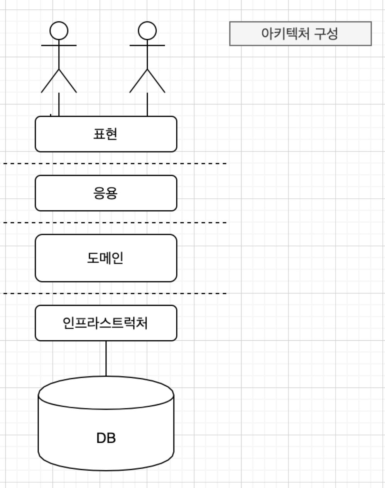

> 책을 읽게 된 계기

이전에 트랜잭션 관련해서 질문한 적이 있는데, 아래와 같은 답변을 받아서 읽게 되었습니다.

> 서비스에서 서비스를 호출하는 구조는 피하고 도메인 레이어에 도메인 서비스를 둬서 처리하는 것을 최범균님이 쓴 '도메인 주도 개발 시작하기(DDD Start)'에서 본 적이 있습니다.

[Java] @Transaction 롤백 안되는 원인[프록시]

이제 읽기 시작하였고, 챕터별로 정리하도록 하겠습니다.

### 도메인 전문가와 개발자 간 지식 공유

코딩에 앞서 요구사항을 올바르게 이해하는 것이 중요합니다. 요구사항을 제대로 이해하지 않으면 쓸모없거나 유용함이 떨어지는 시스템을 만들기 때문입니다. → 개발을 시작하기 전에 직접적으로 사용자 혹은 기획자와 같이 이야기하는 시간을 가져, 도메인에 대한 이해도를 높여야 좋은 결과물이 나옵니다.

### 도메인 모델 패턴

그림. 아키텍처 구성



주문에 대한 기능을 구현할 때 관련된 중요 업무 규칙을 주문 도메인 모델인 Order에 두든 OrderState에 두든, 중요한 점은 주문과 관련된 중요 업무 규칙을 구현한 코드는 도메인 모델에만 위치해야 한다는 것입니다.

### 도메인 모델 도출

도메인 모델을 도출할 때는 핵심 구성요소, 규칙, 기능을 찾는 것입니다.

ex)

- 최소한 한 종류 이상의 상품을 주문해야 한다.
- 한 상품을 한 개 이상 주문할 수 있다.
- 총 주문 금액은 각 상품의 구매 가격을 합을 모두 더한 금액이다.
- 각 상품의 구매 가격 합은 상품 가격에 구매 개수를 곱한 값이다.
- 주문할 때 배송지 정보를 반드시 지정해야 한다.
- 배송지 정보는 받는 사람 이름, 전화번호 주소로 구성한다.
- 출고를 하면 배송지를 변경할 수 없다.
- 출고 전에 주문을 취소할 수 있다.
- 고객이 결제를 완료하기 전에는 상품을 준비하지 않는다.

```java
public class Order {
	public void changeShipped() {...}
	public void changeShippingInfo(ShippingInfo shippingInfo) {...}
	public void cancel() {...}
	public void completePayment() {...}
}
```

위 요구사항을 잘 파악했다면 Order에 어떤 기능이 들어가야 할지 유추할 수 있습니다.

- 한 상품을 한 개 이상 주문할 수 있다.
- 각 상품의 구매 가격 합은 상품 가격에 구매 개수를 곱한 값이다.

이를 토대로 OrderLine을 구성할 수 있습니다.

```java
public class OrderLine{
	private Product product;
	private int price;
	private int qunatity;
	private int amounts;
	
	public OrderLine(Product product, int pirce, int quantity) {
		this.product = product;
		this.price = price;
		this.qunatity = qunatity;
		this.amounts = amounts;
	}

	private int calcualteAmounts() {
		return price * amounts;
	}

	public int getAmonuts() {....} 

}
```

위 예제처럼 기획자, 사용자와의 의사소통 속에서 도메인 모델을 어떻게 구현할지 고민한 뒤 코드를 작성하면 좀 더 원활하게 구현할 수 있다는 것이 중요한 부분인 것 같습니다.

그리고 이렇게 만든 모델은 요구사항 정련을 위해 도메인 전문가나 다른 개발자와 논의하는 과정에서 공유하기도 합니다.

### 밸류 타입

```java
public class ShippingInfo {
	private String reciverName;
	private String reciverPhoneNumber;

	private String shippingAddress1;
	private String shippingAddress2;
	private String shippingZipcode;
}
```

밸류 타입은 개념적으로 완전한 하나를 표현할 때 사용합니다.

reciverName, reciverPhoneNumber를 아래와 같이 변경해 줄 수 있습니다.

```java
Public class Reciver {
	private String name;
	private String phoneNumber;

	public Reciver(String name, String phoneNumber ) {
		this.name = name;
		this.phoneNumber = phoneNumber;
	}
	...
}
```

같은 방법으로 Address도 묶어 줄 수 있겠습니다.

**주의해야 될 점**

> 밸류 객체의 데이터를 변경할 때는 기존 데이터를 변경하기보다는 변경한 데이터를 갖는 **새로운 밸류 객체를 생성하는 방식을 선호한다.**

```java
public class Money{
	private int value;

	public Money add(Money money) {
		return new Monoey(this.value + monry.value);
	}

	// value를 변경 할 수 있는 메서드 없음 
}
```

만약 Money가 setValue()와 같은 메서드를 제공해 준다면 아래와 같이 **참조 투명성과 관련된 문제가 발생합니다.**

```java
money price = new Money(1000);
OrderLine orderLine = new OrderLine(product, price, 2);
price.setValue(2000);
```

이 참조 값 때문에 `price`의 `value`를 변경하는 순간 `OrderLine`의 값도 **같이 변경되는 문제가 발생합니다.**

**해결방법**

```java
public class OrderLine {
	...
	public OrderLine(Product product, Money price, int quntity) {
		this.price = new Money(price.getValue);
	}
}
```

불변이라면 위와 같은 코드는 필요 없겠지만, 변경 가능하다면 안전하지 않기 때문에 위와 같이 사용합니다.

[도메인 주도 개발 시작하기 - 예스24](https://www.yes24.com/Product/Goods/108431347?pid=123487&cosemkid=go16481149689793107&gclid=Cj0KCQjwgNanBhDUARIsAAeIcAvU1218EfnAWaB7jwT88mKqCJ9UJbgjm5qk12G3_kgbQFKtHnPTQaUaArR8EALw_wcB)
