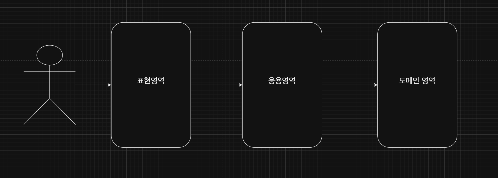

### 표현 영역과 응용 영역



- 표현 영역은 사용자의 요청을 해석합니다.
- 실제 사용자가 원하는 기능은 응용 영역에서 제공합니다.

```java
@PostMapping("/member/join")
public ModelAndVeiw join(HttpServletRequest request) {
		String email = request.getParameter("email");
		String password = request.getPassword("password");
		//사용자 요청을 응용 서비스에 맞게 변환
		JoinReuqest joinReq = new JoinRequest(email, password);
		// 변환한 객체(데이터)를 이용해서 응용 서비스 실행
		JoinService.join(joinReq);
		... 
}
```

### 응용 서비스의 역할

- 사용자(클라이언트)가 요청한 기능을 실행합니다.
- 도메인 객체를 사용해서 사용자의 요청을 처리합니다.
- 주로 도메인 객체 간의 흐름을 제어하기 때문에 아래와 같이 구현합니다.

```java
public Result doSomeFunc(SomeReq req) {
		// 1. 리포지터리에서 애그리거트를 구한다.
		SomeAgg agg = someAggRepository.findById(req.getId());
		checkNull(agg);

		// 2. 애그리거트의 도메인 기능을 실행한다.
		agg.doFunc(req.getValau());

		// 3. 결과를 리턴한다.
		return createSuccessResult(agg);
}
```

```java
public Result doSomeCreation(CreateSomeReq req) {
		// 1. 데이터 중복 등 데이이터가 유효한지 검사한다.
		validate(req);

		// 2. 에그리거트를 생성한다.
		someAgg newAgg = createSome(req);

		// 3. 리포지터리에 에그리거트를 저장한다.
		someAggRepository.save(newAgg);

		// 4. 결과를 리턴한다.
		return createSuccessResult(newAgg);
}
```

- **응용 서비스가 복잡하다면 응용 서비스에 도메인 로직의 일부를 구현하고 있을 가능성이 높습니다.**
- 응용 서비스는 트랜잭션 처리도 담당합니다.

```java
public void blockMembers(String[] blockIds) {
		if (blockingIds == null || blockingIds.length == 0) return;
		List<Member> members = memberRepostiory.findByIdIn(blockIds);
		for (Member member : members) {
				mem.block();
		}
}
```

- blockMembers() 메서드가 트랜잭션 범위에서 실행되지 않으면, 반영 도중 문제가 생길 때 일부 Member만 차단 상태가 되어 데이터 일관성이 깨지게 됩니다. 때문에 응용 서비스의 트랜잭션 범위에서 실행해야 합니다.

**도메인 로직 넣지 않기**

```java
public class changePasswordService {
		public void changePassword(String memberId, String oldPw, String newPw) {
			Member member = memberRepository.findById(memberId);
			checkMemberExists(member);
			member.changePassword(oldpw, newPw);
		}
...
}
```

Member 애그리거트는 암호를 변경하기 전에 기존 암호를 올바르게 입력했는지 확인하는 로직을 구현합니다.

```java
public class Member {
		public void changePasswrod(String oldPw, String newPw) {
			if (!matchPassword(oldPw)) throw new badPasswordException();
			setPassword(newPw);
		}

		// 현재 암호와 일치하는지 검사하는 도메인 로직
		public boolean matchPassword(String pwd) {
			return passwordEncoder.matches(pwd);
		}

		private void setPasswrod(String newPw) {
				if (isEmpty(newPw)) throw new IllegalArgumentException("no new password");
				this.password = newPw;
		}
}
```

기존 암호를 올바르게 입력했는지 확인하는 것은 도메인의 핵심 기능이기 때문에 응용 서비스에 구현하면 안 됩니다.

```java
public class ChangePasswordService {

		public void changePassword(String memberId, String oldPw, String newPw) {
				Member member = memberRepository.findById(memberId);

				if (!passwordEncoder.matches(oldPw, member.getPassword())) {
					throw new badPasswordException();
				}
				member.setPassword(newPw);
		}
}
```

도메인 로직을 도메인 영역이 아닌 응용 서비스에 구현하면 다음과 같은 문제가 생깁니다.

1. 코드의 응집성이 떨어집니다.
2. 여러 응용 서비스에 동일한 도메인 로직을 구현할 가능성이 높아집니다.

이러한 문제(응집도가 떨어지고 코드 중복이 발생하는 것)는 결과적으로 코드 변경을 어렵게 만듭니다.

### 응용 서비스의 구현

응용 서비스는 표현 영역과 도메인 영역을 연결하는 매개체 역할을 합니다.

**응용 서비스의 크기**

회원 도메인을 생각해 보겠습니다. 보통 두 가지 방법 중 한 가지 방식으로 구현합니다.

- 한 응용 서비스 클래스에 회원 도메인의 모든 기능 구현하기
- 구분되는 기능별로 응용 서비스 클래스를 따로 구현하기

**한 응용 서비스 클래스에 모두 구현**

```java
public class MemberService {
		// 각 기능을 구현하는 데 필요한 리포지터리, 도메인 서비스 필드 추가
		private MemberRepository memberRepostiory;

		public void join(MemberJoinRequest joinRequest) {...}
		public void changePassword(String memberId, String curPw, String newPw) {...}
		...

}
```

**장점**

- 동일 로직에 대한 코드 중복을 제거할 수 있습니다.

**단점**

- 클래스의 크기가 커집니다. 연관성 없는 코드가 한 클래스에 위치할 수 있습니다.
- 엄연히 분리하는 것이 좋은 상황임에도 습관적으로 기존에 존재하는 클래스에 억지로 끼워 넣게 됩니다.

**별도 클래스 구현**

```java
public class ChangePasswordService {
		private MemberRepostiory memberRepostiory;

		public void changePassword(String memberId, String curPw, String newPw) {
				Member member = memberRepostory.findById(memberId);
				if (member == null) throw new NoMemberException(memberId);
				member.changePassword(curPw, newPw);
		}
		...
}
```

```java
//각 응용 서비스에서 공통되는 로직을 별도 클래스로 구현
public final class MemberServiceHelper {
		public static Member findExistingMember(MemberRepositry repo, String memberId) {
				Member member = repo.findById(memberId);
				if (member == null) 
						throw new NoMemberException();
				return member;
		}
}

// 공통 로직을 제공하는 메서드를 응용 서비스에서 사용
public class ChangePasswordService {
		private MemberRepositry memberRepostiory;

		public void changePassword(String memberId, String curPw, String newPw) {
			Member member = findExistingMember(memberRepostiory, memberid);
			member.changePassword(curPw, newPw);
		}
}
```

**메서드 파라미터와 값 리턴**

- 응용 서비스가 제공하는 메서드는 도메인을 이용해서 사용자가 요구한 기능을 실행하는 데 필요한 값을 파라미터로 전달받아야 합니다.

```java
public class ChangePasswordService {
		// 암호 변경 기능 구현에 필요한 값을 파라미터로 전달 받음
		public void changePassword(String memberId, String curPw, String newPw) {
			...
		}
}
```

다음 코드처럼 별도 클래스로 전달합니다.

```java
public class ChangePasswordRequest {
		private String memberId;
		private String currentPassword;
		private String newPassword();

		.. get 메서드 등 생략
}
```

```java
public class ChangePasswordService {
		// 암호 변경 기능 구현에 필요한 값을 파라미터로 전달 받음
		public void changePassword(ChangePasswordRequest req) {
				Member member = findExistingMember(req.getMemberId());
				member.changePassword(req.getCurrentPassword(), req.getNewPassword());
		}
		...
}
```

**표현 영역에 의존하지 않기 ⭐️⭐️⭐️**

응용 서비스의 파라미터 타입을 결정할 때 주의할 점은 표현 영역과 관련된 타입을 사용하면 안 된다는 점입니다.

```java
@Controller
@RequestMapping("/member/changePassword")
public class MemberPasswordController {
		
		@PostMapping
		public String submit(HttpSergiceRequest request) {
			try{
					// 응용 서비스가 표현 영역을 의존하면 안됨
					changePasswordService.changePassword(request);
			} catch (NoMemberException ex){
					// 알맞은 익셉션 처리 및 응답
			}
		}
}
```

응용 서비스가 표현 영역에 대한 의존이 발생하면 다음과 같은 문제가 생깁니다.

1. 응용 서비스 단독으로 테스트하기 어렵습니다.
2. 표현 영역이 변경되면 응용 영역도 변경해야 합니다.
3. 응용 서비스가 표현 영역의 역할까지 대신 하는 상황이 발생할 수 있습니다.

```java
public class AuthenticationService {
		public void authenticate(HttpServletRequest request) {
				...
				// 응용 서비스에서 표현 영역이 상태 처리
				HttpSession session = request.getSession()
				...
		}
}
```

**문제점**

- 코드만으로 표현 영역의 상태가 어떻게 변경되는지 추적하기 어려워집니다. → 응집도가 깨집니다. → 유지보수하기 어려워집니다.

**해결 방법**

- 철저하게 응용 서비스가 표현 영역의 기술을 사용하지 않도록 해야 합니다.

### 표현 영역

- 사용자가 시스템을 사용할 수 있는 흐름을 제공하고 제어합니다.
- 사용자의 요청을 알맞은 응용 서비스에 전달하고 결과를 사용자에게 제공합니다.
- 사용자의 세션을 관리합니다.

```java
@PostMapping()
public String changePassword(HttpServletRequest requeset, Errors errors) {
		// 표현 영역은 사용자 요청을 응용 서비스가 요구하는 형식으로 변환한다.
		String curPw = requeset.getParameter("curPw");
		String newPw = requeset.getParameter("newPw"); 
		String memberId = SecurityContext.getAuthentication().getId();
		ChangePasswordRequest chPwdReq = 
				new ChangePasswordRequest(memberId, curPw, newPw);

		try {
			// 응용 서비스를 실행
			changePasswordService.changePassword(chPwdReq);
			return successView;
		} catch (BadPasswordExcetption | NoMemberException ex) {
			// 응용 서비스의 처리 결과를 알맞은 응답으로 변환
			erros.reject(""idPasswordNotMatch);
			return fomeView;
		}
}
```

### 값 검증

- 표현 영역과 응용 서비스 모두 가능합니다.
- 모든 값에 대한 검증은 응용 서비스에서 합니다.

```java
public class JoinService {
		@Transcation
		public void join(joinRequest joinReq) {
				// 값 형식 검사
				checkEmpty(request.getId(), "id");
				..

				
				// 로직 검사
				checkDuplicateId(joinReq.getId());
		}

		private void checkDuplicateId(String id) {
				int count = memberRepsoitory.countsById(id);
				if(count > 0) {
					throw new DuplicationException();
				}
		}
}
```

응용 서비스에서 에러 코드를 모아 하나의 익셉션으로 발생시키는 방법입니다.

```java
@Transacional
public OrderNo placeOrder(OrderRequest orderRequest) {
		List<ValidationError> errors = new ArrayList<>();
		if (orderRequest == null) {
			errors.add(ValiddationError.of("emtpy"));
		} else {
			if (orderRequest.getOrdererMemberID() == null) {
					errors.add(ValiddationError.of("ordererMemberId", "emtpy"))	
			}
			if (orderRequest.getOrderProducts() == null) {
					errors.add(ValiddationError.of("getOrderProducts", "emtpy"))	
			}
			if (orderRequest.getOrderProducts().isEmpty()) {
					errors.add(ValiddationError.of("getOrderProducts", "emtpy"))	
			}
		}
		// 응용 서비스가 입력 오류를 하나의 익셉션으로 모아서 발생
		if (!erros.isEmpty()) throw new ValidationErrorExceptions(errors);
}
```

```java
public class ValidationErrorException extends RuntimeException {
    private List<ValidationError> errors;

    public ValidationErrorException(List<ValidationError> errors) {
        this.errors = errors;
    }

    public List<ValidationError> getErrors() {
        return errors;
    }
}
```

필수 값과 값의 형식을 검사합니다.

- 표현 영역 : 필수 값, 값의 형식 범위 등을 검증합니다.
- 응용 서비스 : 데이터의 존재 유무와 같은 논리적 오류를 검증합니다.

```java
@Controller
public class Controller {
		@PostMapping("/member/join")
		public Strig join(JoinReuqest joinRequest, Erros erros) {
				new JoinRequestValidator().validate(joinRequest, erros);

				if (erros.hasErros()) return forView;
				
				try {
				
				} catch (DuplicatedIdException ex) {
						erros.rejectValue(ex.getPropertyName(), "duplicate");
						return formView;
				}
		}
}
```

### 권한 검사

- AOP를 활용해서 권한을 검사합니다.

```java
public class BlockMemberService {
		private MemberRepostiory memberRepository;

		@PreAuthorize(hasRole('ADMIN'))
		public void block(String memberId) {
			Member member = memberRepository.findById(memberId);
			if (Objects.isNull(member)) throw new NoMemberExcetpion();
			member.block();
		}
}
```

- 개별 도메인 객체 단위로 검사합니다.

```java
public class DeletedArticleService {

		public void delete(String userId, Long articleId) {
				Article article = articleRepository.findById(articleId);
				checkArticleExistence(article);
				permissionService.checkDeletePermission(userId, articleId);
		}
}
```

도메인 객체 수준의 권한 검사 로직은 도메인별로 다르므로, 도메인에 맞게 보안 프레임워크를 확장하려면 프레임워크에 대한 이해도가 높아야 합니다. **이해도가 높지 않다면 도메인에 맞는 권한 검사 기능을 직접 구현하는 것이 코드 유지보수에 유리합니다.**

[도메인 주도 개발 시작하기 - 예스24](https://www.yes24.com/Product/Goods/108431347?pid=123487&cosemkid=go16481149689793107&gclid=Cj0KCQjwgNanBhDUARIsAAeIcAvU1218EfnAWaB7jwT88mKqCJ9UJbgjm5qk12G3_kgbQFKtHnPTQaUaArR8EALw_wcB)
