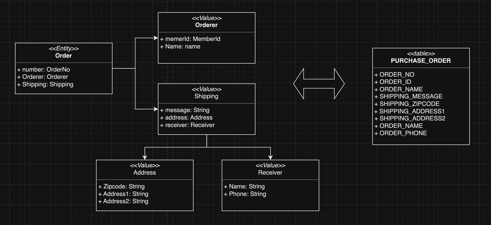
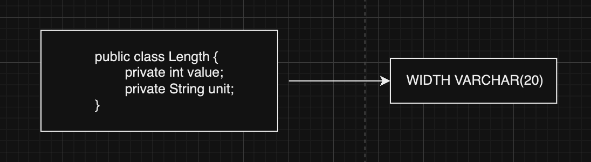
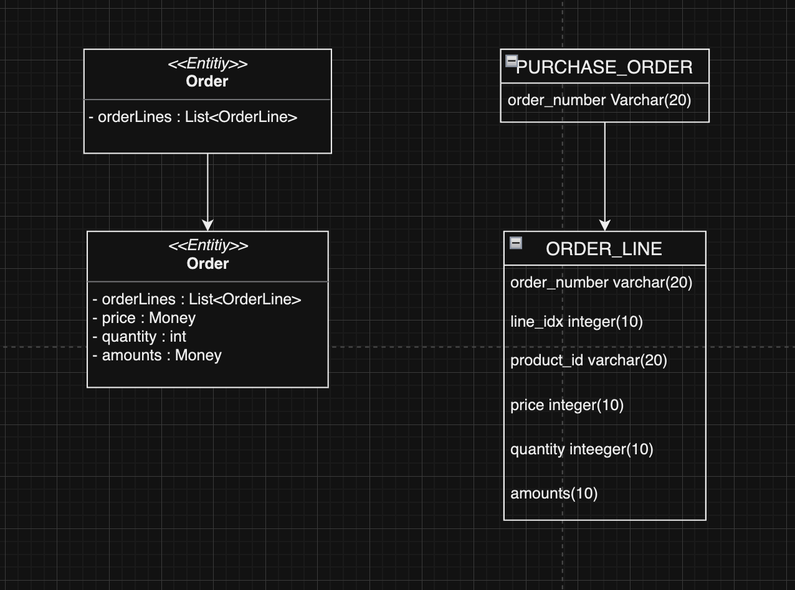
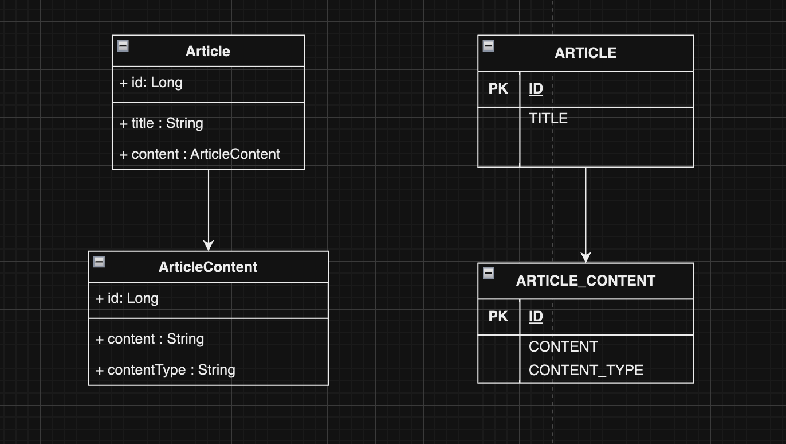
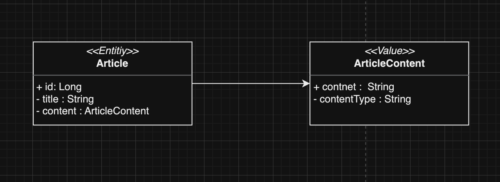
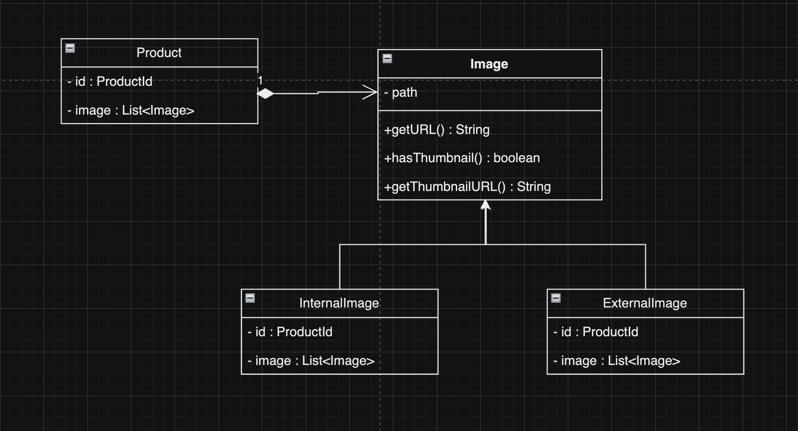
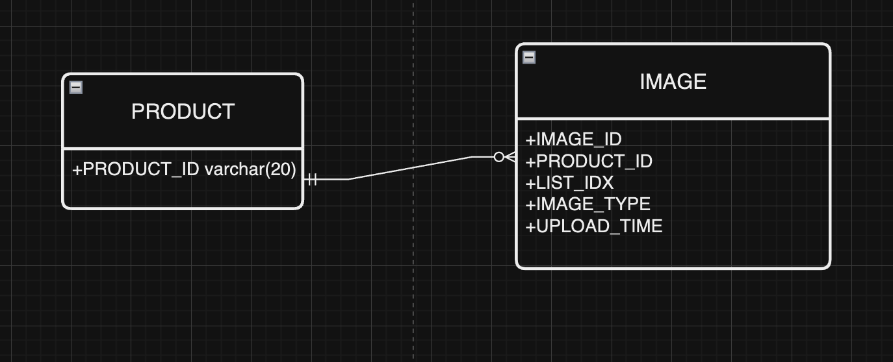

기존에 JPA를 사용하고 있었기 때문에 기본적인 동작인 4.2 리포지터리 구현에 대해서는 생략하도록 하겠습니다.

### 4.3 매핑 구현

엔티티와 밸류가 한 테이블에 매핑됩니다.



```java
@Entity
@Table(name = "purchase_order")
public class Order {
 ...
}
```

Order에 속하는 Orderer는 밸류이므로 @Embeddable로 매핑합니다.

```java
package triple.review.service;

import javax.persistence.*;

@Entity
@Embeddable
public class Orderer {
    @Embedded
    @AttributeOverrides(
            @AttributeOverride(name = "id", column = @Column(name = "order_id"))
    )
    private MemberId memberId;
    
    @Column(name = "orderer_name")
    private String name;

}
```

Orderer의 memberId는 Member 애그리거트를 ID로 참조합니다.

```java
@Embeddable
public class MemberId implements Serializable {
    @Column(name = "member_id")
		private String id;
}
```

`Orderer`의 `memberId` 프로퍼티와 매핑되는 칼럼 이름은 '`orderer_id`'이므로 `MemberId`에 설정된 '`member_id`'와 이름이 다릅니다. `@Embeddable` 타입에 설정한 컬럼 이름과 실제 칼럼 이름이 다르므로 `@AttributeOverrides` 애너테이션을 이용해 Orderer의 memberId 프로퍼티와 매핑할 칼럼 이름을 변경했습니다.

Orderer와 마찬가지로 ShippingInfo 밸류도 Address와 Receiver를 포함합니다. 이것도 마찬가지로 `@AttributeOverrides`를 사용해서 변경합니다.

```java
@Entity
@Embeddable
public class ShippingInfo {
    @Embedded
    @AttributeOverrides({
            @AttributeOverride(name = "zipCode", column = @Column(name = "shipping_zipcode")),
            @AttributeOverride(name = "address1", column = @Column(name = "shipping_addr1")),
            @AttributeOverride(name = "address2", column = @Column(name = "shipping_addr2"))
    })
    private Address address;

    @Column(name = "shipping_message")
    private String message;

    @Embedded
    private Receiver receiver;

}
```

루트 엔티티인 Order 클래스는 `@Embedded`를 이용해서 밸류 타입 프로퍼티를 설정합니다.

```java
@Entity
public class Order {
		...
    @Embedded
		private Orderer orderer;

    @Embedded
		private ShippingInfo shippingInfo;
}
```

**기본 생성자**

JPA에서 @Entity와 @Embeddable로 클래스를 매핑하려면 기본 생성자를 제공해야 합니다.

> DB에서 데이터를 읽어와 매핑된 객체를 생성할 때 기본 생성자를 사용해서 객체를 생성하기 때문입니다. 하지만 기술적인 제약으로 Receiver와 같은 불변 타입은 기본 생성자가 필요 없음에도 불구하고 다음과 같이 추가해야 합니다. → **기본 생성자를 다른 코드에서 사용하면 값이 없는 온전하지 못한 객체를 만들기 때문에 protected로 선언하여 사용합니다.**

```java
@Embeddable
public class Recevier {
		@Column(name = "receiver_name")
		private String name;

		@Column(name = "receiver_phone")
		private String phone;

		protected Recevier() {}

		public Receiver(String name, String phone) {
			this.name = name;
			this.phone = phone;
		}
}
```

**AttributeConverter를 이용한 밸류 매핑 처리**

int, long, String, LocalDateTime과 같은 타입은 DB 테이블의 한 개 컬럼에 매핑됩니다. 이와 비슷하게 밸류 타입의 프로퍼티를 한 개 칼럼에 매핑해야 할 때도 있습니다.

```java
public class Length {
		private int value;
		private String unit;
}
```



두 개 이상의 프로퍼티를 가진 밸류 타입을 한 개 칼럼에 매핑하려면 @Embeddable 애너테이션으로는 처리할 수 없습니다. 이럴 때 사용할 수 있는 것이 AttributeConverter입니다.

```java
public interface AttributeConvert<X, Y> {
		public Y ConvertToDatabasesColumn(X attribute);
		public X ConvertToEntityColumn(Y dbDate);
}
```

`ConvertToDatabasesColumn()` 메서드는 밸류 타입을 DB 컬럼 값으로 변환하는 기능입니다.

`ConvertToEntityColumn()` 메서드는 DB 컬럼 값을 밸류 타입으로 변환하는 기능이며, 아래와 같이 구현할 수 있습니다.

```java
@Converter(autoApply = true)
public class MoneyConverter implements AttributeConvert<Money, Intenger> {
	
		@Override
		public Integer ConvertToDatabasesColumn(Money money) {
				return money == null ? null : money.getValue();
		}

		@Override
		public Money ConvertToDatabasesColumn(Integer value) {
				return value == null ? null : new Money(value);
		}
}
```

`AttributeConverter` 인터페이스를 구현한 클래스는 `@Converter` 애너테이션을 적용합니다. 08행에서 `@Converter` 애너테이션의 `autoApply` 속성값을 봅니다. 이 속성을 `true`로 지정하면 모델에 출현하는 모든 `Money` 타입의 프로퍼티에 대해 `MoneyConverter`를 자동으로 적용합니다.

```java
@Entity
@Table(name = "purchase_order")
public class Order {
	...
	
	@Column(name = "total_amounts")
	private Money totalAmounts; // MoneyConvert를 적용해서 값 변환
	
}
```

@Converter의 autoApply 속성을 false로 지정하면 프로퍼티 값을 변환할 때 사용할 컨버터를 직접 지정해야 합니다.

```java
public class Order {

	@Column(name = "total_amounts")
	@Convert(converter = MoneyConverter.class)
	private Money totalAmounts; // MoneyConvert를 적용해서 값 변환
}
```

**밸류 컬렉션: 별도 테이블 매핑**



**밸류 컬렉션을 별도 테이블로 매핑**

밸류 컬렉션을 별도 테이블로 매핑할 때는 @ElementCollection과 @CollectionTable을 함께 사용합니다.

```java
@Entity
@Table(name = "purchase_order")
public class Order{
		@EmbeddedId
		private OrderNo number;
		...
		@ElementCollection(fetch = FetchType.EAGER)
		@CollectionTable(name = "order_line",
														joinColumn = @JoinColumn(name = "order_number"))
		@OrderColumn(name = "line_idx")
		private List<OrderLine> orderLines;
		
}
```

```java
@Embeddable
public class OrderLine {
		@Embedded
		private ProductId productId;

		@Column(name = "price")
		pricate Money price;

		@Column(name = "quantity")
		pricate Quantity quantity;		

		@Column(name = "amonuts")
		pricate Money money;		
}
```

OrderLine의 매핑을 함께 표시했는데, OrderLine에는 List의 인덱스 값을 저장하기 위한 프로퍼티가 존재하지 않습니다. 그 이유는 **List 타입 자체가 인덱스를 갖고 있기 때문입니다.**

예제 코드에서는 외부키가 한 개인데, 두 개 이상인 경우 @JoinColumn의 배열을 이용해서 외부키 목록을 저장합니다.

**밸류 컬렉션: 한 개 칼럼 매핑**

밸류 컬렉션을 별도 테이블이 아닌 한 개 칼럼에 저장해야 할 때가 있습니다. 예를 들어 도메인 모델에는 이메일 주소 목록을 set으로 보관하고 DB에는 한 개 컬럼에 콤마로 구분해서 저장할 때가 있습니다. 이때 AttributeConverter를 사용합니다.

단, AttributeConverter를 사용하려면 밸류 컬렉션을 표현하는 새로운 밸류 타입을 추가해야 합니다.

```java
public class EmailSet {
		private Set<Email> emails = new HashSet<>();

		public EmailSet(Set<Email> emails) {
			this.emails.addAll(emails);
		}

		public set<Email> getEmails() {
			return Collections.unmodifiableSet(emails);
		}
}
```

```java
public class EmailSetConverter implements AttributeConverter<EmailSet, String> {
    @Override
    public String convertToDatabaseColumn(EmailSet attribute) {
        if (attribute == null) return null;
        return attribute.getEmails().stream()
                .map(email -> email.getAddress())
                .collect(Collectors.joining(","));
    }

    @Override
    public EmailSet convertToEntityAttribute(String dbData) {
        if (dbData == null) return null;
        String[] emails = dbData.split(",");
        Set<Email> emailSet = Arrays.stream(emails)
                .map(value -> new Email(value))
                .collect(toSet());
        return new EmailSet(emailSet);
    }
}
```

이제 남은 것은 EmailSet 타입 프로퍼티가 Convert로 EmailSetConverter를 사용하도록 하는 것입니다.

```java
@Column(name = "email")
@Convert(convert = EmailSetConverter.class)
private EmailSet emailSet;
```

**밸류를 이용한 ID 매핑**

지금까지 살펴본 예제에서 OrderNo, MemberId 등이 식별자를 표현하기 위해 사용한 밸류입니다.

밸류 타입을 식별자로 매핑하려면 @Id 대신 @EmbeddedId 애너테이션을 사용합니다.

```java
@Entitty
@Table(name = "purchase_order")
public class Order {
		@EmbeddedId
		private OrderNo orderNo;
		...

}

@Embeddable
public class OrderNo Implements Serializable {
			@Column(name = "order_number")
			private String number;
			...
}
```

JPA에서 식별자 타입은 Serializable 타입이어야 하므로 식별자로 사용할 밸류 타입은 Serializable 인터페이스를 상속받아야 합니다.

밸류 타입으로 식별자를 구현할 때 얻을 수 있는 장점은 **식별자에 기능을 추가할 수 있다는 점입니다.**

예를 들어 1세대 시스템의 주문번호와 2세대 시스템의 주문번호를 구분할 때 주문번호의 첫 글자를 이용한다면, 다음과 같이 OrderNo 클래스에 시스템 세대를 구분할 수 있는 기능을 구현할 수 있습니다.

```java
@Embeddable
public class OrderNo Implements Serializable {
		@Column(name = "order_number")
		private String number;

		public boolean is2ndGeneration() {
			return number.startsWith("N");
		}
}
```

```java
if (order.getNumber().is2ndGeneration()) {
		...
}
```

**별도 테이블에 저장하는 밸류 매핑** ⭐️⭐️⭐️

애그리거트에서 **루트 엔티티를 뺀 나머지 구성요소는 대부분 밸류**입니다. 루트 엔티티 외에 또 다른 엔티티가 있다면 진짜 엔티티인지 의심해 봐야 합니다. 단지 별도 테이블에 데이터를 저장한다고 해서 엔티티인 것은 아닙니다.

**주문 애그리거트도 OrderLine을 별도 테이블에 저장하지만 OrderLine 자체는 엔티티가 아니라 밸류입니다.**

밸류가 아니라 엔티티가 확실하다면 다른 애그리거트는 아닌지 확인해야 합니다. 특히 자신만의 라이프 사이클을 갖는다면 구분되는 애그리거트일 가능성이 높습니다.



밸류를 엔티티로 잘못 매핑한 예

ArticleContent를 엔티티로 생각할 수 있지만, ArticleContent는 Article의 내용을 담고 있는 밸류로 생각하는 것이 맞습니다. ARTICLE_CONTENT의 ID는 식별자이긴 하지만 이 식별자를 사용하는 이유는 **ARTICLE 테이블과 데이터를 연결하기 위함이지 ARTICLE_CONTENT를 위한 별도 식별자가 필요하기 때문은 아닙니다.**

ArticleContent를 밸류로 보고 접근하면 그림은 아래와 같습니다.



ArticleContent는 밸류이므로 @Embeddable로 매핑합니다. ArticleContent와 매핑되는 테이블은 Article과 매핑되는 테이블과 다릅니다. 이때 밸류를 매핑할 테이블을 지정하기 위해 @SecondaryTable과 @AttributeOverride를 사용합니다.

```java
@Entity
@Table(name = "article")
@SecondaryTable(
        name = "article_content",
        pkJoinColumns = @PrimaryKeyJoinColumn(name = "id")
)
public class Article {
    @Id
    @GeneratedValue(strategy = GenerationType.IDENTITY)
    private Long id;

    private String title;

    @AttributeOverrides({
            @AttributeOverride(
                    name = "content",
                    column = @Column(table = "article_content", name = "content")),
            @AttributeOverride(
                    name = "contentType",
                    column = @Column(table = "article_content", name = "content_type"))
    })
    @Embedded
    private ArticleContent content;
```

@SecondaryTable의 name 속성은 밸류를 저장할 테이블을 지정합니다. pkJoinColumns 속성은 밸류 테이블에서 엔티티 테이블로 조인할 때 사용할 칼럼을 지정합니다. content 필드에 @AttributeOverride를 적용했는데, 이 애너테이션을 사용해서 해당 밸류 데이터가 저장된 테이블 이름을 지정합니다.

```java
// @SecondaryTable로 매팽된 article_content 테이블을 조인
Article article = entityManager.find(Article.class, 1L);
```

⭐️⭐️⭐️

게시글 목록을 보여주는 화면은 article 테이블의 데이터만 필요하고 article_content 테이블의 데이터는 필요하지 않습니다. 그런데 **@SecondaryTable을 사용하면 목록 화면에 보여줄 Article을 조회할 때 article_content 테이블까지 조인해서 데이터를 읽어 옵니다.**

이 문제를 **해소하고자 article_content를 엔티티로 매핑하고 Article에서 ArticleContent로의 로딩을 지연 로딩 방식으로 설정할 수도 있습니다. 하지만 이 방식은 밸류인 모델을 엔티티로 만드는 것이므로 좋은 방법이 아닙니다.**

**밸류 컬렉션 @Entity로 매핑하기**

개념적으로 밸류인데 구현 기술의 한계나 팀 표준 때문에 @Entity를 사용해야 할 때도 있습니다.

제품의 이미지 업로드 방식에 따라 이미지 경로와 섬네일 이미지 제공 여부가 달라진다고 해보겠습니다.



JPA는 @Embeddable 타입의 클래스 상속 매핑을 지원하지 않습니다. 상속 구조를 가지려면 @Entity를 이용해야 합니다.

식별자 매핑을 위한 필드도 추가해야 합니다. 또한 구현 클래스를 구분하기 위한 타입 칼럼을 추가해야 합니다.



한 테이블에 Image와 그 하위 클래스를 매핑하므로 Image 클래스에 다음 설정을 사용합니다.

- @Inheritance 애너테이션 사용
- strategy 값으로 SINGLE_TABLE 사용
- @DiscriminatorColumn

사용 방법

- @Inheritance 사용 방법
    
    ```text
    PA(Java Persistence API)에서 @Inheritance 어노테이션은 객체 지향 프로그래밍의 상속 개념을 데이터베이스 테이블 구조에 매핑할 때 사용되는 어노테이션입니다. 이 어노테이션을 사용하여 상속 구조를 데이터베이스 테이블 간에 어떻게 매핑할 것인지를 지정할 수 있습니다.
    
    @Inheritance 어노테이션은 JPA에서 여러 종류의 상속 매핑 전략(strategy) 중 하나를 선택하거나 커스텀 매핑 전략을 사용할 때 주로 사용됩니다.
    
    JPA에서 제공하는 @Inheritance 어노테이션의 사용 방법과 전략들은 아래와 같습니다:
    
    1. 단일 테이블 전략 (Single Table Strategy):
    부모 클래스와 모든 자식 클래스의 필드를 한 테이블에 저장하는 전략입니다. @Inheritance(strategy = InheritanceType.SINGLE_TABLE)와 같이 사용합니다.
    
    2. 테이블 패턴 전략 (Table Per Class Strategy):
    부모 클래스와 각 자식 클래스마다 별도의 테이블을 생성하는 전략입니다. 각 테이블은 클래스의 필드를 저장합니다. @Inheritance(strategy = InheritanceType.TABLE_PER_CLASS)와 같이 사용합니다.
    
    3. 조인 테이블 전략 (Joined Table Strategy):
    부모 클래스와 각 자식 클래스마다 별도의 테이블을 생성하며, 부모 클래스의 필드는 별도의 테이블에 저장하고, 자식 클래스의 필드는 조인 테이블을 통해 관리하는 전략입니다. @Inheritance(strategy = InheritanceType.JOINED)와 같이 사용합니다.
    
    4. 매핑 없음 (No Inheritance Strategy):
    상속 구조를 사용하지 않을 때 선택하는 전략입니다. 별도의 상속 매핑을 하지 않고, 각 클래스마다 독립적인 테이블을 생성합니다.
    ```
    
- @Inheritance 예제
    
    ```java
    @Entity
    @Inheritance(strategy = InheritanceType.SINGLE_TABLE)
    @DiscriminatorColumn(name = "animal_type")
    public class Animal {
        @Id
        @GeneratedValue(strategy = GenerationType.IDENTITY)
        private Long id;
        // 공통 필드들
    }
    
    @Entity
    @DiscriminatorValue("DOG")
    public class Dog extends Animal {
        // Dog에 특정한 필드들
    }
    ```
    
    > 위의 예시에서는 **`Animal`**과 **`Dog`** 클래스가 상속 관계에 있고, 단일 테이블 전략을 사용하여 **`Animal`** 클래스의 필드와 **`Dog`** 클래스의 필드가 하나의 테이블에 저장됩니다. **`@DiscriminatorColumn`** 어노테이션은 어떤 자식 클래스인지 구분하는 데 사용됩니다.
    >
    > JPA의 상속 매핑은 데이터베이스 스키마와 객체 모델 간의 매핑을 유연하게 처리하기 위해 사용됩니다. 선택한 전략에 따라 데이터베이스 테이블이 어떻게 구성될지 결정할 수 있습니다.
    

```java
@Entity
@Inheritance(strategy = InheritanceType.SINGLE_TABLE)
@DiscriminatorColumn(name = "image_type")
@Table(name = "image")
public abstract class Image {
    @Id
    @GeneratedValue(strategy = GenerationType.IDENTITY)
    @Column(name = "image_id")
    private Long id;

    @Column(name = "image_path")
    private String path;

    @Column(name = "upload_time")
    private LocalDateTime uploadTime;

    protected Image() {
    }

    public Image(String path) {
        this.path = path;
        this.uploadTime = LocalDateTime.now();
    }

    protected String getPath() {
        return path;
    }

    public LocalDateTime getUploadTime() {
        return uploadTime;
    }

    public abstract String getUrl();
    public abstract boolean hasThumbnail();
    public abstract String getThumbnailUrl();

}
```

Image를 상속받는 클래스는 @Entity와 @Discriminator를 사용해서 매핑합니다.

```java
@Entity
@DiscriminatorValue("II")
public class InternalImage extends Image {
    ...
}
@Entity
@DiscriminatorValue("EI")
public class ExternalImage extends Image {
    ...
}
```

⭐️ Image가 @Entity이므로 목록을 담고 있는 Product는 다음과 같이 @OneToMany를 이용해서 매핑을 처리합니다. **Image는 밸류이므로 독자적인 라이프 사이클을 갖지 않고 Product에 완전히 의존합니다.** 따라서 Product를 저장할 때 함께 저장되고 Product를 삭제할 때 함께 삭제되도록 cascade 속성을 지정합니다. 리스트에서 Image 객체를 제거하면 DB에서 함께 삭제되도록 orphanRemoval도 true로 설정합니다.

```java
@Entity
@Table(name = "product")
public class Product {
    @EmbeddedId
    private ProductId id;
    private String name;

    @Convert(converter = MoneyConverter.class)
    private Money price;
    private String detail;

    @OneToMany(cascade = {CascadeType.PERSIST, CascadeType.REMOVE},
            orphanRemoval = true, fetch = FetchType.LAZY)
    @JoinColumn(name = "product_id")
    @OrderColumn(name = "list_idx")
    private List<Image> images = new ArrayList<>();

	  ...

    public void changeImages(List<Image> newImages) {
        images.clear();
        images.addAll(newImages);
    }

}
```

> 이미지 교체를 위해 changeImages의 images.clear()를 사용 중입니다. @Entity에 대한 @OneToMany 매핑에서 컬렉션의 clear() 메서드를 호출하면 삭제 과정이 효율적이지 않습니다. → select 쿼리로 대상 엔티티를 로딩하고, 각 개별 엔티티에 대해 delete 쿼리를 실행합니다.
>
> 하지만 **@Embeddable 타입에 대한 컬렉션 clear() 메서드를 호출하면 컬렉션에 속한 객체를 로딩하지 않고 한 번의 delete 쿼리로 삭제 처리를 수행합니다.** 따라서 애그리거트의 특성을 유지하면서 이 문제를 해결하려면 결국 상속을 포기하고 @Embeddable로 매핑된 단일 클래스로 구현해야 합니다.

```java
@Embeddable
public class Image {
	@Column(name = "image_type")
	private String imageTypes;
	@Column(name = "image_path")
	private String path;

	@Temporal(TemporalType.TIMESTAMP)
	@Column(name = "upload_time")
	private Date uploadTime;
	...

	public boolean hasThumbnail() {
		// 성능을 위해 다형을 포기하고 if - else 로 구현
		if (imageType.equal("II")) {
			return true;
		} else {
			return false;
		}
	}
}
```

### 애그리거트 로딩 전략

JPA 매핑을 설정할 때 항상 기억해야 할 점은 **애그리거트에 속한 객체가 모두 모여야 완전한 하나가 된다는 것**입니다.

```java
// product는 완전한 하나여야 한다.
Product product = productRepository.findById(id);
```

조회 시점에서 애그리거트를 완전한 상태가 되도록 하려면 애그리거트 루트에서 연관 매핑의 조회 방식을 즉시 로딩으로 설정하면 됩니다.

```java
@OneToMany(cascade = {CascadeType.PERSIST, CascadeType.REMOVE},
          orphanRemoval = true, fetch = FetchType.EAGER)
@JoinColumn(name = "product_id")
@OrderColumn(name = "list_idx")
private List<Image> images = new ArrayList<>();
```

즉시 로딩 방식으로 설정하면 애그리거트 루트를 로딩하는 시점에 애그리거트에 속한 모든 객체를 함께 로딩할 수 있는 장점이 있지만, 항상 좋은 것은 아닙니다. **특히 컬렉션에 대해 로딩 전략을 EAGER로 설정하면 오히려 문제가 됩니다.**

예를 들어 Product 애그리거트 루트가 @Entity로 구현한 Image와 @Embeddable로 구현한 Option 목록을 갖고 있다고 해보겠습니다.

```java
@Entity
@Table(name = "product")
public class Product {
...

		@OneToMany(cascade = {CascadeType.PERSIST, CascadeType.REMOVE},
            orphanRemoval = true, fetch = FetchType.EAGER)
    @JoinColumn(name = "product_id")
    @OrderColumn(name = "list_idx")
    private List<Image> images = new ArrayList<>();

		@OneToMany(cascade = {CascadeType.PERSIST, CascadeType.REMOVE},
            orphanRemoval = true, fetch = FetchType.EAGER)
    @JoinColumn(name = "product_id")
    @OrderColumn(name = "list_idx")
    private List<Option> Options = new ArrayList<>();
...
}
```

Product를 조회하게 되었을 때, EntityManager#find() 메서드로 Product를 조회하면 하이버네이트는 다음과 같이 Product를 위한 테이블과 Image, Option을 위한 테이블을 조인하는 쿼리를 실행합니다.

```sql
select
			p.product_id, ... ,...
	from 
			product p
			left outer join image img on p.product = img.product_id
			left outer join product_option opt on p.product_id = opt.product_id
 where p.product_id = ?
```

이 쿼리는 카타시안(Cartesian) 조인을 사용하며, 이는 쿼리 결과에 중복을 발생시킵니다.

- 카타시안
    
    카타시안 조인(Cartesian Join)에 대한 설명을 더 자세히 제공하겠습니다.
    
    카타시안 조인은 조인 조건이나 연결 열(Joining Column)이 지정되지 않은 상태에서 두 개 이상의 테이블을 조인하는 경우 발생하는 조인 유형입니다. 이것은 각 행을 하나의 테이블에서 다른 모든 행과 결합하는 방식으로 작동합니다. 결과적으로 두 테이블의 모든 가능한 조합이 생성됩니다.
    
    예를 들어, 두 개의 테이블 "A"와 "B"가 있다고 가정해보겠습니다.
    
    **테이블 A:**
    
    | **ID** | **Name** |
    | --- | --- |
    | 1 | Alice |
    | 2 | Bob |
    
    **테이블 B:**
    
    | **ID** | **Product** |
    | --- | --- |
    | 101 | Apple |
    | 102 | Banana |
    
    카타시안 조인을 수행하려면 다음과 같은 쿼리를 사용할 수 있습니다:
    
    ```sql
    sqlCopy code
    SELECT * FROM A, B;
    ```
    
    이 쿼리는 "테이블 A"의 각 행을 "테이블 B"의 모든 행과 결합하여 가능한 모든 조합을 생성합니다. 결과는 다음과 같이 4개의 행을 가질 것입니다:
    
    | **ID** | **Name** | **ID** | **Product** |
    | --- | --- | --- | --- |
    | 1 | Alice | 101 | Apple |
    | 1 | Alice | 102 | Banana |
    | 2 | Bob | 101 | Apple |
    | 2 | Bob | 102 | Banana |
    
    카타시안 조인은 일반적으로 데이터베이스 성능에 부정적인 영향을 미치며, 원하지 않는 결과를 생성할 수 있으므로 주의해야 합니다. 조인할 때 적절한 조인 조건이나 연결 열을 사용하여 조인 결과를 필터링하고 원하는 결과만 얻을 수 있도록 해야 합니다.
    

물론 하이버네이트가 중복된 데이터를 알맞게 제거해서 실제 메모리에는 1개의 Product 객체, 2개의 Image 객체, 2개의 Option 객체로 변환해 주지만, 애그리거트가 커지면 문제가 될 수 있습니다.

```java
@Transaction
public void removeOptions(ProductId id, int optIdxToBeDelete) {
		//Product를 로딩 - 컬렉션은 지연 로딩으로 설정했다면, Option은 로딩하지 않음
		Product product = productRepository.findById(id);
		// 트랜잭션 범위이므로 지연 로딩으로 설정한 연관 로딩 가능
		product.removeOption(optIdxToBeDelete);
}
```

일반적인 애플리케이션은 상태 변경 기능을 실행하는 빈도보다 조회 기능을 실행하는 빈도가 훨씬 높습니다. 그러므로 상태 변경을 위해 지연 로딩을 사용할 때 발생하는 추가 쿼리로 인한 실행 속도 저하는 보통 문제가 되지 않습니다.

⭐️⭐️⭐️

### 애그리거트의 영속성 전파

애그리거트가 완전한 상태여야 한다는 것은 애그리거트 루트를 조회할 때뿐만 아니라 저장하고 삭제할 때도 하나로 처리해야 함을 의미합니다.

- 저장 메서드는 애그리거트 루트만 저장하면 안 되고 애그리거트에 속한 모든 객체를 저장해야 합니다.
- 삭제 메서드는 애그리거트 루트뿐만 아니라 애그리거트에 속한 모든 객체를 삭제해야 합니다.

@Embeddable 매핑 타입은 함께 저장되고 삭제되므로 cascade 속성을 추가로 설정하지 않아도 됩니다. 반면에 애그리거트에 속한 **@Entity 타입에 대한 매핑은 cascade 속성을 사용해서 저장과 삭제 시에 함께 처리되도록 설정해야 합니다.**

@OneToOne, @OneToMany는 cascade 속성의 기본값이 없으므로 다음 코드처럼 cascade 속성값으로 CascadeType.PERSIST, CascadeType.REMOVE를 설정합니다.

```java
@OneToMany(cascade = {CascadeType.PERSIST, CascadeType.REMOVE},
        orphanRemoval = true, fetch = FetchType.LAZY)
@JoinColumn(name = "product_id")
@OrderColumn(name = "list_idx")
private List<Image> images = new ArrayList<>();
```

### 식별자 생성 기능

식별자는 크게 세 가지 방식 중 하나로 생성합니다.

- 사용자가 직접 생성
- 도메인 로직으로 생성
- DB를 이용한 일련번호 사용

**사용자가 직접 생성하는 방법**

```java
public class ProductIdService {
		public ProductId nextId() {
			.. // 정해진 규칙으로 식별자 생성
		}
}
```

응용 서비스

```java
public class CreateProductService {
		@Autowired private ProductIdService idSevice;
		@Autowired private ProudctRepository productRepository;

		@Transaction
		public ProuductId createProduct(ProductCreationCommand cmd) {
			// 응용 서비스 도메인 서비스를 이용해서 식별자를 생성
			ProductId id = productIdService.nextId();
			Product product = new Product(id, cmd.getDetail(), cmd.getPrice(), ...);
			productRepository.save(product);
			return id;
		}
}
```

**도메인 서비스를 이용해 식별자 생성 방법**

```java
public class OrderIdService {
		public OrderId createId(UserId userId) {
				if (userId == null) {
					throw new IllegalArgumentException("invalid userid:" + userId);
					return new OrderId(userId.toString() + "-" + timestamp());	
				}
		}

		private String timeStamp() {
			return Long.toString(System.currentTimeMillis());
		}
}
```

**DB를 이용한 일련번호 사용**

```java
@Entity
@Table(name = "article")
public class Article {
    @Id
    @GeneratedValue(strategy = GenerationType.IDENTITY)
    private Long id;
```

[도메인 주도 개발 시작하기 - 예스24](https://www.yes24.com/Product/Goods/108431347?pid=123487&cosemkid=go16481149689793107&gclid=Cj0KCQjwgNanBhDUARIsAAeIcAvU1218EfnAWaB7jwT88mKqCJ9UJbgjm5qk12G3_kgbQFKtHnPTQaUaArR8EALw_wcB)
