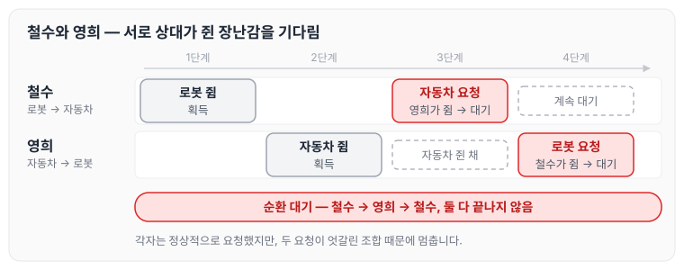
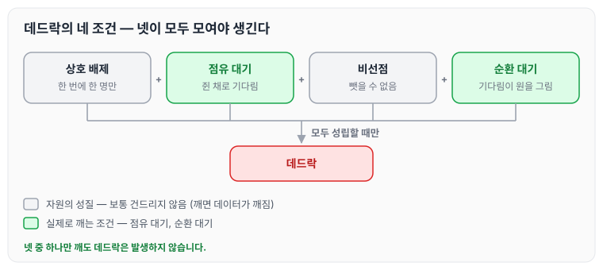
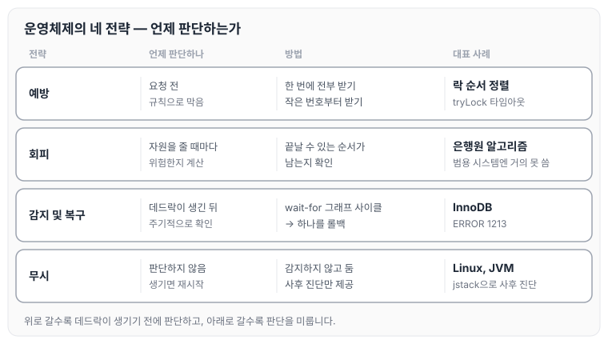
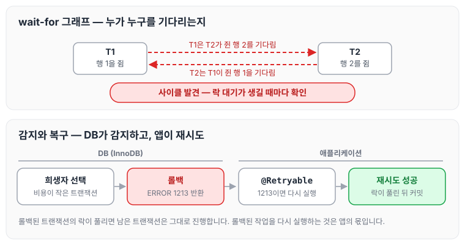
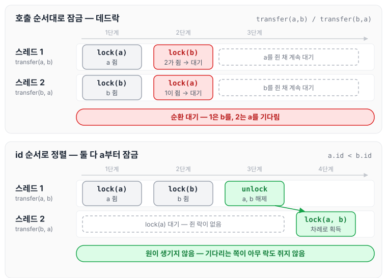
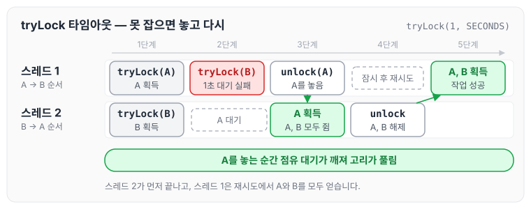

이전에 [트랜잭션 스케줄과 격리 수준](../transaction-schedule-isolation/)에 대해 작성하였습니다. 그 글 마지막에 두 트랜잭션이 각자 락을 쥔 채 상대의 락을 기다리는 데드락을 짧게 다뤘습니다. 이번 글에서는 데드락을 운영체제 교과서 관점으로 정리하고, 실제로 사용하는 도구들이 어느 전략에 해당하는지 연결해 보도록 하겠습니다.

## 데드락이란

데드락(교착 상태)은 둘 이상의 작업이 각자 자원을 쥔 채로 상대가 쥔 자원을 기다려서, 어느 쪽도 더 이상 진행하지 못하는 상태입니다.

예를 들어 철수는 로봇을 쥔 채 자동차를 달라고 하고, 영희는 자동차를 쥔 채 로봇을 달라고 하는 상황입니다. 둘 다 자기 것은 놓지 않고 상대 것만 기다리기 때문에 이 상태는 끝나지 않습니다. 순서대로 그리면 다음과 같습니다.



그림에서 철수와 영희는 각자 정상적으로 행동했습니다. 어느 한쪽의 잘못이 아니라 두 요청이 엇갈린 조합 때문에 멈춘다는 점이 데드락의 특징입니다.

## 데드락이 발생하는 네 가지 조건

데드락은 아래 네 가지 조건이 동시에 성립할 때만 발생합니다.

| 조건 | 설명 | 예 |
|---|---|---|
| 상호 배제 | 한 번에 한 명만 쓸 수 있는 자원이다 | 로봇은 한 명만 가질 수 있다 |
| 점유 대기 | 하나를 쥔 채로 다른 걸 기다린다 | 로봇을 쥔 채 자동차를 기다린다 |
| 비선점 | 남이 쥔 걸 억지로 뺏을 수 없다 | 영희 손에서 자동차를 뺏을 수 없다 |
| 순환 대기 | 기다림이 원을 그린다 | 철수→영희→철수 |

반대로 말하면 **넷 중 하나만 깨도 데드락은 발생하지 않습니다.** 그래서 데드락 해결책은 모두 "네 조건 중 어느 것을 깰 것인가"로 정리할 수 있습니다.

다만 상호 배제와 비선점은 보통 건드리지 않습니다. 자원의 성질 자체이기 때문입니다. 같은 데이터를 두 명이 동시에 쓰게 하거나(상호 배제 제거), 쓰는 도중에 뺏어 가게 하면(선점 허용) 데드락은 없어지지만 데이터가 깨집니다. 이 때문에 실제로 깨는 조건은 점유 대기와 순환 대기입니다.



그림의 회색 두 조건은 자원의 성질이라 그대로 두고, 초록 두 조건 중 하나를 깨는 것이 이후에 나오는 방법들의 공통점입니다.

## 운영체제의 데드락 처리 전략

운영체제 교과서에서는 데드락을 다루는 전략을 네 가지로 나눕니다.

### 1. 예방: 생기지 않도록 규칙을 둔다

네 조건 중 하나를 구조적으로 깨는 규칙을 두는 방법입니다.

- **점유 대기 깨기:** 필요한 자원을 한 번에 전부 받고, 하나라도 받지 못하면 아무것도 받지 않습니다. 로봇과 자동차를 한 번에 요청하고, 하나라도 없으면 둘 다 받지 않는 방식입니다.
- **순환 대기 깨기:** 자원에 번호를 매기고 항상 작은 번호부터 받습니다. 로봇이 1번, 자동차가 2번이면 둘 다 로봇부터 집기 때문에 기다림이 원을 그릴 수 없습니다.

데드락을 확실하게 막을 수 있다는 장점이 있지만, 쓸 수 있는 상황에서도 자원을 못 쓰게 막기 때문에 효율이 떨어진다는 단점이 있습니다.

### 2. 회피: 자원을 줄 때마다 위험한지 계산한다

자원 요청을 받을 때마다 "이 자원을 주고 나서도 모두가 끝날 수 있는 순서가 하나라도 남아 있는가"를 계산해서, 남아 있으면 주고 없으면 기다리게 하는 방법입니다. 교과서의 **은행원 알고리즘**이 여기에 해당합니다.

이름처럼 은행이 대출을 해 줄 때 "이 돈을 빌려줘도 모든 고객이 돌아가며 갚을 수 있는 시나리오가 있는가"를 확인하는 것과 같은 계산입니다. 다만 모든 프로세스가 앞으로 자원을 최대 얼마나 쓸지 미리 알아야 하기 때문에, 실제 범용 시스템에서는 거의 사용하지 못합니다.

### 3. 감지 및 복구: 생기면 하나를 롤백한다

규칙 없이 자유롭게 실행하다가, 주기적으로 "누가 누구를 기다리는지" 그래프를 그려서 원(사이클)이 생겼는지 확인하는 방법입니다. 원이 생겼으면 그중 하나를 강제로 끝내고(롤백) 자원을 회수합니다.

InnoDB가 이 방식을 사용합니다. 락 대기가 생길 때마다 wait-for 그래프에서 사이클을 찾고, 사이클이 있으면 비용이 작은 트랜잭션을 희생자로 골라 `ERROR 1213`과 함께 롤백합니다. DB가 이 방식을 택한 이유는 어떤 쿼리가 어떤 행을 잠글지 미리 알 수 없어서 예방이나 회피를 적용할 수 없기 때문입니다.

### 4. 무시: 그대로 둔다

데드락은 거의 생기지 않고, 생기면 재시작하면 된다고 보는 전략입니다. 교과서에서는 **타조 알고리즘**이라고 부릅니다(타조가 모래에 머리를 박고 못 본 척한다는 데서 나온 이름입니다).

가볍게 들리지만 대부분의 범용 OS와 JVM이 이 전략을 사용합니다. Linux는 사용자 프로세스의 데드락을 감지하지 않고, JVM도 `synchronized`끼리 데드락이 나면 그대로 멈춥니다. 데드락이 생기는 빈도에 비해 감지 비용이 너무 크기 때문입니다. 대신 `jstack`으로 덤프를 뜨면 "Found one Java-level deadlock"이라고 알려 주는 사후 진단 도구만 제공합니다.

네 전략을 언제 판단하는지 기준으로 나란히 놓으면 다음과 같습니다.



위쪽 전략일수록 데드락이 생기기 전에 판단하고, 아래쪽으로 갈수록 판단을 미룹니다. 실제로 많이 보는 InnoDB는 감지 및 복구, JVM은 무시에 해당합니다.

InnoDB의 감지 및 복구를 애플리케이션까지 이어서 그리면 다음과 같습니다. 감지와 롤백은 DB가 하고, 롤백된 작업을 다시 실행하는 것은 애플리케이션의 몫입니다.



## 개발자가 직접 하는 예방

OS와 JVM이 무시 전략을 택하고 있으니, 애플리케이션 코드에서는 개발자가 직접 예방을 해야 합니다. 방법은 크게 두 가지입니다.

### 방법 1. 획득 순서 통일 (순환 대기 깨기)

모든 코드가 같은 기준의 순서로 락을 잡도록 맞추는 방법입니다. 아래 코드처럼 계좌 id로 정렬한 뒤 작은 쪽부터 잠급니다.

```java
// 위험: 호출 순서에 따라 락 순서가 뒤집힘
transfer(a, b);  // a 잠그고 b 잠금
transfer(b, a);  // b 잠그고 a 잠금  → 데드락

// 안전: 항상 같은 기준으로 정렬해서 잠금
void transfer(Account x, Account y) {
    Account first  = x.id < y.id ? x : y;
    Account second = x.id < y.id ? y : x;
    synchronized (first) {
        synchronized (second) { ... }
    }
}
```

`transfer(a, b)`와 `transfer(b, a)`가 동시에 실행될 때, 정렬하지 않은 경우와 정렬한 경우를 비교하면 다음과 같습니다.



정렬한 경우에도 한쪽은 기다리지만, 기다리는 쪽이 아무 락도 쥐고 있지 않기 때문에 원이 생기지 않습니다. DB에서 여러 행을 PK 오름차순으로 잠그는 것, Redisson MultiLock의 키를 정렬해서 잡는 것도 모두 이 방법에 해당합니다.

### 방법 2. 중첩 구조 제거 (점유 대기 깨기)

락 안에서 또 락을 잡는 구조 자체를 없애는 방법입니다.

- **락 범위를 줄입니다.** 락 안에서는 꼭 필요한 일만 하고, 다른 락이 필요한 작업은 밖으로 뺍니다. 트랜잭션 안에서 외부 API를 호출하지 않는 것도 같은 맥락입니다.
- **한 번에 못 잡으면 다 놓고 다시 시도합니다.** `tryLock`에 타임아웃을 줘서, 두 번째 락을 못 잡으면 첫 번째 락도 놓고 처음부터 재시도합니다.

```java
if (lockA.tryLock(1, SECONDS)) {
    try {
        if (lockB.tryLock(1, SECONDS)) {
            try { ... } finally { lockB.unlock(); }
        } else {
            // B를 못 잡음 → A도 놓고 다시 시도 (점유 대기 깨기)
        }
    } finally { lockA.unlock(); }
}
```

스레드 1은 A → B 순서로, 다른 코드 경로의 스레드 2는 B → A 순서로 락을 잡는 상황에서 `tryLock`이 어떻게 고리를 푸는지 그리면 다음과 같습니다.



스레드 1이 A를 놓는 순간 점유 대기가 깨지기 때문에, 스레드 2가 먼저 끝나고 스레드 1은 재시도에서 성공합니다.

[Redisson](../distributed-lock/)의 `waitTime`, DB의 `innodb_lock_wait_timeout`, HikariCP의 [`connectionTimeout`](../dbcp/)이 모두 이 역할을 합니다. 무한히 기다리지 않으면 데드락은 영원히 멈추는 상태가 아니라 "타임아웃 후 재시도"로 바뀝니다.

## 도구별 전략 정리

지금까지 다룬 도구들을 전략별로 정리하면 아래와 같습니다.

| 도구 | 전략 | 비고 |
|---|---|---|
| InnoDB 데드락 감지 → 희생자 롤백 | 감지 및 복구 | 1213 에러, 재시도 필요 |
| `innodb_lock_wait_timeout` | 감지의 보조 | 사이클이 없어도 너무 오래 기다리면 끊음 |
| JVM `synchronized` | 무시 | 데드락 나면 멈춤, `jstack`으로 사후 진단 |
| `ReentrantLock.tryLock(timeout)` | 예방 (점유 대기 깨기) | 못 잡으면 놓고 재시도 |
| PK 순서 정렬, MultiLock 키 정렬 | 예방 (순환 대기 깨기) | 가장 싸고 확실 |
| `FOR UPDATE`로 처음부터 X락 | 예방 (점유 대기 깨기) | S락 쥔 채 X락 기다리는 구조 제거 |
| 트랜잭션 짧게, 외부 호출 밖으로 | 예방 (중첩 제거) | 락 보유 시간 자체를 줄임 |
| `@Retryable`로 1213 재시도 | 복구 | 감지는 DB가, 복구는 앱이 |

`FOR UPDATE`로 X락을 잡는 방법은 [비관적 락](../pessimistic-lock/) 글에서 자세히 다뤘습니다.

## 마무리

정리한 내용을 요약하자면 아래와 같습니다.

- 데드락은 자원을 쥔 채로 기다리는 관계가 원을 그릴 때 생기고, 네 가지 조건이 모두 모여야만 발생합니다.
- OS는 예방·회피·감지·무시 중 하나를 고르는데, DB(InnoDB)는 감지 후 롤백을, JVM은 무시를 택했습니다.
- 그래서 개발자는 락 순서를 통일하고(원 끊기), 쥔 채로 기다리지 않게 하고(타임아웃·범위 축소), 그래도 생기면 재시도하는 방식으로 예방과 복구를 직접 책임져야 합니다.

오늘은 데드락의 네 가지 조건과 해결 전략에 대해 정리하였습니다. 평소에 쓰던 타임아웃이나 재시도 설정이 어떤 전략에 해당하는지 알고 나니, 데드락이 생겼을 때 어디를 먼저 봐야 할지 판단하는 데 도움이 될 것 같습니다.
