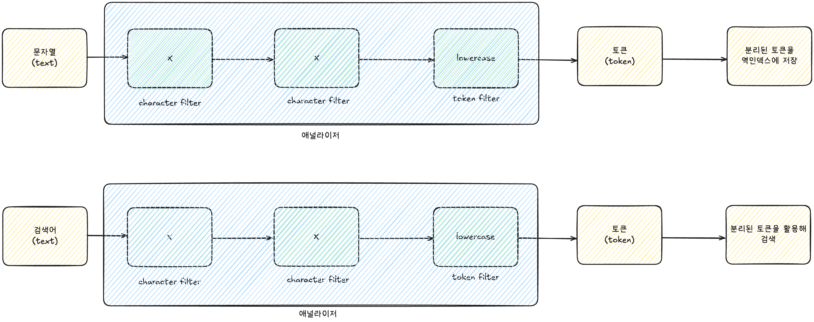
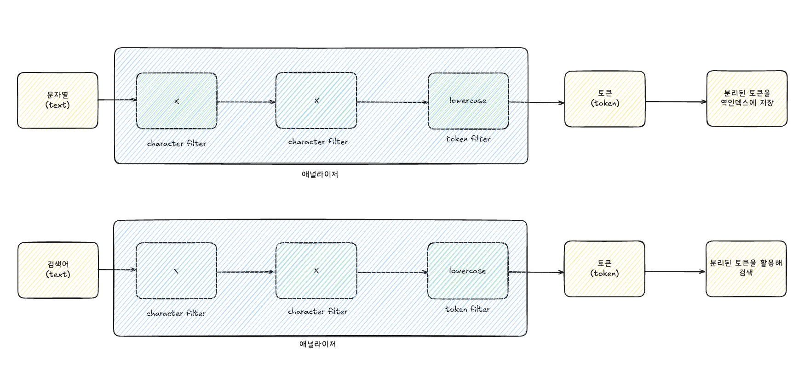

## 애널라이저란?

문자열을 토큰으로 변환시켜 주는 장치입니다.

```json
POST /products/_create/1
{
  "name": "Apple 2025 맥북 에어 13 M4 10코어"
}

POST /products/_create/2
{
  "name": "Apple 2024 에어팟 4세대"
}

POST /products/_create/3
{
  "name": "Apple 2024 아이패드 mini A17 Pro"
}
```

| **토큰(token)** | 도큐먼트 id |
| --- | --- |
| Apple | [1, 2, 3] |
| 2025 | [1] |
| 맥북 | [1] |
| 에어 | [1] |
| 13 | [1] |
| M4 | [1] |
| 10코어 | [1] |
| 2024 | [2, 3] |
| 에어팟 | [2] |
| 4세대 | [2] |
| 아이패드 | [3] |
| mini | [3] |
| A17 | [3] |
| Pro | [3] |

문자열을 자를 때 단순히 단어 단위로 자르는 것이 아니라, 애널라이저가 여러 단계의 작업을 거쳐 토큰으로 만듭니다.

### 캐릭터 필터

문자열을 토큰으로 자르기 전에 문자열을 다듬는 역할을 합니다.

- **html_strip (HTML 태그를 제거)**
    - `<h1>아이폰 15 사용 후기</h1>` → `아이폰 15 사용 후기`

### 토크나이저

문자열을 토큰으로 자르는 역할을 합니다.

**[예시]**

- **standard 토크나이저 (공백 또는 `,`, `.`, `!`, `?`와 같은 문장 부호를 기준으로 자름)**

    `The Brown-Foxes jumped over the roof.`

    → [`The`, `Brown`, `Foxes`, `jumped`, `over`, `the`, `roof`]

### 토큰 필터

**토큰 필터(token filter)**는 **잘린 토큰을 최종적으로 다듬는 역할**을 합니다.

**[예시]**

1. **lowercase 필터 적용 (소문자로 변환)**

    [`The`, `Brown`, `Foxes`, `jumped`, `over`, `the`, `roof`]

    → [`the`, `brown`, `foxes`, `jumped`, `over`, `the`, `roof`]

2. **stop 필터 적용 (`a`, `the`, `is`와 같은 특별한 의미를 가지지 않는 단어 제거)**

    [`the`, `brown`, `foxes`, `jumped`, `over`, `the`, `roof`]

    → [`brown`, `foxes`, `jumped`, `roof`]

3. **stemmer 필터 적용 (단어의 원래 형태로 변환)**

    [`brown`, `foxes`, `jumped`, `roof`]

    → [`brown`, `fox`, `jump`, `roof`]

### 사용 방법

애널라이저가 토큰을 어떻게 나누는지 확인하는 명령어입니다.

```json
// 방법 1 
GET /_analyze
{
  "text": "_________",
  "analyzer": "standard"
}

// 방법 2 (standard analyer의 구성을 직접 명시)
GET /_analyze 
{
  "text": "_________",
  "char_filter": [],
  "tokenizer": "standard",
  "filter": ["lowercase"]
}
```

Custom Analyzer는 다음과 같이 정의합니다.

```json
// 인덱스 생성 + 매핑 정의 + Custom Analyzer 적용
PUT /products
{
  "settings": {
    "analysis": {
      "analyzer": {
        "products_name_analyzer": {
          "char_filter": [],
          "tokenizer": "standard",
          "filter": []
        }
      }
    }
  },
  "mappings": {
	  "properties": {
	    "name": {
	      "type": "text",
	      "analyzer": "products_name_analyzer"
	    }
	  }
	}
}

// 데이터 삽입하기
POST /products/_create/1
{
  "name": "Apple 2025 맥북 에어 13 M4 10코어"
}

//  검색하기
GET /products/_search
{
  "query": {
    "match": {
      "name": "apple"
    }
  }
}

GET /products/_search
{
  "query": {
    "match": {
      "name": "**A**pple"  // --> "filter": []로 커스텀하게 적용안해서 대문자로만 검색가능
    }
  }
}

```

### 애널라이저의 토큰화와 검색 방식



도큐먼트를 생성할 때 애널라이저가 문자열을 토큰으로 분리해 역인덱스를 만듭니다. 그런데 검색을 할 때도 애널라이저가 검색어로 입력한 문자열을 토큰으로 분리해 검색합니다.

이 때문에 `Apple`이라고 검색어를 입력하더라도 `lowercase token filter`에 의해 `apple`로 바뀐 채로 검색을 하게 됩니다. 그래서 `Apple`이라고 검색했는데도 도큐먼트가 조회된 것입니다.

### HTML 태그 제거하기

- HTML 태그가 포함된 데이터를 검색에 사용할 때는 character filter로 `html_strip`을 적용합니다.

```json
PUT /boards
{
  "settings": {
    "analysis": {
      "analyzer": {
        "boards_content_analyzer": {
          "char_filter": [**"html_strip"**],
          "tokenizer": "standard",
          "filter": ["lowercase"]
        }
      }
    }
  },
  "mappings": {
	  "properties": {
	    "content": {
	      "type": "text",
	      "analyzer": "boards_content_analyzer"
	    }
	  }
	}
}

// 데이터 삽입하기
POST /boards/_doc
{
  "content": "<h1>Running cats, jumping quickly — over the lazy dogs!</h1>"
}

// 검색하기
GET /boards/_search
{
  "query": {
    "match": {
      "content": "running"
    }
  }
}

GET /boards/_search
{
  "query": {
    "match": {
      "content": "h1"
    }
  }
}

// **Analyze API 사용하기**
GET /boards/_analyze
{
  "field": "content",
  "text": "<h1>Running cats, jumping quickly — over the lazy dogs!</h1>"
}
```

### 불용어(a, an, the, or, but) 제거하기 (stop)

- 의미 없는 불용어를 제거합니다.

```json
// 인덱스 생성 + 매핑 정의 + Custom Analyzer 적용
PUT /boards
{
  "settings": {
    "analysis": {
      "analyzer": {
        "boards_content_analyzer": {
          "char_filter": [],
          "tokenizer": "standard",
          "filter": ["lowercase", **"stop"**]
        }
      }
    }
  },
  "mappings": {
	  "properties": {
	    "content": {
	      "type": "text",
	      "analyzer": "boards_content_analyzer"
	    }
	  }
	}
}
```

- 불용어(a, the, are, is 등)를 활용해 검색할 일이 없는 데이터라면, 역인덱스의 효율성을 위해 token filter로 `stop`을 활용해야 합니다.
- 만약 노래 제목(예: 비틀즈의 Let It Be)처럼 불용어를 포함해서 검색하는 것이 중요할 때는 token filter로 `stop`을 적용하지 않아야 합니다.

### 단어의 형태(-ed, -ing, -s 등)에 상관없이 검색하는 방법

```json
PUT /boards
{
  "settings": {
    "analysis": {
      "analyzer": {
        "boards_content_analyzer": {
          "char_filter": [],
          "tokenizer": "standard",
          "filter": ["lowercase", **"stemmer"**]
        }
      }
    }
  },
  "mappings": {
	  "properties": {
	    "content": {
	      "type": "text",
	      "analyzer": "boards_content_analyzer"
	    }
	  }
	}
}
```



이 때문에 `jumped`라고 검색어를 입력하더라도 `stemmer`에 의해 `jump`로 바뀐 채로 검색을 하게 됩니다. 그래서 `jumped`라고 검색했는데도 도큐먼트가 조회됩니다.

### Nori Analyzer를 활용해 한글이 제대로 검색되게 만들기

```json
// 방법 1
GET /_analyze
{
  "text": "백화점에서 쇼핑을 하다가 친구를 만났다.",
  "analyzer": "nori"
}

// 방법 2 (nori analyzer의 구성을 직접 명시)
GET /_analyze
{
  "text": "백화점에서 쇼핑을 하다가 친구를 만났다.",
  "char_filter": [], 
	"tokenizer": "nori_tokenizer", 
	"filter": ["nori_part_of_speech", "nori_readingform", "lowercase"]
}
```

- `nori_part_of_speech` : 의미 없는 조사(`을`, `의` 등), 접속사 등을 제거합니다.
- `nori_readingform` : 한자를 한글로 바꿔서 토큰으로 저장합니다.

### 한글과 영어가 섞인 글을 검색 가능하게 만들기

- `stop`과 `stemmer`를 함께 쓰면 불용어가 제거되고 영단어가 기본 형태로 바뀝니다.

```json
GET /_analyze
{
  "text": "오늘 영어 책에서 'It depends on the results.'이라는 문구를 봤다.",
  "char_filter": [], 
	"tokenizer": "nori_tokenizer", 
	"filter": ["nori_part_of_speech", "nori_readingform", "lowercase", **"stop", "stemmer"**]
}
```

정리하면, 역색인을 위해 데이터를 미리 만들 때 애널라이저를 사용해 구성하며, 이때 어떤 애널라이저를 적용할지 선택해 자신의 서비스에 맞게 설정해야 합니다.

검색할 때도 정의해 둔 애널라이저를 사용해서 검색하기 때문에, 이 점도 함께 고려해야 합니다.
