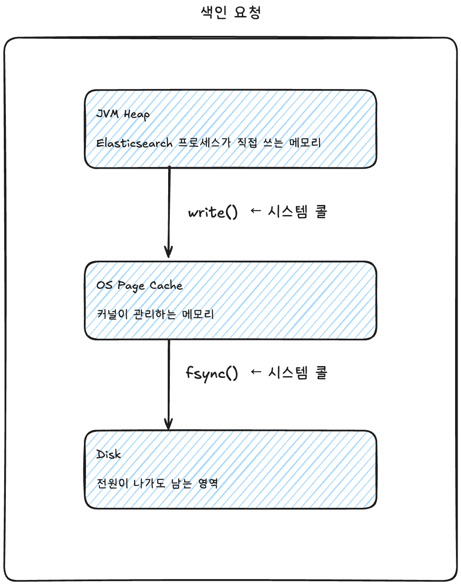
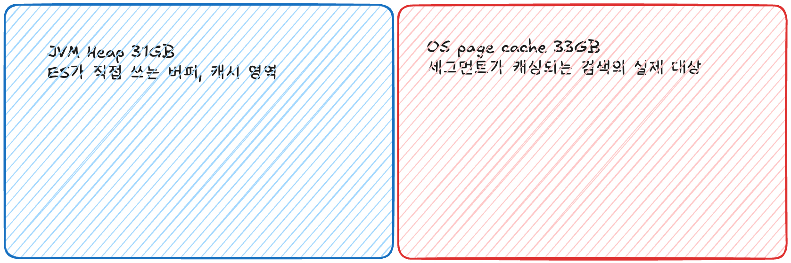
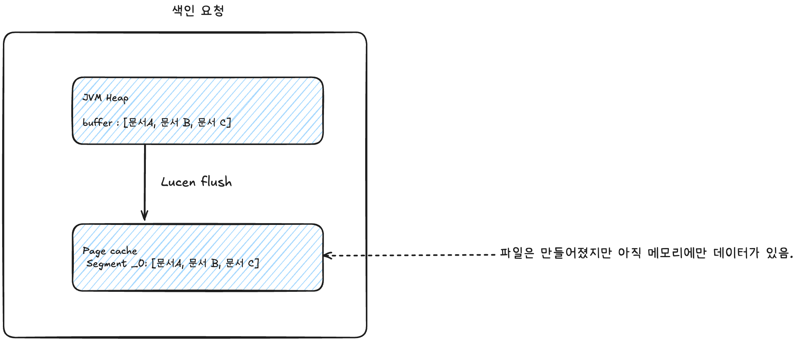
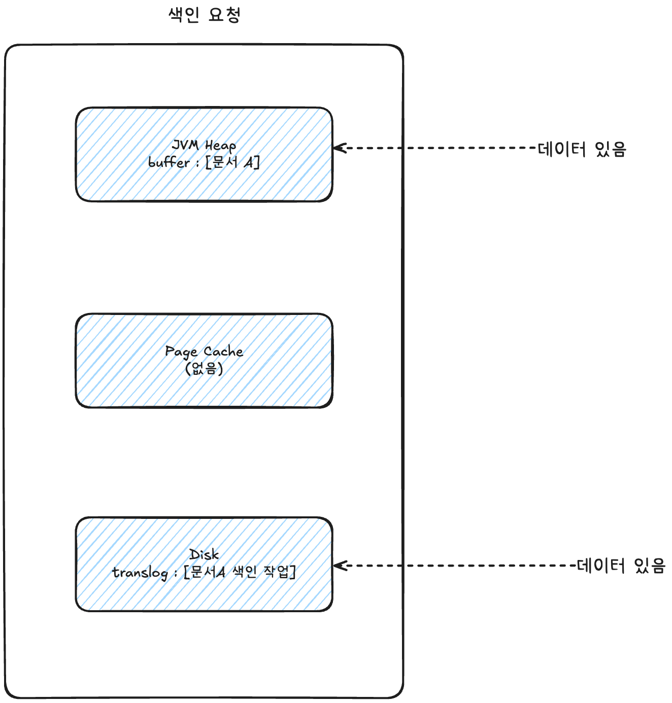
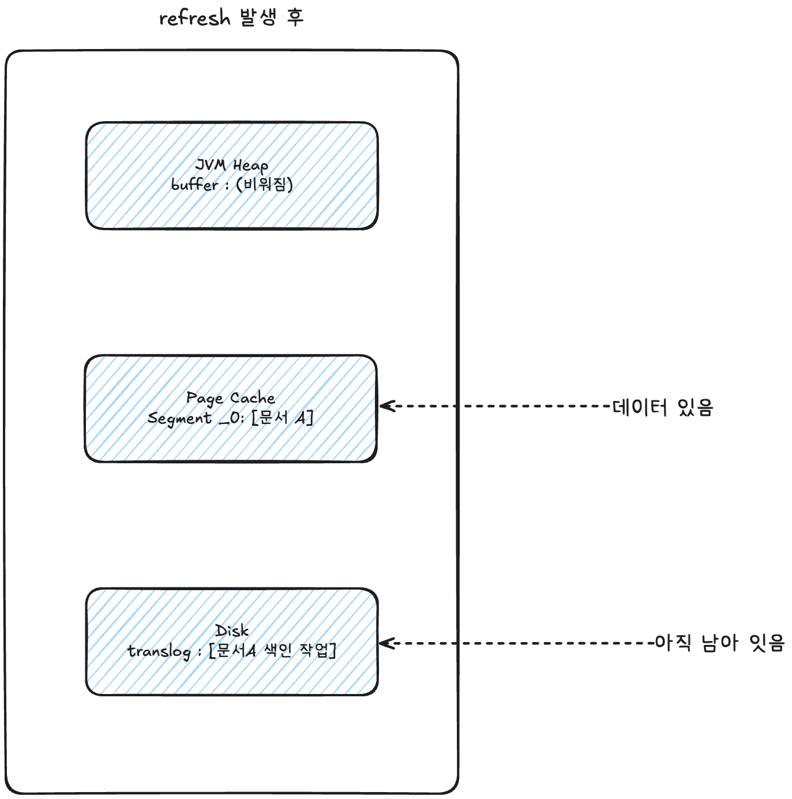
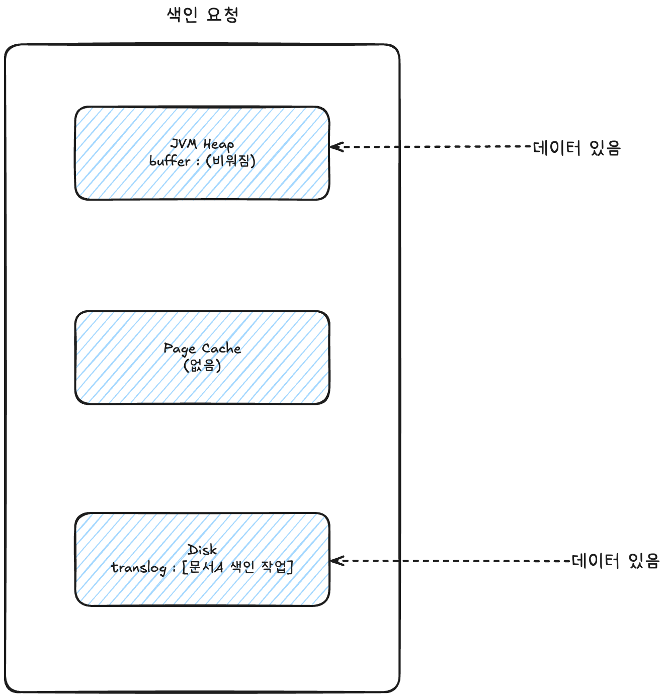
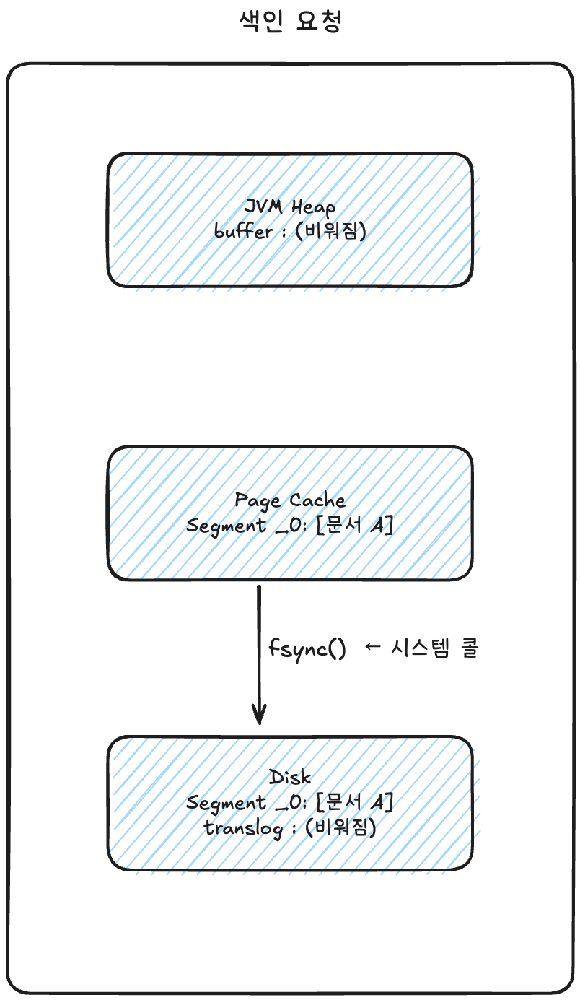
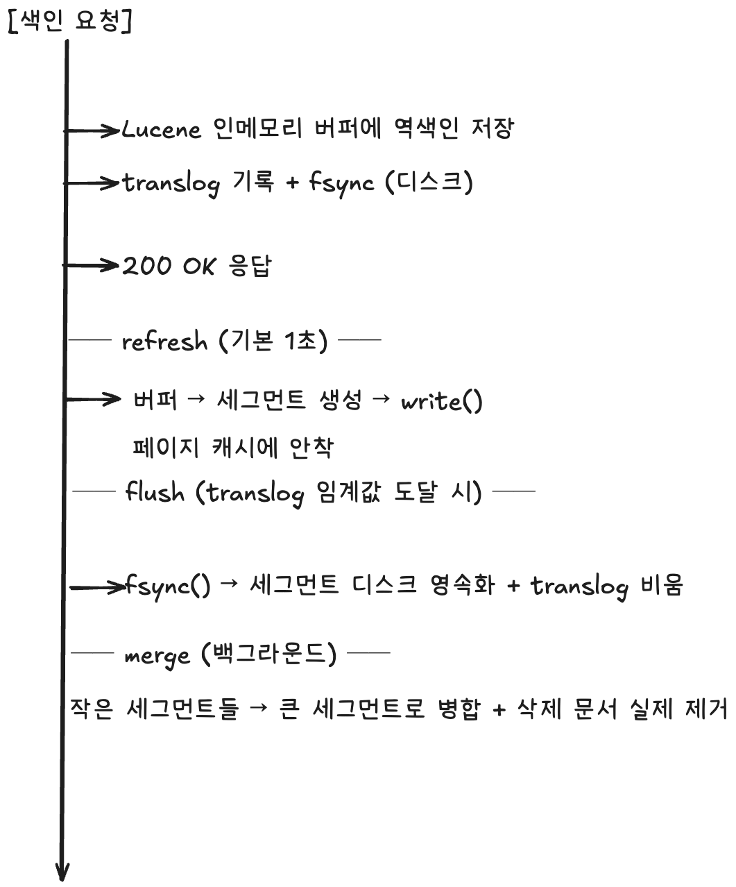

## 1. 3단계 색인 구조



> **`write()`를 호출해도 데이터는 디스크에 가지 않습니다.**
> 커널 메모리(페이지 캐시)에 복사될 뿐이고, 실제 디스크 기록은 OS가 나중에 알아서 처리합니다.
> 확실히 디스크에 내리려면 `fsync()`를 명시적으로 호출해야 합니다.

그래서 **"파일로 저장됐다"와 "디스크에 안전하다"는 다른 말**입니다. 이 사이에 존재하는 어중간한 상태가 페이지 캐시고, Elasticsearch의 refresh/flush 개념이 정확히 이 지점에서 갈립니다.

**페이지 캐시가 검색 성능을 빠르게 합니다.**

Elasticsearch가 빠른 이유의 상당 부분이 여기서 나옵니다. 검색 대상인 `세그먼트 파일이 페이지 캐시에 올라가 있으면, 검색할 때 디스크 I/O가 아예 발생하지 않고 메모리에서 읽습니다.`

페이지 캐시는 커널이 LRU로 관리하므로, 자주 검색되는 인덱스의 세그먼트가 자연스럽게 메모리에 남고 안 쓰는 것부터 밀려납니다. 별도 설정 없이 알아서 동작합니다.

이것이 **JVM 힙을 물리 메모리의 절반 이하로 설정하라**는 권장의 이유입니다.

**물리 메모리 64GB인 데이터 노드**



나머지 절반은 노는 게 아닙니다. 힙을 60GB로 잡으면 페이지 캐시가 4GB밖에 안 남아서 매 검색마다 디스크를 읽게 되고, **힙을 키운 것이 오히려 검색을 느리게 만드는** 역설이 생깁니다.

> **31GB 선이 따로 있는 이유**
> JVM의 compressed oops는 객체 포인터를 32비트로 압축해 메모리를 절약하는데, 힙이 32GB 이상이면 비활성화됩니다. 그러면 포인터가 커져서 **힙을 늘렸는데 실질 저장 용량은 줄어드는** 구간이 생깁니다. 그래서 32GB 미만, 여유를 둬서 보통 30~31GB로 잡습니다.

---

## 2. Lucene의 flush

문서 색인 요청이 들어오면 Lucene은 아래와 같은 순서로 처리를 합니다.

1. 문서를 분석기에 통과시켜 **역색인을 생성**합니다
2. 생성된 역색인을 **인메모리 버퍼**에 쌓습니다
3. **flush**: 버퍼의 내용을 **세그먼트(segment)** 라는 파일로 만들어 `write()` 합니다



**세그먼트는 Lucene이 검색을 수행하는 단위**입니다. 검색 요청이 오면 Lucene은 현재 존재하는 모든 세그먼트를 순회하며 결과를 모읍니다. 즉 세그먼트로 만들어지기 전, 버퍼에만 있는 문서는 **검색되지 않습니다.**

---

## 3. ElasticSearch의 refresh

Elasticsearch의 **refresh**는 Lucene flush를 트리거해서, 색인된 문서를 검색 가능한 상태로 만드는 작업입니다.

**색인 요청이 들어온 직후**



현재 Page Cache에 세그먼트(데이터)가 없기 때문에 검색되지 않습니다.

**refresh 발생 후**



세그먼트가 만들어져 페이지 캐시에 올라간 순간부터 검색이 가능해집니다. **디스크에 도달하는 것을 기다리지 않습니다.**

이것이 Elasticsearch가 "실시간이 아니라 **near real-time**"인 이유입니다.

## refresh 주기와 search idle

기본 refresh 주기는 **1초**이며 `index.refresh_interval`로 조정합니다.

다만 refresh는 세그먼트 파일 생성과 searcher 갱신을 동반하는 비용 있는 작업이라, Elasticsearch는 최적화를 하나 두고 있습니다. **일정 시간(`index.search.idle.after`, 기본 30초) 동안 검색 요청이 없었던 샤드는 주기적 refresh를 건너뜁니다.** 아무도 조회하지 않는 인덱스에 1초마다 세그먼트를 만들 이유가 없기 때문입니다.

**첫째, 이 최적화는 `refresh_interval`을 명시적으로 설정하지 않은 인덱스에만 적용됩니다.** 값을 직접 지정하는 순간 샤드는 search idle 상태로 들어가지 않고, 지정한 주기대로 계속 refresh합니다.

**둘째, search idle 상태의 샤드에 검색이 들어오면 그 검색은 다음 refresh가 완료될 때까지 대기합니다.** 트래픽이 뜸한 인덱스의 첫 검색이 갑자기 수백 ms~1초씩 걸리는 현상의 원인이 이것입니다. 안정적인 응답 시간이 필요하다면 `refresh_interval`을 명시하는 편이 낫습니다.

**색인 직후 바로 검색해야 한다면**

테스트 코드나 "저장하고 바로 목록 조회" 같은 흐름에서는 `refresh` 파라미터를 씁니다.

```
POST /products/_doc?refresh=wait_for   ← 다음 refresh까지 기다렸다 응답 (권장)
POST /products/_doc?refresh=true       ← 즉시 refresh 강제 (남용하면 세그먼트 폭증)
```

`wait_for`는 추가 세그먼트를 만들지 않고 다음 주기를 기다리기만 하므로 부작용이 적습니다. `true`는 매번 세그먼트를 만들어내므로 운영 코드에서는 피해야 합니다.

> **예외: ID로 조회하는 GET은 실시간입니다.** `GET /products/_doc/1`은 refresh와 무관하게 항상 최신 값을 돌려줍니다. 세그먼트에 없으면 translog를 뒤져서 찾기 때문입니다. 검색(`_search`)만 near real-time이고, 단건 조회는 실시간입니다.

## 4. 검색되지 않는 구간의 데이터는 어떻게 유지하는가?

여기까지 보면 문제가 하나 보입니다. 세그먼트는 페이지 캐시에만 있고, 페이지 캐시는 **전원이 나가면 사라지는 휘발성 메모리**입니다. 색인 성공 응답을 이미 내보냈는데 노드가 죽으면 데이터가 사라집니다.

Elasticsearch는 이를 **translog(transaction log)** 로 해결합니다. RDBMS의 WAL(Write-Ahead Logging)과 같은 패턴이고, MySQL InnoDB의 redo log에 대응한다고 보면 정확합니다.

동작 순서는 아래와 같습니다.

1. 문서를 Lucene 인메모리 버퍼에 색인
2. 같은 작업을 translog에 기록
3. translog를 fsync
4. 클라이언트에게 200 OK 응답

**translog만은 매 요청마다 진짜 디스크로 갑니다**

**이 글에서 가장 중요한 디테일입니다.** 기본 설정인 `index.translog.durability: request`는, translog가 **프라이머리와 할당된 모든 레플리카에서 fsync되어 커밋된 뒤에야** 클라이언트에게 성공을 응답한다는 의미입니다.

즉 색인 성공 응답을 받은 시점의 상태는 이렇습니다.



캐시에 세그먼트가 적재되지 않았기 때문에 검색되지 않음

트랜스로그에 데이터가 적재되었기 때문에 유실되지 않음

노드가 죽었다 살아나면, 샤드 복구 과정에서 translog를 재생(replay)해서 **Lucene commit에 포함되지 않았던 작업들을 되살립니다.**

---

## 5. Lucene의 commit과 Elasticsearch의 flush

translog가 계속 쌓이기만 하면 두 가지 문제가 생깁니다.

- 디스크 공간을 계속 차지합니다
- 복구 시 재생할 양이 많아져 샤드 복구가 오래 걸립니다

그래서 주기적으로 **세그먼트를 진짜 디스크에 내리고, 그만큼의 translog를 버리는** 작업이 필요합니다.

**Lucene의 commit**이 그 역할입니다. `fsync()` 시스템 콜로 페이지 캐시의 세그먼트를 디스크와 동기화하고, 커밋 포인트(commit point)를 기록해 "여기까지는 안전하다"고 표시합니다.

**Elasticsearch의 flush**는 이 Lucene commit을 트리거하고, 추가로 필요 없어진 translog를 비웁니다.



여기서 페이지 캐시의 세그먼트는 **지워지지 않습니다.** 검색은 계속 메모리에서 이뤄집니다. fsync는 디스크에 사본을 확정하는 것이지 메모리를 비우는 게 아닙니다.

flush는 디스크 I/O를 유발하므로 refresh보다 훨씬 무겁습니다. 자주 할 수 없고, 그렇다고 미루면 translog가 커져 복구가 느려집니다. 그 균형을 잡는 것이 flush 임계값 설정입니다.

---

## 6. 용어 정리

`flush`라는 단어가 Lucene과 Elasticsearch에서 **완전히 다른 뜻**으로 쓰입니다.

| 부르는 이름 | 하는 일 | 도착지 | 결과 |
| --- | --- | --- | --- |
| **Lucene flush** | 버퍼 → 세그먼트 생성 → `write()` | 페이지 캐시 (메모리) | 검색 가능해짐 |
| **Elasticsearch refresh** | Lucene flush를 트리거 | 페이지 캐시 (메모리) | 검색 가능해짐 |
| **Lucene commit** | `fsync()` 호출 + 커밋 포인트 기록 | 디스크 | 영속성 확보 |
| **Elasticsearch flush** | Lucene commit 트리거 + translog 비움 | 디스크 | 영속성 확보 |

```
Elasticsearch refresh  =  Lucene flush     (메모리까지, 검색 가능)
Elasticsearch flush    =  Lucene commit    (디스크까지, 영속)
```

**Lucene의 flush와 Elasticsearch의 flush는 다른 작업입니다.** 이름만 겹칠 뿐 도착지가 다릅니다. 이 대응만 잡아두면 나머지 혼란은 대부분 정리됩니다.

---

## 흐름도



이를 통해 검색을 최적화하기 위해 미리 선행 작업을 진행한다는 것, 이러한 선행 작업으로 인해 실시간으로 업데이트되지 않는다는 것, 그리고 비용이 많이 든다는 것을 알 수 있었습니다.
