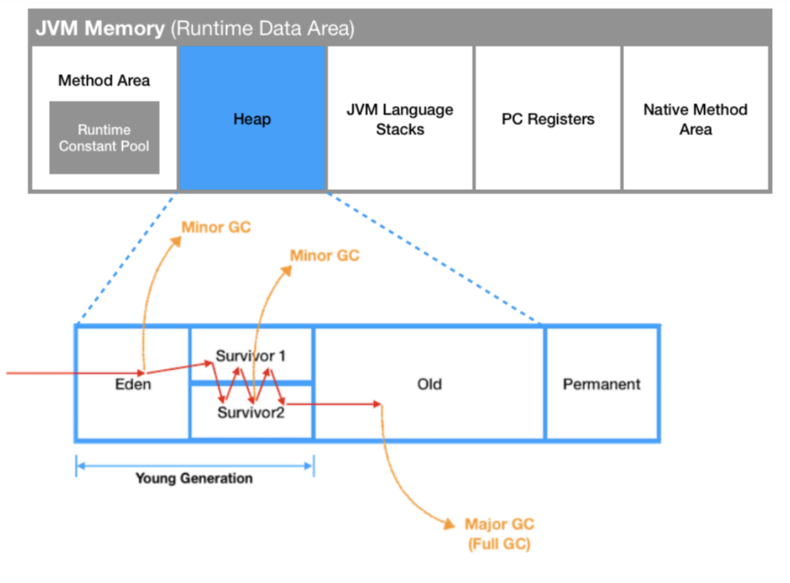
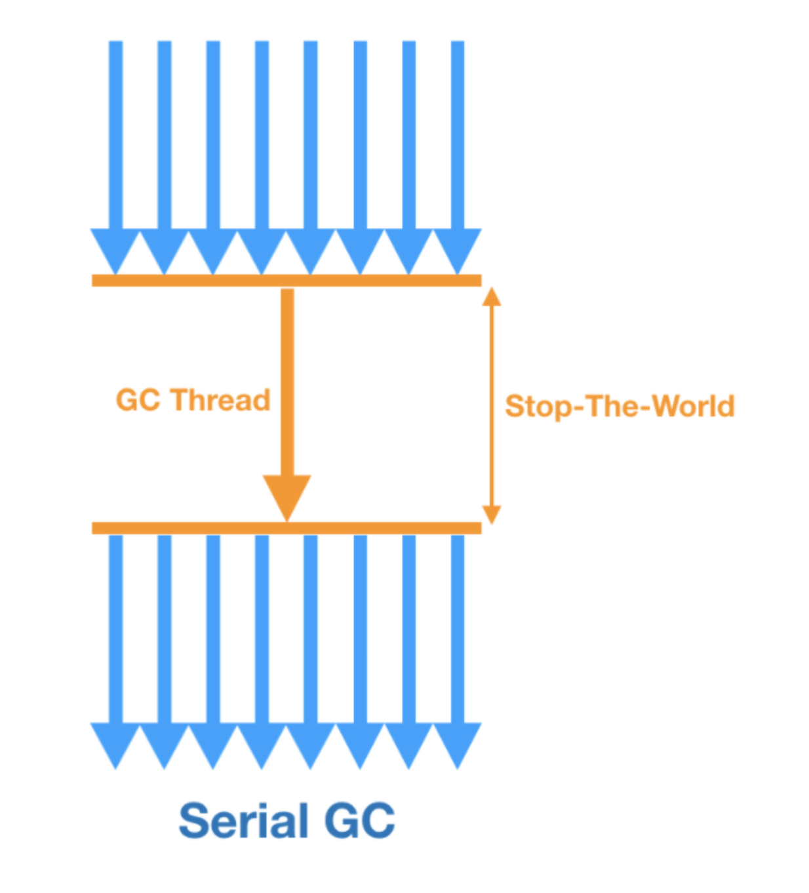
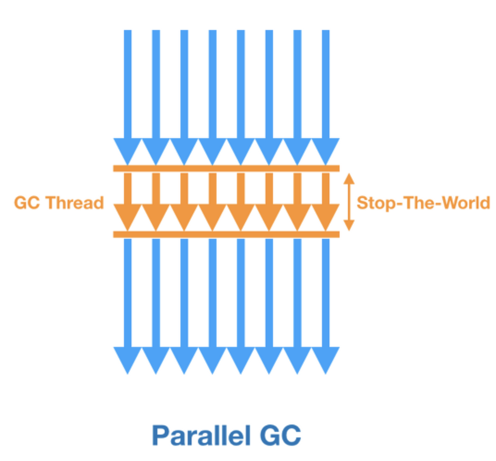
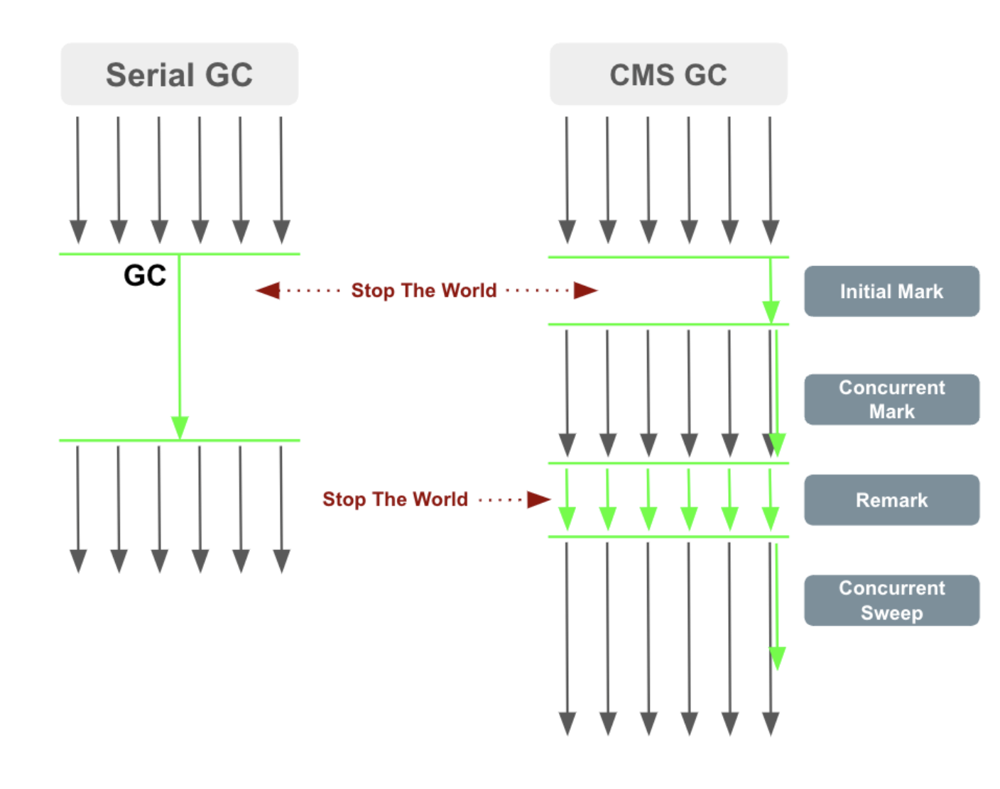
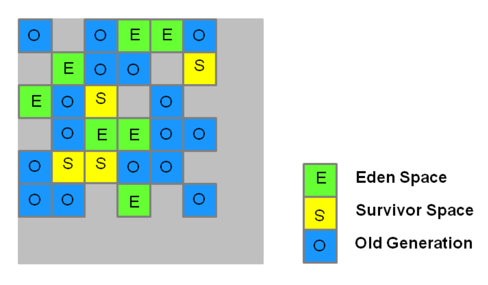
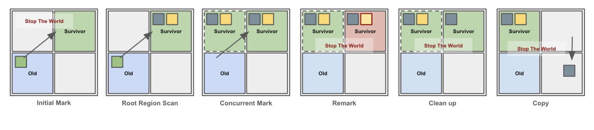
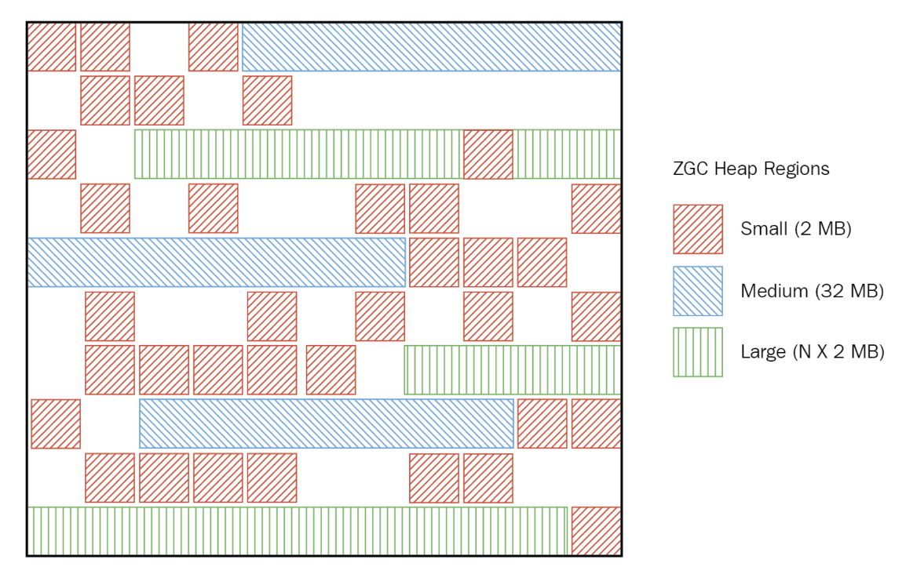

### Garbage Collection 이란?

메모리 관리를 자동해주는 시스템으로 프로그램이 더 이상 사용하지 않는 메모리 영역을 자동으로 찾아 해제하여 메모리 누수를 방지하는 것으로, 힙영역에서 작동합니다. 이를 통해 개발자는 더 이상 메모리를 관리하지 않으면서 개발에만 집중할 수 있게 됩니다. 하지만 단점으로는 자동으로 메모리를 관리해주는 만큼 언제 메모리가 해제되는지 알 수가 없어 제어하기 힘들며, GC가 동작하면 Stop-The-World로 다른 동작들이 멈추기 때문에 오버헤드가 발생합니다.

> **Stop-The-World**
>
> - **GC 시작**: GC가 시작되면, JVM은 모든 스레드를 일시 정지합니다.
> - **메모리 분석**: GC는 Root 객체로부터 시작하여 도달 가능한 객체를 표시하고, 더 이상 사용되지 않는 객체를 해제합니다. 이 과정에서 애플리케이션은 어떤 작업도 수행하지 않습니다.
> - **메모리 회수**: 사용되지 않는 객체가 해제되고, 메모리가 회수된 후, JVM은 모든 스레드를 다시 시작합니다.
> - **애플리케이션 재개**: 스레드가 다시 실행되고, 애플리케이션은 정상적으로 동작하기 시작합니다.

그렇다면 JVM의 메모리 구조에 대해 알아야 할 필요가 있다고 생각됩니다.

---

### JVM

- 자바 프로그램이 실행되면 OS로부터 메모리를 할당받아 메모리 용도에 따라 여러 영역으로 나눕니다.
- 컴퓨터의 메모리는 한정적이기 때문에, 어떻게 관리하느냐에 따라 프로그램의 속도가 좌우됩니다. 결과적으로 같은 기능의 프로그램이더라도 메모리 관리에 따라 성능 차이가 크게 나게 됩니다.



- **Method Area(메소드 영역)**
    - 필드, 메서드, 인터페이스 정보
    - 정적변수 (static fields)
    - 애플리케이션이 시작될 때 메소드 영역에 클래스가 로드되고, 메모리는 종료 시까지 유지됩니다.
- **Heap(힙)**
    - 모든 객체와 배열이 할당되는 메모리 영역
    - 동적으로 생성되는 객체 및 배열
    - Garbage Collection(GC)가 주로 동작하는 영역입니다.
- **Stack(스택)**
    - 메소드의 지역 변수, 파라미터, 반환 값, 중간 연산 결과 등을 저장
    - **지역 변수(Local Variables)**, **연산 스택(Operand Stack)**, 그리고 **프레임 데이터**가 포함
- **PC Register(PC 레지스터)**
    - 현재 실행 중인 JVM 명령어의 주소(PC, Program Counter)를 저장
- Native Method Stack(네이티브 메소드 스택)
    - 자바가 아닌 네이티브 언어(C나 C++)로 작성된 메소드가 실행될 때 사용하는 스택

---

### Heap영역의 Garbage Collection의 동작 원리

- Mark 단계
    - GC는 루트 객체부터 시작하여, 도달할 수 있는 객체들을 찾고 표시해둡니다.
    - 객체를 탐색하면서 살아있는 객체에 대하여 Mark 표시를 합니다.

    > **루트객체**
    >
    > JVM 스레드 스택에 있는 지역 변수, 전역 변수, 메소드 호출 체인에서 참조되는 객체들입니다.

- Sweep 단계
    - Mark 단계에서 표시되지 않은 객체들은 더 이상 참조하지 않는다고 판단하여 메모리에서 해제합니다.
    - Sweep은 사용하지 않는 객체들을 청소한다는 의미로 Sweep이라고 합니다.
- Compaction 단계
    - 메모리 회수가 완료되면, 살아 있는 객체들을 앞으로 보내 메모리의 연속적인 빈 공간을 확보합니다.
- Stop-The-World 발생
    - GC가 실행되면 애플리케이션의 모든 스레드가 일시적으로 중지되며, 이를 **Stop-The-World** 상태라고 합니다.


> - `MinorGC`는 짧은 시간동안 작동하기 때문에  `Stop-The-World 시간이 짧습니다.`
> - `Major GC나 Full GC는 Old Generation의 객체를 처리하는 동안 시간이 오래 걸리기 때문에 Stop-The-World 시간이 더 길어`집니다.

---

### **Generational GC의 동작**

- Heap 영역은 크게 Young Generation과 Old Generation으로 나눌 수 있습니다. 이러한 구조는 GC의 성능을 최적화하는 데 중요한 역할을 합니다.
    - Young Generation
        - **Eden 공간**: 새롭게 생성된 객체가 처음으로 할당되는 공간입니다.
        - **Survivor 공간 (S0, S1)**: Eden 공간에서 살아남은 객체가 이동하는 공간입니다. S0과 S1은 두 개의 Survivor 공간으로 번갈아 사용됩니다.
        - MinorGC : Young Generation에서 가비지 컬렉션이 발생하는 경우입니다. GC가 자주 발생하며 객체가 빠르게 회수됩니다.
    - Old Generation
        - Young Generation에서 살아남은 객체가 이동하는 영역입니다.
        - **Major GC(또는 Full GC)**: Old Generation에서 가비지 컬렉션이 발생하는 경우입니다. **`GC가 느리게 발생하며, 애플리케이션에 큰 영향을 줄 수 있습니다.`**

이를 해결하고자 가비지 컬렉션의 알고리즘을 계속 발전시켜 왔습니다.

---

### 가비지 컬렉션의 알고리즘

### **1. Serial GC**

- **Serial GC**는 **단일 스레드**를 사용하여 GC를 처리합니다. Young Generation과 Old Generation에서 발생하는 GC를 모두 **`단일 스레드로 순차적으로 수행`**합니다.
- 작은 힙 크기를 가진 애플리케이션에서 주로 사용됩니다.



**동작순서**

1. **Minor GC (Young Generation에서 수행)**:
    - **Mark**: Young Generation(Eden 및 Survivor 영역)에서 루트 객체(root objects)로부터 접근 가능한 객체를 표시합니다.
    - **Copying**: 살아남은 객체를 Survivor 영역으로 복사합니다.
    - **Sweep**: Eden 영역의 나머지 객체(더 이상 참조되지 않는 객체)를 삭제하여 메모리를 회수합니다.
    - **Compaction**: 필요하지 않습니다. 단순히 복사 후 Eden 영역을 비우기만 하면 됩니다.
2. **Major GC (Old Generation에서 수행)**:
    - **Mark**: Old Generation에서 루트 객체로부터 접근 가능한 객체를 표시합니다.
    - **Sweep**: 표시되지 않은 객체들을 제거하고 메모리를 회수합니다.
    - **Compaction**: Major GC는 메모리 단편화를 방지하기 위해 객체들을 앞쪽으로 밀어내어 메모리 공간을 연속적으로 만듭니다.
3. **Stop-The-World**: Serial GC는 GC를 처리하는 동안 애플리케이션 스레드를 멈춥니다. 모든 GC 작업이 단일 스레드에서 진행되기 때문에 **Stop-The-World** 시간이 길어질 수 있습니다.

**실행 명령어**

```java
-XX:+UseSerialGC
```

### 2. **Parallel GC**

- **Parallel GC**는 **여러 스레드**를 사용하여 Young Generation과 Old Generation의 **`GC 작업을 병렬로 처리`**합니다.
- 멀티코어 CPU를 가진 환경에서 성능을 극대화하는데 적합하며, 서버 애플리케이션에 주로 사용됩니다.



**동작순서**

1. **Minor GC (Young Generation에서 수행)**:
    - **Mark**: 여러 스레드를 사용하여 Eden과 Survivor 영역에서 접근 가능한 객체를 표시합니다.
    - **Copying**: 여러 스레드를 사용해 살아남은 객체를 Survivor 영역으로 병렬로 복사합니다.
    - **Sweep**: Eden 영역에서 사용되지 않는 객체들을 제거합니다.
    - **Compaction**: 필요하지 않습니다. 복사 후 Eden 영역을 비우기만 하면 됩니다.
2. **Major GC (Old Generation에서 수행)**:
    - **Mark**: 여러 스레드를 사용해 Old Generation의 객체를 스캔하여, 접근 가능한 객체를 표시합니다.
    - **Sweep**: **`병렬로 사용되지 않는 객체들을 제거`**합니다.
    - **Compaction**: Major GC는 메모리 단편화를 방지하기 위해 객체를 병렬로 메모리 앞부분으로 이동시킵니다.
3. **Stop-The-World**: GC 작업을 병렬로 처리하므로, Stop-The-World 시간이 **Serial GC보다 짧습니다**. 하지만 여전히 애플리케이션의 모든 스레드가 멈춥니다.

**실행 명령어**

```java
-XX:+UseParallelGC
```

추가 옵션

- Old Generation도 병렬로 처리

    ```java
    -XX:+UseParallelOldGC
    ```

### 3. CMS (Concurrent Mark-Sweep) GC

- **CMS GC**는 **애플리케이션과 동시에 GC**를 수행하려는 목적을 가진 알고리즘으로, Old Generation에서의 **`Stop-The-World 시간을 최소화하는 데 중점`**을 둡니다.
- **Mark and Sweep** 방식을 사용하여 Old Generation의 GC를 처리합니다.
- 단점은 메모리 단편화가 발생할 수 있다는 점입니다.



**동작순서**

1. **Initial Mark** (Stop-The-World):
    - 루트 객체로부터 Old Generation에서 접근 가능한 객체들을 찾고 표시(mark)합니다.
    - 이 단계는 빠르게 완료되며, **Stop-The-World** 상태가 발생합니다.
2. **Concurrent Mark** (애플리케이션과 동시에):
    - **루트 객체로부터 연결된 모든 객체를 스캔**하여 살아 있는 객체들을 표시합니다.
    - 이 단계는 애플리케이션 스레드와 **동시에 수행**되기 때문에 애플리케이션이 계속 실행될 수 있습니다.
3. **Remark** (Stop-The-World):
    - Concurrent Mark 단계 동안 변경된 객체들을 다시 한 번 확인하여, GC에 반영되지 않은 객체들을 표시합니다.
    - 이 단계는 **Stop-The-World** 상태에서 진행되지만, 짧게 완료됩니다.
4. **Concurrent Sweep** (애플리케이션과 동시에):
    - Concurrent Mark와 Remark 단계에서 도달할 수 없는 객체를 **동시에 제거**하고 메모리를 회수합니다.
5. **Compaction 없음**:
    - CMS는 객체를 이동시키지 않기 때문에 메모리 단편화가 발생할 수 있습니다. 따라서 **Compaction** 단계가 없습니다.
    - 만약 메모리 단편화가 심해지면, **Full GC**가 발생하여 Old Generation을 다시 압축하게 됩니다.
6. **Stop-The-World**: CMS는 Stop-The-World 시간을 최소화하려고 설계되었지만, **Initial Mark**와 **Remark** 단계에서는 애플리케이션이 멈춥니다. 그 외에는 애플리케이션과 동시에 작업이 진행됩니다.

> CMS GC는 JDK 9 이후로는 사용되지 않으며, `JDK 14`부터는 지원이 종료되었습니다.
> CMS GC는 지연 시간을 줄이기 위한 중요한 GC 알고리즘이었지만, **`메모리 단편화 문제`**와 `**유지보수 복잡성**`이 주요 단점이었습니다.
>
> 최신 GC 알고리즘인 **G1 GC**가 이러한 문제를 해결하면서 CMS는 점차 사용되지 않게 되었고, **JDK 14에서 지원 종료**되었습니다. G1 GC 외에도 **ZGC**와 **Shenandoah GC**와 같은 더욱 발전된 GC 알고리즘들이 CMS를 대체하여 더욱 효율적인 메모리 관리와 짧은 Stop-The-World 시간을 제공하고 있습니다.

**실행 명령어**

```java
-XX:+UseConcMarkSweepGC
```

추가 옵션

- **메모리 단편화 방지로 Full GC 강제 실행**

    ```java
    -XX:+CMSFullGCsBeforeCompaction
    ```

### 4. G1(Garbage First) GC

- **`G1 GC는 세대별 구분 없이 힙`**을 여러 개의 고정된 크기의 영역(Region)으로 나누어 GC를 수행합니다.
- 각 영역을 **Young Generation** 또는 **Old Generation**으로 다룰 수 있으며, `병렬로 GC`를 처리합니다.
- `Stop-The-World 시간을 최소`화하고, 대규모 애플리케이션에서 성능을 향상시키기 위해 설계된 최신 GC입니다.





1. **Initial Mark** (Stop-The-World):
    - 루트 객체로부터 접근 가능한 Young Generation 및 Old Generation의 객체들을 표시(mark)합니다.
    - 이 단계는 **Stop-The-World** 상태에서 빠르게 완료됩니다.
2. **Remark** (Stop-The-World):
    - Concurrent Mark 동안 변경된 객체들을 다시 확인하여 도달할 수 없는 객체들을 표시합니다.
    - 이 단계는 짧게 진행되며, **Stop-The-World** 상태에서 수행됩니다.
3. **Cleanup**:
    - GC 작업에서 도달하지 못한 객체들을 **제거**하고, 메모리를 회수합니다.
    - 이 작업은 **동시에 진행**되며, 애플리케이션에 미치는 영향을 최소화합니다.
4. **Copying (Compaction)**:
    - G1은 메모리 단편화를 방지하기 위해 **Compaction**을 적극적으로 사용합니다.
    - 살아 있는 객체들을 새로운 영역으로 **이동하여 압축**한 후, 빈 공간을 확보합니다.
5. **Stop-The-World**: G1 GC는 Minor GC와 Major GC를 구분하지 않고, 각각의 영역(Region) 단위로 GC를 수행하므로, **Stop-The-World 시간이 짧습니다**. 이 GC는 애플리케이션의 응답성을 중시하는 환경에서 특히 유용합니다.

**실행 명령어**

```java
-XX:+UseG1GC
```

**추가 옵션**

- **Max Pause Time** 설정 (GC의 최대 일시정지 시간을 설정):

    ```java
    -XX:MaxGCPauseMillis=<밀리초>
    ```

### 5. ZGC

- **비압축형(Non-Compacting)**: ZGC는 메모리 압축을 수행하지 않고, 객체 재배치(Relocation)를 통해 메모리 단편화를 해결합니다.
- **병행(Concurrent)**: 대부분의 작업이 애플리케이션과 동시에 수행됩니다.
- **대규모 힙을 지원**: ZGC는 대규모 메모리(TB 단위)를 처리할 수 있으며, 힙 크기에 관계없이 일시정지 시간을 **10ms 이하**로 유지합니다.



**동작순서**

1. **Initial Mark (Stop-The-World)**:
    - 루트 객체로부터 도달할 수 있는 객체들을 빠르게 표시(**mark**)합니다.
    - 이 단계는 매우 짧은 **Stop-The-World** 이벤트에서 수행됩니다.
2. **Concurrent Mark (애플리케이션과 동시에)**:
    - **Initial Mark** 후, ZGC는 루트 객체에서 연결된 모든 객체들을 추적하여 **살아 있는 객체**를 표시합니다.
    - 이 작업은 애플리케이션과 **동시에** 수행되어 애플리케이션의 중단 없이 진행됩니다.
3. **Concurrent Prepare for Relocate (애플리케이션과 동시에)**:
    - 객체를 새로운 메모리 영역으로 재배치할 준비를 합니다. 이동할 객체들을 선택하여 어떤 메모리 영역으로 이동할지를 결정하는 단계입니다.
    - 이 과정은 역시 애플리케이션과 **병행**으로 진행됩니다.
4. **Remark (Stop-The-World)**:
    - **Concurrent Mark** 단계에서 객체의 생존 상태가 변동된 경우, 다시 한번 정확하게 확인하는 작업입니다.
    - 이 단계 역시 매우 짧은 **Stop-The-World** 상태에서 수행됩니다.
5. **Concurrent Relocate (애플리케이션과 동시에)**:
    - 선택된 객체들을 새로운 메모리 영역으로 재배치하여 메모리 단편화를 방지합니다.
    - 이 작업 역시 애플리케이션과 **동시에** 진행되며, 압축을 수행하지 않기 때문에 빠르고 효율적입니다.

**실행 명령어**

```java
-XX:+UseZGC
```

정리

| **GC 알고리즘** | **JVM 옵션** | **적용 상황** | **Java 버전별 기본 GC** |
| --- | --- | --- | --- |
| **Serial GC** | `-XX:+UseSerialGC` | 작은 애플리케이션이나 리소스가 제한된 시스템. | **Java 8 이하에서 기본** (단일 CPU 환경) |
| **Parallel GC** | `-XX:+UseParallelGC` | 대규모 애플리케이션, 처리량을 극대화하고자 할 때. | **Java 8**(기본), Java 9~11 옵션 선택 |
| **CMS GC** | `-XX:+UseConcMarkSweepGC` | 빠른 응답 시간과 낮은 지연 시간을 중요시하는 애플리케이션. (Deprecated) | **Java 8~9 옵션 선택, Java 14 지원 종료** |
| **G1 GC** | `-XX:+UseG1GC` | 대규모 힙을 사용하는 시스템에서 성능을 최적화할 때. | **Java 9부터 기본 GC** |
| **ZGC** | `-XX:+UseZGC` | 매우 큰 힙을 사용하는 애플리케이션에서 짧은 Stop-The-World 시간을 필요로 할 때. | **Java 11부터 옵션, Java 15부터 공식 사용** |

참고

[☕ 가비지 컬렉션 동작 원리 & GC 종류 💯 총정리](https://inpa.tistory.com/entry/JAVA-☕-가비지-컬렉션GC-동작-원리-알고리즘-💯-총정리)

[[Java] Garbage Collection - 개념, 구조, GC 종류(Serial GC, Parallel GC, CMS GC, G1 GC, Z GC)](https://velog.io/@erinleeme/Garbage-Collection-개념-구조-GC-종류Serial-GC-Parallel-GC-CMS-GC-G1-GC-Z-GC)
