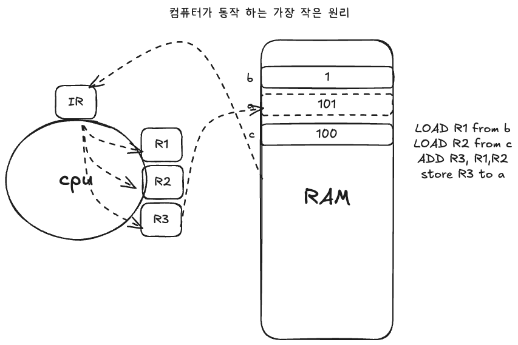
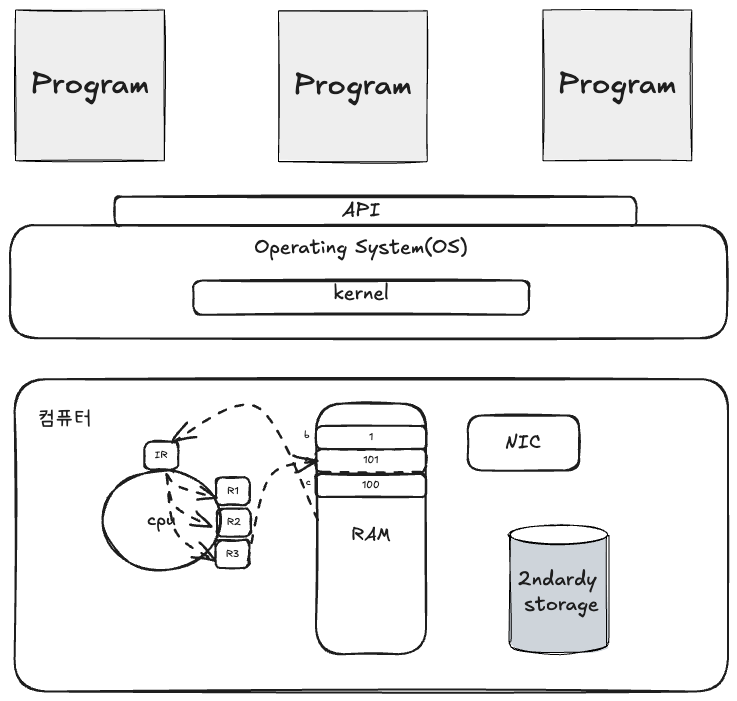
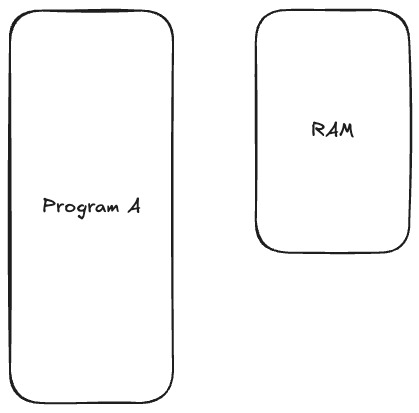
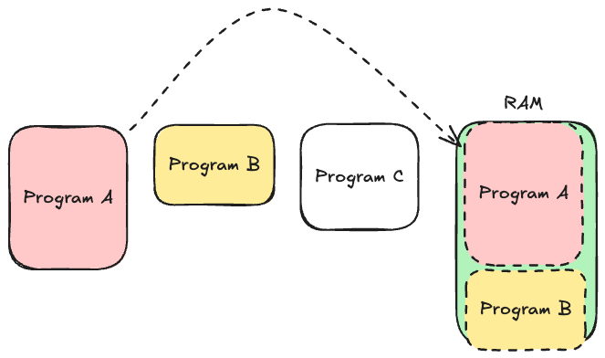
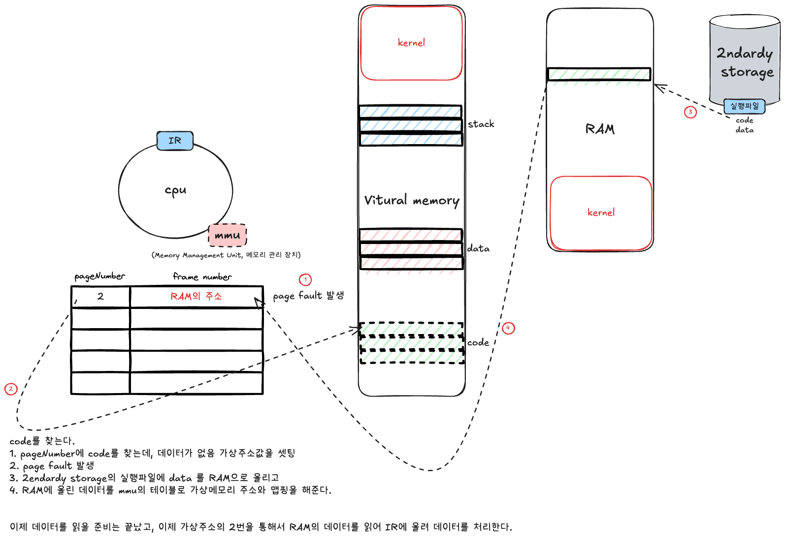
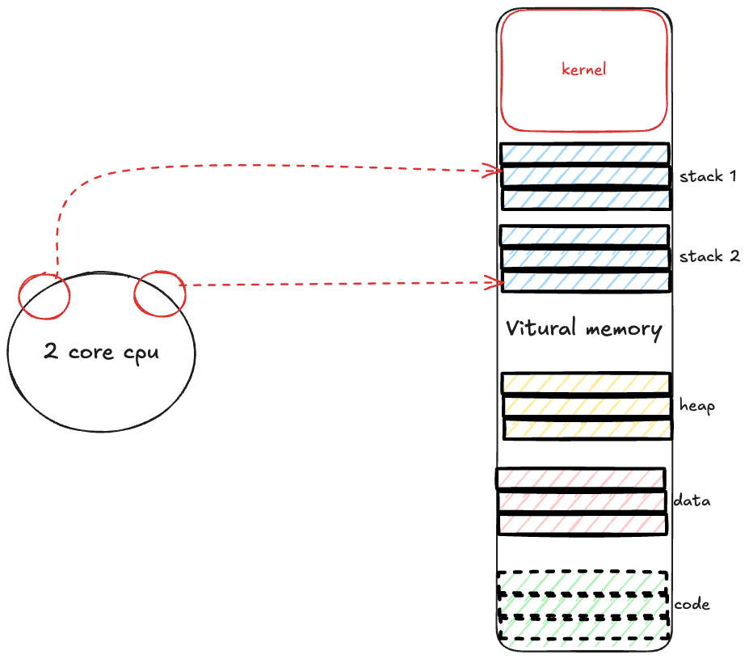
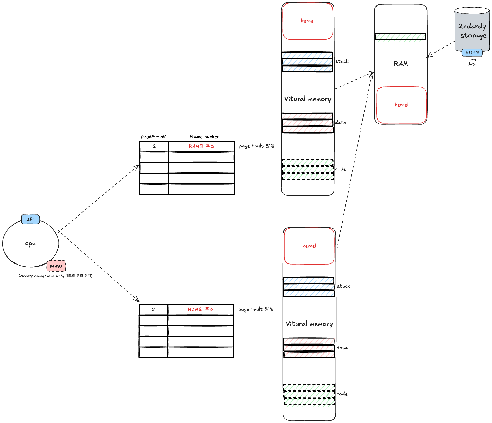

- 프로그램: 명령어와 명령어가 가리키는 대상들의 집합입니다.
- 프로세스: 프로그램이 RAM에 올라와서 실행되고 있는 상태입니다.



```java
LOAD R1 from b
LOAD R2 from c
ADD R3, R1, R2
store R3 to a
```

위와 같은 명령어가 동작할 때는 IR(instruction register)을 통해 데이터를 읽고, CPU에서 해당하는 레지스터에 값을 저장하여 RAM에 올립니다.

일반적으로 프로그램이 하드웨어를 직접 사용하려고 하면 문제가 발생합니다.

- 사용자의 프로그램에 따라 시스템 전체에 문제가 야기될 수 있습니다.
- 여러 프로세스를 실행할 때 자원 관리와 분배를 잘해야 합니다.

즉, 컴퓨터를 좀 더 쉽고 효율적이고 안전하게 중재할 수 있는 존재가 필요한데, 이것이 바로 OS입니다.

## OS 역할



1. 쉽게
   1. system call: 컴퓨터의 기능들을 쉽게 사용할 수 있게 하드웨어를 추상화하여 제공하는 인터페이스입니다.
   2. OS standard library: 여러 유용한 핵심 기능을 함수 형태로 제공합니다. system call을 wrapping하여 제공합니다.
2. 효율적
   1. process/thread scheduling: 한정된 CPU 자원을 적절히 분배합니다. (time sharing 방식을 사용합니다.)
   2. virtual memory: 필요한 페이지(Page)만 RAM에 올려서, 여러 프로세스가 RAM을 더 효율적으로 사용할 수 있게 합니다.
3. 안전
   1. system call: 크리티컬한 instruction set은 커널만 사용하도록 보호합니다.
   2. virtual memory: 독립된 가상의 주소 공간을 제공해서 RAM에 직접 접근하지 못하게 막습니다.
   3. synchronization: 공유 자원에 동시에 접근해서 레이스 컨디션(race condition)이 발생하는 것을 막을 수 있는 기능을 제공합니다.

## RAM은 유한한 자원

RAM은 유한한 자원인데 프로그램은 다양하고 점점 더 커지기 때문에 RAM이 부족한 현상이 발생합니다. 동시에 여러 프로그램을 올리려고 하면 RAM의 용량이 부족해집니다.





메모리의 파편화로 RAM에 여유가 있어도 쓰지 못하는 현상(external fragmentation)이 발생하며, 프로그램의 일부분은 잘 사용하지 않는 기능이나 로직인데도 RAM을 차지하고 있습니다.

**Locality**

- Spatial Locality(공간 지역성): 특정 메모리 위치에 접근하면, 그 근처의 메모리 위치도 곧 접근될 가능성이 높다는 원리입니다.

```java
// 배열의 연속된 요소들을 순차적으로 접근
int[] array = new int[1000];
for (int i = 0; i < array.length; i++) {
    array[i] = i * 2;  // 메모리상 연속된 위치를 순차 접근
}
```

- Temporal Locality(시간 지역성): 최근에 접근한 데이터가 가까운 미래에 다시 접근될 가능성이 높다는 원리입니다.

```java
// 반복문에서 같은 변수를 계속 참조
for (int i = 0; i < 1000; i++) {
    sum += i;  // sum 변수가 반복적으로 접근됨
}
```

이러한 유한한 RAM의 특성을 해결하기 위해 나온 것이 바로 Virtual Memory입니다.

- 프로세스는 자신만의 Virtual Memory Space를 가집니다.



주소 공간만 확보하고, 실제 데이터는 RAM에 있습니다. RAM에 데이터가 없을 때는 데이터를 읽어와서 가상 주소에 주소값을 세팅합니다. 이 때문에 RAM은 다른 프로세스에서도 동시에 사용할 수 있습니다.

> 💡 **Demand paging**: 프로세스가 실행 중에 실제로 코드나 데이터가 필요한 순간에 해당 페이지를 RAM에 올리는 방식입니다.

그렇다면 RAM이 꽉 차면 어떻게 될까요? 여러 알고리즘을 통해 결정합니다.

1. 버립니다. 코드는 이미 세컨더리 스토리지에 저장되어 있기 때문에 다시 읽어올 수 있습니다.
2. swap space에 씁니다. 힙(Heap)에서 사용자가 사용하는 데이터를 swap space에 저장하고, 필요할 때 다시 사용합니다.
3. write-back 합니다.

RAM이 꽉 차게 되면 자동으로 관리가 이루어집니다. 하지만 swap space는 하드디스크이기 때문에 속도 면에서 RAM, CPU보다 현저하게 느립니다. 그래서 현재 swap space의 작업이 많다는 것은 RAM이 꽉 차서 부하가 발생하고 있다는 뜻이며, 이는 모니터링의 대상이 됩니다.

## Process VS Thread

CPU에서 실행되는 가장 기본 단위는 스레드입니다.

같은 프로세스에 속하는 스레드는 같은 가상 주소 공간을 공유합니다. 그래서 스레드가 추가되면 stack 영역만 추가로 확보하면 됩니다.

같은 프로세스에 속한 스레드 간의 컨텍스트 스위칭이 더 빠른 이유는 같은 주소 공간을 공유하기 때문입니다. 반면 프로세스가 다르면 MMU의 테이블도 변경해야 하고, 가상 메모리에 해당하는 모든 것을 변경해야 합니다. 즉, 컨텍스트 스위칭 비용이 비쌉니다.



즉, 컴퓨터는 다양한 프로그램과 다양한 가상 메모리가 공유하는 CPU와 RAM을 사용하고 있습니다.



결국 JVM도 하나의 프로세스입니다. 이러한 동작 방식을 알아야 JVM을 좀 더 상세하고 폭넓게 이해할 수 있습니다.

참고 영상: [GC 1부: GC 공부를 위해 알아야할 OS 지식](https://www.youtube.com/live/ifhvbBrG9ic?si=NhDaNXI5zeDC4iE3)
