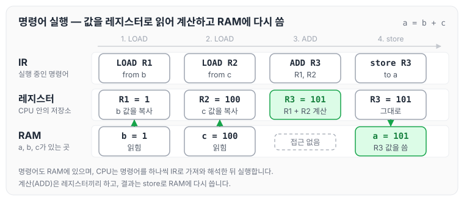
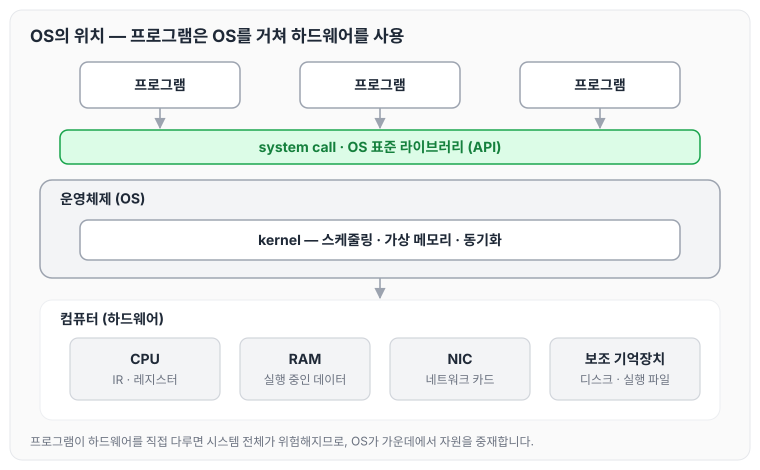
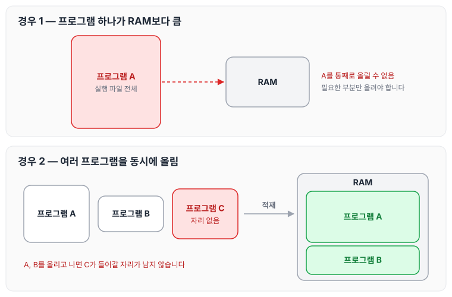
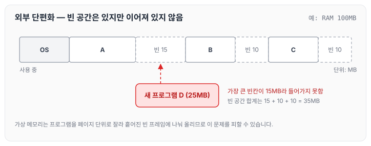
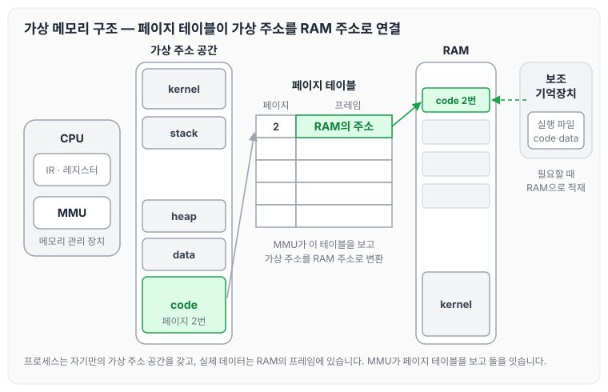
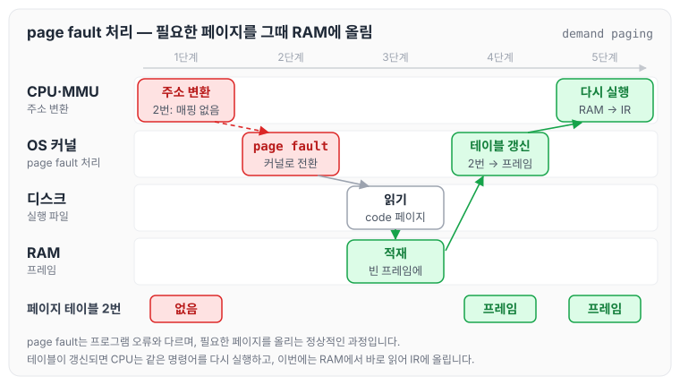
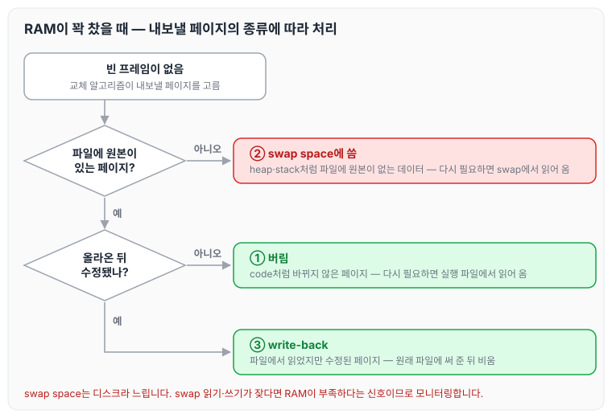
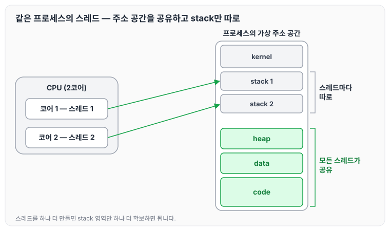
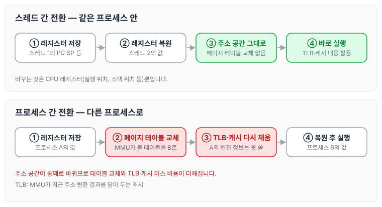
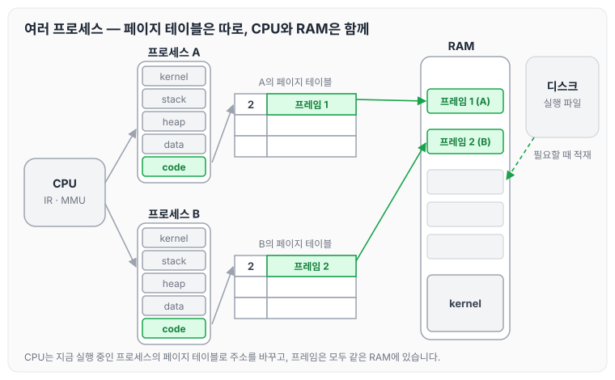

오늘은 GC 챌린지의 첫 번째 글로, [GC 1부: GC 공부를 위해 알아야할 OS 지식](https://www.youtube.com/live/ifhvbBrG9ic?si=NhDaNXI5zeDC4iE3) 영상을 보고 프로그램과 프로세스, OS의 역할, 가상 메모리, 프로세스와 스레드에 대해 정리하도록 하겠습니다.

GC를 공부하려면 먼저 JVM이 올라가는 OS가 프로그램을 어떻게 실행하고 메모리를 나눠 주는지 알아야 합니다. JVM도 결국 OS 위에서 동작하는 하나의 프로세스이기 때문입니다.

## 프로그램과 프로세스

- 프로그램: 명령어와 명령어가 가리키는 대상들의 집합입니다.
- 프로세스: 프로그램이 RAM에 올라와서 실행되고 있는 상태입니다.

디스크에 저장된 실행 파일은 그 자체로는 프로그램일 뿐이고, 이것이 RAM에 올라와 CPU가 명령어를 하나씩 실행하기 시작하면 프로세스가 됩니다.

### CPU가 명령어를 실행하는 방식

`a = b + c`를 계산하는 아주 단순한 명령어를 예로 들면 아래와 같습니다.

```text
LOAD R1 from b
LOAD R2 from c
ADD R3, R1, R2
store R3 to a
```

위와 같은 명령어가 동작할 때는 IR(instruction register)을 통해 명령어를 읽고, CPU에서 해당하는 레지스터에 값을 저장한 뒤 결과를 RAM에 다시 씁니다. 순서대로 보면 다음과 같습니다.

1. `LOAD R1 from b`: RAM에 있는 b의 값을 레지스터 R1에 복사합니다.
2. `LOAD R2 from c`: RAM에 있는 c의 값을 레지스터 R2에 복사합니다.
3. `ADD R3, R1, R2`: R1과 R2를 더한 값을 R3에 저장합니다. 계산은 CPU 안의 레지스터끼리 합니다.
4. `store R3 to a`: R3의 값을 RAM의 a 위치에 씁니다.

b가 1, c가 100일 때 네 명령어가 실행되는 흐름을 그려 보면 아래와 같습니다.



RAM의 값은 레지스터로 읽혀 와서 계산되고, 마지막 store에서야 RAM의 a가 101로 바뀝니다. 명령어 자체도 RAM에 올라와 있어야 CPU가 IR로 가져올 수 있다는 점이 뒤에 나오는 가상 메모리와 이어집니다.

## OS가 필요한 이유

일반적으로 프로그램이 하드웨어를 직접 사용하려고 하면 문제가 발생합니다.

- 사용자의 프로그램에 따라 시스템 전체에 문제가 야기될 수 있습니다.
- 여러 프로세스를 실행할 때 자원 관리와 분배를 잘해야 합니다.

즉, 컴퓨터를 좀 더 쉽고 효율적이고 안전하게 중재할 수 있는 존재가 필요한데, 이것이 OS입니다. 프로그램은 하드웨어를 직접 다루지 않고 OS가 제공하는 API를 통해 요청하며, 실제 하드웨어 제어는 OS의 커널이 맡습니다.



### OS의 역할

OS가 하는 일을 쉽게, 효율적, 안전 세 가지로 나누면 아래와 같습니다.

1. 쉽게
   1. system call: 컴퓨터의 기능들을 쉽게 사용할 수 있게 하드웨어를 추상화하여 제공하는 인터페이스입니다.
   2. OS standard library: 여러 유용한 핵심 기능을 함수 형태로 제공합니다. system call을 wrapping하여 제공합니다.
2. 효율적
   1. process/thread scheduling: 한정된 CPU 자원을 적절히 분배합니다. (time sharing 방식을 사용합니다.)
   2. virtual memory: 필요한 페이지(Page)만 RAM에 올려서, 여러 프로세스가 RAM을 더 효율적으로 사용할 수 있게 합니다.
3. 안전
   1. system call: 크리티컬한 instruction set은 커널만 사용하도록 보호합니다.
   2. virtual memory: 독립된 가상의 주소 공간을 제공해서 RAM에 직접 접근하지 못하게 막습니다.
   3. synchronization: 공유 자원에 동시에 접근해서 레이스 컨디션(race condition)이 발생하는 것을 막을 수 있는 기능을 제공합니다.

여기서 virtual memory는 효율과 안전 두 곳에 모두 등장합니다. 이 글의 나머지 부분은 대부분 virtual memory가 왜 필요하고 어떻게 동작하는지에 대한 내용입니다.

## RAM은 유한한 자원

RAM은 유한한 자원인데 프로그램은 다양하고 점점 더 커지기 때문에 RAM이 부족한 현상이 발생합니다. 프로그램 하나가 RAM보다 큰 경우도 있고, 동시에 여러 프로그램을 올리려고 하면 RAM의 용량이 부족해지기도 합니다.



또한 메모리의 파편화로 RAM에 여유가 있어도 쓰지 못하는 현상(external fragmentation)이 발생하며, 프로그램의 일부분은 잘 사용하지 않는 기능이나 로직인데도 RAM을 차지하고 있습니다.

external fragmentation은 프로그램을 RAM의 연속된 공간에 통째로 올릴 때 생깁니다. 프로그램이 올라가고 내려가기를 반복하면 빈 공간이 여기저기 조각으로 남는데, 조각들의 합은 충분해도 하나하나가 작으면 새 프로그램이 들어갈 자리가 없습니다. 예시로 그려 보면 아래와 같습니다.



### Locality

프로그램 전체를 RAM에 올리지 않아도 실행이 되는 이유는 locality(지역성) 때문입니다. 프로그램은 실행되는 동안 전체 메모리를 고르게 쓰지 않고, 일정 시간 동안은 일부 영역에 집중해서 접근합니다.

- Spatial Locality(공간 지역성): 특정 메모리 위치에 접근하면, 그 근처의 메모리 위치도 곧 접근될 가능성이 높다는 원리입니다.

```java
// 배열의 연속된 요소들을 순차적으로 접근
int[] array = new int[1000];
for (int i = 0; i < array.length; i++) {
    array[i] = i * 2;  // 메모리상 연속된 위치를 순차 접근
}
```

- Temporal Locality(시간 지역성): 최근에 접근한 데이터가 가까운 미래에 다시 접근될 가능성이 높다는 원리입니다.

```java
// 반복문에서 같은 변수를 계속 참조
for (int i = 0; i < 1000; i++) {
    sum += i;  // sum 변수가 반복적으로 접근됨
}
```

지역성이 있기 때문에 지금 쓰고 있는 부분만 RAM에 올려 두어도 대부분의 접근은 RAM 안에서 처리됩니다. 이러한 유한한 RAM의 특성을 해결하기 위해 나온 것이 Virtual Memory입니다.

## Virtual Memory

### 가상 주소 공간과 페이지 테이블

- 프로세스는 자신만의 Virtual Memory Space(가상 주소 공간)를 가집니다.
- 가상 주소 공간은 kernel, stack, heap, data, code 같은 영역으로 나뉘고, 일정한 크기의 페이지(page) 단위로 관리됩니다.
- RAM도 같은 크기의 프레임(frame) 단위로 나뉘며, 어떤 페이지가 어느 프레임에 있는지는 페이지 테이블에 기록됩니다.
- CPU 안의 MMU(Memory Management Unit, 메모리 관리 장치)가 페이지 테이블을 보고 가상 주소를 RAM의 실제 주소로 바꿉니다.



주소 공간만 확보하고, 실제 데이터는 RAM에 있습니다. RAM에 데이터가 없을 때는 데이터를 읽어와서 가상 주소에 주소값을 세팅합니다. 이 때문에 RAM은 다른 프로세스에서도 동시에 사용할 수 있습니다.

그림에서 code 영역의 페이지 2번은 페이지 테이블을 통해 RAM의 한 프레임과 연결되어 있고, 그 프레임의 내용은 보조 기억장치에 있는 실행 파일에서 올라온 것입니다. 페이지 단위로 흩어진 프레임에 올릴 수 있기 때문에, 앞에서 본 external fragmentation 문제도 피할 수 있습니다.

### page fault와 demand paging

> 💡 **Demand paging**: 프로세스가 실행 중에 실제로 코드나 데이터가 필요한 순간에 해당 페이지를 RAM에 올리는 방식입니다.

demand paging에서는 처음부터 모든 페이지를 올려 두지 않기 때문에, 접근하려는 페이지가 아직 RAM에 없는 경우가 생깁니다. 이때 발생하는 것이 page fault입니다. CPU가 code 영역의 페이지 2번을 실행하려고 할 때의 흐름은 아래와 같습니다.

1. CPU가 페이지 2번의 가상 주소에 접근하고, MMU가 페이지 테이블에서 2번을 찾지만 연결된 프레임이 없습니다.
2. page fault가 발생하고, 제어가 OS 커널로 넘어갑니다.
3. OS가 보조 기억장치의 실행 파일에서 해당 페이지를 읽어 RAM의 빈 프레임에 올립니다.
4. OS가 페이지 테이블의 2번에 RAM에 올린 프레임의 주소를 기록해 가상 주소와 매핑합니다.
5. 데이터를 읽을 준비가 끝났으므로 CPU는 같은 명령어를 다시 실행하고, 이번에는 가상 주소 2번을 통해 RAM의 데이터를 읽어 IR에 올려 처리합니다.



page fault는 이름 때문에 오류처럼 보이지만, demand paging에서 필요한 페이지를 올리는 정상적인 과정입니다. 다만 디스크를 읽어야 하므로 RAM에서 바로 읽는 것보다 훨씬 느리고, page fault가 너무 자주 일어나면 성능이 떨어집니다.

### RAM이 꽉 찼을 때

RAM이 꽉 차서 새 페이지를 올릴 빈 프레임이 없을 때는 페이지 교체 알고리즘을 통해 RAM에서 내보낼 페이지를 결정하고, 그 페이지의 종류에 따라 아래 중 하나로 처리합니다.

1. 버립니다. 코드는 이미 세컨더리 스토리지에 저장되어 있기 때문에 다시 읽어올 수 있습니다.
2. swap space에 씁니다. 힙(Heap)에서 사용자가 사용하는 데이터를 swap space에 저장하고, 필요할 때 다시 사용합니다.
3. write-back 합니다.

각각을 조금 더 풀어 쓰면 다음과 같습니다.

- 버림: 실행 파일의 code처럼 디스크 파일에 원본이 있고, RAM에 올라온 뒤 바뀌지 않은 페이지입니다. 내용이 원본과 같으므로 그냥 비우고, 다시 필요해지면 파일에서 읽어 옵니다.
- swap space: heap이나 stack처럼 실행 중에 만들어져 파일에 원본이 없는 데이터입니다. 버리면 내용이 사라지므로 디스크의 swap space에 써 두고, 다시 필요해지면 swap space에서 읽어 옵니다.
- write-back: 파일에서 읽어 왔지만 RAM에 있는 동안 내용이 수정된 페이지입니다. 원본 파일과 내용이 달라졌으므로 원래 파일에 다시 써 준 뒤 프레임을 비웁니다.



RAM이 꽉 차게 되면 이러한 관리가 자동으로 이루어집니다. 하지만 swap space는 하드디스크에 있기 때문에 속도 면에서 RAM, CPU보다 현저하게 느립니다. 그래서 현재 swap space의 작업이 많다는 것은 RAM이 꽉 차서 부하가 발생하고 있다는 뜻이며, 이는 모니터링의 대상이 됩니다.

## Process VS Thread

### 스레드는 주소 공간을 공유한다

CPU에서 실행되는 가장 기본 단위는 스레드입니다. 프로세스는 가상 주소 공간과 같은 자원을 가지는 단위이고, 그 안에서 실제로 CPU에 올라가 명령어를 실행하는 것은 스레드입니다.

같은 프로세스에 속하는 스레드는 같은 가상 주소 공간을 공유합니다. heap, data, code 영역은 모든 스레드가 함께 쓰고, 함수 호출 정보와 지역 변수를 담는 stack만 스레드마다 따로 가집니다. 그래서 스레드가 추가되면 stack 영역만 추가로 확보하면 됩니다.

아래는 2코어 CPU에서 같은 프로세스의 스레드 두 개가 동시에 실행되는 모습입니다.



두 스레드가 heap을 함께 쓰기 때문에, 앞에서 OS의 역할로 본 synchronization이 필요해집니다.

### 컨텍스트 스위칭 비용

CPU 코어 하나는 한 번에 하나의 스레드만 실행할 수 있으므로, OS는 time sharing 방식으로 실행할 스레드를 계속 바꿉니다. 이때 지금까지 실행하던 상태를 저장하고 다음에 실행할 상태를 불러오는 것을 컨텍스트 스위칭이라고 합니다.

같은 프로세스에 속한 스레드 간의 컨텍스트 스위칭이 더 빠른 이유는 같은 주소 공간을 공유하기 때문입니다. 반면 프로세스가 다르면 MMU의 테이블도 변경해야 하고, 가상 메모리에 해당하는 모든 것을 변경해야 합니다. 즉, 컨텍스트 스위칭 비용이 비쌉니다.

두 경우를 나란히 놓으면 아래와 같습니다.



- 스레드 간 전환: 실행 위치(PC), 스택 위치(SP) 같은 레지스터 값만 저장하고 복원합니다. 페이지 테이블은 그대로이므로, MMU가 최근 주소 변환 결과를 담아 두는 TLB와 CPU 캐시의 내용도 계속 활용할 수 있습니다.
- 프로세스 간 전환: 레지스터 저장·복원에 더해 MMU가 참조할 페이지 테이블을 새 프로세스의 것으로 바꿔야 합니다. 이전 프로세스의 주소 변환 결과는 새 프로세스에서 쓸 수 없으므로 TLB와 캐시가 새 프로세스 기준으로 다시 채워질 때까지 느려집니다.

### 여러 프로세스가 CPU와 RAM을 나눠 쓴다

프로세스마다 자기만의 가상 주소 공간과 페이지 테이블을 가지지만, CPU와 RAM은 하나입니다. CPU는 지금 실행 중인 프로세스의 페이지 테이블로 주소를 바꾸고, 각 프로세스의 페이지는 같은 RAM의 서로 다른 프레임에 올라갑니다.



즉, 컴퓨터는 다양한 프로그램과 다양한 가상 메모리가 공유하는 CPU와 RAM을 사용하고 있습니다.

결국 JVM도 하나의 프로세스입니다. JVM의 heap도 이 글에서 본 가상 주소 공간의 일부이고, 실제로는 페이지 단위로 RAM에 올라가며, GC 스레드도 OS가 스케줄링하는 스레드 중 하나입니다. 이러한 동작 방식을 알아야 JVM을 좀 더 상세하고 폭넓게 이해할 수 있습니다.

오늘은 GC를 이해하기 위한 OS 기초로 CPU가 명령어를 실행하는 방식, OS의 역할, 가상 메모리와 page fault, 프로세스와 스레드의 차이에 대해 정리하였습니다. 다음 글 [JVM은 어떻게 실행되고 클래스를 로딩하는가](../jvm-execution-classloading/)에서는 이 위에서 JVM이 프로세스로 실행되고 클래스를 로딩하는 과정을 정리하겠습니다.

참고 영상: [GC 1부: GC 공부를 위해 알아야할 OS 지식](https://www.youtube.com/live/ifhvbBrG9ic?si=NhDaNXI5zeDC4iE3)
