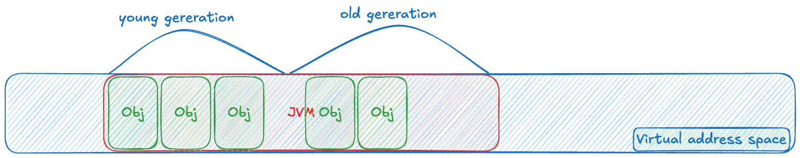
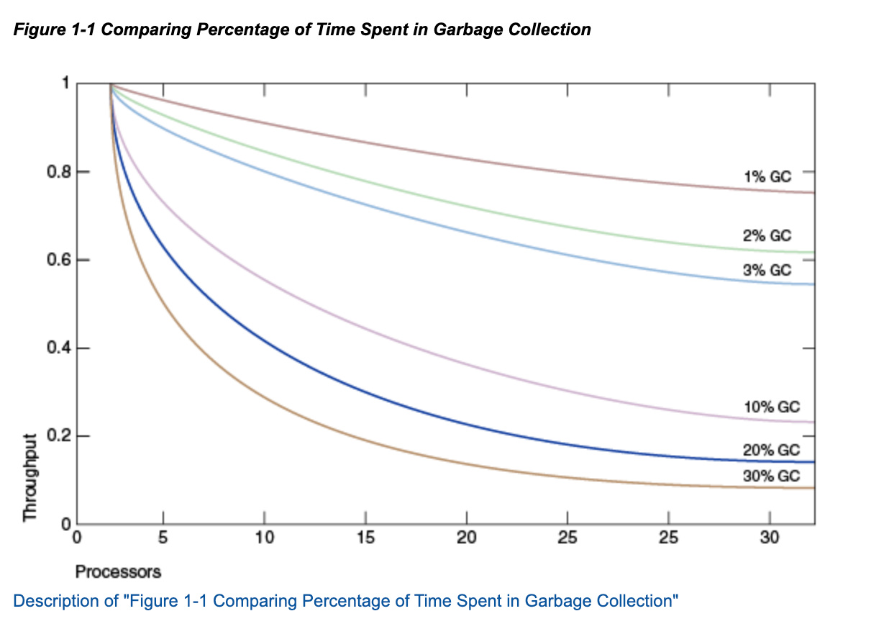
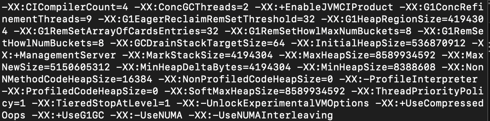
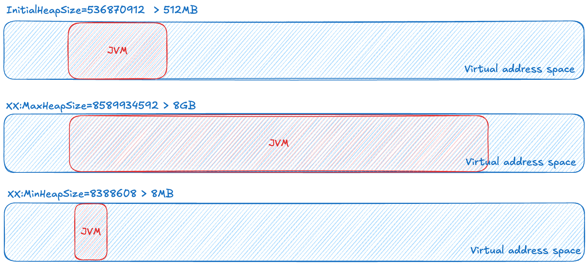

## GC의 역할

- OS로부터 메모리 영역을 확보합니다.
- 애플리케이션에서는 객체 생성 등 메모리가 필요할 때 GC가 확보한 메모리 영역을 사용합니다.

## GC의 주요 테크닉

- 세대별 청소(generational scavenging)와 aging 기법을 사용해서, JVM Heap 내에서도 회수할 만한 객체가 많이 있을 법한 영역에 집중합니다.
- 살아있는 객체들은 한 곳에 모아서 최대한 연속된 free 영역을 확보하려고 노력합니다.
- GC가 동작할 때 여러 스레드를 사용해 최대한 병렬로 동작할 수 있도록 하고, 오래 걸리는 GC 작업은 백그라운드에서 애플리케이션 코드와 동시에 실행될 수 있도록 합니다.

## 언제 GC 선택과 튜닝이 중요한가?

기술은 상황에 맞게 알맞게 설정해야 합니다.

기본적으로 작은 프로젝트나 사이드 프로젝트에서는 GC를 튜닝할 정도로 큰 트래픽이 발생하지 않습니다. 그래서 기본적인 설정값으로 프로그램을 진행해도 됩니다. 하지만 스케일이 큰 애플리케이션, 특히 데이터를 많이 쓰고 스레드도 많이 쓰며 높은 처리량을 요구하는 애플리케이션의 경우에는 성능을 위해 별도의 GC 선택과 튜닝이 필요할 수 있습니다.

- 소규모 시스템에서는 별 문제가 안 될 GC로 인한 성능 이슈가, 대규모 시스템으로 확장될 때는 주요 병목 지점이 될 수 있습니다.
- 대규모 시스템에서는 GC 오버헤드를 조금만 낮춰도 성능 향상에 이점이 크기 때문에, 적절한 garbage collector를 선택하고 필요하다면 GC 튜닝도 하는 것이 중요하고 가치 있는 일입니다.
- 자바는 네 개의 garbage collector를 제공하는데, 그중 Serial GC를 제외하고는 모두 성능 향상을 위해 병렬로 동작합니다.
- 오늘날 서버 클래스로 분류될 수 있는 머신에서 애플리케이션이 실행되며, 보통 디폴트로 G1GC가 사용됩니다.

## Ergonomics

Ergonomics란 JVM이 주어진 환경에서 GC와 메모리 관련 설정을 스스로 최적화하는 것을 말합니다.

- default selection: collector, heap size, GC 스레드 수, JIT compiler를 JVM이 환경에 맞게 스스로 선택합니다.
- 실행 중 동적 조정: 아래 두 가지 목표를 맞추기 위해 사용자가 설정한 목표를 모니터링하여, 실행 중에 동적으로 조정합니다.
  - Maximum Pause-Time goal (`-XX:MaxGCPauseMillis=nnn`)
  - Throughput goal (`-XX:GCTimeRatio=nnn`)
  - 위 두 가지 목표가 모두 충족되는 동안에는 minimum footprint를 추구하며 동작합니다.

## JVM의 주요 default 설정

- garbage collector
  - 서버용 머신에는 G1GC, 그 외에는 Serial Collector를 사용합니다.
    - 판단 기준: 두 개 이상의 프로세서를 가지며 RAM이 1792MB를 초과하는 경우입니다.
  - initial heap size: JVM이 시작할 때 바로 확보되는 Heap 크기로, RAM의 1/64입니다.
  - maximum heap size: JVM heap의 최대 크기로, RAM의 1/4입니다.
  - minimum heap size: 디폴트 값 설정이 약간 복잡하게 결정됩니다.

> 💡 서버 애플리케이션의 경우 initial heap size, maximum heap size, minimum heap size를 동일하게 맞춰서 최대한 메모리를 사용하게 합니다.

명령어

- `jps -l`
  - `51379 com.ic.api.InterviewConnectApiApplication`
- `jcmd 51379 VM.flags`

- `-XX:InitialHeapSize=536870912` → 512MB
- `-XX:MaxHeapSize=8589934592` → 8GB
- `-XX:MinHeapSize=8388608` → 8MB

현재 제 컴퓨터 기준 애플리케이션의 유동적인 JVM 설정은 다음과 같습니다.

## Maximum Pause-Time goal

- pause time: GC로 인해 애플리케이션이 아예 멈추는 시간, 즉 stop-the-world 시간입니다.
- pause time이 아무리 길어도 maximum-pause-time goal보다는 적어야 합니다.
- Maximum Pause-Time goal은 `-XX:MaxGCPauseMillis=nnn`으로 지정하며, 이때 nnn의 단위는 밀리초(milliseconds)입니다.
- GC는 pause time에 대한 가중평균과 분산을 계산해서, 이 둘의 합을 maximum-pause-time goal과 비교합니다.
- garbage collector는 heap size나 GC 관련 여러 파라미터들을 조절해 pause time을 nnn 밀리초보다 작게 유지하려고 시도합니다.
- maximum pause-time goal의 디폴트 값은 collector마다 다릅니다.

> 💡 그렇다면 JVM의 heap size를 목표 pause time인 1초에 맞추기 위해서는 heap size를 줄여야 할까요, 늘려야 할까요?
>
> 1.5초를 1초로 줄이려면 heap size를 작게 가져가야 더 빠르게 처리되고, 그만큼 GC가 더 자주 실행됩니다.

## Throughput goal

- Throughput goal: GC time과 application time을 비교해서 특정 비율을 맞추도록 하는 것입니다.
- GC time: 지금까지 GC에 의해 애플리케이션이 멈춘(pause) 시간의 총합, 즉 stop-the-world가 된 시간의 총합을 의미합니다.
- application time: GC time을 제외한 시간의 총합입니다.
  - 일부 GC 스레드가 애플리케이션과 병렬로 실행된다면, 이 시간도 application time으로 분류됩니다.
- Throughput goal은 `-XX:GCTimeRatio=nnn`으로 지정합니다.
  - GC Time ratio = 1 / (1+nnn)을 목표로 설정하는 것입니다.
    - 만약 nnn을 19로 맞춘다면 1/20이 되고, 이는 0.05, 즉 5%로 맞추는 것입니다.
- Throughput goal이 충족되지 않으면 GC는 여러 방법을 통해 이를 충족시키려고 하는데, 그중 하나가 heap size를 늘리는 것입니다.

> 💡 만약 현재 Throughput goal이 5%가 아니라 10%라고 가정했을 때, 목표치인 5%를 달성하기 위해서는 heap size를 늘려야 합니다. application의 시간을 늘려야 하므로 heap size를 늘려야 하는 것입니다.

## Minimum Footprint

- Footprint는 프로세스가 현재 사용 중인 메모리의 크기이며, heap 크기가 전체 메모리 크기에 가장 큰 영향을 미칩니다.
- Maximum Pause-Time goal과 Throughput goal이 모두 충족된다면, garbage collector는 heap 사이즈를 조금씩 줄입니다.

참고 자료
- [GC 3부: GC은 왜 필요한가? GC 튜닝은 언제 왜 필요한가? GC의 자동 최적화](https://www.youtube.com/live/1glyhyChmmk?si=gVO6ijaZTABzf5LD)
- [Introduction (Oracle GC Tuning Guide)](https://docs.oracle.com/javase/8/docs/technotes/guides/vm/gctuning/introduction.html)
