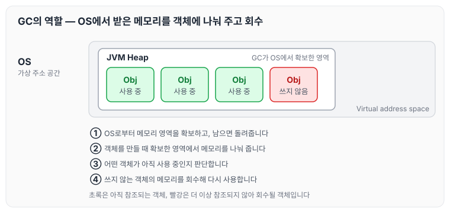
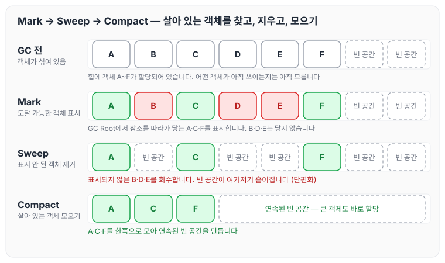
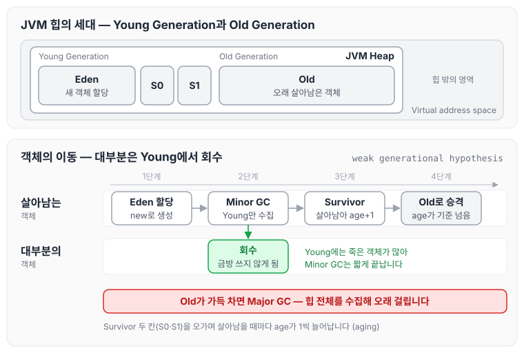
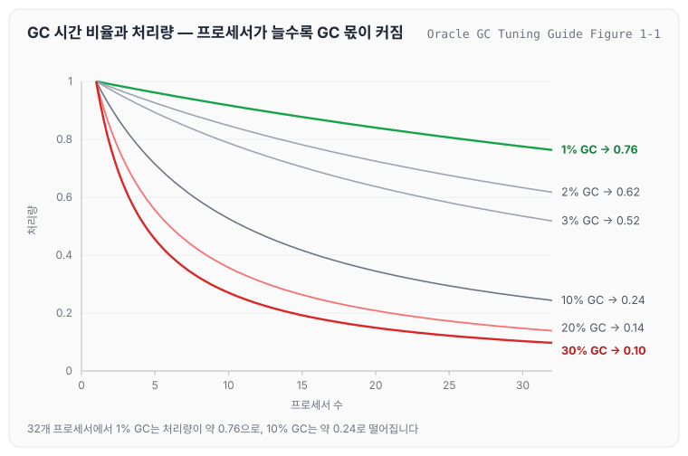
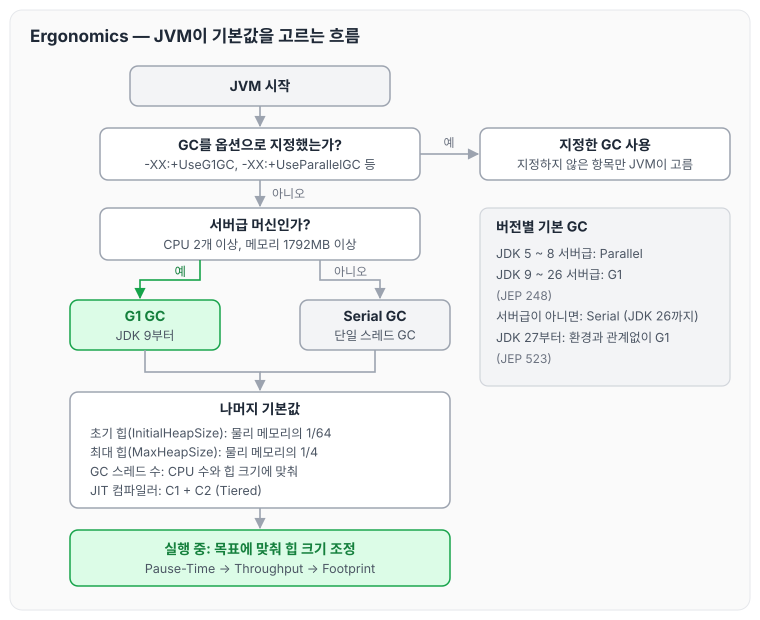
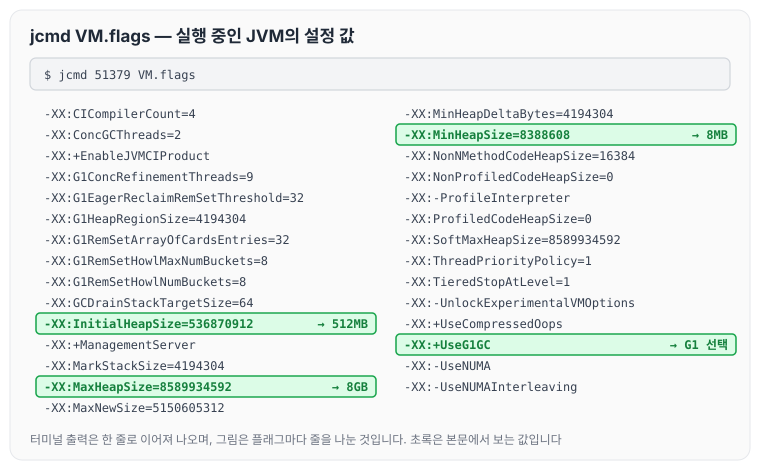
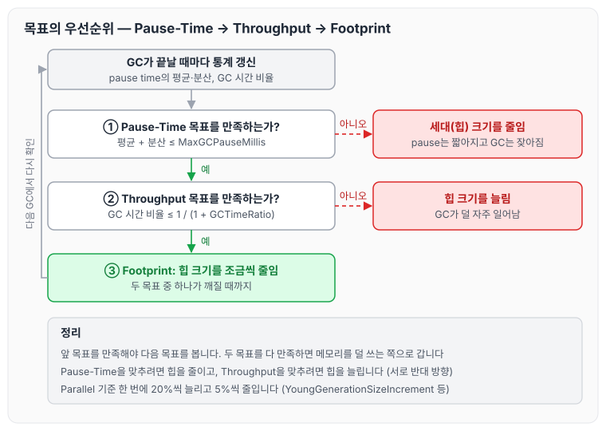
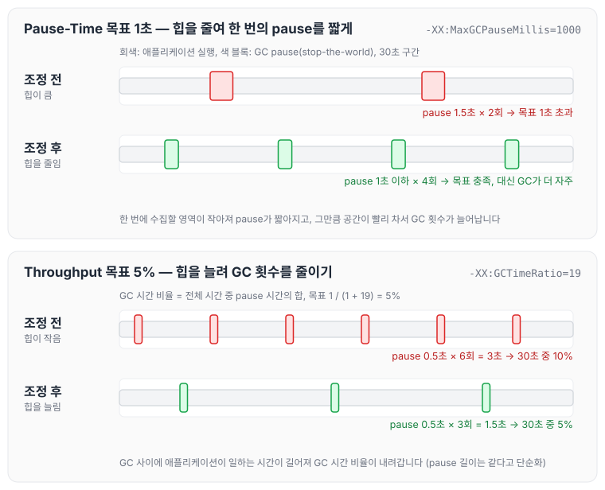

이전에 [JVM은 어떻게 실행되고 클래스를 로딩하는가](../jvm-execution-classloading/)에 대해 작성하였습니다. 이번 글에서는 GC가 하는 일과 GC를 튜닝할 때 기준이 되는 Ergonomics, JVM의 기본 설정에 대해 정리하도록 하겠습니다.

## GC의 역할

GC는 애플리케이션이 사용할 메모리를 대신 관리합니다.

- OS로부터 메모리 영역을 확보합니다.
- 애플리케이션에서는 객체 생성 등 메모리가 필요할 때 GC가 확보한 메모리 영역을 사용합니다.

Oracle GC Tuning Guide에서는 GC가 하는 일을 조금 더 나누어 아래 네 가지로 설명합니다.

- OS로부터 메모리를 확보하고, 필요 없어진 메모리는 OS에 돌려줍니다.
- 애플리케이션이 요청할 때 확보한 메모리를 나눠 줍니다.
- 메모리 중 애플리케이션이 아직 사용하고 있는 부분을 판단합니다.
- 사용하지 않는 메모리를 회수해 다시 쓸 수 있게 합니다.

아래 그림은 OS의 가상 주소 공간 안에 GC가 JVM 힙을 확보하고, 그 안에 객체가 할당되는 모습입니다.

초록색 객체는 아직 다른 객체에서 참조되고 있어 사용 중인 객체이고, 빨간색 객체는 더 이상 참조되지 않아 GC가 회수할 대상입니다.

## GC의 주요 테크닉

- 세대별 청소(generational scavenging)와 aging 기법을 사용해서, JVM Heap 내에서도 회수할 만한 객체가 많이 있을 법한 영역에 집중합니다.
- 살아있는 객체들은 한 곳에 모아서 최대한 연속된 free 영역을 확보하려고 노력합니다.
- GC가 동작할 때 여러 스레드를 사용해 최대한 병렬로 동작할 수 있도록 하고, 오래 걸리는 GC 작업은 백그라운드에서 애플리케이션 코드와 동시에 실행될 수 있도록 합니다.

세 가지 중 앞의 두 가지는 GC가 객체를 회수하는 기본 과정과 세대 구분을 알면 이해하기 쉽습니다.

### Mark, Sweep, Compact

GC는 어떤 객체가 아직 쓰이는지부터 판단해야 합니다. 이때 기준은 "도달 가능한가"입니다. 실행 중인 스레드의 스택 변수, static 변수처럼 GC가 출발점으로 삼는 참조(GC Root)에서 참조를 따라가 닿는 객체는 살아 있는 객체이고, 어디에서도 닿지 않는 객체는 회수 대상입니다.

- Mark: GC Root에서 참조를 따라가며 닿는 객체에 표시를 합니다.
- Sweep: 표시되지 않은 객체를 회수합니다.
- Compact: 살아 있는 객체를 한쪽으로 모아 빈 공간을 연속되게 만듭니다.

Sweep만 하면 회수한 공간이 B, D, E 자리처럼 여기저기 흩어집니다(단편화). 이렇게 되면 빈 공간의 합은 충분해도 큰 객체를 한 번에 놓을 자리가 없을 수 있습니다. 위에서 말한 "살아있는 객체들을 한 곳에 모아서 연속된 free 영역을 확보"하는 것이 Compact 단계입니다. G1도 살아 있는 객체를 새 영역으로 복사(evacuation)하면서 같은 효과를 얻습니다.

### 세대별 수집 (Generational Collection)

힙 전체를 매번 Mark하면 살아 있는 객체가 많을수록 오래 걸립니다. 그래서 HotSpot의 GC는 대부분의 애플리케이션에서 관찰되는 성질을 이용합니다. 이를 weak generational hypothesis라고 부르며, 내용은 "대부분의 객체는 생성된 뒤 짧은 시간만 살아 있다"는 것입니다. 예를 들어 반복문 안에서 만든 iterator는 반복문이 끝나면 더 이상 쓰이지 않습니다.

이 성질을 이용해 힙을 세대로 나눕니다.

- Young Generation: 새 객체가 할당되는 곳입니다. Eden과 두 개의 Survivor(S0, S1)로 나뉩니다.
- Old Generation: Young에서 오래 살아남은 객체가 옮겨 가는 곳입니다.

그림에서 확인할 점은 다음과 같습니다.

- Young이 가득 차면 Young만 수집하는 Minor GC가 일어납니다. Young에는 이미 쓰이지 않는 객체가 대부분이므로 살아남은 소수만 옮기면 되고, 그래서 빠르게 끝납니다.
- Minor GC에서 살아남은 객체는 Survivor로 옮겨지고, 살아남을 때마다 age가 1씩 늘어납니다. 이것이 aging입니다.
- age가 기준을 넘은 객체는 Old로 옮겨집니다(승격, promotion).
- Old가 가득 차면 힙 전체를 수집하는 Major GC가 일어나며, 대상 객체가 많아 Minor GC보다 오래 걸립니다.

"회수할 만한 객체가 많이 있을 법한 영역에 집중"한다는 것은 이렇게 Young을 자주, 짧게 수집하는 것을 말합니다.

## 언제 GC 선택과 튜닝이 중요한가?

기술은 상황에 맞게 알맞게 설정해야 합니다.

기본적으로 작은 프로젝트나 사이드 프로젝트에서는 GC를 튜닝할 정도로 큰 트래픽이 발생하지 않습니다. 그래서 기본적인 설정값으로 프로그램을 진행해도 됩니다. 하지만 스케일이 큰 애플리케이션, 특히 데이터를 많이 쓰고 스레드도 많이 쓰며 높은 처리량을 요구하는 애플리케이션의 경우에는 성능을 위해 별도의 GC 선택과 튜닝이 필요할 수 있습니다.

아래 그래프는 Oracle GC Tuning Guide의 Figure 1-1을 다시 그린 것입니다. GC를 빼면 프로세서 수에 비례해 완벽하게 확장되는 이상적인 시스템을 가정하고, 단일 프로세서에서 GC에 쓰는 시간 비율에 따라 프로세서를 늘렸을 때 처리량이 어떻게 되는지 보여 줍니다.

단일 프로세서에서 GC에 시간의 1%만 쓰는 애플리케이션도 32개 프로세서에서는 처리량을 20% 넘게 잃고, 10%를 쓰는 애플리케이션은 75% 넘게 잃습니다. GC는 병렬로 나누기 어려운 몫이 있어서, 프로세서가 늘어날수록 전체에서 GC가 차지하는 비중이 커지기 때문입니다(Amdahl의 법칙).

- 소규모 시스템에서는 별 문제가 안 될 GC로 인한 성능 이슈가, 대규모 시스템으로 확장될 때는 주요 병목 지점이 될 수 있습니다.
- 대규모 시스템에서는 GC 오버헤드를 조금만 낮춰도 성능 향상에 이점이 크기 때문에, 적절한 garbage collector를 선택하고 필요하다면 GC 튜닝도 하는 것이 중요하고 가치 있는 일입니다.
- 자바는 네 개의 garbage collector를 제공하는데, 그중 Serial GC를 제외하고는 모두 성능 향상을 위해 병렬로 동작합니다. JDK 21 기준 문서에서는 Serial, Parallel, G1, ZGC 네 가지를 설명합니다.
- 오늘날 서버 클래스로 분류될 수 있는 머신에서 애플리케이션이 실행되며, 보통 디폴트로 G1GC가 사용됩니다.

## Ergonomics

Ergonomics란 JVM이 주어진 환경에서 GC와 메모리 관련 설정을 스스로 최적화하는 것을 말합니다. 크게 두 가지 일을 합니다.

- default selection: collector, heap size, GC 스레드 수, JIT compiler를 JVM이 환경에 맞게 스스로 선택합니다.
- 실행 중 동적 조정: 아래 두 가지 목표를 맞추기 위해 사용자가 설정한 목표를 모니터링하여, 실행 중에 동적으로 조정합니다.
  - Maximum Pause-Time goal (`-XX:MaxGCPauseMillis=nnn`)
  - Throughput goal (`-XX:GCTimeRatio=nnn`)
  - 위 두 가지 목표가 모두 충족되는 동안에는 minimum footprint를 추구하며 동작합니다.

JVM이 시작할 때 기본값을 고르는 흐름은 아래와 같습니다. 옵션으로 직접 지정한 항목은 그 값을 쓰고, 지정하지 않은 항목만 JVM이 고릅니다.

기본 GC는 JDK 버전에 따라 달라졌습니다. JDK 8까지는 서버급 머신에서 Parallel GC가 기본이었고, JDK 9부터 G1 GC가 기본이 되었습니다(JEP 248). 서버급이 아닌 환경에서는 Serial GC를 고릅니다. 또한 JDK 27부터는 JEP 523에 따라 환경과 관계없이 항상 G1을 고르도록 바뀌었습니다.

## JVM의 주요 default 설정

- garbage collector
  - 서버용 머신에는 G1GC, 그 외에는 Serial Collector를 사용합니다(JDK 26까지).
    - 판단 기준: 두 개 이상의 프로세서를 가지며 RAM이 1792MB 이상인 경우입니다.
  - initial heap size: JVM이 시작할 때 바로 확보되는 Heap 크기로, RAM의 1/64입니다.
  - maximum heap size: JVM heap의 최대 크기로, RAM의 1/4입니다.
  - minimum heap size: 디폴트 값 설정이 약간 복잡하게 결정됩니다.

> 💡 서버 애플리케이션의 경우 initial heap size, maximum heap size, minimum heap size를 동일하게 맞춰서 최대한 메모리를 사용하게 합니다.

Oracle 문서에서도 실행 중에 OS로부터 메모리를 받거나 돌려주는 과정이 지연을 만들 수 있으므로, `-Xms`와 `-Xmx`를 같은 값으로 지정하는 방법을 권장합니다.

실제로 실행 중인 애플리케이션의 설정은 아래 명령어로 확인할 수 있습니다. `jps -l`로 자바 프로세스의 PID를 찾고, `jcmd <PID> VM.flags`로 그 JVM에 적용된 플래그를 출력합니다.

- `jps -l`
  - `51379 com.ic.api.InterviewConnectApiApplication`
- `jcmd 51379 VM.flags`

출력에는 Ergonomics가 고른 값과 실행할 때 넘긴 값이 함께 나옵니다. `-XX:+UseG1GC`로 G1이 선택된 것을 확인할 수 있고, 힙 크기와 관련된 값은 아래 세 가지입니다.

- `-XX:InitialHeapSize=536870912` → 512MB
- `-XX:MaxHeapSize=8589934592` → 8GB
- `-XX:MinHeapSize=8388608` → 8MB

현재 제 컴퓨터 기준 애플리케이션의 유동적인 JVM 설정은 다음과 같습니다. 최대 힙 8GB가 물리 메모리의 1/4이라는 규칙대로라면 메모리는 32GB로 계산되고, 초기 힙 512MB도 32GB의 1/64와 맞습니다.

JVM은 시작할 때 512MB를 확보하고, 사용량에 따라 최소 8MB에서 최대 8GB 사이에서 힙을 늘리거나 줄입니다. 이 크기를 실행 중에 어느 쪽으로 움직일지 정하는 것이 아래의 세 가지 목표입니다.

## 목표의 우선순위

Ergonomics의 목표는 Maximum Pause-Time goal, Throughput goal, Minimum Footprint 세 가지이며, 이 순서대로 처리됩니다. Pause-Time 목표를 먼저 맞추고, 그것이 충족된 뒤에야 Throughput 목표를 보고, 두 목표가 모두 충족되었을 때 Footprint를 고려합니다.

GC가 끝날 때마다 통계를 갱신하고 목표를 확인합니다. 그림에서 볼 수 있듯이 Pause-Time 목표와 Throughput 목표는 힙 크기를 서로 반대 방향으로 움직입니다. 아래에서 각 목표를 하나씩 정리하겠습니다.

## Maximum Pause-Time goal

- pause time: GC로 인해 애플리케이션이 아예 멈추는 시간, 즉 stop-the-world 시간입니다.
- pause time이 아무리 길어도 maximum-pause-time goal보다는 적어야 합니다. 다만 이 값은 GC에게 주는 힌트이기 때문에 항상 지켜지지는 않습니다.
- Maximum Pause-Time goal은 `-XX:MaxGCPauseMillis=nnn`으로 지정하며, 이때 nnn의 단위는 밀리초(milliseconds)입니다.
- GC는 pause time에 대한 가중평균과 분산을 계산해서, 이 둘의 합을 maximum-pause-time goal과 비교합니다. 가중평균은 최근의 pause에 더 큰 가중치를 둡니다.
- garbage collector는 heap size나 GC 관련 여러 파라미터들을 조절해 pause time을 nnn 밀리초보다 작게 유지하려고 시도합니다.
- maximum pause-time goal의 디폴트 값은 collector마다 다릅니다. G1은 200ms이고, Parallel은 기본 목표가 없습니다.

> 💡 그렇다면 JVM의 heap size를 목표 pause time인 1초에 맞추기 위해서는 heap size를 줄여야 할까요, 늘려야 할까요?
>
> 1.5초를 1초로 줄이려면 heap size를 작게 가져가야 더 빠르게 처리되고, 그만큼 GC가 더 자주 실행됩니다.

위 예를 30초 동안의 실행으로 그려 보면 아래 그림의 위쪽과 같습니다.

한 번에 수집할 영역이 작아지면 pause는 짧아지지만, 공간이 빨리 차기 때문에 GC 횟수는 늘어납니다. 이 때문에 Pause-Time 목표를 맞추는 과정에서 전체 처리량은 줄어들 수 있습니다. G1은 특히 Young 영역의 크기를 조절해 pause 목표를 맞추기 때문에, Oracle 문서에서는 `-Xmn`이나 `-XX:NewRatio`로 Young 크기를 고정하지 말라고 안내합니다.

## Throughput goal

- Throughput goal: GC time과 application time을 비교해서 특정 비율을 맞추도록 하는 것입니다.
- GC time: 지금까지 GC에 의해 애플리케이션이 멈춘(pause) 시간의 총합, 즉 stop-the-world가 된 시간의 총합을 의미합니다.
- application time: GC time을 제외한 시간의 총합입니다.
  - 일부 GC 스레드가 애플리케이션과 병렬로 실행된다면, 이 시간도 application time으로 분류됩니다.
- Throughput goal은 `-XX:GCTimeRatio=nnn`으로 지정합니다.
  - GC Time ratio = 1 / (1+nnn)을 목표로 설정하는 것입니다.
    - 만약 nnn을 19로 맞춘다면 1/20이 되고, 이는 0.05, 즉 5%로 맞추는 것입니다.
- Throughput goal이 충족되지 않으면 GC는 여러 방법을 통해 이를 충족시키려고 하는데, 그중 하나가 heap size를 늘리는 것입니다.

GCTimeRatio의 기본값도 collector마다 다릅니다.

| collector | GCTimeRatio 기본값 | GC에 쓸 수 있는 시간 |
|------|------|------|
| Parallel | 99 | 1 / (1 + 99) = 1% |
| G1 | 12 | 1 / (1 + 12) ≈ 8% |

G1은 pause time과 처리량의 균형을 목표로 하기 때문에, 처리량을 우선하는 Parallel보다 GC에 쓸 수 있는 시간을 넉넉하게 잡습니다.

> 💡 만약 현재 Throughput goal이 5%가 아니라 10%라고 가정했을 때, 목표치인 5%를 달성하기 위해서는 heap size를 늘려야 합니다. application의 시간을 늘려야 하므로 heap size를 늘려야 하는 것입니다.

위 그림의 아래쪽이 이 예입니다. 현재 GC에 쓰는 시간이 30초 중 3초(10%)라면, 힙을 늘려 GC 사이에 애플리케이션이 일할 수 있는 시간을 길게 만들어 GC 횟수를 줄입니다. 그러면 같은 30초 동안 GC에 쓰는 시간이 1.5초(5%)로 줄어듭니다. Parallel GC 기준으로 힙(세대)은 한 번에 20%씩 늘리고 5%씩 줄이며, Throughput 목표가 충족되지 않을 때는 Young과 Old를 각각 전체 GC 시간에서 차지하는 비중만큼 늘립니다.

## Minimum Footprint

- Footprint는 프로세스가 현재 사용 중인 메모리의 크기이며, heap 크기가 전체 메모리 크기에 가장 큰 영향을 미칩니다.
- Maximum Pause-Time goal과 Throughput goal이 모두 충족된다면, garbage collector는 heap 사이즈를 조금씩 줄입니다.

힙을 줄이다 보면 결국 두 목표 중 하나가 다시 깨지는데, Oracle 문서에 따르면 대부분은 Throughput 목표가 먼저 깨집니다. 그러면 다시 힙을 늘리는 쪽으로 돌아가므로, 힙 크기는 두 목표를 겨우 만족하는 지점 근처에서 움직이게 됩니다. 사용할 수 있는 힙의 범위는 `-Xms`(최소)와 `-Xmx`(최대)로 정할 수 있습니다.

## 마무리

오늘은 GC의 역할과 Mark·Sweep·Compact, 세대별 수집, 그리고 Ergonomics가 고르는 기본값과 Pause-Time·Throughput·Footprint 목표에 따라 힙 크기가 조정되는 방식에 대해 정리하였습니다.

정리하면서 GC 튜닝은 옵션을 많이 붙이는 것보다, JVM이 어떤 기본값을 고르고 어떤 순서로 목표를 맞추는지 먼저 이해하는 것이 중요하다는 것을 알 수 있었습니다. 대부분은 기본값으로 충분하고, 문제가 생겼을 때 pause time 목표와 최대 힙 크기부터 조정해 보는 것이 맞는 순서인 것 같습니다.

이 글에서 다룬 Eden에 객체가 할당되는 과정은 [JVM TLAB (Thread Local Allocation Buffer)](../jvm-tlab/)에서 부연해서 정리하였습니다. Eden 안에 스레드마다 따로 두는 할당 버퍼로, 여러 스레드가 동시에 객체를 할당할 때 생기는 경합을 줄이는 구조입니다.

참고 자료
- [GC 3부: GC은 왜 필요한가? GC 튜닝은 언제 왜 필요한가? GC의 자동 최적화](https://www.youtube.com/live/1glyhyChmmk?si=gVO6ijaZTABzf5LD)
- [Introduction (Oracle GC Tuning Guide)](https://docs.oracle.com/javase/8/docs/technotes/guides/vm/gctuning/introduction.html)
- [Ergonomics (Oracle HotSpot GC Tuning Guide, JDK 21)](https://docs.oracle.com/en/java/javase/21/gctuning/ergonomics1.html)
- [The Parallel Collector (Oracle HotSpot GC Tuning Guide, JDK 21)](https://docs.oracle.com/en/java/javase/21/gctuning/parallel-collector3.html)
- [Garbage-First Garbage Collector Tuning (Oracle HotSpot GC Tuning Guide, JDK 21)](https://docs.oracle.com/en/java/javase/21/gctuning/garbage-first-garbage-collector-tuning.html)
- [JEP 248: Make G1 the Default Garbage Collector](https://openjdk.org/jeps/248)
- [JEP 523: Make G1 the Default Garbage Collector in All Environments](https://openjdk.org/jeps/523)
