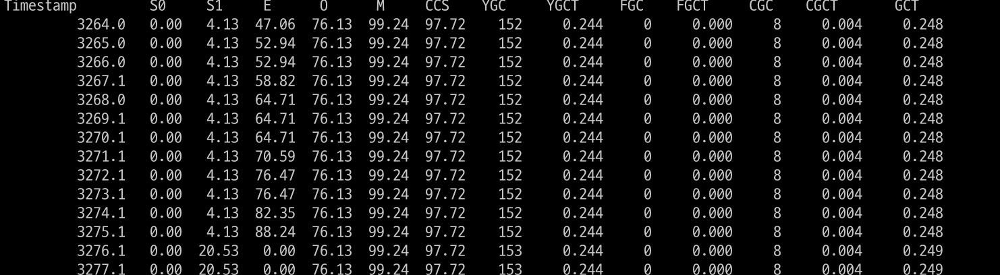
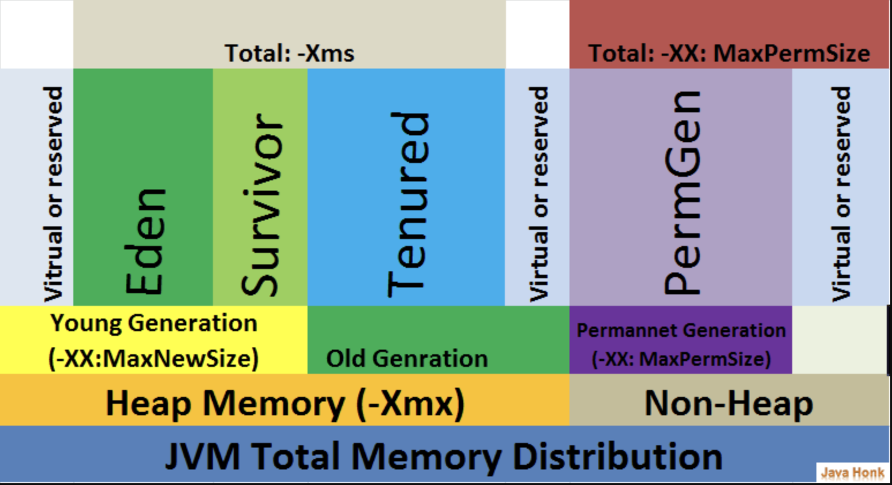

이전에 [Java] Garbage Collection(GC)에 대해 설명하였습니다.

### GC 요약

요약하자면

- GC는 가비지 컬렉션이 힙 영역에서 동작하는 방식이며, Young → Old 영역 순서로 진행됩니다.
- Young 영역의 GC가 동작하면 STW가 빠르게 끝나며, Old 영역의 GC가 동작하면 메모리 크기가 Young 영역보다 크기 때문에 STW가 보다 오래 걸립니다. 따라서 개발자는 객체가 메모리를 어떻게 사용하는지에 대해 알아야 할 필요가 있습니다.
- GC의 동작 순서는 아래와 같습니다.
    - Mark
    - Sweep
    - Compaction
- GC의 알고리즘은 다양하며 애플리케이션의 활용 용도에 따라 다르게 GC 알고리즘을 지정할 수 있습니다.

| **GC 알고리즘** | **JVM 옵션** | **적용 상황** | **Java 버전별 기본 GC** |
| --- | --- | --- | --- |
| **Serial GC** | `-XX:+UseSerialGC` | 작은 애플리케이션이나 리소스가 제한된 시스템. | **Java 8 이하에서 기본** (단일 CPU 환경) |
| **Parallel GC** | `-XX:+UseParallelGC` | 대규모 애플리케이션, 처리량을 극대화하고자 할 때. | **Java 8**(기본), Java 9~11 옵션 선택 |
| **CMS GC** | `-XX:+UseConcMarkSweepGC` | 빠른 응답 시간과 낮은 지연 시간을 중요시하는 애플리케이션. (Deprecated) | **Java 8~9 옵션 선택, Java 14 지원 종료** |
| **G1 GC** | `-XX:+UseG1GC` | 대규모 힙을 사용하는 시스템에서 성능을 최적화할 때. | **Java 9부터 기본 GC** |
| **ZGC** | `-XX:+UseZGC` | 매우 큰 힙을 사용하는 애플리케이션에서 짧은 Stop-The-World 시간을 필요로 할 때. | **Java 11부터 옵션, Java 15부터 공식 사용** |

---

### GC 튜닝의 주의점

JVM(Java Virtual Machine)은 기본 GC 알고리즘과 설정이 대부분의 애플리케이션에 대해 최적화되어 있습니다. 특히 최신 JVM은 지능적인 방식으로 메모리 관리와 가비지 컬렉션을 처리하며, 많은 상황에서 별도의 튜닝 없이도 좋은 성능을 제공합니다. 따라서 **`심각한 문제가 발생하지 않는 이상 기본 설정으로 유지하는 것이 일반적으로 권장됩니다.`**

1. GC 튜닝을 잘못할 경우 오히려 성능을 악화시킬 수 있습니다. GC는 메모리 관리, 힙 크기, 애플리케이션의 워크로드에 따라 다르게 동작합니다.
    1. **더 자주 발생하는 Full GC**: 잘못된 힙 크기 설정으로 인해 **Full GC가 더 자주 발생하게 되어 성능이 떨어질 수 있습니다.**
    2. **메모리 부족 또는 메모리 누수**: 부적절한 GC 옵션으로 인해 **메모리 부족 문제나 메모리 누수 문제가 발생할 수 있습니다.**
    3. **애플리케이션 지연 시간 증가**: GC 중단 시간을 줄이기 위한 잘못된 튜닝이 오히려 **애플리케이션의 응답성을 저하시키는 결과를 초래할 수 있습니다.**
2. GC 튜닝은 유지보수가 어렵고 환경에 민감합니다.
    1. 애플리케이션이 업데이트되거나 워크로드가 변하면, GC 동작도 함께 변화할 수 있습니다. 따라서 현재 최적화되어 있더라도 미래에는 비효율적으로 동작할 수 있습니다.

성능 문제의 원인이 메모리 관리나 GC가 아닌 경우가 많습니다. **`먼저 코드를 살펴보고 비효율적으로 객체를 생성하고 사용 중이라면, 코드를 리팩토링하는 것을 권장드립니다.`**

현재 사용하는 소스코드가 아래와 같은 문제가 있는지 확인하는 것을 추천드립니다.

1. **메모리 누수**: 사용하지 않는 객체가 계속 참조되어 메모리에서 해제되지 않는 경우.
2. **대용량 데이터 처리**: 매우 큰 컬렉션이나 배열을 사용하여 메모리를 다 써버리는 경우.
3. **메모리 캐싱**: 캐시 전략이 적절하지 않거나 제한 없이 데이터를 캐시에 저장할 때.
4. **잘못된 GC 튜닝**: 비효율적인 GC 설정으로 인해 메모리 회수가 늦어지는 경우.

---

### GC 튜닝을 통해 얻고자 하는 것은?

1. GC Pause Time 최소화
    1. GC가 메모리를 정리하는 동안 애플리케이션의 실행이 일시적으로 멈추는 것을 줄이는 것이 핵심 목표입니다. 이를 통해 응답 지연을 줄이고, 애플리케이션이 더 매끄럽게 동작하도록 만듭니다.
2. Full-GC 빈도 감소
    1. 너무 자주 GC가 발생하면 CPU 리소스가 낭비되고 성능이 저하됩니다. GC가 효율적으로 발생하도록 조정하는 것이 중요합니다.

---

### GC 모니터링을 통해 문제점 확인하기

cmd > jps 명령어를 통해 사용 중인 Spring Boot Port 확인

cmd > jstat -gcutil -t 6554 1000 00

jstat -gcutil -t [Spring Boot port] 1000 00

- S0 / S1 (Survivor 0, 1): Eden에서 살아남은 객체들이 이동하는 Survivor 영역의 사용률을 나타냅니다.
- E (Eden): 객체가 처음 할당되는 Eden 영역의 사용률을 나타냅니다.
- O (Old): Old Generation(Tenured 영역) 사용률을 나타냅니다. 이 영역은 오랫동안 살아남은 객체들이 위치하며, 이 영역이 꽉 차면 Full GC가 발생합니다.
- M (Metaspace): Metaspace 사용률을 나타냅니다. Metaspace는 클래스 메타데이터가 저장되는 공간으로, 일반적으로 메모리 누수가 없다면 큰 변화가 없습니다.
- YGC (Young GC): Young Generation에서 발생한 GC의 총 횟수입니다.
- FGC (Full GC): Old Generation과 같은 전체 힙 영역을 청소하는 Full GC의 총 횟수입니다.
- FGCT (Full GC Time): Full GC에 소요된 총 시간입니다.
- GCT (Total GC Time): 모든 GC에 소요된 총 시간입니다.

---

### GC 상태 분석 및 튜닝 기준

1. Young Generation 영역(Survivor, Eden) 가득 참
    - **증상**: `S0`, `S1`, `E` 값이 90% 이상 지속적으로 유지되는 경우.
    - **원인**: Young Generation에서 많은 객체가 생성되지만, 빠르게 수거되지 않거나 Survivor로 이동하는 객체가 너무 많음.

    **튜닝 방안**

    - **Eden 영역 크기 조정**: `Xmn` 옵션을 사용해 Young Generation의 크기를 늘립니다.
    - **GC 알고리즘 변경**: 적절한 알고리즘을 선택합니다.
    - **Survivor 영역 크기 조정**: `XX:SurvivorRatio` 옵션을 조정해 Survivor 영역의 비율을 조정해 볼 수 있습니다.

1. Old Generation 영역 가득 참
    - **증상**: `O`(Old Generation) 값이 80% 이상 지속적으로 유지되고, Full GC가 자주 발생함.
    - **원인**: Young Generation에서 살아남는 객체들이 계속해서 Old Generation으로 이동하며, Old Generation에서 GC가 발생하지 않음.

    **튜닝 방안**

    - **Old Generation 크기 증가**: `Xmx` 옵션으로 Old Generation 힙 크기를 늘립니다.
    - **Full GC 방지**: 적절한 알고리즘을 선택합니다.
    - **객체 생명주기 최적화**: 코드를 분석해 불필요하게 오래 살아남는 객체를 줄이고, 메모리 누수가 없는지 확인합니다.

2. **Metaspace 가득 참**
    - **증상**: `M`(Metaspace) 값이 80% 이상일 경우, 메타데이터가 너무 많이 사용되고 있다는 신호입니다.
    - **원인**: 클래스 로더나 동적 클래스 로드 관련 이슈, 메모리 누수.

    **튜닝 방안**

    - **Metaspace 크기 증가**: `XX:MaxMetaspaceSize`로 Metaspace의 최대 크기를 늘립니다.
    - **클래스 로딩 관련 문제 해결**: 동적 클래스를 너무 많이 로드하고 있는지 확인하고, 필요 시 클래스 로더를 적절히 관리합니다.

1. Full GC가 자주 발생함
    - **증상**: `FGC`(Full GC 횟수) 값이 빠르게 증가하고, `FGCT`(Full GC Time)도 증가하는 경우.
    - **원인**: Old Generation이 가득 차 Full GC가 자주 발생하는 것

    **튜닝 방안**

    - **GC 알고리즘 변경**: 적절한 GC 알고리즘으로 변경
    - **힙 크기 조정**: 힙 크기(`Xmx`)를 늘려 Old Generation이 가득 차는 상황을 방지합니다.
    - **객체 생명 주기 개선**: 애플리케이션에서 오래 살아남는 객체를 줄이고, 메모리 누수 문제가 없는지 확인합니다.

1. GC Time이 길어짐
    - **증상**: `GCT`(Total GC Time) 값이 빠르게 증가하고, 애플리케이션이 느려짐.
    - **원인**: GC가 너무 자주 발생하여 CPU 자원이 GC에 소모되고 있는 상태.

    **튜닝 방안**

    - **GC 알고리즘 변경**: 적절한 GC 알고리즘으로 변경
    - **Young Generation 크기 조정**: `Xmn` 옵션으로 Young Generation 크기를 늘려서 GC 발생 빈도를 줄입니다.

---

GC 튜닝은 제일 마지막에 성능을 확인한 후에 할 작업이며, 개발자는 적절한 메모리를 사용하여 GC가 원활하게 동작하게 개발해야 할 것입니다.

또한 GC가 문제가 생겼을 때 당황하지 말고 어떤 문제인가를 유추할 수 있으면 좋을 것 같아 작성하게 되었습니다.

추가적으로 VisualVM으로 테스트하는 것 또한 추가로 작성해 놓도록 하겠습니다.

감사합니다.

참고:

[JVM과 GC 그리고 GC튜닝 연습까지](https://velog.io/@akfls221/JVM으로-시작해-GC-그리고-GC-튜닝까지)

[Understanding Heap Memory - PERFORMANCESTACK](https://performancestack.in/understanding-heap/)
