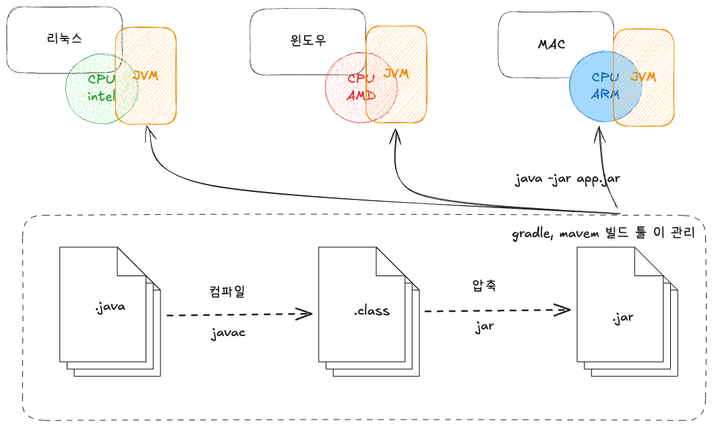
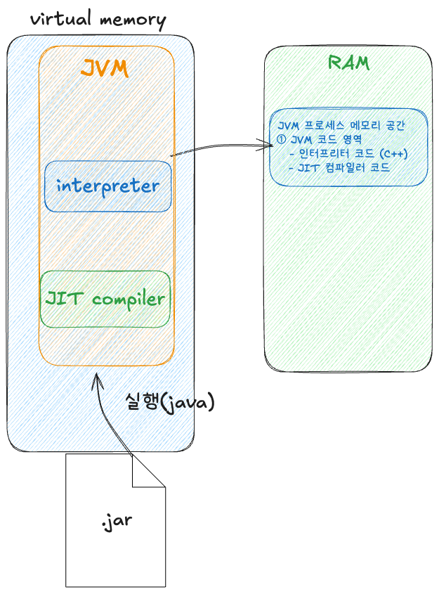
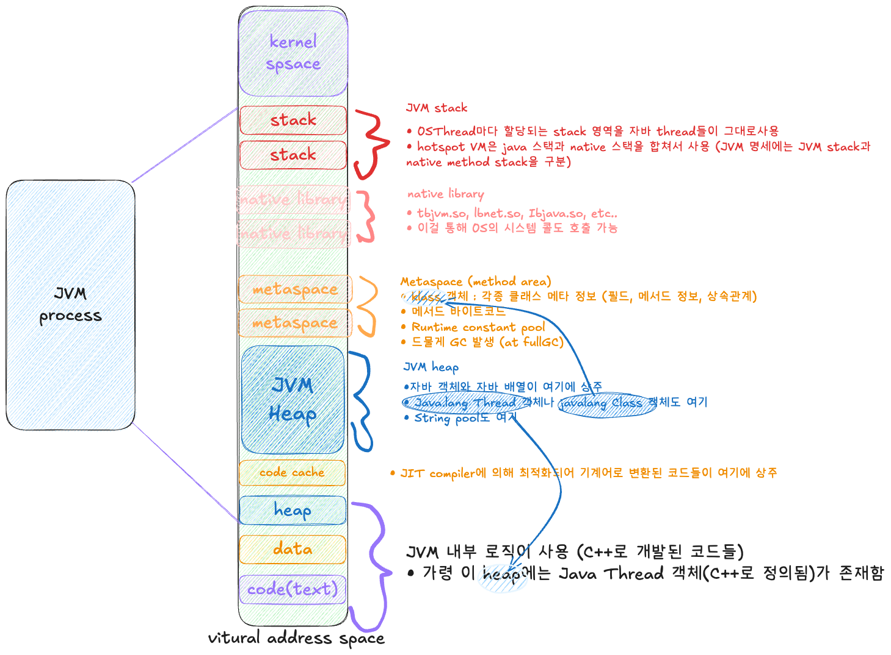

JVM을 실행할 수 있는 환경이라면 어디든지 jar 파일을 동작시킬 수 있습니다. JVM은 바이트코드를 해석하거나 실행할 수 있는 실행 파일이기 때문입니다.

## 프로세스로 실행되는 건 jar 파일인가 java 실행 파일인가?

```
myapp.jar = 특수한 형태의 ZIP 압축 파일
├── META-INF/
│   └── MANIFEST.MF (메타정보)
├── com/example/
│   ├── Main.class (컴파일된 바이트코드)
│   └── Service.class
└── application.properties
```

```
# 이렇게 실행하면
java -jar myapp.jar

# 실제로는 이런 일이 벌어집니다
/usr/bin/java  ← 이게 실행 파일이고 프로세스가 됨
```

## /bin/java 실행 후 우리가 작성한 Main.class까지 접근하는 방법

```cpp
// 1. 진입점: java 명령어 실행
JNIEXPORT int main(int argc, char **argv) {
    return JLI_Launch(argc, argv, ...);  
}

// 2. JLI_Launch 내부에서 플랫폼별 처리 후
int CallJavaMainInNewThread(jlong stack_size, void* args) { 
    // 새로운 스레드 생성 (필요 시)
    if (pthread_create(&tid, &attr, ThreadJavaMain, args) == 0) {
        // 성공: 새 스레드에서 JavaMain 실행
        pthread_join(tid, &res);
    } else {
        // 실패: 현재 스레드에서 JavaMain 실행
        rslt = JavaMain(args);
    }
}

// 3. 실제 Java 실행 로직
int JavaMain(void* _args) {
    // ① JVM 초기화
    if (!InitializeJVM(&vm, &env, &ifn)) {
        // 실패 처리
    }
    
    // InitializeJVM 내부:
    result = JNI_CreateJavaVM(&vm, (void**)&env, &args);
        ↓
    // hotspot/share/prims/jni.cpp
    jint JNI_CreateJavaVM(JavaVM **vm, void **penv, void *args) {
        result = Threads::create_vm(
            (JavaVMInitArgs*) args, 
            &can_try_again
        );
    }
        ↓
    // Threads::create_vm 내부에서
    JavaThread* main_thread = JavaThread::create_system_thread_object(...);
    
    // ② Main 클래스 로딩
    mainClass = LoadMainClass(env, mode, what);
    // 예: "com.example.Application" 클래스 찾기
    
    // ③ main 메서드 ID 가져오기
    mainID = (*env)->GetStaticMethodID(env, mainClass, 
                                       "main", 
                                       "([Ljava/lang/String;)V");
    
    // ④ main 메서드 호출
    (*env)->CallStaticVoidMethod(env, mainClass, mainID, mainArgs);
    // 또는
    // ret = invokeStaticMainWithoutArgs(env, mainClass);
    
    return 0;
}
```

## Kernel Thread, OS Thread, JVM Thread, java.lang.Thread의 관계 부연설명

### 1:1:1:1 관계

```java
// Java 코드
Thread thread = new Thread(() -> {
    System.out.println("Hello");
});
thread.start();  // ← 여기서 1:1:1:1 매핑 발생
```

### 실제 매핑 과정

```
Java 레벨
    java.lang.Thread 객체 생성
    thread.start() 호출
         ↓
JVM 레벨 (C++)
    JavaThread 객체 생성 (JVM 내부)
    os::create_thread() 호출
         ↓
OS 레벨
    pthread_create() 호출 (Linux/macOS)
    CreateThread() 호출 (Windows)
    → OS Thread 생성
         ↓
Kernel 레벨
    Kernel Thread (Light Weight Process) 생성
    → CPU 스케줄링 대상
```

**각 레벨별 역할**

```c
// Linux 커널 내부
struct task_struct {
    pid_t pid;           // 프로세스 ID
    pid_t tgid;          // 스레드 그룹 ID
    // CPU 스케줄링 정보
    // 메모리 관리 정보
};
```

- **CPU 스케줄러가 직접 관리하는 실행 단위**입니다.
- 실제로 CPU 코어에 할당되어 실행됩니다.
- Context Switching의 주체입니다.

**OS Thread (운영체제 스레드)**

```c
// POSIX pthread (Linux/macOS)
pthread_t thread;
pthread_create(&thread, NULL, thread_func, arg);

// Windows
HANDLE hThread;
hThread = CreateThread(NULL, 0, thread_func, arg, 0, NULL);
```

- **OS가 제공하는 스레드 API**입니다.
- 실제로는 Kernel Thread를 래핑한 것입니다.
- 보통 1:1로 대응됩니다.

**JVM Thread (JavaThread 객체)**

```cpp
// hotspot/share/runtime/thread.hpp
class JavaThread: public Thread {
private:
    JavaFrameAnchor _anchor;  // Java 스택 프레임
    oop _threadObj;           // java.lang.Thread 객체 참조
    OSThread* _osthread;      // OS Thread 정보
};
```

- **JVM 내부 C++ 객체**입니다.
- Java 스택, PC 레지스터 등을 관리합니다.
- OS Thread와 1:1로 매핑됩니다 (Platform Thread).

**java.lang.Thread**

```java
public class Thread implements Runnable {
    private volatile String name;
    private int priority;
    private ThreadGroup group;
    private Runnable target;
    
    private long eetop;  // JVM의 JavaThread 포인터
}
```

- **개발자가 사용하는 Java 객체**입니다.
- JVM의 JavaThread와 1:1로 대응됩니다.

### 직접 확인 방법

```java
public class ThreadMapping {
    public static void main(String[] args) throws Exception {
        // Platform Thread 생성
        Thread t1 = new Thread(() -> {
            System.out.println("Platform Thread ID: " + 
                Thread.currentThread().threadId());
            
            // 10초 대기 (관찰 시간 확보)
            try { Thread.sleep(10000); } 
            catch (Exception e) {}
        }, "MyThread-1");
        
        t1.start();
        
        // JVM 프로세스 PID 출력
        System.out.println("PID: " + ProcessHandle.current().pid());
        
        t1.join();
    }
}
```

```java
# 1. 실행
java ThreadMapping &

# 2. OS Thread 확인
ps -eLf | grep 12345
# user 12345 1234 12346 ... java (메인)
# user 12345 1234 12347 ... MyThread-1 만든 스레드

# 3. Kernel Thread 확인
ls -l /proc/12345/task/

# 4. JVM 내부 확인
jstack 12345 | grep "MyThread-1"
```

결과: **nid (native thread id) = 12347 = OS Thread ID = Kernel Thread ID**입니다.

## VM이 바이트코드를 실행하는 두 가지 흐름

**1. Interpreter (인터프리터)**

**바이트코드를 한 줄씩 해석해서 실행합니다.**

- 바이트코드를 한 줄씩 읽으면서 각 명령어에 정의된 동작을 내부 코드로 실행하는 방식입니다.
- `java` 명령으로 프로그램을 실행하면 기본적으로 인터프리터가 바이트코드를 해석하며 실행합니다.

```java
public class Main {
      public static void main (String[] args) {
      superAmazingPopularMethod();
}

public static void superAmazingPopularMethod) {
      int a = 10;
      int b = a + 7;
      //
      ....
}
```

```java
public static void main(java.lang. String[]);
  Code:
    0: invokestatic
    3: return
    #7
public static void superAmazingPopularMethod);
  Code:
    0: bipush
    2: istore_0
    3: iload_0
    4: bipush
    6: iadd
    7: istore_1
    8: return
```

**2. JIT Compiler (Just-In-Time 컴파일러)**

**자주 사용되는 코드를 기계어로 컴파일해서 성능을 최적화합니다.**

- 바이트코드 중 자주 호출되는 메서드나 반복문(loop) 블록을 감지합니다.
- 해당 코드를 최적화된 네이티브 기계어로 컴파일하여 Code Cache에 저장합니다.
- 이후 같은 코드를 실행할 때는 컴파일된 기계어를 직접 호출하여 빠르게 실행합니다.

인터프리터 언어로 동작하다가 자주 호출되는 영역(hotspot)은 JIT compiler를 통해 기계어로 컴파일하여, 그 기계어가 직접 실행되도록 하는 방식의 VM을 HotSpot VM이라고 합니다.



## JVM 클래스 로딩: RAM에 한번에 다 올라갈까?

### 아니요, 필요한 것만 점진적으로 로딩됩니다

JAR 파일 안의 모든 클래스가 한번에 RAM으로 올라가는 것이 **아닙니다**. JVM은 **필요한 시점에 필요한 클래스만** 로딩하는 lazy loading 방식을 사용합니다.

---

### 1. 클래스 로딩의 전체 흐름

```
[JAR 파일 (디스크)]
    ↓
[ClassLoader가 필요시점에 읽기]
    ↓
[Metaspace (RAM)에 Klass 객체 생성]
    ↓
[Java Heap (RAM)에 Class 객체 생성]
    ↓
[바이트코드 실행 가능]
```

#### 1단계: 애플리케이션 시작

```java
public class Application {
    public static void main(String[] args) {
        // 이 시점: Application 클래스만 로딩됨
        // 다른 클래스들은 아직 디스크(JAR)에만 존재
    }
}
```

#### 2단계: 실행 중 클래스 필요 시점

```java
public void processOrder() {
    // 이 코드를 만나는 순간 OrderService가 로딩됨
    OrderService service = new OrderService();

    // 이 코드를 만나는 순간 ArrayList가 로딩됨
    List<String> items = new ArrayList<>();
}
```

---

### 2. Lazy Loading의 구체적 동작

#### 예시: 실제 애플리케이션 시나리오

```java
@SpringBootApplication
public class EcommerceApplication {
    public static void main(String[] args) {
        // 1. main 실행: EcommerceApplication 클래스 로딩
        SpringApplication.run(EcommerceApplication.class, args);
        // 2. Spring 초기화: 필요한 Spring 클래스들 순차 로딩
    }
}

@RestController
public class OrderController {
    // 3. 첫 HTTP 요청 도착 시점: OrderController 로딩

    @GetMapping("/orders")
    public List<Order> getOrders() {
        // 4. 이 메서드 실행 시점: Order, ArrayList 등 로딩
        return orderService.findAll();
    }
}

@Service
public class FraudDetectionService {
    // 5. 실제로 사기 탐지가 호출될 때:
    //    FraudDetectionService 로딩
    public boolean isFraud(Transaction tx) {
        // 6. Redis 접근 시점: Redis 관련 클래스들 로딩
        return redisTemplate.hasKey("fraud:" + tx.getId());
    }
}
```

#### 로딩 위치별 구분

```java
// 우리 코드 → JAR 파일에서 로딩
new ProductService();
// → /app/myapp.jar 에서 읽음

// JDK 기본 클래스 → Java 모듈에서 로딩
new ArrayList<>();
// → $JAVA_HOME/lib/modules 에서 읽음

// 외부 라이브러리 → 의존성 JAR에서 로딩
new ObjectMapper();
// → jackson-databind.jar 에서 읽음
```

---

### 3. 왜 문제가 될까?

#### 저장 장치별 속도 비교

```
CPU Cache:  ~1 ns
RAM:        ~100 ns
SSD:        ~100,000 ns (1,000배 느림)
HDD:        ~10,000,000 ns (100,000배 느림)
```

#### 실제 시나리오: 첫 요청이 느린 이유

```java
// 배포 직후 첫 번째 사용자 요청
@GetMapping("/fraud-check")
public FraudResult checkFraud(@RequestBody Transaction tx) {
    // ❌ 문제: 이 시점에 FraudDetectionService가 로딩 안됨
    // → 디스크에서 클래스 파일 읽기 (느림!)
    // → Metaspace에 로딩 (메모리 할당)
    // → 바이트코드 검증
    // → 실제 메서드 실행

    return fraudService.analyze(tx); // 총 수백 ms 소요
}

// 두 번째 이후 요청
// ✅ 이미 RAM에 로딩됨 → 빠름! (수십 ms)
```

#### 타이밍 비교

```
첫 요청 (Cold Start):
├─ 클래스 로딩: 200ms
├─ JIT 컴파일: 100ms
└─ 실제 로직: 50ms
총: 350ms ❌

두 번째 요청 이후 (Warm):
└─ 실제 로직: 50ms
총: 50ms ✅
```

---

### 4. 해결책: Warm-up

#### 배포 시나리오

```bash
# 1. 새 인스턴스 배포
kubectl rollout restart deployment/api-server

# 2. Pod 시작됨 (클래스 거의 안 로딩된 상태)
# 3. ❌ 바로 트래픽 받으면?
#    → 첫 요청들이 느림 (고객 불만)

# 4. ✅ Warm-up 실행
curl http://localhost:8080/actuator/health
curl http://localhost:8080/api/orders?page=1
curl http://localhost:8080/api/fraud-check/test

# 5. 주요 클래스들 RAM에 로딩 완료
# 6. 이제 실제 트래픽 받기 시작
```

---

### 5. 메모리 구조 정리

```
[Metaspace - Native Memory]
├─ Klass 객체 (클래스 메타데이터)
│  ├─ 필드 정보
│  ├─ 메서드 정보
│  └─ 바이트코드
│
[Java Heap - JVM Memory]
├─ Class 객체 (java.lang.Class 인스턴스)
│  └─ 리플렉션에서 사용
│
└─ 실제 객체 인스턴스들
   ├─ new OrderService()
   └─ new ArrayList<>()
```

#### 실제 로딩 예시

```java
// 이 한 줄이 실행될 때:
OrderService service = new OrderService();

// 내부적으로:
// 1. ClassLoader가 OrderService.class 파일을 JAR에서 읽음
// 2. Metaspace에 Klass 객체 생성 (메타데이터)
// 3. Heap에 Class 객체 생성 (OrderService.class)
// 4. Heap에 인스턴스 생성 (service 변수가 가리킴)
```

---

### 요약

| 항목 | 설명 |
| --- | --- |
| **로딩 방식** | Lazy Loading (필요할 때만) |
| **로딩 위치** | JAR (우리 코드) / modules (JDK) |
| **저장 공간** | Metaspace (메타데이터) + Heap (Class 객체) |
| **성능 이슈** | 첫 요청이 느림 (디스크 I/O) |
| **해결 방법** | Warm-up 실행 (배포 직후) |

모든 클래스를 한번에 로딩하면 메모리 낭비와 시작 시간 증가로 이어지므로, JVM은 필요한 시점에만 로딩합니다. 하지만 첫 로딩이 느려서 초기 요청 성능이 떨어지므로, 배포 후 warm-up으로 주요 클래스를 미리 로딩해 두어야 합니다.

#### JVM 프로세스 메모리 구조



참고 영상: [GC 2부: GC 공부를 위해 알아야할 JVM 지식](https://www.youtube.com/watch?v=NFwYJnvUFzI&list=PLcXyemr8ZeoSUPUhwqtxe1oztltsJhxBY&index=4)
