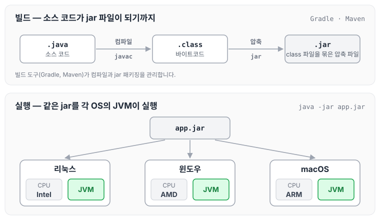
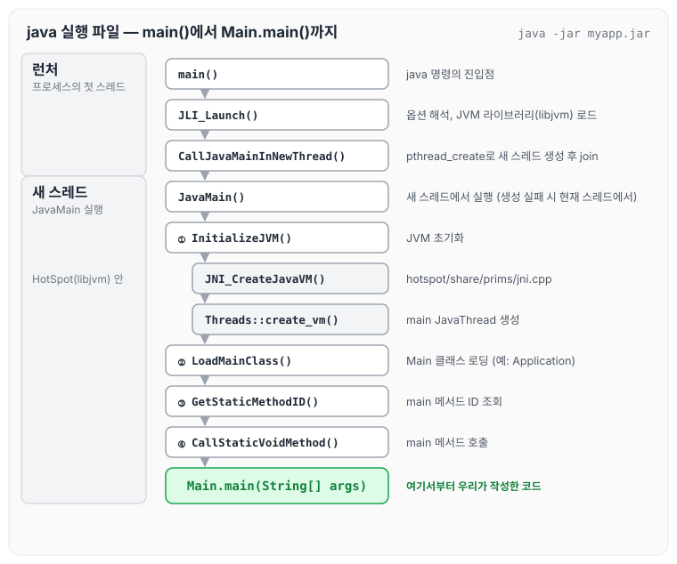
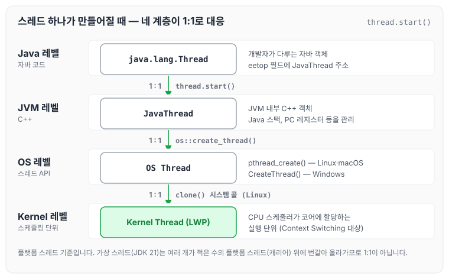
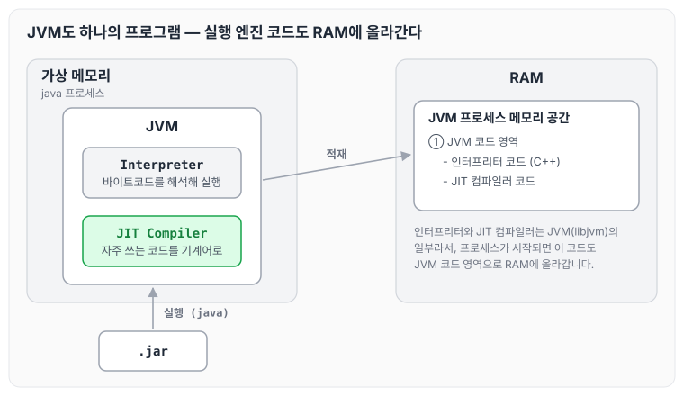
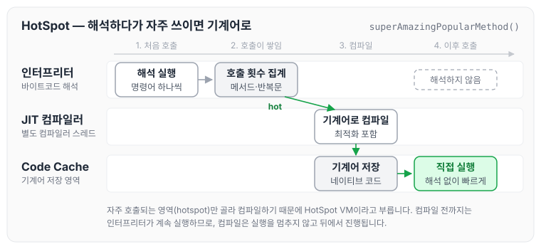
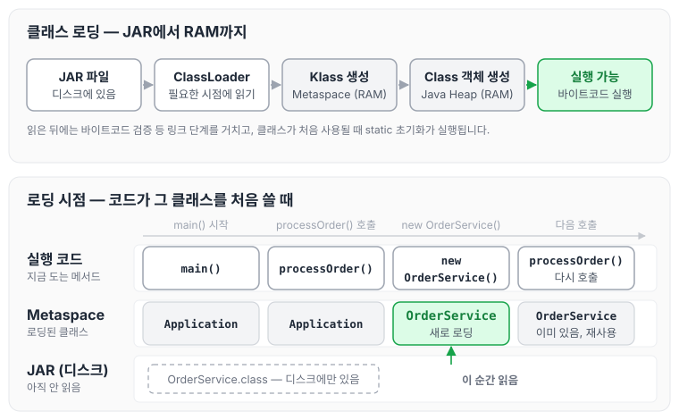
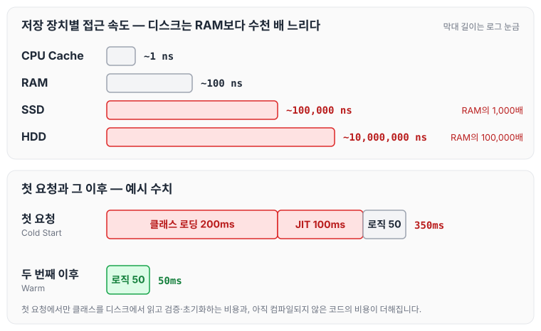
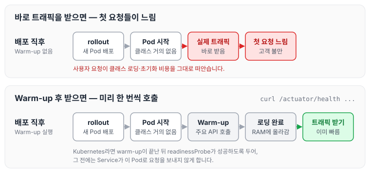
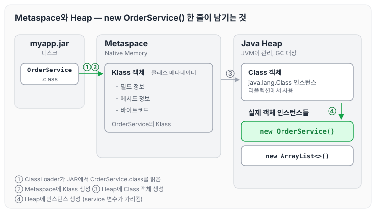
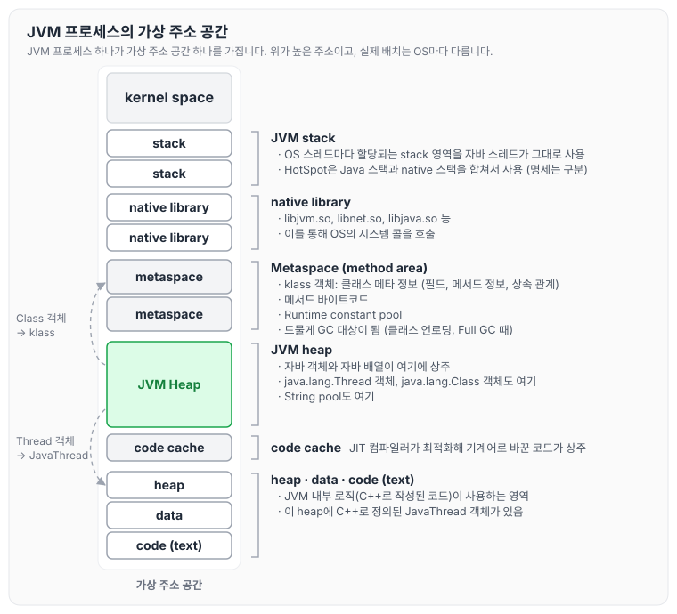

이전에 [GC를 이해하기 위한 OS 기초: 프로세스와 스레드](../gc-os-basics/)에 대해 작성하였습니다. 그 글에서는 OS가 프로세스와 스레드, 메모리를 어떻게 다루는지 정리했는데, 이번 글에서는 그 위에서 JVM이 어떻게 실행되는지를 이어서 정리하겠습니다.

다루는 내용은 아래와 같습니다.

- jar 파일을 실행하면 실제로 프로세스가 되는 것은 무엇인지
- java 실행 파일이 우리가 작성한 `main` 메서드를 호출하기까지의 과정
- `java.lang.Thread`와 JVM·OS·커널 스레드의 관계
- 바이트코드를 실행하는 인터프리터와 JIT 컴파일러
- 클래스가 RAM에 언제, 어디에 올라가는지와 첫 요청이 느린 이유

## 자바 코드가 어디서든 실행되는 이유

JVM을 실행할 수 있는 환경이라면 어디든지 jar 파일을 동작시킬 수 있습니다. JVM은 바이트코드를 해석하거나 실행할 수 있는 실행 파일이기 때문입니다.

빌드 단계에서 `.java` 소스는 `javac`로 컴파일되어 `.class` 바이트코드가 되고, 여러 `.class` 파일과 설정 파일을 묶어 `.jar`로 압축합니다. 이 과정은 보통 Gradle, Maven 같은 빌드 도구가 관리합니다. 바이트코드는 특정 CPU의 기계어가 아니기 때문에, 같은 jar를 리눅스(Intel), 윈도우(AMD), macOS(ARM) 어디에서든 그 환경용으로 만들어진 JVM이 실행할 수 있습니다.



그림에서 jar는 하나이고, OS와 CPU마다 다른 것은 JVM 쪽이라는 점을 확인할 수 있습니다.

## 프로세스로 실행되는 것은 jar 파일인가, java 실행 파일인가

jar 파일은 아래와 같은 구조를 가진 특수한 형태의 ZIP 압축 파일입니다.

```text
myapp.jar = 특수한 형태의 ZIP 압축 파일
├── META-INF/
│   └── MANIFEST.MF (메타정보)
├── com/example/
│   ├── Main.class (컴파일된 바이트코드)
│   └── Service.class
└── application.properties
```

jar 자체는 실행 파일이 아니라 데이터입니다. `java -jar`로 실행하면 프로세스가 되는 것은 `java` 실행 파일이고, `java`가 jar를 열어 `MANIFEST.MF`에 적힌 Main 클래스를 찾아 실행합니다.

```bash
# 이렇게 실행하면
java -jar myapp.jar

# 실제로는 이런 일이 벌어집니다
/usr/bin/java  ← 이게 실행 파일이고 프로세스가 됨
```

## java 실행 파일이 Main.class의 main을 호출하기까지

`/usr/bin/java`가 실행된 뒤 우리가 작성한 `Main` 클래스의 `main` 메서드까지 도달하는 순서를 그림으로 먼저 보면 아래와 같습니다.



런처는 `JLI_Launch`에서 옵션을 해석하고 JVM 라이브러리(`libjvm`)를 불러온 뒤, `pthread_create`로 새 스레드를 만들어 그 스레드에서 `JavaMain`을 실행합니다. 새 스레드를 만드는 이유는 `-Xss` 같은 옵션으로 정한 스택 크기를 main 스레드에 적용하기 위해서이고, 스레드 생성에 실패하면 현재 스레드에서 그대로 실행합니다. `JavaMain`은 JVM을 초기화하고, Main 클래스를 로딩한 다음, `main` 메서드를 찾아 호출합니다.

JDK 런처 코드의 흐름을 간추리면 아래와 같습니다.

```cpp
// 1. 진입점: java 명령어 실행
JNIEXPORT int main(int argc, char **argv) {
    return JLI_Launch(argc, argv, ...);  
}

// 2. JLI_Launch 내부에서 플랫폼별 처리 후
int CallJavaMainInNewThread(jlong stack_size, void* args) { 
    // 새로운 스레드 생성 (필요 시)
    if (pthread_create(&tid, &attr, ThreadJavaMain, args) == 0) {
        // 성공: 새 스레드에서 JavaMain 실행
        pthread_join(tid, &res);
    } else {
        // 실패: 현재 스레드에서 JavaMain 실행
        rslt = JavaMain(args);
    }
}

// 3. 실제 Java 실행 로직
int JavaMain(void* _args) {
    // ① JVM 초기화
    if (!InitializeJVM(&vm, &env, &ifn)) {
        // 실패 처리
    }
    
    // InitializeJVM 내부:
    result = JNI_CreateJavaVM(&vm, (void**)&env, &args);
        ↓
    // hotspot/share/prims/jni.cpp
    jint JNI_CreateJavaVM(JavaVM **vm, void **penv, void *args) {
        result = Threads::create_vm(
            (JavaVMInitArgs*) args, 
            &can_try_again
        );
    }
        ↓
    // Threads::create_vm 내부에서
    JavaThread* main_thread = JavaThread::create_system_thread_object(...);
    
    // ② Main 클래스 로딩
    mainClass = LoadMainClass(env, mode, what);
    // 예: "com.example.Application" 클래스 찾기
    
    // ③ main 메서드 ID 가져오기
    mainID = (*env)->GetStaticMethodID(env, mainClass, 
                                       "main", 
                                       "([Ljava/lang/String;)V");
    
    // ④ main 메서드 호출
    (*env)->CallStaticVoidMethod(env, mainClass, mainID, mainArgs);
    // 또는
    // ret = invokeStaticMainWithoutArgs(env, mainClass);
    
    return 0;
}
```

①에서 `JNI_CreateJavaVM` → `Threads::create_vm`으로 이어지는 부분이 HotSpot(`libjvm`) 안에서 실행되는 JVM 초기화이고, 이때 main 스레드에 대응하는 `JavaThread`가 만들어집니다. ②~④는 다시 런처 코드로 돌아와 JNI 함수로 Main 클래스와 `main` 메서드를 다루는 부분입니다.

## Kernel Thread, OS Thread, JVM Thread, java.lang.Thread의 관계

### 1:1:1:1 관계

자바 코드에서 스레드를 만들고 `start()`를 호출하면, 자바 객체 하나에 JVM 내부 객체, OS 스레드, 커널의 실행 단위가 하나씩 대응됩니다.

```java
// Java 코드
Thread thread = new Thread(() -> {
    System.out.println("Hello");
});
thread.start();  // ← 여기서 1:1:1:1 매핑 발생
```

이 1:1:1:1 관계는 `new Thread()`로 만드는 플랫폼 스레드 기준입니다. JDK 21에 정식 도입된 가상 스레드(Virtual Thread)는 여러 개의 가상 스레드가 적은 수의 플랫폼 스레드(캐리어 스레드) 위에 번갈아 올라가 실행되므로, OS 스레드와 1:1로 대응하지 않습니다.

### 실제 매핑 과정

`thread.start()`부터 커널에 실행 단위가 만들어지기까지의 과정은 아래와 같습니다.



Java 레벨의 `java.lang.Thread`에서 `start()`를 호출하면 JVM은 내부 C++ 객체인 `JavaThread`를 만들고 `os::create_thread()`를 호출합니다. 이 함수는 Linux·macOS에서는 `pthread_create()`, Windows에서는 `CreateThread()`로 OS 스레드를 만들고, 커널에는 CPU 스케줄링 대상이 되는 실행 단위(Light Weight Process)가 생깁니다. Linux에서는 `pthread_create()`가 내부적으로 `clone()` 시스템 콜을 사용합니다.

### 각 레벨의 역할

**Kernel Thread**

```c
// Linux 커널 내부
struct task_struct {
    pid_t pid;           // 프로세스 ID
    pid_t tgid;          // 스레드 그룹 ID
    // CPU 스케줄링 정보
    // 메모리 관리 정보
};
```

- CPU 스케줄러가 직접 관리하는 실행 단위입니다.
- 실제로 CPU 코어에 할당되어 실행됩니다.
- Context Switching의 주체입니다.

Linux에서는 스레드마다 `task_struct`가 하나씩 있습니다. 이때 `pid`에는 스레드마다 다른 값(스레드 ID)이 들어가고, 같은 프로세스의 스레드들은 같은 `tgid`를 가집니다. 사용자 공간에서 보는 프로세스 ID는 이 `tgid`입니다. 또한 이 글에서 말하는 Kernel Thread는 커널이 스케줄링하는 실행 단위를 뜻하며, 커널 내부 작업만 하는 커널 전용 스레드(`kthreadd` 등)와는 다른 것입니다.

**OS Thread (운영체제 스레드)**

```c
// POSIX pthread (Linux/macOS)
pthread_t thread;
pthread_create(&thread, NULL, thread_func, arg);

// Windows
HANDLE hThread;
hThread = CreateThread(NULL, 0, thread_func, arg, 0, NULL);
```

- OS가 제공하는 스레드 API입니다.
- 실제로는 Kernel Thread를 래핑한 것입니다.
- 보통 1:1로 대응됩니다. Linux의 pthread 구현(NPTL)이 1:1 방식입니다.

**JVM Thread (JavaThread 객체)**

```cpp
// hotspot/share/runtime/thread.hpp
class JavaThread: public Thread {
private:
    JavaFrameAnchor _anchor;  // Java 스택 프레임
    oop _threadObj;           // java.lang.Thread 객체 참조
    OSThread* _osthread;      // OS Thread 정보
};
```

- JVM 내부 C++ 객체입니다.
- Java 스택, PC 레지스터 등을 관리합니다.
- OS Thread와 1:1로 매핑됩니다 (Platform Thread).

**java.lang.Thread**

```java
public class Thread implements Runnable {
    private volatile String name;
    private int priority;
    private ThreadGroup group;
    private Runnable target;
    
    private long eetop;  // JVM의 JavaThread 포인터
}
```

- 개발자가 사용하는 Java 객체입니다.
- JVM의 JavaThread와 1:1로 대응됩니다. `eetop` 필드에 JavaThread의 주소가 들어 있습니다.

### 직접 확인하는 방법

아래 코드는 스레드를 하나 만들어 10초 동안 대기시키고, 그 사이에 JVM 프로세스의 PID를 출력합니다.

```java
public class ThreadMapping {
    public static void main(String[] args) throws Exception {
        // Platform Thread 생성
        Thread t1 = new Thread(() -> {
            System.out.println("Platform Thread ID: " + 
                Thread.currentThread().threadId());
            
            // 10초 대기 (관찰 시간 확보)
            try { Thread.sleep(10000); } 
            catch (Exception e) {}
        }, "MyThread-1");
        
        t1.start();
        
        // JVM 프로세스 PID 출력
        System.out.println("PID: " + ProcessHandle.current().pid());
        
        t1.join();
    }
}
```

출력되는 `threadId()`(JDK 19부터 제공)는 자바가 매기는 스레드 ID라서 OS 스레드 ID와는 다른 값입니다. OS 쪽 ID는 아래 명령어로 확인합니다. 예시의 `12345`는 위 코드가 출력한 PID라고 가정하였고, `ps -eLf`와 `/proc`은 Linux 기준입니다.

```bash
# 1. 실행
java ThreadMapping &

# 2. OS Thread 확인
ps -eLf | grep 12345
# user 12345 1234 12346 ... java (메인)
# user 12345 1234 12347 ... MyThread-1 만든 스레드

# 3. Kernel Thread 확인
ls -l /proc/12345/task/

# 4. JVM 내부 확인
jstack 12345 | grep "MyThread-1"
```

결과: nid (native thread id) = 12347 = OS Thread ID = Kernel Thread ID입니다.

`ps -eLf`의 LWP 열, `/proc/<PID>/task/` 아래의 디렉터리 이름, `jstack`이 출력하는 `nid`가 모두 같은 값을 가리킵니다. JDK 버전에 따라 `nid`가 `0x303b`처럼 16진수로 출력되기도 하므로, 그때는 10진수로 바꿔 비교하면 됩니다.

## JVM이 바이트코드를 실행하는 두 가지 방식

JVM 안에서 바이트코드를 실행하는 방식은 인터프리터와 JIT 컴파일러 두 가지입니다. 둘 다 JVM(`libjvm`)의 일부이기 때문에, `java`로 jar를 실행하면 프로세스의 메모리 공간 중 JVM 코드 영역에 함께 올라갑니다.



### 인터프리터

인터프리터는 바이트코드를 한 줄씩 해석해서 실행합니다.

- 바이트코드를 한 줄씩 읽으면서 각 명령어에 정의된 동작을 내부 코드로 실행하는 방식입니다.
- `java` 명령으로 프로그램을 실행하면 기본적으로 인터프리터가 바이트코드를 해석하며 실행합니다.

예를 들어 아래와 같은 코드가 있습니다.

```java
public class Main {
      public static void main (String[] args) {
      superAmazingPopularMethod();
}

public static void superAmazingPopularMethod) {
      int a = 10;
      int b = a + 7;
      //
      ....
}
```

이 코드를 컴파일한 바이트코드를 `javap -c`로 보면 아래와 같은 명령어들이 나옵니다. 인터프리터는 이 명령어를 하나씩 읽어 실행합니다.

```text
public static void main(java.lang. String[]);
  Code:
    0: invokestatic
    3: return
    #7
public static void superAmazingPopularMethod);
  Code:
    0: bipush
    2: istore_0
    3: iload_0
    4: bipush
    6: iadd
    7: istore_1
    8: return
```

### JIT 컴파일러

JIT(Just-In-Time) 컴파일러는 자주 사용되는 코드를 기계어로 컴파일해서 성능을 최적화합니다.

- 바이트코드 중 자주 호출되는 메서드나 반복문(loop) 블록을 감지합니다.
- 해당 코드를 최적화된 네이티브 기계어로 컴파일하여 Code Cache에 저장합니다.
- 이후 같은 코드를 실행할 때는 컴파일된 기계어를 직접 호출하여 빠르게 실행합니다.

인터프리터 언어로 동작하다가 자주 호출되는 영역(hotspot)은 JIT 컴파일러를 통해 기계어로 컴파일하여, 그 기계어가 직접 실행되도록 하는 방식의 VM을 HotSpot VM이라고 합니다. 위 예제의 `superAmazingPopularMethod()`가 여러 번 호출될 때의 흐름은 아래와 같습니다.



JVM은 메서드 호출 횟수와 반복문이 도는 횟수를 세다가 기준을 넘으면 그 메서드를 컴파일 대상으로 정합니다. 컴파일은 별도의 컴파일러 스레드에서 진행되고, 끝나기 전까지는 인터프리터가 계속 실행합니다. HotSpot은 JDK 8부터 빠르게 컴파일하는 C1과 더 최적화하는 C2를 단계적으로 쓰는 계층형 컴파일(Tiered Compilation)을 기본으로 사용합니다.

## JVM 클래스 로딩: RAM에 한 번에 다 올라갈까

JAR 파일 안의 모든 클래스가 한 번에 RAM으로 올라가는 것은 아닙니다. JVM은 필요한 시점에 필요한 클래스만 로딩하는 lazy loading 방식을 사용합니다.

### 클래스 로딩의 전체 흐름

클래스가 디스크의 JAR에서 RAM으로 올라가 실행되기까지의 흐름과, 그 시점이 언제인지를 그림으로 보면 아래와 같습니다.



ClassLoader가 필요한 시점에 JAR에서 클래스 파일을 읽으면, Metaspace(RAM)에 클래스 메타데이터인 Klass 객체가 만들어지고, Java Heap(RAM)에는 그 클래스를 가리키는 `Class` 객체가 만들어집니다. 그 뒤에 바이트코드를 실행할 수 있습니다.

조금 더 자세히 보면 클래스는 로딩(Loading) → 링크(Linking: 검증, 준비, 해석) → 초기화(Initialization) 단계를 거칩니다. JVM 명세는 로딩 시점을 구현에 맡기지만, 초기화(static 블록 실행)는 `new`나 static 메서드 호출처럼 클래스를 처음 사용할 때 하도록 정해 두었습니다. HotSpot은 대부분의 클래스를 처음 참조될 때 로딩합니다.

**1단계: 애플리케이션 시작**

```java
public class Application {
    public static void main(String[] args) {
        // 이 시점: Application 클래스만 로딩됨
        // 다른 클래스들은 아직 디스크(JAR)에만 존재
    }
}
```

이 주석은 우리가 작성한 클래스 기준입니다. JVM이 시작될 때 `java.lang.Object`, `String` 같은 JDK 핵심 클래스는 이미 수백 개가 로딩되어 있습니다.

**2단계: 실행 중 클래스가 필요한 시점**

```java
public void processOrder() {
    // 이 코드를 만나는 순간 OrderService가 로딩됨
    OrderService service = new OrderService();

    // 이 코드를 만나는 순간 ArrayList가 로딩됨
    List<String> items = new ArrayList<>();
}
```

`ArrayList`처럼 JDK 내부에서도 자주 쓰는 클래스는 JVM 시작 과정에서 이미 로딩되어 있는 경우가 많습니다. 실제로 어떤 클래스가 언제 로딩되는지는 `java -Xlog:class+load -jar myapp.jar`(JDK 9 이상)로 실행하면 로그로 확인할 수 있습니다.

### Lazy Loading의 구체적 동작

**예시: 실제 애플리케이션 시나리오**

Spring Boot 애플리케이션에서는 아래와 같은 순서로 클래스가 로딩됩니다.

```java
@SpringBootApplication
public class EcommerceApplication {
    public static void main(String[] args) {
        // 1. main 실행: EcommerceApplication 클래스 로딩
        SpringApplication.run(EcommerceApplication.class, args);
        // 2. Spring 초기화: 필요한 Spring 클래스들 순차 로딩
    }
}

@RestController
public class OrderController {
    // 3. 첫 HTTP 요청 도착 시점: OrderController 로딩

    @GetMapping("/orders")
    public List<Order> getOrders() {
        // 4. 이 메서드 실행 시점: Order, ArrayList 등 로딩
        return orderService.findAll();
    }
}

@Service
public class FraudDetectionService {
    // 5. 실제로 사기 탐지가 호출될 때:
    //    FraudDetectionService 로딩
    public boolean isFraud(Transaction tx) {
        // 6. Redis 접근 시점: Redis 관련 클래스들 로딩
        return redisTemplate.hasKey("fraud:" + tx.getId());
    }
}
```

**로딩 위치별 구분**

클래스는 종류에 따라 읽어 오는 위치가 다릅니다.

```java
// 우리 코드 → JAR 파일에서 로딩
new ProductService();
// → /app/myapp.jar 에서 읽음

// JDK 기본 클래스 → Java 모듈에서 로딩
new ArrayList<>();
// → $JAVA_HOME/lib/modules 에서 읽음

// 외부 라이브러리 → 의존성 JAR에서 로딩
new ObjectMapper();
// → jackson-databind.jar 에서 읽음
```

JDK 기본 클래스는 Bootstrap·Platform 클래스 로더가 `$JAVA_HOME/lib/modules`에서 읽고, 우리 코드와 외부 라이브러리는 Application 클래스 로더가 클래스패스에서 읽습니다. Spring Boot로 만든 실행 jar는 `BOOT-INF/classes`(우리 코드)와 `BOOT-INF/lib`(의존성 jar)를 Spring Boot의 클래스 로더가 읽습니다.

### 첫 요청이 느린 이유

필요할 때 로딩한다는 것은, 처음 쓰이는 순간에 디스크를 읽어야 한다는 뜻이기도 합니다. 저장 장치별 접근 속도와 첫 요청에 드는 시간을 비교하면 아래와 같습니다.



SSD는 RAM보다 약 1,000배, HDD는 약 100,000배 느립니다. 배포 직후 첫 번째 요청에서는 아래와 같은 일이 생깁니다.

```java
// 배포 직후 첫 번째 사용자 요청
@GetMapping("/fraud-check")
public FraudResult checkFraud(@RequestBody Transaction tx) {
    // ❌ 문제: 이 시점에 FraudDetectionService가 로딩 안됨
    // → 디스크에서 클래스 파일 읽기 (느림!)
    // → Metaspace에 로딩 (메모리 할당)
    // → 바이트코드 검증
    // → 실제 메서드 실행

    return fraudService.analyze(tx); // 총 수백 ms 소요
}

// 두 번째 이후 요청
// ✅ 이미 RAM에 로딩됨 → 빠름! (수십 ms)
```

그림의 시간은 예시 수치입니다. 첫 요청에서는 클래스 로딩(200ms)과 JIT 컴파일(100ms)이 실제 로직(50ms)에 더해져 350ms가 걸리고, 두 번째 요청부터는 실제 로직 50ms만 걸립니다.

다만 첫 요청이 느린 원인이 디스크 I/O만은 아닙니다. 클래스를 읽은 뒤의 검증·초기화, Spring 빈의 지연 초기화, 아직 컴파일되지 않아 인터프리터로 실행되는 시간이 함께 더해집니다. JIT 컴파일은 컴파일러 스레드에서 진행되므로 요청을 직접 멈추게 하기보다, 컴파일이 끝날 때까지 느린 인터프리터로 실행되는 시간을 늘립니다. JIT 컴파일은 메서드가 수백~수천 번 호출된 뒤에 단계적으로 일어나므로, 두 번째 요청만으로 바로 최고 속도가 나오지는 않고 요청이 쌓이면서 점점 빨라집니다.

### 해결책: Warm-up

배포 직후 실제 트래픽을 받기 전에 주요 API를 미리 호출해 두면, 필요한 클래스가 로딩되고 자주 쓰는 코드가 컴파일된 상태에서 트래픽을 받을 수 있습니다. 바로 트래픽을 받는 경우와 비교하면 아래와 같습니다.



배포 순서로 적으면 아래와 같습니다.

```bash
# 1. 새 인스턴스 배포
kubectl rollout restart deployment/api-server

# 2. Pod 시작됨 (클래스 거의 안 로딩된 상태)
# 3. ❌ 바로 트래픽 받으면?
#    → 첫 요청들이 느림 (고객 불만)

# 4. ✅ Warm-up 실행
curl http://localhost:8080/actuator/health
curl http://localhost:8080/api/orders?page=1
curl http://localhost:8080/api/fraud-check/test

# 5. 주요 클래스들 RAM에 로딩 완료
# 6. 이제 실제 트래픽 받기 시작
```

Kubernetes에서는 warm-up이 끝난 뒤에 readinessProbe가 성공하도록 구성하면, 그 전까지는 Service가 해당 Pod로 요청을 보내지 않습니다.

### 메모리 구조 정리

클래스 정보는 Metaspace와 Java Heap에 나뉘어 저장됩니다.

- Metaspace (Native Memory): Klass 객체(클래스 메타데이터) — 필드 정보, 메서드 정보, 바이트코드
- Java Heap (JVM Memory): Class 객체(`java.lang.Class` 인스턴스, 리플렉션에서 사용)와 `new OrderService()`, `new ArrayList<>()` 같은 실제 객체 인스턴스

`new OrderService()` 한 줄이 실행될 때 이 두 영역에 무엇이 만들어지는지는 아래와 같습니다.



**실제 로딩 예시**

```java
// 이 한 줄이 실행될 때:
OrderService service = new OrderService();

// 내부적으로:
// 1. ClassLoader가 OrderService.class 파일을 JAR에서 읽음
// 2. Metaspace에 Klass 객체 생성 (메타데이터)
// 3. Heap에 Class 객체 생성 (OrderService.class)
// 4. Heap에 인스턴스 생성 (service 변수가 가리킴)
```

### JVM 프로세스 메모리 구조

마지막으로 JVM 프로세스 하나의 가상 주소 공간 전체를 보면 아래와 같습니다.



영역별로 정리하면 아래와 같습니다.

- JVM stack: OS 스레드마다 할당되는 stack 영역을 자바 스레드가 그대로 사용합니다. HotSpot은 Java 스택과 native 스택을 합쳐서 사용합니다(JVM 명세에서는 JVM stack과 native method stack을 구분합니다).
- native library: `libjvm.so`, `libnet.so`, `libjava.so` 등이 올라가며, 이를 통해 OS의 시스템 콜을 호출할 수 있습니다.
- Metaspace (method area): klass 객체(필드, 메서드 정보, 상속 관계 같은 클래스 메타 정보), 메서드 바이트코드, Runtime constant pool이 있습니다. 클래스가 언로딩될 때만 정리되므로 GC 대상이 되는 일은 드뭅니다(Full GC 등).
- JVM heap: 자바 객체와 자바 배열이 상주합니다. `java.lang.Thread` 객체와 `java.lang.Class` 객체, String pool도 여기에 있습니다. `Class` 객체는 Metaspace의 klass를, `Thread` 객체는 아래 heap의 `JavaThread`를 가리킵니다.
- code cache: JIT 컴파일러가 최적화해 기계어로 바꾼 코드가 상주합니다.
- heap · data · code(text): JVM 내부 로직(C++로 작성된 코드)이 사용하는 영역입니다. 예를 들어 이 heap에는 C++로 정의된 `JavaThread` 객체가 있습니다.

오늘은 java 명령이 jar를 실행해 `main` 메서드를 호출하기까지의 과정과 자바 스레드와 OS 스레드의 매핑, 인터프리터와 JIT 컴파일러, 그리고 클래스 로딩에 대해 정리하였습니다. 클래스는 필요할 때만 JAR나 `modules`에서 읽혀 Metaspace와 Heap에 올라가므로, 모든 클래스를 한 번에 올릴 때보다 메모리와 시작 시간을 아낄 수 있습니다. 대신 첫 로딩 비용 때문에 배포 직후 요청이 느려질 수 있으니, warm-up으로 주요 클래스를 미리 로딩해 두는 것이 좋을 것 같습니다.

다음 글에서는 이 메모리 구조를 바탕으로 [GC의 역할과 튜닝 기준: Ergonomics와 JVM 기본 설정](../gc-tuning-criteria/)에 대해 정리하겠습니다.

참고 영상: [GC 2부: GC 공부를 위해 알아야할 JVM 지식](https://www.youtube.com/watch?v=NFwYJnvUFzI&list=PLcXyemr8ZeoSUPUhwqtxe1oztltsJhxBY&index=4)
