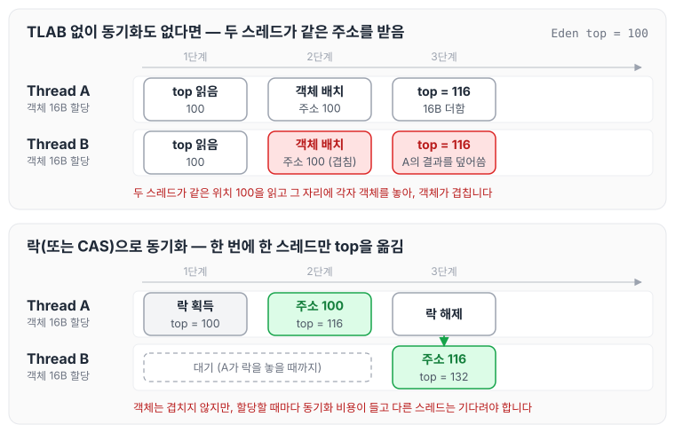
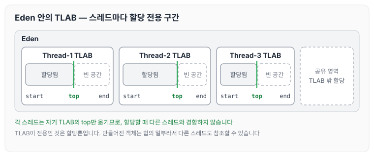
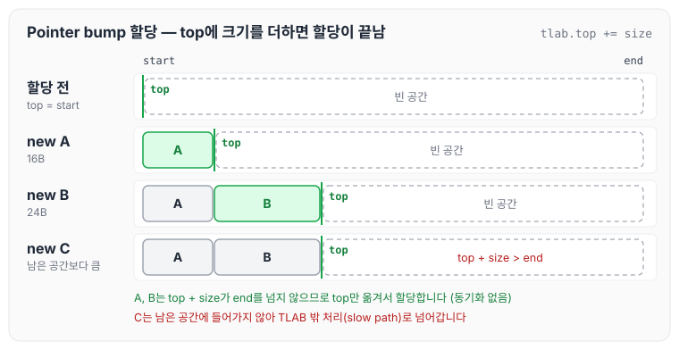
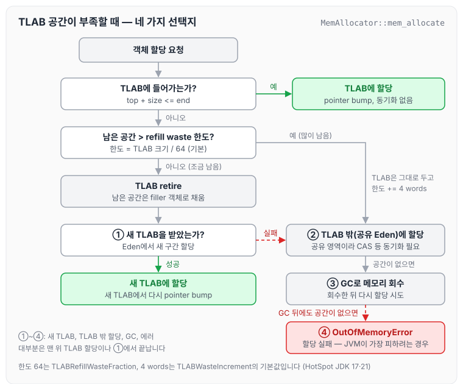
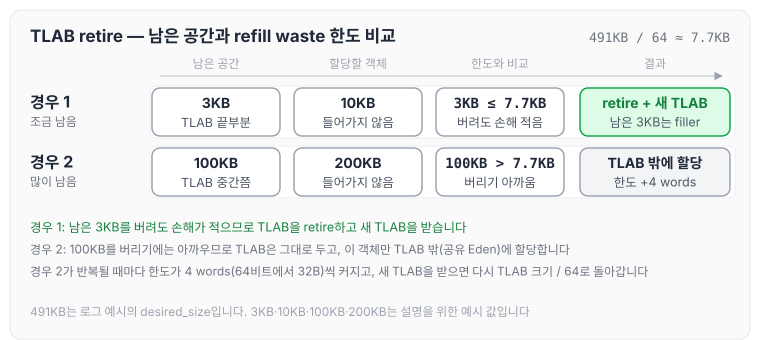
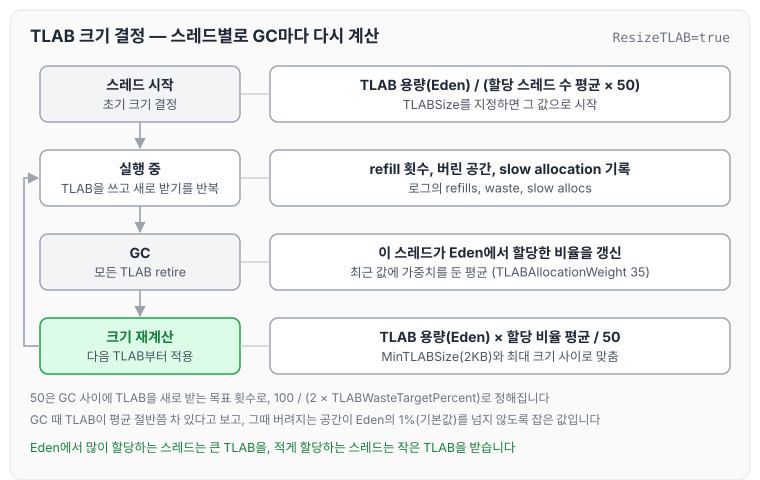
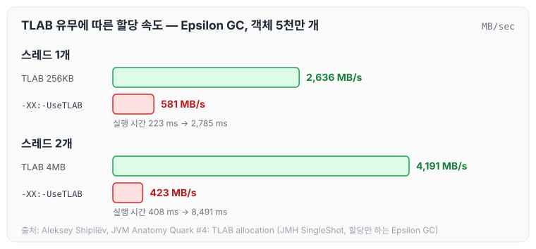

이전에 [GC의 역할과 튜닝 기준: Ergonomics와 JVM 기본 설정](../gc-tuning-criteria/)에 대해 작성하였습니다. 오늘은 그 글에서 다룬 Heap(Eden)에 객체가 할당되는 과정을 부연해서, 여러 스레드가 동시에 객체를 만들 때 JVM이 사용하는 TLAB(Thread Local Allocation Buffer)의 동작 방식과 주요 플래그에 대해 정리하도록 하겠습니다.

## TLAB이 필요한 이유

Java에서 `new` 키워드로 객체를 생성하면 JVM은 Heap 메모리에 공간을 할당합니다. 이때 객체는 Young Generation의 Eden 영역에 먼저 놓이게 됩니다.

싱글 스레드 환경에서는 문제가 없지만, 멀티 스레드 환경에서는 문제가 생깁니다. Eden에 다음 객체를 놓을 위치를 가리키는 할당 포인터(top)가 하나뿐이라면, 두 스레드가 동시에 메모리 할당을 요청했을 때 같은 메모리 블록을 받을 수 있기 때문입니다.

아래 그림의 위쪽은 동기화 없이 두 스레드가 같은 포인터 값을 읽은 경우이고, 아래쪽은 락으로 동기화한 경우입니다.



동기화가 없으면 Thread A와 Thread B가 같은 위치 100을 받아 객체가 겹칩니다. 이를 해결하는 단순한 방법은 락(Lock)이나 CAS로 동기화하는 것이지만, 그러면 할당할 때마다 동기화 비용이 들고 다른 스레드는 기다려야 합니다. Java는 객체 생성이 매우 빈번하기 때문에 이 경합이 큰 성능 병목이 됩니다.

## TLAB의 개념

TLAB(Thread Local Allocation Buffer)은 Eden 내부에서 특정 스레드에게 전용으로 할당된 영역입니다. 해당 영역에는 오직 하나의 스레드만 새 객체를 할당할 수 있으며, 각 스레드는 자신만의 TLAB을 가집니다.



각 TLAB은 시작 위치(start), 다음 객체를 놓을 위치(top), 끝 위치(end)로 관리됩니다. 스레드는 자기 TLAB의 top만 옮기므로 할당할 때 다른 스레드와 경합하지 않고, TLAB에 들어가지 않는 할당은 TLAB 밖의 공유 영역에서 처리합니다.

다만 TLAB이 전용인 것은 할당뿐입니다. TLAB 안에 만들어진 객체도 힙의 일부이기 때문에, 다른 스레드가 그 객체를 참조하거나 TLAB 밖 객체의 필드에 그 참조를 넣는 것은 자유롭습니다.

## Pointer Bump 할당

TLAB에서 가장 빈번한 정상 경로는 TLAB의 현재 커서(top)에 객체 크기를 더하고 진행하는 것입니다. 이 때문에 이 방식을 포인터 범프 할당(Pointer Bump Allocation)이라고도 합니다. HotSpot의 JIT 컴파일러는 이 경로를 생성 코드 안에 인라인으로 넣기 때문에, 대부분의 할당은 GC 코드를 호출하지 않고 끝납니다.

```java
// TLAB 내 객체 할당 의사 코드
Object allocate(size) {
    if (tlab.top + size <= tlab.end) {
        Object obj = tlab.top;
        tlab.top += size;  // 포인터만 이동! 동기화 불필요
        return obj;
    }
    // TLAB이 부족하면 다른 처리
}
```

아래 그림은 같은 TLAB에 객체 A(16B), B(24B), C를 차례로 할당하는 모습입니다.



A와 B는 `top + size`가 `end`를 넘지 않으므로 top만 옮기면 할당이 끝납니다. 각 스레드가 자신만의 영역에서만 포인터를 움직이기 때문에 이 과정에는 동기화가 전혀 필요 없습니다. C처럼 남은 공간에 들어가지 않는 객체는 다음 절의 slow path로 넘어갑니다.

Pointer bump는 할당할 공간이 연속되어 있어야 쓸 수 있습니다. 이전 글에서 살펴본 Compact 단계나 G1의 evacuation처럼 살아 있는 객체를 한쪽으로 모아 연속된 빈 공간을 만드는 과정이 이 할당 방식을 받쳐 주는 셈입니다.

## TLAB 공간이 부족할 때

객체를 할당하려는데 TLAB에 공간이 부족하면 JVM은 네 가지 선택을 할 수 있습니다.

1. 해당 스레드를 위해 새 TLAB 공간을 할당합니다.
2. TLAB 외부(공유 Eden 영역)에서 해당 객체에 대한 메모리를 할당합니다.
3. GC를 통해 메모리 회수를 시도합니다.
4. 메모리 할당에 실패하고 에러를 던집니다.

네 번째는 최악의 경우이며 JVM은 이를 최대한 피하려 합니다. HotSpot 소스(`MemAllocator`)를 기준으로 네 가지가 어떤 순서로 이어지는지 그리면 아래와 같습니다.



먼저 지금 TLAB에 남은 공간을 버릴지 판단하고, 버린다면 새 TLAB을 받습니다(①). 남은 공간이 많아 버리기 아깝거나 새 TLAB을 받지 못하면 공유 영역에 직접 할당합니다(②). 공유 영역은 여러 스레드가 함께 쓰므로 이 경로에서는 동기화가 필요합니다. 그래도 공간이 없으면 GC로 메모리를 회수한 뒤 다시 시도하고(③), GC 뒤에도 공간이 없을 때 OutOfMemoryError가 발생합니다(④).

### TLAB Retirement와 refill waste 한도

첫 번째 판단에 쓰이는 기준이 refill waste 한도입니다. TLAB에 남은 공간이 이 한도보다 작으면, JVM은 현재 TLAB을 은퇴(retire)시키고 새 TLAB을 받아옵니다. 반대로 남은 공간이 한도보다 크면, TLAB은 그대로 두고 이번 객체만 TLAB 외부(공유 Eden)에 직접 할당합니다(Slow Allocation).

한도의 처음 값은 TLAB 크기를 `-XX:TLABRefillWasteFraction=N`(기본값 64)으로 나눈 값입니다. 즉 기본 설정에서는 TLAB 크기의 1/64(약 1.6%)보다 적게 남았을 때 TLAB을 바꿉니다. Slow Allocation이 한 번 일어날 때마다 JVM은 이 한도를 `-XX:TLABWasteIncrement=N`(기본값 4) word만큼 올리는데, 같은 크기의 객체를 반복해서 할당하는 스레드가 계속 slow path에 머무르지 않게 하려는 것입니다. 새 TLAB을 받으면 한도는 다시 처음 값으로 돌아갑니다.

아래는 TLAB 크기가 491KB일 때 한도(491KB / 64, 약 7.7KB)와 비교하는 두 가지 예시입니다.



남은 공간이 3KB이면 한도보다 작으므로 TLAB을 retire하고 새 TLAB을 받습니다. 남은 공간이 100KB이면 버리기에는 크므로 TLAB은 유지하고, 들어가지 않는 200KB 객체만 TLAB 밖에 할당합니다.

retire된 TLAB의 남은 공간은 다른 스레드에 다시 나눠 주지 않고, JVM이 GC가 힙을 순서대로 훑을(파싱할) 수 있도록 더미(Filler) 객체로 채워 둡니다. 이 공간은 다음 GC 때 함께 정리됩니다.

## TLAB 크기 결정 방식

기본적으로 TLAB은 각 스레드마다 동적으로 크기가 조정됩니다(`-XX:+ResizeTLAB`, 기본 활성화). TLAB 크기는 Eden의 크기, 스레드 수, 그리고 스레드별 할당 속도를 기반으로 재계산됩니다.



- 스레드가 시작할 때는 TLAB으로 쓸 수 있는 용량(Eden)을 할당하는 스레드 수의 평균과 목표 refill 횟수로 나눠 초기 크기를 정합니다. `-XX:TLABSize`를 지정하면 그 값으로 시작합니다.
- GC가 일어나면 모든 TLAB을 retire하고, 스레드마다 지난 구간에 Eden에서 할당한 비율을 가중 평균(`TLABAllocationWeight`, 기본값 35)으로 갱신합니다.
- 다음 TLAB 크기는 "Eden 용량 × 할당 비율 평균 / 목표 refill 횟수"로 다시 계산하고, `MinTLABSize`(기본 2KB)와 최대 크기 사이로 맞춥니다.

목표 refill 횟수는 `100 / (2 × TLABWasteTargetPercent)`로 정해지며, 기본값(1)에서는 50번입니다. GC 시점에 각 스레드의 TLAB이 평균 절반쯤 차 있다고 보고, 그때 버려지는 공간이 Eden의 1%를 넘지 않도록 잡은 값입니다. 이 때문에 Eden에서 많이 할당하는 스레드는 큰 TLAB을, 적게 할당하는 스레드는 작은 TLAB을 받게 됩니다.

스레드가 종료될 때는 다음과 같이 처리됩니다.

- 이미 생성된 객체들은 Eden 영역에 그대로 남아 GC가 관리합니다.
- 스레드의 TLAB은 retire되고, 남은 미사용 공간은 GC가 힙을 파싱할 수 있도록 더미(Filler) 객체로 채워집니다. 이 공간은 다음 GC 때 Eden과 함께 회수됩니다.

## 성능 효과

TLAB 없이 할당하면 스레드가 하나뿐이어도 공유 할당 포인터를 옮길 때마다 CAS(Compare-And-Swap) 같은 원자 연산이 필요합니다. x86 코어에서 일반적인 store는 즉시 프로세서 캐시에 도달하지 않고 스토어 버퍼에 먼저 쓰인 뒤 실행이 계속되지만, CAS 연산은 스토어 버퍼를 비우고 메모리에 반영될 때까지 기다려야 하므로 더 비쌉니다. 또한 HotSpot에서는 TLAB을 끄면 할당할 때마다 JIT 코드에서 VM 내부 코드로 호출이 넘어갑니다.

Aleksey Shipilëv의 [JVM Anatomy Quark #4: TLAB allocation](https://shipilev.net/jvm/anatomy-quarks/4-tlab-allocation/)에서는 할당만 하는 Epsilon GC에서 객체 5천만 개를 할당하는 벤치마크로 이 차이를 측정했습니다.



TLAB을 사용하면 단일 스레드로도 초당 약 2.5GB의 할당 속도, 16바이트 객체 기준 초당 1억 6천만 개의 객체를 생성할 수 있습니다. 같은 벤치마크를 `-XX:-UseTLAB`로 돌리면 할당 속도는 581MB/s로 떨어지고 실행 시간은 223ms에서 2,785ms로 늘어납니다. 스레드를 두 개로 늘리면 실행 시간이 408ms에서 8,491ms로 약 20배 차이가 나서, 스레드가 많을수록 TLAB의 효과가 커지는 것을 확인할 수 있습니다.

## 주요 JVM 플래그 정리

기본값은 HotSpot JDK 17·21에서 `-XX:+PrintFlagsFinal`로 확인한 값입니다.

| 플래그 | 설명 | 기본값 |
| --- | --- | --- |
| `-XX:+UseTLAB` | TLAB 활성화 | true (기본 활성화) |
| `-XX:-UseTLAB` | TLAB 비활성화 | - |
| `-XX:+ResizeTLAB` | GC마다 스레드별 TLAB 크기를 다시 계산 | true |
| `-XX:TLABSize=N` | TLAB 초기 크기 설정 | 0 (자동) |
| `-XX:MinTLABSize=N` | TLAB 최소 크기 | 2KB |
| `-XX:TLABWasteTargetPercent=N` | GC 시점에 TLAB 낭비로 허용하는 Eden 비율(%), 목표 refill 횟수 계산에 사용 | 1 |
| `-XX:TLABWasteIncrement=N` | Slow Allocation 1회마다 refill waste 한도 증가량(word) | 4 |
| `-XX:TLABRefillWasteFraction=N` | refill waste 한도 = TLAB 크기 / N | 64 |

TLAB 최대 크기를 정하는 플래그는 따로 없습니다. `-XX:MaxTLABSize`라는 옵션은 HotSpot에 없어서 JDK 17·21에서는 `Unrecognized VM option`으로 JVM이 시작되지 않고, 최대 크기는 힙 구현이 정합니다. 예를 들어 G1에서는 humongous 객체 기준(region 크기의 절반)이 TLAB의 최대 크기입니다.

## TLAB 통계 확인 방법

GC 로그에서 TLAB 동작을 관찰할 수 있습니다.

```text
# GC 로그 활성화
-XX:+PrintTLAB
-Xlog:gc+tlab=trace  # JDK 9 이상
```

`-XX:+PrintTLAB`는 JDK 8까지 쓰던 옵션입니다. JDK 9에서 GC 로그가 Unified Logging으로 바뀌면서 `-Xlog:gc+tlab=trace`로 대체되었고, JDK 17·21에서 `-XX:+PrintTLAB`를 주면 `Unrecognized VM option`으로 JVM이 시작되지 않습니다.

로그 예시를 간추려 보면 다음과 같습니다.

```text
TLAB: gc thread: 0x... [id: 1234]
  desired_size: 491KB
  slow allocs: 7  waste 44%
  refills: 111
  waste: 0.1%
```

- `slow allocs`: TLAB 외부 할당 횟수입니다. 높으면 문제입니다.
- `refills`: TLAB 재충전 횟수입니다.
- `waste`: 낭비 비율입니다. 낮을수록 효율적입니다.

실제 출력은 한 줄로 나옵니다. JDK 21(G1, `-Xmx64m`)에서 `-Xlog:gc+tlab=trace`로 실행하면 GC마다 아래와 같은 줄이 찍힙니다.

```text
[0.343s][trace][gc,tlab] GC(0) TLAB: gc thread: 0x000000013800e200 [id: 5635] desired_size: 471KB slow allocs: 5  refill waste: 7536B alloc: 1.00000    23552KB refills: 60 waste  0.3% gc: 0B slow: 65896B
[0.343s][debug][gc,tlab] GC(0) TLAB totals: thrds: 6  refills: 67 max: 60 slow allocs: 5 max 5 waste:  6.8% gc: 1533032B max: 482208B slow: 67960B max: 65896B
[0.345s][trace][gc,tlab] GC(0) TLAB new size: thread: 0x000000013800e200 [id: 5635] refills 50  alloc: 0.945322 desired_size: 60293 -> 49562
```

- `desired_size`: 이 스레드가 다음에 받을 TLAB 크기입니다.
- `refill waste`: 지금의 refill waste 한도입니다. 471KB / 64 = 7,536B로 위에서 본 계산과 같습니다.
- `waste`: 할당받은 TLAB 중 버려진 공간의 비율로, GC 때 남아 있던 공간(`gc`)과 retire하면서 버린 공간(`slow`)을 더한 값입니다.
- `TLAB totals`: 모든 스레드를 합친 값이고, `TLAB new size`의 `refills 50`은 목표 refill 횟수, `desired_size`는 word 단위로 다시 계산한 크기입니다.

## 실무에서 주의해야 할 점

TLAB 외부 할당(Slow Allocation)이 많은 경우에는 아래와 같은 원인과 해결책을 생각해 볼 수 있습니다.

1. 큰 배열·객체: 현재 TLAB에 남은 공간보다 큰 객체는, 남은 공간이 refill waste 한도보다 크면 공유 Eden에 할당됩니다. TLAB 최대 크기보다 큰 객체는 항상 TLAB 밖에 할당되며, G1에서는 region 크기의 절반 이상인 객체가 humongous 객체로 따로 할당됩니다. 이때는 객체 크기를 줄이거나 나눠서 할당하는 방법을 먼저 검토합니다.
2. 스레드가 너무 많음: 스레드 수가 많아지면 각 TLAB 크기가 작아져 자주 재충전이 필요합니다. 이때는 스레드 풀 크기를 조정합니다.
3. 할당 속도가 지나치게 높음: GC 튜닝과 함께 Young 영역 크기(`-Xmn`) 조정을 고려합니다. 다만 G1은 Young 크기를 조절해 pause 목표를 맞추기 때문에, [이전 글](../gc-tuning-criteria/)에서 정리한 것처럼 `-Xmn`으로 Young 크기를 고정하지 않는 것이 좋습니다.

## 마무리

오늘은 객체 할당 경합을 줄이는 TLAB이 pointer bump로 할당하는 방식, 공간이 부족할 때의 retire와 TLAB 밖 할당, 크기를 정하는 방식과 주요 플래그, 로그 보는 법에 대해 정리하였습니다.

TLAB은 기본적으로 활성화되어 있고 JVM이 스레드마다 크기를 자동으로 조정하므로, 대부분의 경우 플래그를 건드릴 필요는 없는 것 같습니다. 다만 Slow Allocation 비율이 높거나 할당과 관련된 성능 이슈가 있을 때는, TLAB 통계를 먼저 확인한 뒤 객체 크기를 줄이거나 스레드·힙 설정을 조정하는 순서로 접근하는 것이 좋을 것 같습니다.

참고 자료
- [What Is a TLAB or Thread-Local Allocation Buffer in Java? | Baeldung](https://www.baeldung.com/java-jvm-tlab)
- [JVM Anatomy Quark #4: TLAB allocation (Aleksey Shipilëv)](https://shipilev.net/jvm/anatomy-quarks/4-tlab-allocation/)
- [OpenJDK HotSpot 소스: threadLocalAllocBuffer.cpp](https://github.com/openjdk/jdk21u/blob/master/src/hotspot/share/gc/shared/threadLocalAllocBuffer.cpp)
- [OpenJDK HotSpot 소스: tlab_globals.hpp](https://github.com/openjdk/jdk21u/blob/master/src/hotspot/share/gc/shared/tlab_globals.hpp)
