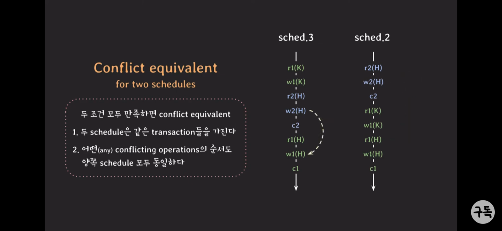
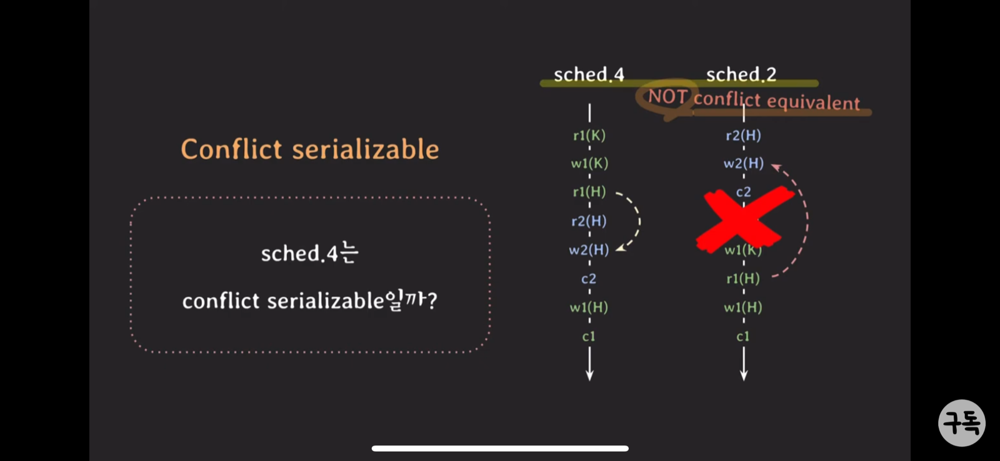
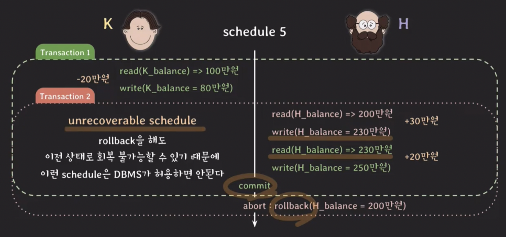
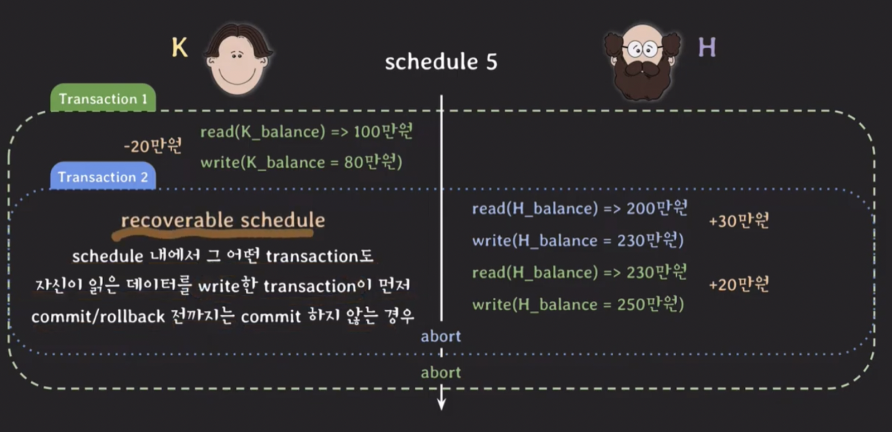
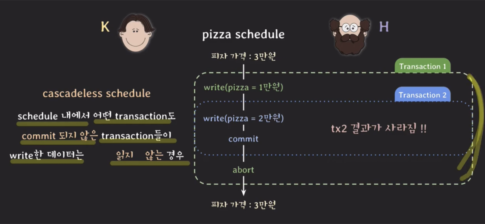
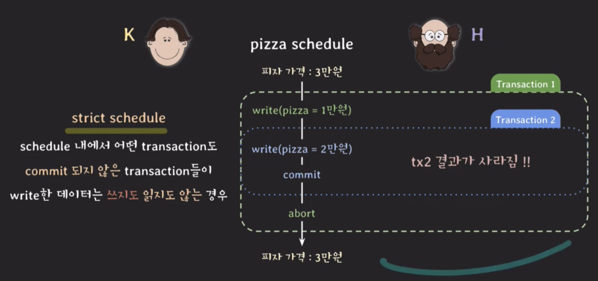

문제발생

- 카프카에서 3개의 컨슈머를 사용해서 데이터를 MySQL에 적재하고 있었습니다. 문제는 적재를 하면서 주문Id에 대한 주문 상태 값을 최신의 상태로 유지하고 싶은 요구가 있었다는 점입니다.

이를 해결하기 위해

1. 적재를 하기 전에 findByCode로 주문 상태의 코드를 조회하고, 조회한 값이 있을 경우 주문 상태의 라벨 값을 비교하여 다르면 업데이트, 같으면 얼리 리턴으로 동작
2. findByCode의 값이 없으면 insert

기대예상 결과

- 각각의 주문 상태의 코드값과 라벨 값이 없을 때 insert가 되고 있을 시 최신의 값으로 update될 것으로 생각했습니다.

---

결과

- 동일한 code의 값이 2~3개로 쌓여 중복 데이터가 발생

원인

- 3개의 컨슈머가 거의 동시에 DB 조회를 하고, 없다고 판단하여 insert를 진행
- 웹에서 더블클릭의 이슈와 동일하다고 생각됩니다.

해결방법

1. 더블 클릭에 의하여 발생되었다면, 프론트에서 1번만 클릭할 수 있게 javascript 수정
2. 만약에 좋아요를 두 번 클릭했을 경우로 가정하면, 각각의 데이터에 ‘게시글id’_’username’ 으로 uni_key를 지정하여 DB insert
3. 분산락을 사용하여, 트랜잭션이 진행 중이라면 실행 이외의 처리는 대기할 수 있게 처리

---

분산락이란?

- 분산락이란 멀티스레드 환경에서 공유 자원에 접근할 때, 데이터의 정합성을 지키기 위해 사용합니다.
- MySQL에서도 분산락을 사용할 수 있지만, 현재 Redis를 사용 중이므로 Redisson을 사용해 해결하는 방법을 찾아보았습니다.
1. 어노테이션 기반의 Redisson을 구현하여 사용하는 방법
    - [https://helloworld.kurly.com/blog/distributed-redisson-lock/](https://helloworld.kurly.com/blog/distributed-redisson-lock/)
    - 커스텀 어노테이션 사용 방법

        [Spring] Spring Annotation 그리고 Custom Annotation

    - 트랜잭션 Isolation

        [JAVA]  @`Transactional` 이란? 트랜잭션 성질 (1)

2. 직접 접근해서 사용하는 방법
    - [https://kko.to/zuunlha](https://kko.to/zuunlha)

글을 읽으면서 Spin Lock이라는 단어가 나왔는데, 이것 또한 궁금해서 알아보았습니다.

정리하면, Race Condition(경쟁 상태) 상황에서 Lock이 반환될 때까지, Critical Section(임계 구역)에 진입 가능할 때까지 프로세스가 재시도하며 대기하는 상태입니다.

- [https://kko.to/zuunlhb](https://kko.to/zuunlhb)

---

### 트랜잭션을 좀 더 파고들어보겠습니다.

[데이터베이스 트랜잭션(transaction)을 아십니까? 그리고 트랜잭션의 매우 중요한 속성들인 ACID를 아십니까? 모르신다면 들렀다 가시지요](https://youtu.be/sLJ8ypeHGlM?si=PZGSfKF3OU08bxii)

### Transaction ACID

- Atomicity : 원자성
    - All or Nothing
    - transaction은 논리적으로 쪼개질 수 없는 작업 단위이기 때문에 내부의 SQL문들이 모두 성공해야 합니다.
    - 중간에 SQL문이 실패하면 지금까지의 작업을 모두 취소하여 아무 일도 없었던 것처럼 롤백해야 합니다.

    그렇다면 commit과 rollback은 DBMS가 트랜잭션이 걸리면 알아서 해주지만, **`개발자가 잘 해야 되는 부분은 트랜잭션의 Commit과 Rollback을 언제 처리해야 될지 잘 정해`**야 합니다.

- Consistency : 일관성
    - transaction이 DB에 정의된 rule을 위반했는지 DBMS가 commit 전에 확인하고 알려줍니다. 룰에 위반되었을 경우, 에러 메시지를 반환해 줍니다.

    그렇다면 개발자는 무엇을 잘해야 할까요? **`application 관점에서 해당하는 트랜잭션의 룰을 어기지 않게 동작하게 해주는 것이 개발자가 챙겨야 할 몫입니다.`**

- Isolation : 격리, 분리
    - 여러 Transaction들이 동시에 실행될 때도 혼자 실행되는 것처럼 동작하게 만듭니다.
    - DBMS는 여러 종류의 Isolation이 있고, 이 격리 수준을 높이면 제한이 많이 생기기 때문에 성능적으로 많이 떨어지며, 격리 수준을 낮추면 성능적으로는 올라가나 트랜잭션 결과 값이 올바르지 않을 수 있습니다.

    그렇다면 개발자는 무엇을 잘해야 할까요? **`상황에 맞게 Isolation Level을 부여해 줄 수 있어야 합니다.`**

- Durability : 영속성
    - commit된 Transaction은 DB에 영구적으로 저장됩니다.

    기본적으로 Transaction의 durability는 DBMS가 보장합니다.

> 1. Transaction을 어떻게 정의해서 쓸지는 개발자가 정의하는 것입니다.
>   - 구현하려는 기능과 ACID 속성을 이해해야 transaction을 잘 정의할 수 있습니다.
> 2. Transaction의 ACID와 관련해서 개발자가 챙겨야 하는 부분들이 있습니다.
>   - 모든 것을 DBMS가 해주는 것은 아닙니다.

[(1부) concurrency control 기초 : schedule과 serializability. 트랜잭션들이 동시에 실행될 때 isolation을 보장하는 기초 이론](https://youtu.be/DwRN24nWbEc?si=WtetJCQFjQ5Qu_lR)

### Concurrency control - Serializability

- Schedule
    - 여러 Transaction들이 동시에 실행될 때 각 Transaction에 속한 Operation들의 실행 순서를 Schedule이라고 합니다.
    - 각 Transaction 내의 Operations들의 순서는 바뀌지 않습니다.
- Serial schedule
    - Transaction들이 겹치지 않고 한 번에 하나씩 실행되는 schedule

    한 번에 하나의 트랜잭션을 사용해서 이상한 데이터를 만들지 않지만, 한 번에 하나의 Transaction만 실행되기 때문에 **`좋은 성능을 낼 수 없고, 현실적으로 사용할 수 없는 방식입니다.`**

- Non-Serial schedule
    - Transaction들이 겹쳐서 실행되는 schedule

    Transaction들이 겹쳐서 실행되기 때문에 동시성이 높아져서 같은 시간 동안 더 많은 Transaction들을 처리할 수 있습니다. → **`트랜잭션이 겹쳐서 실행되서 경우에 따라 이상한 결과를 초래할 수 있다.`**

각각의 단점으로 인해 사용하기 어려운데, 이를 해결하려면 어떻게 해야 할까요?

nonserial schedule로 실행해도 이상한 결과가 나오지 않을 수 있는 방법을 찾아보겠습니다.

→ Serial schedule과 동일한 nonserial schedule을 실행하면 됩니다!

그렇다면 동일한 Schedule이란 무엇일까요?

Conflict

아래 3가지 조건을 만족하면 Conflict하다고 합니다.

1. 서로 다른 Transaction 소속
2. 같은 데이터에 접근
3. 최소 하나는 write operation

왜 Conflict가 중요할까요?

**`Conflict operation은 순서가 바뀌면 결과도 바뀐다.`**

Conflict equivalent

두 조건 모두 만족하면 conflict equivalent

1. 두 schedule은 같은 transaction들을 가진다.
2. 어떤(any) conflicting operation의 순서도 양쪽 schedule 모두 동일하다.

    

    

Conflict serializable

- Serial schedule과 Conflict equivalent일 때를 말합니다.
- nonserial schedule은 conflict serializable이 됩니다.

고민거리

- 성능 때문에 이러한 Transaction들을 겹쳐서 실행할 수 있으면 좋습니다.
- 하지만 이상한 결과가 나오는 것은 싫습니다.

해결책

- conflict serializable한 nonserial schedule을 허용하면 됩니다!

하지만 **현실적으로 여러 Transaction이 실행될 때 마다 해당 schedule이 conflict serializable인지 확인하는 것은 어렵다.**

구현에서는 **`여러 Transaction을 동시에 실행해도 schedule이 conflict serializable하도록 보장하는 프로토콜을 적용`**

- Concurrency control - recoverability
    - unrecoverable Schedule
        - Schedule 내에서 commit된 Transaction이 rollback된 Transaction이 write 했던 데이터를 읽는 경우
        - rollback을 해도 **`이전 상태로 회복 불가능할 수 있기 때문에 이런 Schedule은 DBMS가 허용하면 안된다.`**

        

    - recoverable Schedule
        - Schedule 내에서 그 어떤 Transaction도 자신이 읽는 데이터를 write한 Transaction이 먼저 commit/rollback 전까지는 commit 하지 않는 경우.

            

        - cascading rollback
            - 여러 Transaction의 rollback이 연쇄적으로 일어나는 것을 말합니다.
            - 여러 Transaction의 rollback이 연쇄적으로 일어나면 처리하는 비용이 많이 듭니다.
                - 그렇다면 어떻게 하면 비용을 줄이고 효과적으로 처리할 수 있을까요?
                - commit된 데이터를 읽는 스케줄만 허용하면 됩니다!
        - cascading schedule
            - schedule 내에서 어떤 Transaction도 commit 되지 않는 transaction들이 write한 데이터는 읽지 않는 경우.

            

        - strict schedule
            - schedule 내에서 어떤 Transaction도 commit 되지 않는 Transaction들이 write한 데이터는 쓰지도 읽지도 않는 경우.

            

- Isolation level
    - https://mangkyu.tistory.com/299
