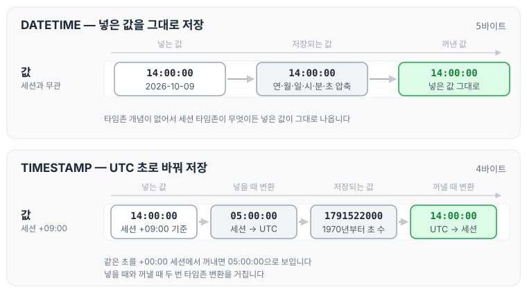
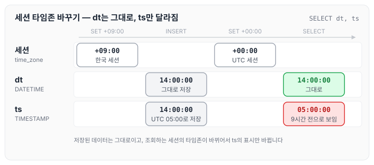
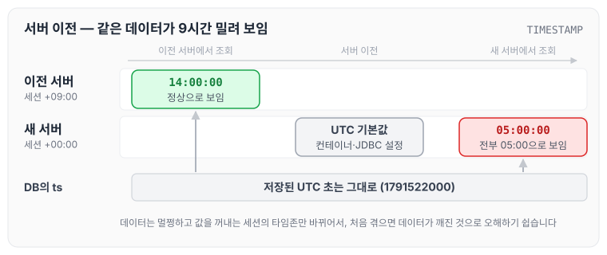
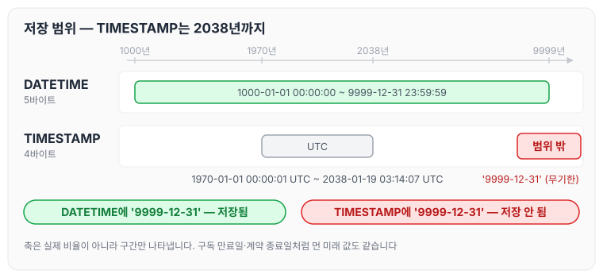
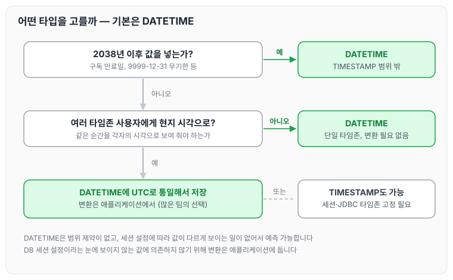

오늘은 MySQL의 날짜·시간 타입인 DATETIME과 TIMESTAMP의 차이에 대해 정리하도록 하겠습니다.

두 타입 모두 `2026-10-09 14:00:00`처럼 똑같은 모양으로 넣고 조회하기 때문에 헷갈리기 쉽지만, 값을 저장하는 방식은 다릅니다. DATETIME은 적힌 날짜와 시각을 그대로 저장하고, TIMESTAMP는 그 값이 가리키는 **특정 순간**을 저장합니다. 이 차이를 알고 있으면 나머지 차이점도 자연스럽게 이해할 수 있습니다.

## DATETIME과 TIMESTAMP

오후 2시(`14:00`)라는 값을 넣은 경우를 예로 들어 보겠습니다.

DATETIME은 "14:00"이라는 값을 적힌 그대로 저장합니다. 서울에서 조회하든 뉴욕에서 조회하든 값은 "14:00"이며, 어디에서 조회해도 넣은 값이 그대로 나옵니다.

TIMESTAMP는 그 시각이 UTC 기준으로 몇 초째인지를 저장하고, 조회할 때 조회하는 쪽의 타임존에 맞춰 변환해서 보여 줍니다. 서울(+09:00)에서는 14:00으로, UTC 기준으로는 05:00으로 보입니다. 가리키는 순간은 같고 표시만 다릅니다.

## 저장 방식의 차이

DATETIME은 연·월·일·시·분·초를 그대로 압축해서 5바이트에 저장합니다(MySQL 5.6.4 이후 기준이며, 소수 초를 쓰면 바이트가 추가됩니다). 타임존이라는 개념이 없기 때문에 넣은 값이 그대로 나옵니다.

TIMESTAMP는 1970년 1월 1일 0시(UTC)부터 흐른 초 수를 4바이트 정수로 저장합니다. 넣을 때는 현재 세션 타임존 기준의 값을 UTC로 바꿔 저장하고, 꺼낼 때는 UTC 값을 다시 세션 타임존으로 바꿔 보여 줍니다.

같은 값을 넣었을 때 두 타입이 각각 어떻게 저장하고 꺼내는지 그림으로 보면 아래와 같습니다.



DATETIME은 저장 단계에서 값이 바뀌지 않고, TIMESTAMP는 넣을 때와 꺼낼 때 두 번 타임존 변환을 거칩니다.

이 때문에 아래와 같은 일이 생깁니다.

```sql
SET time_zone = '+09:00';   -- 한국 세션
INSERT INTO t VALUES ('2026-10-09 14:00:00', '2026-10-09 14:00:00');

SET time_zone = '+00:00';   -- UTC 세션으로 바꾸고 조회
SELECT dt, ts FROM t;
-- dt: 2026-10-09 14:00:00   ← 그대로
-- ts: 2026-10-09 05:00:00   ← 9시간 전으로 보임
```

위 쿼리를 단계별로 펼치면 다음과 같습니다.



같은 값을 넣었지만 세션 타임존을 바꾸자 TIMESTAMP 컬럼만 다르게 조회되었습니다. 저장된 데이터가 바뀐 것이 아니라 조회하는 쪽의 타임존이 바뀌어서 표시가 바뀐 것입니다.

## 비교 정리

두 타입을 비교하면 아래와 같습니다.

| | DATETIME | TIMESTAMP |
|---|---|---|
| 뜻 | 타임존 없는 날짜·시각 | 특정 순간(UTC 기준) |
| 크기 | 5바이트 (5.6.4 이후, 소수 초는 추가) | 4바이트 (소수 초는 추가) |
| 범위 | 1000-01-01 00:00:00 ~ 9999-12-31 23:59:59 | 1970-01-01 00:00:01 UTC ~ 2038-01-19 03:14:07 UTC |
| 타임존 | 상관없음, 넣은 값 그대로 | 세션 타임존에 따라 자동 변환 |
| 자동 갱신(`ON UPDATE CURRENT_TIMESTAMP`) | 가능 (5.6.5부터) | 가능 |

예전에는 자동 갱신이 TIMESTAMP에서만 된다는 점이 차이점이었지만, 지금은 DATETIME에서도 가능하기 때문에 더 이상 차이점이 아닙니다. 남는 차이는 **타임존 변환**과 범위 두 가지입니다.

## 실제로 문제가 생기는 경우

### 세션 타임존이 바뀌면 TIMESTAMP 값이 밀려 보이는 경우

서버를 Kubernetes로 옮겼는데 컨테이너의 기본 타임존이 UTC라면, 어제까지 14:00으로 조회되던 데이터가 전부 05:00으로 조회됩니다. DB의 데이터는 그대로이고 조회하는 쪽의 타임존이 바뀐 것이지만, 처음 겪으면 데이터가 깨진 것으로 오해하기 쉽습니다. JDBC 연결 설정 하나로도 같은 문제가 생깁니다.



그림처럼 DB에 저장된 값은 처음부터 끝까지 같고, 값을 꺼내는 세션의 타임존만 바뀌었습니다.

### 2038년 이후 값을 저장할 수 없는 경우

TIMESTAMP는 4바이트 정수의 한계 때문에 2038년 1월 19일 03:14:07(UTC)까지만 담을 수 있습니다. 구독 만료일이나 계약 종료일처럼 먼 미래를 넣는 컬럼, 또는 "무기한"을 `9999-12-31`로 표현하는 방식은 TIMESTAMP 컬럼에는 저장할 수 없습니다.



DATETIME은 9999년까지 담을 수 있어서 같은 값을 문제없이 저장합니다.

## Java 타입과의 매핑

Java 타입과 잘 맞는 컬럼은 아래와 같습니다.

| Java 타입 | 의미 | 잘 맞는 컬럼 |
|---|---|---|
| `LocalDateTime` | 타임존 없는 날짜·시각 | DATETIME |
| `Instant`, `OffsetDateTime` | 특정 순간 | TIMESTAMP |

JPA에서 `LocalDateTime`을 사용하고 있다면 DATETIME과 개념이 맞습니다([엔티티 매핑](../jpa-entity-mapping/)에서 정리한 것처럼 `LocalDateTime`은 `@Temporal` 없이 매핑할 수 있습니다). TIMESTAMP를 사용한다면 Connector/J의 `connectionTimeZone`, `preserveInstants` 같은 옵션에 따라 변환 결과가 달라지므로, 옵션을 명시적으로 고정해 두어야 앞의 세션 타임존 문제를 피할 수 있습니다.

## 어떤 타입을 사용할까

특별한 이유가 없다면 DATETIME을 기본으로 사용하면 됩니다. 이유는 아래와 같습니다.

- 범위 제약이 없음(2038년 문제 없음)
- 세션 설정에 따라 값이 다르게 조회되는 일이 없어서 예측 가능함
- 국내 단일 타임존 서비스라면 변환이 필요 없음

여러 나라 사용자에게 같은 순간을 각자의 현지 시각으로 보여 줘야 할 때는 TIMESTAMP가 편합니다. 다만 이 경우에도 많은 팀이 DATETIME에 UTC로 통일해서 저장하고, 변환은 애플리케이션에서 하는 방식을 택합니다. DB 세션 설정이라는 눈에 보이지 않는 값에 의존하지 않기 위해서입니다.

선택 기준을 흐름으로 그리면 아래와 같습니다.



## 후기

오늘은 MySQL의 DATETIME과 TIMESTAMP의 차이에 대해 정리하였습니다. DATETIME은 넣은 값을 그대로 저장하고, TIMESTAMP는 UTC 초로 저장했다가 조회하는 쪽의 타임존으로 바꿔 보여 줍니다. TIMESTAMP는 세션 타임존이 바뀌면 값이 밀려 보이고 2038년 이후 값은 저장할 수 없기 때문에, 특별한 이유가 없다면 DATETIME을 사용하고 애플리케이션에서 시간 기준을 통일하는 편이 안전할 것 같습니다.
