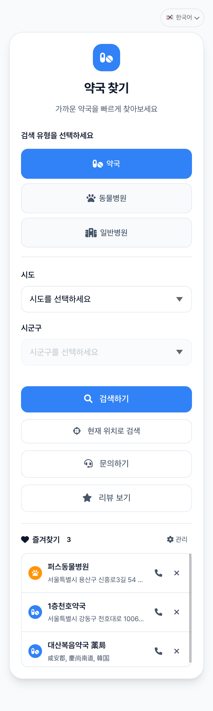
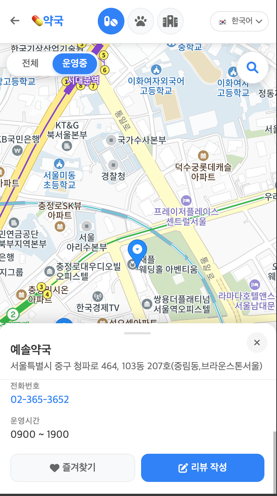
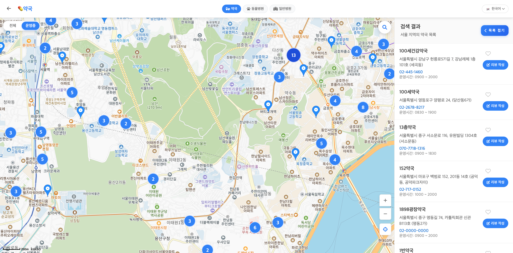
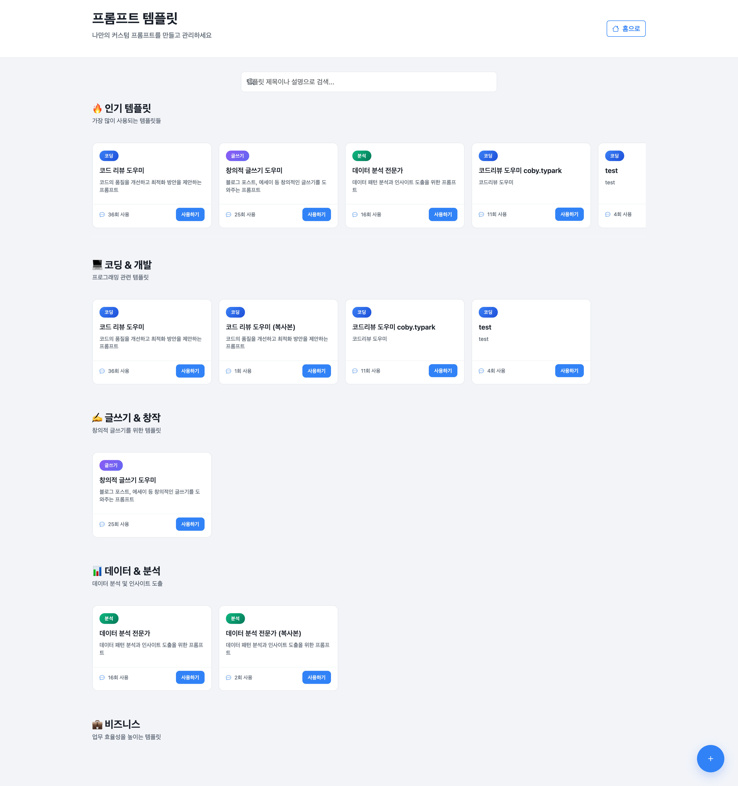
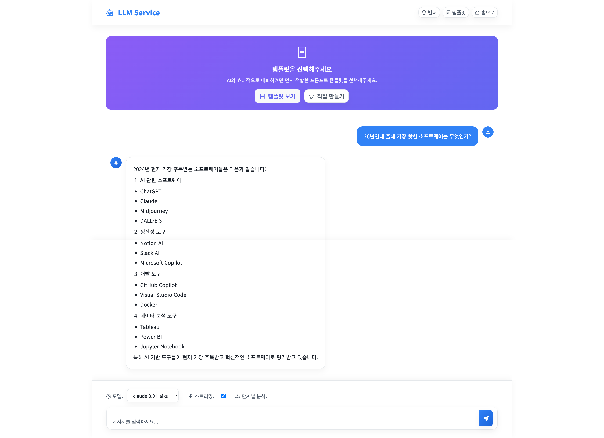

# 신규 프로젝트 2차 오픈

---

## 분산 환경에서의 동시성 제어: 분산락 도입기

### 문제 상황

500개의 데이터를 일괄 검수 처리하는 기능을 개발하던 중, 3대의 서버 환경에서 여러 사용자가 동시에 같은 데이터를 검수하는 상황이 발생했습니다. 데이터 정합성이 깨지는 문제였습니다.

### 기술적 선택: 왜 분산락인가?

처음에는 낙관적 락, 비관적 락, 분산락 중 어떤 방식을 선택할지 고민했습니다.

- **낙관적 락**: 데이터 충돌이 적을 때 효과적이지만, 우리 케이스는 500개 일괄 처리라는 특성상 충돌 가능성이 높았습니다.
- **비관적 락**: 단일 서버 환경에서는 유효하지만, 우리는 3대의 서버가 운영 중인 분산 환경이었습니다.
- **분산락**: Redis 기반의 분산락이 우리 아키텍처에 가장 적합하다고 판단했습니다.

### 구현과 아쉬움

Redisson을 선택해서 분산락을 구현했습니다. 기능은 정상적으로 동작했지만, 돌이켜보니 아쉬운 점들이 있습니다.

**아쉬웠던 점:**

- Lettuce vs Redisson: "요즘 많이 쓴다"는 이유로 Redisson을 선택했는데, 명확한 기술적 근거가 부족했습니다. Redisson의 pub/sub 기반 락 획득 방식이 Lettuce의 스핀락 방식보다 우리 상황에 왜 더 적합한지 깊이 있게 고민하지 못했습니다.
- **락 타임아웃 전략**: 500개 처리 시간을 고려한 적절한 타임아웃 설정, 락 획득 실패 시 재시도 정책 등을 더 신중하게 설계했어야 했습니다.
- **모니터링 부재**: 락 대기 시간, 획득 실패율 같은 메트릭을 수집하지 않아 성능 개선 포인트를 찾기 어려웠습니다.

다음에는 "왜 이 기술을 선택했는가?"에 대한 명확한 답을 가지고 시작해야 할 것 같습니다.

---

## DDD 경계의 모호함: 문서화의 중요성

### 2024년: DDD 도입의 시작

신규 프로젝트를 시작하면서 DDD를 도입했습니다. 처음에는 깔끔하게 경계가 나뉘어진 것처럼 보였습니다.

### 2025년: 현실의 벽

여러 개발자가 투입되면서 문제가 드러났습니다.

- 같은 도메인 개념을 다르게 해석하는 경우가 발생했습니다.
- 패키지 구조가 점점 복잡해지고 일관성을 잃었습니다.
- 새로운 팀원은 어디에 코드를 작성해야 할지 혼란스러워했습니다.

### 해결 방법: 위키 문서화

"코드로 말한다"는 원칙도 중요하지만, 맥락과 의도는 문서로 전달해야 함을 깨달았습니다.

**진행한 작업:**

- 각 Bounded Context의 책임과 경계를 위키에 명확히 정의했습니다.
- 도메인 용어 사전을 작성했습니다.
- 패키지 구조와 의존성 방향을 다이어그램으로 시각화했습니다.

---

## TDD

### 현재 상황

TDD를 실천하고 있습니다. 문제는 다른 분들이 개발 후 빌드할 때 제 테스트가 실패하면 주석 처리하고 넘어가는 경우가 많다는 점입니다.

### 왜 이런 일이 발생할까?

- 테스트 작성이 추가 공수로 느껴집니다.
- 테스트의 가치를 체감하지 못합니다.
- 테스트 실패 시 디버깅이 어렵습니다.

### 시도 중인 변화

**1. 가치 공유하기**

- 버그 수정 시간이 얼마나 줄었는지 수치화했습니다.

**2. 진입 장벽 낮추기**

- 테스트 작성 템플릿을 제공했습니다.
- 페어 프로그래밍으로 함께 작성했습니다.
- 간단한 케이스부터 시작하도록 유도했습니다.

**향후 목표:**
혼자만의 실천이 아닌, 팀의 당연한 개발 프로세스로 만드는 것입니다.

---

## 슬로우 쿼리 개선: 6초에서 1초 미만으로

### 증상

메인 페이지 로딩에 6초 이상 걸리는 심각한 성능 이슈가 발생했습니다.

### 원인 분석 과정

처음에는 당연히 인덱스 문제라고 생각했습니다. 하지만...

`EXPLAIN ANALYZE SELECT ...`

MySQL 옵티마이저가 잘못된 실행 계획을 선택하고 있었습니다. 인덱스는 존재했지만, 통계 정보나 카디널리티 문제로 풀스캔을 선택한 것이었습니다.

### 해결: Optimizer Hint

sql

`SELECT /*+ INDEX(table_name idx_name) */ ...`

힌트를 부여하여 명시적으로 인덱스 사용을 강제했고, 쿼리 응답 시간이 **1초 미만**으로 개선되었습니다.

### 배운 교훈

- `EXPLAIN ANALYZE`는 추측이 아닌 근거를 제공합니다.
- 옵티마이저도 완벽하지 않습니다. 때로는 개발자의 도메인 지식이 더 정확할 수 있습니다.

---

# Claude Code 사용 경험: 편리함에서 복잡함으로

## 바이브 코딩을 알게 된 계기

"한 걸음 앞선 개발자가 지금 꼭 알아야 할 클로드 코드" 책을 통해 바이브 코딩이라는 개념을 처음 접했습니다. AI와 대화하듯이 코드를 작성한다는 컨셉이 신선해서 실제 프로젝트에 적용해보기로 했습니다.

## 초반의 놀라움

처음 사용했을 때는 정말 편리했습니다. CRUD 같은 반복 작업을 빠르게 생성할 수 있었고, 복잡한 비즈니스 로직도 자연어로 설명하면 구현이 가능했습니다. 테스트 코드 작성 시간도 크게 단축됐습니다. 실제로 프로젝트 오픈까지 성공적으로 진행할 수 있었습니다.

## 문제의 시작

처음에는 작은 버그나 개선사항을 Claude에게 요청하는 정도였습니다. 빠르게 해결해주니까 편리했습니다.

하지만 시간이 지나면서 문제가 발생하기 시작했습니다. AI가 수정한 코드가 다른 부분에 영향을 주고, 그것을 또 AI로 수정하면서 소스코드가 점점 복잡해졌습니다. 어느 순간 "왜 이렇게 작성됐지?"를 명확하게 설명할 수 없는 코드가 되어버렸습니다.

## Claude.md의 한계

프로젝트 가이드라인을 Claude.md 파일에 명확하게 작성했습니다.

하지만 실제로는 Claude가 이 가이드라인을 제대로 읽지 않고 코드를 생성하는 경우가 많았습니다. 특히 대화 컨텍스트가 길어지면 초기 지침을 잊어버리는 것처럼 보였습니다.

## 해결 방법: 서브 에이전트 활용

하나의 Claude에게 모든 작업을 맡기는 대신, 역할별로 분리하는 방식을 시도했습니다.

- **설계 전담 에이전트**: 전체 아키텍처와 구조 결정만 담당합니다.
- **구현 전담 에이전트**: 실제 코드 작성을 담당합니다.
- **리뷰 전담 에이전트**: 코드 품질 검증 및 가이드라인 준수 확인을 담당합니다.

각 에이전트가 명확한 책임을 가지니 결과물의 일관성이 크게 향상되었습니다.

## 배운 점

AI가 생성한 코드를 이해하고 설명할 수 있어야 합니다. "왜 이렇게 작성됐지?"에 답할 수 없다면 위험 신호입니다.

Claude.md만으로는 부족했습니다. 서브에이전트를 두고 설계 → 구현 → 검증의 단계를 명확히 분리하고, 각 단계마다 적절한 도구를 사용하는 것이 중요했습니다.

## 솔직한 후기

생산성은 확실히 향상되었습니다. 반복 작업이 줄어들고 리팩토링 아이디어도 얻을 수 있었습니다.

다만 초기 설정에 시간 투자가 필요했습니다. Skills를 만들고 서브 에이전트 역할을 정의하는 작업이 번거로웠습니다. 그래도 claude.md 파일만 두고 사용하는 것보다는 훨씬 나았습니다.

---

# 동물병원, 약국, 일반병원 찾기 웹사이트 오픈

## 프로젝트 배경

가족이 아플 때 근처 병원이나 약국을 찾는 게 생각보다 어려웠습니다. 그래서 직접 만들어보기로 했습니다. 동물병원, 약국, 일반병원을 한 곳에서 찾을 수 있는 웹사이트를 4일 만에 개발해서 오픈했습니다.

## 인프라 구성의 시행착오

처음에는 서비스를 두 개의 클라우드로 나눠서 구성했습니다.

- 동물병원, 약국, 일반병원 검색 웹사이트: NCP

- LLM 프롬프트 챗팅 웹: AWS

### AWS 사용 경험

AWS를 처음 사용했을 때 매달 8~9만원 정도의 비용이 발생했습니다. 생각보다 비용이 나가서 친구의 조언으로 NCP로 변경을 시도했습니다.

### NCP로의 전환 시도

NCP의 1년 무료 서버를 사용해봤는데 문제가 있었습니다. API만 단독으로 운영하기에는 괜찮았지만, 웹 애플리케이션까지 함께 띄우기에는 스펙이 턱없이 부족했습니다. 메모리와 CPU 성능이 제한적이어서 웹 서버가 제대로 작동하지 않았습니다.

결국 가장 작은 유료 서버를 선택했는데, 비용이 AWS와 비슷한 8~9만원 선이었습니다.

### 배운 점

혼자 NCP에 적응하고 학습하는 것보다, 업계 표준인 AWS를 익히는 게 더 합리적이라고 판단했습니다. 비용이 비슷하다면 생태계가 크고 레퍼런스가 많은 플랫폼을 선택하는 게 맞다고 느꼈습니다.

다음 프로젝트는 AWS로 오픈할 예정입니다.

## 가장 큰 문제: 사용자 유입 부재

웹사이트는 성공적으로 오픈했지만, 정작 사용자가 들어오지 않았습니다.

기술적으로는 문제없이 작동했지만, 좋은 서비스를 만드는 것과 사람들이 사용하게 만드는 것은 완전히 다른 문제였습니다. 마케팅과 SEO, 사용자 유입 채널에 대한 고민이 부족했던 것 같습니다.

---

# 인덱스 기초 사내 세미나 진행

## 세미나 개최 배경

프로젝트를 진행하던 중 특정 테이블에 인덱스가 과도하게 선언되어 있는 것을 발견했습니다. 쓰기 성능이 저하되고 있었고, 실제로 사용되지 않는 인덱스들이 많았습니다. 이 문제를 해결하면서 "인덱스를 언제, 어떻게 써야 하는가"에 대해 팀 차원에서 정리할 필요성을 느꼈습니다. 세미나를 준비하면서 저도 생각을 정리할 수 있을 것 같아 진행하게 되었습니다.

## 세미나 주요 내용

### 인덱스의 기본 개념

책의 '찾아보기'에 비유해서 설명했습니다. 인덱스 없이 데이터를 찾는 것은 책의 첫 페이지부터 끝까지 확인하는 것과 같고, 인덱스를 사용하면 원하는 페이지로 바로 이동할 수 있다는 점을 강조했습니다.

실제 product 테이블 예시를 통해 B-Tree 인덱스 구조가 어떻게 동작하는지 시연했습니다.

### 카디널리티와 선택도

가장 많은 질문이 나왔던 부분입니다.

- **카디널리티**: 열에 존재하는 고유한 값의 개수입니다.
- **선택도**: 카디널리티를 전체 행 수로 나눈 값입니다.

email 같이 고유 값이 많은 열은 카디널리티가 높아서 인덱스 효과가 좋지만, gender처럼 남/여 2개 값만 있는 열은 카디널리티가 낮아서 인덱스 효과가 미미하다는 점을 실제 수치로 보여줬습니다.

### 실전 팁

1. **복합 인덱스 활용**: 자주 함께 검색되는 열은 복합 인덱스로 생성하되, 자주 사용되는 열을 앞에 배치해야 한다는 점입니다.
2. **LIKE 검색 주의점**: 접두사 검색('김%')은 인덱스를 사용하지만, 중간/접미사 검색('%철수%')은 인덱스를 활용할 수 없다는 점입니다.
3. **EXPLAIN 활용**: 쿼리 최적화 확인 방법입니다.

### 왜 B-Tree인가?

MySQL이 왜 B-Tree 구조를 사용하는지 설명했습니다.

- 균형 유지로 성능을 보장합니다.
- 디스크 I/O를 최소화합니다.
- 범위 검색을 지원합니다.
- ORDER BY 작업을 최적화합니다.

Hash 인덱스나 다른 자료구조와 비교하면서, B-Tree가 범용적으로 가장 적합한 이유를 다뤘습니다.

## 세미나 후 반응

팀원들이 가장 관심 있어 했던 부분은 "과도한 인덱스 생성은 오히려 성능을 떨어뜨릴 수 있다"는 점이었습니다. INSERT, UPDATE, DELETE 시 인덱스 갱신으로 인한 오버헤드가 발생한다는 것을 실제 사례로 설명하니 이해가 빨랐습니다.

특히 "쿼리 패턴과 데이터 특성을 분석해서 균형 있게 설계해야 한다"는 결론 부분에서 많은 공감을 얻었습니다.

## 배운 점

세미나를 준비하면서 저도 인덱스에 대해 더 깊이 공부하게 됐습니다. 특히 커버링 인덱스나 클러스터드 인덱스 같은 고급 개념들을 정리하면서, 단순히 "인덱스를 만들면 빨라진다"가 아니라 "왜 빨라지는지, 언제 써야 하는지"를 명확하게 이해하게 됐습니다.

**25년 목표**

1. 개발 책을 8권 이상 읽겠습니다.
2. 인프라를 공부하겠습니다.
3. 사용자가 유입될 수 있는 개인 프로젝트를 2개 이상 진행하겠습니다.
4. 다른 사람들에게 설명할 수 있는 자리를 적극적으로 마련하겠습니다.

---

# 2025년을 마무리하며

2025년 한 해 동안 개인 프로젝트 2개를 진행했고, 처음으로 사내 세미나도 열어봤습니다.

회사 업무와 병행하면서 개인 프로젝트를 진행하고 세미나를 준비하는 것은 솔직히 쉽지 않았습니다. 퇴근 후 시간을 쪼개서 코드를 짜고, 주말에 세미나 자료를 만드는 과정이 쉽지만은 않았습니다.

하지만 돌이켜보니 그만큼 많은 것을 배웠습니다. 직접 서비스를 만들어보면서 AWS와 NCP의 차이를 체감했고, Claude Code를 활용한 개발 방식도 익혔습니다. 세미나를 준비하면서는 인덱스에 대해 깊이 있게 공부할 수 있었습니다.

개발 서적은 "한 걸음 앞선 개발자가 지금 꼭 알아야 할 클로드 코드" 한 권밖에 읽지 못했습니다. 목표했던 것보다 적지만, 그래도 바이브 코딩이라는 새로운 개발 방식에 관심을 가질 수 있는 좋은 기회였습니다.

2026년에는 2025년에 부족했던 부분을 채워나가려고 합니다. 특히 인프라 지식과 개발 서적 읽기에 더 집중할 계획입니다.

한 해 동안 함께 성장해준 팀원분들께 감사드립니다.
