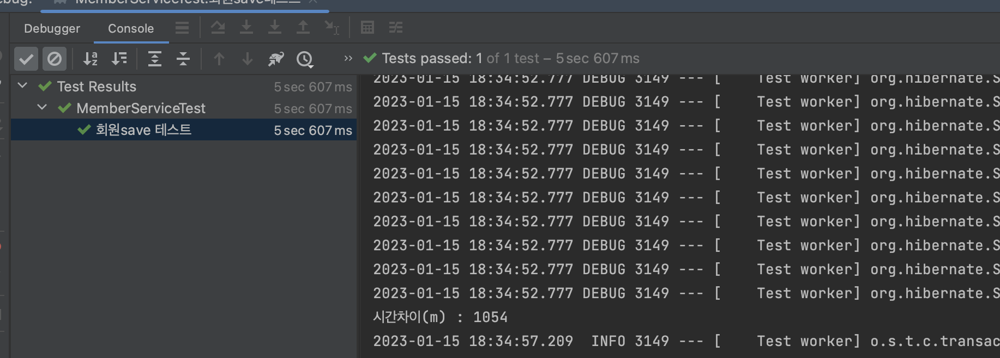
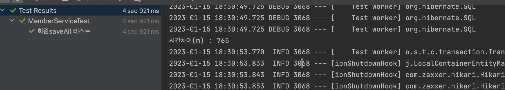

오늘은 JPA를 공부하다가 save와 saveAll의 성능에 대해 궁금해졌습니다.

두 개 다 테스트 코드를 작성해 보고, 걸리는 시간을 기반으로 측정하였습니다.

결론적으로 이야기하자면 saveAll이 save보다 최대 1.25배 ~ 2배 정도 차이가 났습니다.

이유는 아래의 테스트 코드와 설명을 통해 전달하겠습니다.

### 1. Save

```java
@Test
    @DisplayName("회원save 테스트")
    public void 회원save톄스트() {
        int memberCount = 10000;

        long beforeTime = System.currentTimeMillis();
        for (int i = 0; i < memberCount; i++) {
            Member member = Member.createMember("typark"+i, 40);
            memberService.join(member);
        }
        long afterTime = System.currentTimeMillis();
        long secDiffTime = (afterTime - beforeTime); //두 시간에 차 계산
        System.out.println("시간차이(m) : "+secDiffTime); // 1026
    }
```

1. 회원의 카운트를 10,000으로 작성.
2. 회원 저장 함수 시작 전 시스템 시간을 적시
3. 10,000개의 회원을 저장
4. 저장 후 시스템 시간을 적시
5. 저장 후 시스템 시간 - 저장 전 시스템 시간을 = 총 걸린 시간



### 2. saveAll

```java
@Test
    @DisplayName("회원saveAll 테스트")
    public void 회원saveAll테스트() {
        int memberCount = 10000;
        List<Member> members = new ArrayList<>();

        long beforeTime = System.currentTimeMillis();
        for (int i = 0; i < memberCount; i++) {
            Member member = Member.createMember("typark"+i, 40);
            members.add(member);
        }
        memberService.joinAll(members);
        long afterTime = System.currentTimeMillis();
        long secDiffTime = (afterTime - beforeTime); //두 시간에 차 계산
        System.out.println("시간차이(m) : "+secDiffTime); // 750
    }
```

1. 회원의 카운트를 10,000으로 작성.
2. 회원 저장 함수 시작 전 시스템 시간을 적시
3. 10,000개의 회원을 리스트에 저장
4. saveAll 함수에 리스트 저장
5. 저장 후 시스템 시간을 적시
6. 저장 후 시스템 시간 - 저장 전 시스템 시간을 = 총 걸린 시간



### 결과

결과를 보면 **`save보다 saveAll이 훨씬 빠르다`**는 것을 알 수 있습니다. 왜 이런 현상이 발생하였을까요?

1. save 내부 함수

```java
	@Transactional
	@Override
	public <S extends T> S save(S entity) {

		Assert.notNull(entity, "Entity must not be null.");

		if (entityInformation.isNew(entity)) {
			em.persist(entity);
			return entity;
		} else {
			return em.merge(entity);
		}
	}
```

`save` 함수는 내부적으로 `@Transactional`로 감싸져 있으며, 이는 스프링의 프록시 기반으로 동작합니다. **즉, 호출이 될 때 프록시 기반의 객체를 가로채서 사용하는 객체의 함수가 작동되는 것입니다.**

참고: 프록시 설명 링크 참조 → [Clean Code] 12장 시스템 (2)

1. saveAll 내부 함수

```java
	@Transactional
	@Override
	public <S extends T> List<S> saveAll(Iterable<S> entities) {

		Assert.notNull(entities, "Entities must not be null!");

		List<S> result = new ArrayList<>();

		for (S entity : entities) {
			result.add(save(entity));
		}

		return result;
	}
```

`saveAll` 함수도 내부적으로 `@Transactional`로 감싸져 있지만, 내부의 함수 `save`를 호출하게 됩니다. 이렇게 **되면 프록시 기반으로 save가 동작하지 않기 때문에, 불필요한 프로세스가 없어지게 되고, save를 호출하는 것보다 효율적으로 변경되는 것입니다.**

오늘은 save와 saveAll의 차이점에 대해 설명하였습니다. **`다량의 데이터를 저장할 때는 saveAll을 활용해 좀 더 효율적으로 접근해야 하겠습니다.`**

참조:

[[Spring Data JPA] save와 saveAll의 성능 차이에 대한 실험과 결과!(스프링 프록시, @Transactional)](https://sas-study.tistory.com/388)
