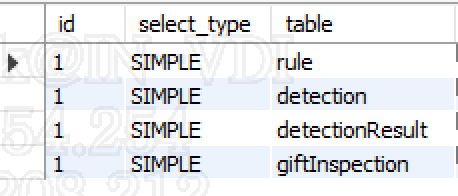
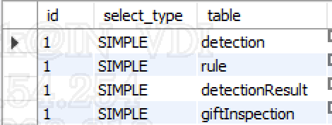

실무에서 특정 웹페이지에 접근하면 응답 속도가 6초 이상 걸리는 페이지가 있었고, 이를 해결하기 위해 분석했던 방법을 정리하겠습니다.

해당 페이지를 불러오기 위해서는 DB와 API 통신을 통해 데이터를 조합하여 노출하기 때문에, 근본적인 원인이 무엇인지 확인하기 위해 아래와 같이 응답 시간을 직접 확인하였습니다.

```java
 public static double measureExecutionTime(long startTime) {
        long endTime = System.nanoTime();
        return (endTime - startTime) / 1_000_000.0; // ms 단위 변환
    }
```

확인해 보니 DB 조회 응답이 느린 것을 확인하였습니다.

조회 쿼리

```sql
(생략)
FROM gift_detection detection
         INNER JOIN gift_detect_result detectionResult ON detection.id = detectionResult.detection_id
         INNER JOIN gift_inspection giftInspection ON detection.id = giftInspection.detection_id
         INNER JOIN rule rule ON detection.rule_id = rule.code
WHERE detection.check_ts >= '2024-05-01'
  AND detection.check_ts <= '2025-02-12'
  AND rule.channel = 'GIFT'
  AND rule.status = 'ACTIVE'
(생략)
```

여기서 하나씩 Join을 소거해 가면서 응답 시간을 확인해 보았습니다.

1. rule 테이블의 조인과 조건을 삭제했을 때 속도가 6초 → 1.0~1.3초까지 응답이 빨라지는 것을 확인하였습니다.
2. 그렇다면 조인만 하고 조건을 삭제한다면 어떻게 나올까요?
    1. channel을 삭제하였을 때는 똑같이 6초가량 느린 것을 확인하였습니다.
    2. **`status를 삭제하였을 때 6초 → 1.0~1.3초까지 응답이 빠른 것을 확인`**하였습니다.

그렇다면 왜 rule 테이블의 status 조건을 삭제했을 때 조회 응답이 빨라지는 것일까요?

MySQL Workbench에서 Explain을 통하여 실행계획을 확인하였습니다.

아래와 같이 노출되는 것을 확인하였습니다.



테이블을 보면 **`Rule 테이블이 드라이빙 테이블`**이 되었고, detection 테이블이 드리븐 테이블이 되는 것을 확인할 수 있습니다. 그렇다면 `rule.status` 조회 조건을 삭제하면 어떻게 노출될까요?

[조회쿼리]

```sql
(생략)
FROM gift_detection detection
         INNER JOIN gift_detect_result detectionResult ON detection.id = detectionResult.detection_id
         INNER JOIN gift_inspection giftInspection ON detection.id = giftInspection.detection_id
         INNER JOIN rule rule ON detection.rule_id = rule.code
WHERE detection.check_ts >= '2024-05-01'
  AND detection.check_ts <= '2025-02-12'
  AND rule.channel = 'GIFT'
(생략)
```



드라이빙 테이블이 detection으로 변경된 것을 확인할 수 있습니다. 그렇다면 왜 `rule.status`를 조건으로 넣으면 느려지는 것일까요?

rule이 드라이빙 테이블로 지정되면서 **`조인에 사용된 rule_id가 인덱스로 사용`**되었고, 이로 인해 조회 조건인 **`detection.check_ts의 인덱스가 동작하지 않아 정렬하는 데 많은 시간이 소요`**되는 것을 확인하였습니다. 그러면 왜 드라이빙 테이블이 변경되었을지 궁금하였습니다.

---

### MySQL 옵티마이저

MySQL 옵티마이저는 **SQL 쿼리를 가장 효율적으로 실행하기 위한 실행 계획을 수립하는 핵심 구성 요소**입니다. 쿼리 실행 계획은 데이터를 어떻게 읽고 처리할지 결정하는 일련의 단계로, 옵티마이저는 다양한 요소를 고려하여 최적의 계획을 선택합니다.

### 옵티마이저의 주요 기능

**쿼리 분석 및 재작성**

옵티마이저는 SQL 쿼리를 분석하고 필요에 따라 재작성하여 실행 효율성을 높입니다. 예를 들어, 불필요한 조건이나 중복된 연산을 제거하거나, 쿼리 순서를 변경하여 더 나은 성능을 얻을 수 있습니다.

**실행 계획 수립**

옵티마이저는 다양한 실행 계획을 생성하고 각 계획의 비용을 추정하여 가장 효율적인 계획을 선택합니다. 이때 사용되는 비용은 CPU 사용량, 메모리 사용량, 디스크 I/O 등 다양한 요소를 종합적으로 고려합니다.

**인덱스 활용**

옵티마이저는 쿼리 실행 시 인덱스를 활용하여 데이터 접근 속도를 향상시킵니다. 적절한 인덱스를 선택하고 활용하는 것은 쿼리 성능에 큰 영향을 미칩니다.

**조인 최적화**

여러 테이블을 조인하는 쿼리의 경우, **옵티마이저는 다양한 조인 알고리즘(예: `Nested Loop Join`, Hash Join, Merge Join) 중에서 가장 효율적인 알고리즘을 선택**합니다.

**서브쿼리 최적화**

옵티마이저는 서브쿼리를 분석하고 필요에 따라 재작성하거나 다른 방식으로 처리하여 성능을 향상시킵니다.

**병렬 처리**

최신 MySQL 버전에서는 옵티마이저가 쿼리를 병렬로 처리하여 실행 시간을 단축할 수 있습니다.

---

**Nested Loop Join**

Nested Loop Join(중첩 루프 조인)은 두 개의 테이블을 조인할 때 사용하는 가장 기본적인 방식으로, 하나의 테이블(외부 테이블, Outer Table)의 각 행을 가져와 다른 테이블(내부 테이블, Inner Table)과 비교하며 매칭되는 데이터를 찾는 방식입니다.

동작 방식

1. **외부 루프 (Outer Table)** → 첫 번째 테이블의 각 행을 하나씩 가져옵니다.
    1. **일반적으로 데이터량이 적은 테이블이 외부 테이블로 선택되는 경우가 많습**니다.
2. **내부 루프 (Inner Table)** → 가져온 행과 두 번째 테이블의 모든 행을 비교하며 조인 조건을 만족하는지 확인합니다.
3. **매칭된 데이터 반환** → 조인 조건을 만족하는 경우 결과에 추가하고, 다음 행으로 이동합니다.

---

**데이터량이 적은 테이블이 외부 테이블로 선택되는 경우가 많습니다.**

여기서 rule 테이블이 gift_detection 테이블보다 현저하게 데이터가 적습니다. 때문에 DB 옵티마이저가 데이터량이 더 적은 **`Rule 테이블을 드라이빙(Driving) 테이블로`** 선택하고 **`Detection 테이블을 드리븐(Driven) 테이블로 선택`**하게 된 것입니다.

이 때문에 Rule과 Detection 테이블이 조인될 때 rule_id 인덱스를 사용하게 되었고, **하나의 테이블에서는 하나의 인덱스만 사용 가능하니 조회 조건의 detection.check_ts는 인덱스로 사용되지 않아 정렬하는 데 많은 시간이 소요된 것**입니다.

그렇다면 어떻게 하면 조회 속도를 올릴 수 있을까요?

1. 조인과 조건에 사용하는 컬럼을 복합 인덱스(rule_id, check_ts)로 지정하면 될 것입니다.
2. `STRAIGHT_JOIN`을 통하여 FROM 절에 명시된 순서대로 조인하도록 힌트를 주는 것입니다.

저 같은 경우 조회 조건의 컬럼이 동적으로 변하기 때문에 `STRAIGHT_JOIN`을 선택하여 해결하였습니다.

오늘은 특정 페이지에서 조회 속도가 느려서 해결한 경험을 작성하였습니다.

DB 옵티마이저가 자동으로 드라이빙 테이블을 데이터가 적은 Rule 테이블로 선택해서 발생한 것으로, 비슷한 경험이 있을 시 `Explain` 실행계획을 확인해서 드라이빙 테이블과 드리븐 테이블을 확인하고 개발자가 원하는 방법으로 지정하는 것으로 해결할 수 있을 것입니다. 감사합니다.

---

## 요약

### 문제점

- 특정 웹페이지 로딩 속도가 6초 이상으로 느렸으며, 원인은 DB 조회 응답 시간 때문이었습니다.

### 분석 결과

- 쿼리에서 `rule` 테이블의 `status` 조건이 문제였습니다. 해당 조건을 삭제하면 응답 시간이 1초 내외로 단축되었습니다.

### 원인

- MySQL 옵티마이저가 `rule` 테이블을 드라이빙 테이블로 선택하면서 `rule_id` 인덱스가 사용되었고, 이로 인해 `detection.check_ts` 인덱스가 사용되지 않아 정렬에 많은 시간이 소요되었습니다.

### 해결 방법

- `STRAIGHT_JOIN` 힌트를 사용하여 FROM 절에 명시된 순서대로 조인하도록 유도하여 문제를 해결했습니다.

### 교훈

- MySQL 옵티마이저가 항상 최적의 실행 계획을 선택하는 것은 아니므로, 실행 계획을 확인하고 필요에 따라 힌트를 사용하여 옵티마이저의 동작을 제어해야 합니다.
