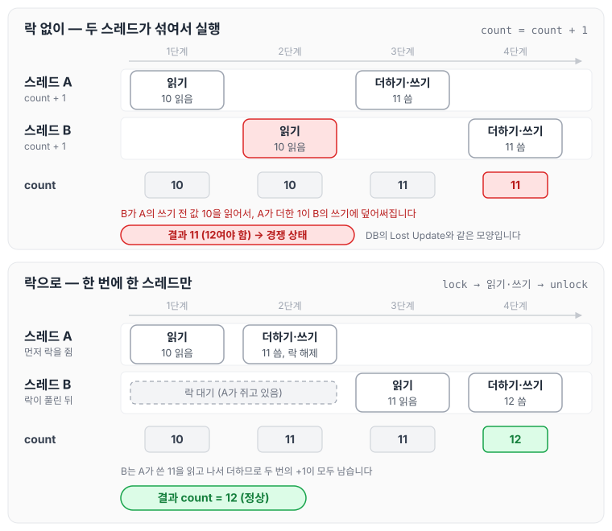
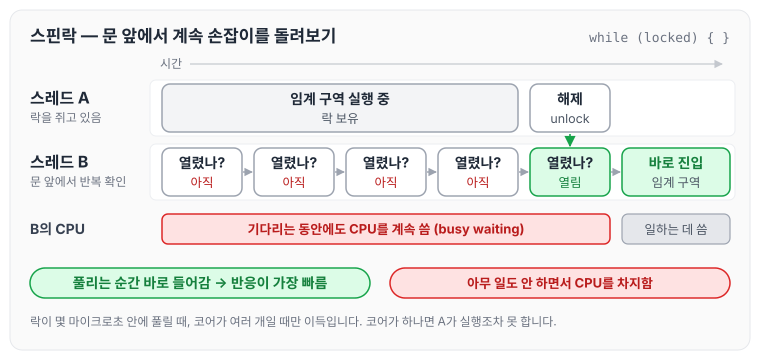
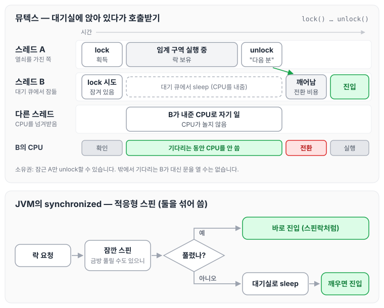
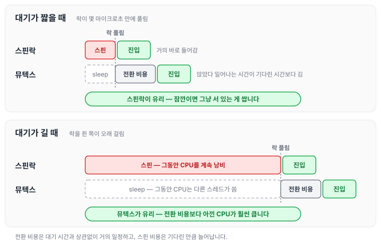
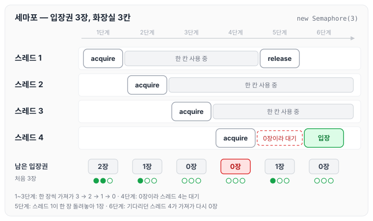
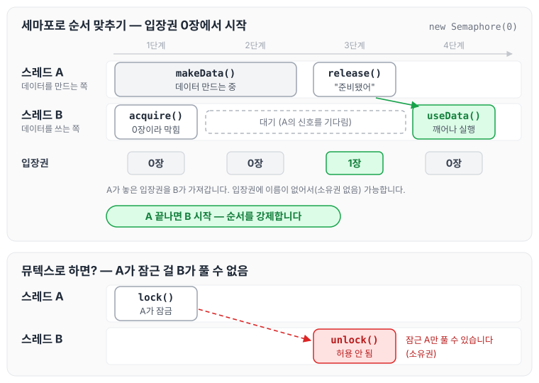
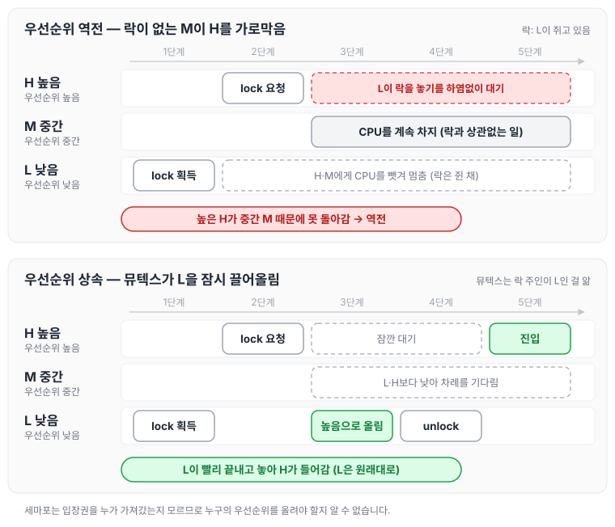
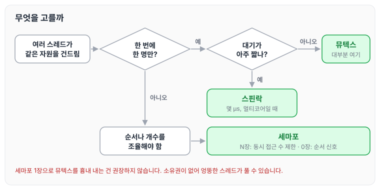

[앞 글](../transaction-schedule-isolation/)에서 DB 락을 "공용 공책 페이지 쥐기"로 봤죠. 이번엔 **한 프로그램 안에서 여러 스레드가 같은 데이터를 건드릴 때** 쓰는 도구입니다. 원리는 똑같고, "기다리는 방식"과 "몇 명까지 들어가게 할지"만 다릅니다.

## 먼저: 임계 구역이란

여러 스레드가 동시에 건드리면 안 되는 코드 구간입니다. 화장실 한 칸이라고 생각하세요. 한 번에 한 명만 들어가야 하고, 두 명이 동시에 들어가면 사고(경쟁 상태)가 납니다.

```java
count = count + 1;   // 읽기 → 더하기 → 쓰기, 세 단계
```

이 한 줄도 두 스레드가 동시에 하면 둘 다 10을 읽고 둘 다 11을 써서 12가 돼야 할 값이 11이 됩니다. DB의 Lost Update와 완전히 같은 문제입니다.

count가 10일 때 두 스레드가 각각 +1을 하는 과정을 단계별로 펼치면 다음과 같습니다. 위는 락 없이 섞인 경우, 아래는 락으로 한 번에 한 스레드만 들어가게 한 경우입니다.



락이 없으면 B가 A의 쓰기 전 값 10을 읽는 바람에 A가 더한 1이 사라집니다. 락으로 차례를 지키면 B는 A가 쓴 11을 읽고 더하므로 12가 남습니다.

## 스핀락: 문 앞에서 계속 손잡이를 돌려보기

화장실이 잠겨 있으면 **문 앞에 서서 계속 손잡이를 돌려봅니다.** "열렸나? 아직. 열렸나? 아직…"

- **장점:** 열리는 순간 바로 들어갑니다. 반응이 가장 빠릅니다.
- **단점:** 기다리는 동안 **CPU를 계속 씁니다.** 아무 일도 안 하면서 바쁜 척하는 겁니다(busy waiting).

스레드 A가 락을 쥐고 있는 동안 스레드 B가 무엇을 하는지 시간 순서로 그려 보면 다음과 같습니다.



B는 기다리는 내내 "열렸나?"를 되풀이하느라 CPU를 놓지 않고, 그 대가로 풀리는 순간 곧바로 들어갑니다.

**언제 쓰나:** 안에 있는 사람이 **금방 나올 때**(몇 마이크로초). 잠깐이면 자리 비웠다가 돌아오는 비용보다 그냥 서 있는 게 쌉니다. CPU 코어가 여러 개일 때만 의미가 있습니다. 코어가 하나면 내가 돌리는 동안 안에 있는 사람이 실행조차 못 하니까요.

## 뮤텍스: 대기실에 앉아 있다가 호출받기

화장실이 잠겨 있으면 **대기실에 가서 앉습니다(sleep).** 안에 있는 사람이 나오면서 "다음 분"이라고 부르면 그때 일어납니다.

- **장점:** 기다리는 동안 **CPU를 안 씁니다.** 다른 스레드가 그 CPU를 쓸 수 있습니다.
- **단점:** 앉았다 일어나는 데 시간이 듭니다(컨텍스트 스위칭). 안에 있는 사람이 1초 뒤에 나올 거면 손해입니다.

**언제 쓰나:** 안에 있는 사람이 **오래 걸릴 수 있을 때.** 일반적인 상황 대부분입니다.

뮤텍스에는 중요한 규칙이 하나 더 있습니다. **열쇠는 들어간 사람만 가지고 있고, 그 사람만 문을 열 수 있습니다(소유권).** 밖에 있는 사람이 남의 문을 열어줄 수 없습니다.

```java
// Java
synchronized (lock) { ... }         // 뮤텍스. 블록 나갈 때 자동 해제
ReentrantLock lock = new ReentrantLock();
lock.lock();  try { ... } finally { lock.unlock(); }   // 잠근 스레드만 unlock 가능
```

실제 JVM의 `synchronized`는 **둘을 섞어 씁니다.** 처음엔 잠깐 스핀하다가(금방 풀릴 수도 있으니), 안 되면 대기실로 갑니다. 이걸 적응형 스핀(adaptive spinning)이라고 합니다.

앞의 스핀락 그림과 같은 상황을 뮤텍스로 그리면 다음과 같습니다. 아래쪽은 JVM `synchronized`가 스핀과 대기를 섞는 순서입니다.



B가 잠든 동안 CPU는 다른 스레드가 쓰고, 열쇠를 가진 A가 unlock하며 깨워야 B가 들어갑니다. 깨어나는 순간의 전환이 뮤텍스가 치르는 비용입니다.

결국 스핀락과 뮤텍스 중 어느 쪽이 싼지는 기다리는 시간에 달려 있습니다. 대기가 짧을 때와 길 때를 나란히 놓으면 다음과 같습니다.



스핀 비용은 기다린 만큼 늘어나고, 뮤텍스의 전환 비용은 대기 시간과 상관없이 거의 일정합니다.

## 세마포: 입장권 N장

이번엔 화장실이 **3칸**입니다. 입구에 **입장권 3장**을 걸어두고, 들어갈 때 한 장 가져가고(`acquire`) 나올 때 돌려놓습니다(`release`). 입장권이 0장이면 기다립니다.

- 입장권이 **1장**이면 뮤텍스처럼 한 명만 들어갑니다. (이걸 바이너리 세마포라고 합니다)
- 입장권이 **N장**이면 N명까지 동시에 들어갑니다. DB 커넥션 풀 10개, 동시 다운로드 3개 제한 같은 데 씁니다.

```java
Semaphore permits = new Semaphore(3);
permits.acquire();  try { download(); } finally { permits.release(); }
```

스레드 네 개가 입장권 3장을 두고 차례로 `acquire`하면 다음처럼 흘러갑니다.



남은 입장권은 3장에서 2, 1, 0장으로 줄고, 네 번째 스레드는 0장이라 기다립니다. 첫 번째 스레드가 한 장을 돌려놓자 기다리던 스레드가 그 장을 가져가 다시 0장이 됩니다.

그런데 세마포에는 뮤텍스와 결정적으로 다른 점이 있습니다. **입장권에 이름이 안 적혀 있습니다(소유권 없음).** 그래서 **내가 가져간 적이 없어도 입장권을 돌려놓을 수 있습니다.**

이게 버그처럼 들리지만, 사실 세마포의 **두 번째 용도**가 여기서 나옵니다.

## 세마포의 진짜 쓸모: ‘순서 맞추기’ 신호

입장권을 **0장**으로 시작하면 어떻게 될까요? 아무도 못 들어갑니다. 그런데 **다른 스레드가** 입장권을 한 장 놓으면 그때 들어갈 수 있습니다.

```java
Semaphore ready = new Semaphore(0);

// 스레드 A: 데이터를 다 만들면 신호
makeData();
ready.release();        // "준비됐어" 하고 입장권 한 장 놓기

// 스레드 B: 신호 올 때까지 기다림
ready.acquire();        // 입장권이 생길 때까지 대기
useData();              // A가 끝난 뒤에만 실행됨
```

이건 "화장실 한 칸을 지키는" 게 아니라 **"A 끝나면 B 시작"이라는 순서를 강제하는** 겁니다. 뮤텍스로는 못 합니다. 뮤텍스는 잠근 사람만 풀 수 있으니, A가 잠그고 B가 푸는 구조가 애초에 안 되기 때문입니다.

위 코드를 시간 순서로 펼치고, 같은 일을 뮤텍스로 하려 할 때와 나란히 놓으면 다음과 같습니다.



B는 `acquire`에서 멈춰 있다가 A가 `release`로 놓은 한 장을 받고서야 `useData`를 실행합니다. 뮤텍스였다면 B의 `unlock`은 거부됩니다.

## 뮤텍스 vs 세마포, 왜 용도가 갈리나

| | 뮤텍스 | 세마포 |
|---|---|---|
| 들어갈 수 있는 수 | 1명 | N명 (1이면 뮤텍스처럼) |
| 열쇠 주인 | 잠근 스레드만 풀 수 있음 | 누구나 돌려놓을 수 있음 |
| 우선순위 상속 | 가능 | 불가 |
| 잘 맞는 용도 | **상호 배제** ("한 명만") | **순서 조율** ("A 끝나면 B"), 동시 접근 수 제한 |

**우선순위 상속**은 이런 상황 때문입니다. 낮은 우선순위 스레드가 락을 쥐고 있고, 높은 우선순위 스레드가 그 락을 기다리는데, 그 사이 중간 우선순위 스레드가 CPU를 계속 차지하면 **높은 애가 중간 애 때문에 못 돌아가는 역전**이 생깁니다. 뮤텍스는 "지금 누가 락을 쥐고 있는지" 알기 때문에, 그 낮은 애의 우선순위를 잠시 올려줘서 빨리 끝내게 할 수 있습니다. 세마포는 주인이 누군지 모르니 이걸 못 합니다.

높음(H), 중간(M), 낮음(L) 세 스레드로 이 상황을 그려 보면 다음과 같습니다.



위쪽에서는 락과 상관없는 M이 CPU를 차지하는 탓에 H가 하염없이 기다립니다. 아래쪽에서는 뮤텍스가 락 주인인 L을 잠시 끌어올려 먼저 끝내게 하므로 H가 곧 들어갑니다.

그래서 결론이 "**한 명만 들어가게 할 거면 뮤텍스, 순서나 개수를 조율할 거면 세마포**"입니다. 세마포 1장으로 뮤텍스 흉내를 낼 수는 있지만, 소유권이 없어서 엉뚱한 스레드가 풀어버리는 실수를 막을 수 없기 때문에 권장하지 않습니다.

이 결론을 고르는 순서대로 그리면 다음과 같습니다.



## 앞에서 본 것들과 연결하면

| 앞에서 본 것 | 정체 |
|---|---|
| [Redisson이 "스핀이 아니라 pub/sub으로 기다린다"](../distributed-lock/) | 스핀락 대신 **뮤텍스 방식**(대기실에서 호출받기)을 분산 환경에서 구현한 것 |
| Redisson 락은 잠근 스레드만 풀 수 있다 | **뮤텍스의 소유권** 개념. 그래서 스레드 ID를 hash에 저장 |
| [DB의 행 X락](../pessimistic-lock/) | 뮤텍스. 커밋한 트랜잭션만 풀 수 있고, 기다리는 쪽은 CPU 안 씀 |
| [DB 커넥션 풀 10개](../dbcp/) | **세마포** N장. 10개 넘으면 대기 |
| 컨슈머 코드의 `synchronized` | 뮤텍스. JVM 하나 안에서만 통함 |
| [REQUIRES_NEW로 커넥션 풀 고갈](../self-invocation/) | 세마포 입장권을 쥔 채 또 한 장 요구 → 데드락 구조 |

## 한 줄 정리

> 임계 구역은 "한 번에 한 명만 들어가야 하는 화장실"이고, **스핀락**은 문 앞에서 손잡이 계속 돌리기(짧을 때), **뮤텍스**는 대기실에서 호출받기(일반적, 잠근 사람만 풀 수 있음), **세마포**는 입장권 N장(여러 명 허용, 누구나 돌려놓을 수 있어서 "순서 신호"로도 씀)입니다. "한 명만"은 뮤텍스, "순서나 개수 조율"은 세마포입니다.
