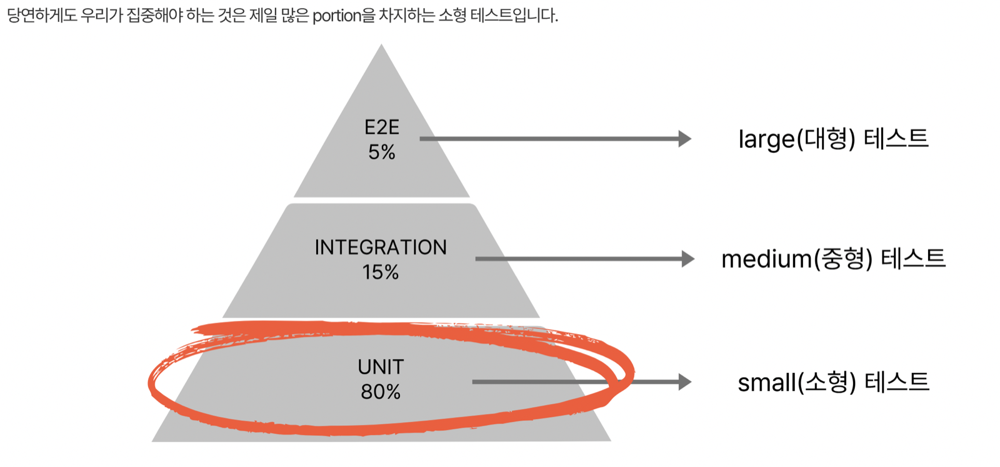
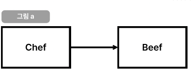
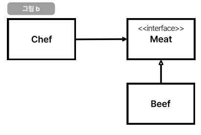
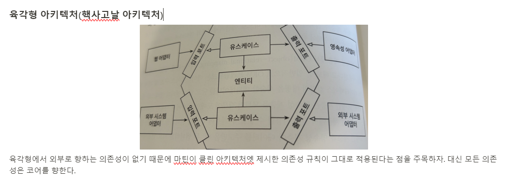

### 강의를 수강하게 된 계기

---

링크드인에서 이동욱 인프런 CTO님을 팔로우했는데, **Java/Spring 테스트를 추가하고 싶은 개발자들의 오답노트** 강의에 대한 평가를 너무 좋게 작성해서 놀랐다는 글을 보았습니다.

nextStep에서 객체지향적으로 설계하는 방법과 TDD 작성을 배웠음에도 실무에 적용하려고 했을 때 유동적이지 못했던 경험이 있어서, 좀 더 공부하고 싶은 마음에 강의를 수강하게 되었습니다.

5월 12일 현재 섹션 1까지 들었는데, 저에게 가장 인상 깊었던 부분과 실무에도 적용하면 좋을 것 같다고 생각되는 부분을 작성하도록 하겠습니다.

### 테스트에서의 제일 중요한 부분

---

1. 제일 중요한 것은 당연하게도 소형 테스트입니다.



소형 테스트를 진행하기 위해서는 행위보다는 상태를 테스트하는 것이 좋습니다.

### 테스트에서 사용하는 개념

---

- SUT : System Under Test(테스트하려는 대상)

```java
@Test
void 유저테스트() {
	//given
	User sut = User.builder()
		.bookmark(new ArrayList<>())
		.build(); // 테스트 하려는 대상
}
```

- 테스트 픽스처 : 테스트에 필요한 자원을 생성하는 것

```java
private User sut;

@BeforeEach
void 사용자는_미리_할당합니다() {
	sut = User.builder()
		.bookmark(new ArrayList<>())
		.build(); // 테스트 하려는 대상
}
```

- 더미(dummy) : 아무런 동작도 하지 않고, 정상적으로 돌아가기 위해 전달하는 객체

```java
@Test
public void 이메일_회원가입을_할_수있다() {
	//given
	UserCreateRquest userCreateReuqest = userCreateRequest.builder()
			.email("foo@localhost.com")
			.password("123456")
			.build();
			
	UserService sut = UserService.builder()
			.registerEmailSender(new DummyRegisterEmailSender())
			.userRepository(userRepository)
			.build();
	sut.register(userCreateReuqest)
}

//더미 객체가 되는 것.
class DummyRegisterEmailSender implements RegisterEmailSender {

		@Override
		public void send(String email, String message) {
		}
}
```

- 속임(Fake) : Local에서 사용하거나 테스트에서 사용하기 위해 만들어진 가짜 객체

```java
@Test
public void 이메일_회원가입을_할_수있다() {
	//given
	UserCreateRquest userCreateReuqest = userCreateRequest.builder()
			.email("foo@localhost.com")
			.password("123456")
			.build();
			
	UserService sut = UserService.builder()
			.registerEmailSender(new DummyRegisterEmailSender())
			.userRepository(userRepository)
			.build();
	sut.register(userCreateReuqest)
}

//더미 객체가 되는 것.
class FakeRegisterEmailSender implements RegisterEmailSender {

		private final Map<String, List<String>> latestMessages = new HashMap<>();
		
		@Override
		public void send(String email, String message) {
				List<String> records = latestMessage.getOrDefault(email, new ArrayList<>());
				records.add(message);
				latestMessages.put(email, records);
		}
		
		public Optional<String> findLatestMessage(String email) {
				return latestMessages.getOrDefault(email, new ArrayList<>()).stream.findFirst();
		}
}
```

- stub : 미리 준비된 값을 출력하는 객체

```java
class StubUserRepository implements UserRepository {
	
		public User getByEmail(String email) {
				if (email.equals("foo@bar.com")) {
						return User.builder()
								.email("foo@bar.com")
								.status("PENDING")
								.build();
				}
				throw new UsernameNotFoundException(email);
		}
}
```

### 의존성 ⭐️⭐️⭐️⭐️⭐️⭐️

---

강의를 들으면서 정말 좋았던 부분이었습니다. **`의존성 주입과 의존성 역전을 통해서 유연하게 테스트를 진행할 수 있고, 소스코드 관리도 더 잘할 수 있다는 부분`**이었습니다. 이 부분은 소스코드를 남기고 차후에도 볼 수 있도록 정리하였습니다.

- 의존성 주입 (DI) : 인스턴스를 직접 만드는 것이 아니라, 상위에서 생성해서 생성자를 통해 객체를 매개변수로 받습니다.



- 의존성 역전 (DIP) : 인터페이스나 추상 클래스 같은 추상적인 선언을 참조해서 사용합니다.



⭐️⭐️⭐️ 테스트 잘하는 방법

테스트를 잘하려면 의존성 주입과 의존성 역전을 잘 다룰 수 있어야 합니다.

---

### user 객체 마지막 로그인 시간 테스트

- user 객체
    
    ```java
    class User {
    		private long lastLoginTimestamp;
    		
    		public void login() {
    				//..
    				this.lastLoginTimestamp = Clock.systemUTC().millis();
    		}
    }
    ```
    
    - 내부 로직은 Clock에 의존합니다.
    - 외부에서 보면 login이 시간에 의존하고 있는지 알 수 없습니다.

**문제발생**

- User의 로그인 시간을 테스트하려면 어떻게 해야 할까요?
    
    ```java
    class UserTest {
    		
    		@Test
    		public boid login_테스트() {
    			User user = new User();
    			
    			user.login();
    			
    			assertThat(user.getLastLoginTimestamp()).isEqualTo(???); // 😭🥳 어떻게 테스트 해야 될 지 모른다.
    		}
    }
    ```
    
- **`내부에서 의존적으로 코드를 작성했기 때문에 테스트를 진행할 수 없습니다.`**

**해결방법**

- 의존성 주입으로 해결 가능합니다.
    
    ```java
    class User {
    		private long lastLoginTimestamp;
    		
    		public void login(Clock clock) {
    				//..
    				this.lastLoginTimestamp = clock.millis();
    		}
    }
    ```
    
- User 테스트 코드
    
    ```java
    class UserTest {
    		
    		@Test
    		public boid login_테스트() {
    			User user = new User();
    			Clock clock = Clock.fixed(Instant.parse("2000-01-01T00:00:00.00Z"));
    			
    			user.login(clock);
    			
    			assertThat(user.getLastLoginTimestamp()).isEqualTo(946684800000L); 
    		}
    }
    ```
    

---

### UserService 테스트

- UserService 클래스

```java
class UserService {
		public void login(User user) {
				user.login(Clock.systemUTC());
		}
}
```

문제발생 ⭐️⭐️⭐️

- userServiceTest
    
    ```java
    class UserServiceTest {
    		@Test
    		public void login_테스트() {
    				User user = new User();
    				userService userService = new UserService();
    				
    				userService.login(user);
    				
    				assertThat(user.getLastLoginTimestamp()).isEqualTo(???);
    		}
    }
    ```
    
- 유저 서비스에서 테스트를 진행하려고 할 때 의존성 주입으로 고정값을 지정해줘야 합니다. → 결국 User에서처럼 내부의 값을 어딘가에서 숨겼기 때문에 테스트하기 어려워지는 것입니다. 이를 해결하려면 DIP(의존성 역전)를 사용해야 합니다.

**해결방법**⭐️⭐️⭐️

- Clock interface
    
    ```java
    interface ClockHolder {
    
    		long getMillis();
    
    }
    ```
    
- TestClockHolder
    
    ```java
    @AllArgsConstructor
    class TestClockHolder implements ClockHolder {
    		
    		private Clock clock;
    		
    		public long getMillis() {
    			return Clock.millis();
    		}
    }
    ```
    
- userService
    
    ```java
    @Service
    @RequiredArgsConstructor
    class UserService {
    		
    		private final ClockHolder clockHolder;
    		
    		public void login(User user) {
    				user.login(clockHolder)
    		}
    }
    ```
    
- UserServiceTest
    
    ```java
    class UserServiceTest {
    
    		@Test
    		public void 로그인_테스트() {
    				Clock clock = Clock.fixed(Instant.parse("2000-01-01T00:00:00.00Z"));
    				User user = new User();
    				UserService = new UserService(new TestClockHolder(clock));
    				
    				//when 
    				userService.login();
    				
    				//then
    				assertThat(user.getLastLoginTimestamp()).isEqualTo(946684800000L);
    		}
    }
    ```
    
    - 항상 일관된 테스트 코드를 작성할 수 있고, 쉽게 깨지지 않습니다.
    
      이런 형식으로 Controller도 DIP를 사용해서 테스트를 진행합니다.
    
    신기하게도 어느새 [만들면서 배우는 클린 아키텍처]의 헥사고날 아키텍처가 되어가고 있었고, 기존에 읽었던 책들을 다시 한번 생각하는 계기가 되었습니다.
    
    02 [만들면서 배우는 클린 아키텍처] 의존성 역전하기.
    
    
    
    ### 후기
    
    ---
    
    오늘은 [**Java/Spring 테스트를 추가하고 싶은 개발자들의 오답노트]** 라는 강의를 보았습니다. 자바를 시작했거나 스프링을 시작한 지 얼마 안 됐다면 어려울 수도 있겠지만, 현업에서 Spring을 하고 있는 사람이라면 충분히 이해할 수 있을 것이라고 생각되고, 테스트하는 데 큰 도움이 된 강의였습니다.
    
    **핵심은 DI와 DIP를 이용해 Spring, Mock, DB에 의존적이지 않게 테스트하고, 단위 테스트를 잘해야 한다는 것 같습니다**. 정말 많은 도움이 된 강의입니다. 추천드립니다.
    
    [Java/Spring 테스트를 추가하고 싶은 개발자들의 오답노트 | 김우근 - 인프런](https://www.inflearn.com/course/자바-스프링-테스트-개발자-오답노트/dashboard)
