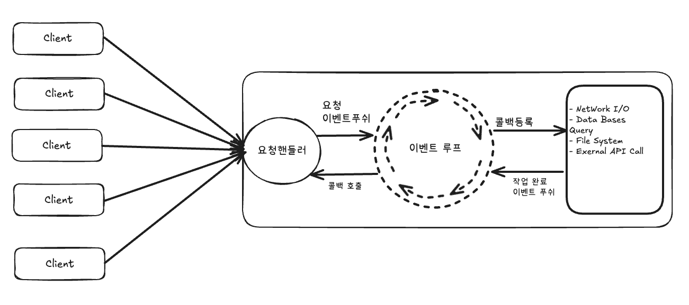

오늘은 골든크로스 데드크로스 돌파에 따른 매수, 매도 프로젝트를 구성하면서 어떤 생각을 하였고 왜 해당 기술을 사용했는지 설명하려고 작성하였습니다.

일단 필요한 API는

1. 실시간 시세 수집
2. 주문 처리
3. 텔레그램 알림 API 등

다양한 API를 활용해야 됐고, 자료를 찾는 중 `WebFlux`를 알게 되었습니다. WebFlux는 리액티브 웹 애플리케이션으로 Spring 5.0부터 지원되는 Reactive Web Framework입니다.

- Spring MVC의 (Thread-per-Request 모델)은 보통 요청 1개에 1개의 스레드를 할당받습니다.

```text
요청 1개 → 스레드 1개 할당 → 작업 완료까지 스레드 점유
```

- 반면 Spring WebFlux(Event Loop 모델)는 요청 N개를 소수의 스레드로 공유받고 작업 대기 시 스레드를 해제합니다.

```text
요청 N개 → 소수의 스레드 공유 → 작업 대기시 스레드 해제
```

### WebFlux가 등장한 이유는

아래 총 4가지가 가장 크다고 생각됩니다.

1. Spring MVC의 한계
    
    ```text
    동시 접속자 10,000명이 접속하면?
    
    Spring MVC:
    - 10,000개의 스레드 필요
    - 1개 스레드 = 약 1MB 메모리
    - 10,000 × 1MB = 10GB 메모리 필요!
    - 스레드 생성/관리 비용 증가
    - 컨텍스트 스위칭 오버헤드 급증
    ```
    

1. I/O 대기 시간 낭비
    
    ```text
    Spring MVC 요청 처리 시간 분석:
    
    총 1000ms 중:
    ├─ 실제 비즈니스 로직: 50ms (5%)
    ├─ DB 조회 대기: 500ms (50%) 스레드 점유
    ├─ 외부 API 호출 대기: 400ms (40%) 스레드 점유
    └─ 기타: 50ms (5%)
    
    95%의 시간을 대기하면서 스레드를 점유
    ```
    

1. 마이크로서비스 아키텍처의 부상
    
    ```text
    모놀리식 → 마이크로서비스 전환
    
    특징:
    - 서비스간 빈번한 HTTP 통신
    - 다수의 외부 API 호출
    - 네트워크 I/O 대기 시간 증가
    
    Spring MVC:
    각 API 호출마다 스레드가 블로킹되어 대기
    → 성능 병목 현상 발생
    ```
    

1. 실시간 스트리밍 데이터 처리 요구
    
    ```text
    최근 애플리케이션 트렌드:
    
    - 실시간 채팅
    - 실시간 알림 (Server-Sent Events)
    - 스트리밍 데이터 처리
    - WebSocket 통신
    
    Spring MVC:
    전통적인 요청-응답 모델에 최적화
    → 실시간 처리에 비효율적
    ```
    

그렇다면 이러한 문제를 WebFlux는 어떻게 해결했을까요?

서버 엔진을 Netty를 통하여 요청에 대한 처리 방식을 이벤트 루프 방식의 논블록킹 단일 스레드를 활용하였습니다.



아래 동작 순서는 Client 요청 > 요청 핸들러 > 이벤트 루프 푸시 > 콜백 등록 > 비동기 작업 후 > 이벤트 푸시 > 콜백 호출 순으로 동작합니다.

그렇다면 왜 다중 스레드를 활용하는 MVC보다 적은 스레드를 사용하는 WebFlux가 더 효율적인지 궁금해졌습니다.

1. CPU 집약적 작업 (계산이 많고 I/O 대기가 적음)

```java
// 복잡한 계산, 이미지 처리, 암호화 등
@GetMapping("/calculate")
public Result heavyCalculation() {
    // CPU만 사용하는 연산
    for (int i = 0; i < 100000000; i++) {
        // 복잡한 계산...
    }
    return result;
}
```

- **특징**: CPU를 계속 사용
- **대기 시간**: 거의 없음
- **스레드 상태**: 항상 실행 중

1. I/O 집약적 작업 (I/O-bound)

```java
// DB 조회, 외부 API 호출, 파일 읽기 등
@GetMapping("/order")
public Order getOrder(String id) {
    Order order = orderRepository.findById(id);      // DB I/O 100ms
    Payment payment = paymentApi.getPayment(id);    // API I/O 200ms
    Delivery delivery = deliveryApi.getStatus(id);  // API I/O 150ms
    return combine(order, payment, delivery);
}
```

- **특징**: I/O를 기다림
- **대기 시간**: 전체 시간의 80~95%
- **스레드 상태**: 대부분 대기(블로킹) 중

```text
**시나리오
작업 내용: 복잡한 수학 계산, 이미지 처리
총 처리 시간: 1000ms
├─ CPU 연산: 950ms (95%)
└─ I/O 대기: 50ms (5%)

-----------
Spring MVC**
-----------
8코어 CPU 환경:
- 동시에 8개 스레드가 CPU 사용
- 나머지 192개는 대기
- CPU 활용률: 100%

1000개 요청 처리:
1000개 ÷ 8 = 125라운드
125 × 1초 = 125초

-----------
**Spring WebFlux**
-----------
8코어 CPU 환경:
- 동시에 8개 스레드가 CPU 사용
- 나머지 8개는 대기
- CPU 활용률: 100%

1000개 요청 처리:
1000개 ÷ 8 = 125라운드
125 × 1초 = 125초
```

즉 **`CPU 집약적 작업에서는 컨텍스트 스위칭 비용만 차이 날 뿐 크게 차이는 없습니다.`**

하지만 최근 프로젝트에서 많이 사용하는 I/O가 많은 작업들일 경우에는 어떻게 될까요?

```text
작업 내용: DB 조회, 외부 API 호출
총 처리 시간: 1000ms
├─ CPU 연산: 50ms (5%)
└─ I/O 대기: 950ms (95%)  ← 대부분이 대기!

**-----------
Spring MVC**
-----------
Thread 1: [CPU 5%][I/O 대기 95%🔒] ← 스레드 블로킹!
Thread 2: [CPU 5%][I/O 대기 95%🔒] ← 스레드 블로킹!
Thread 3: [CPU 5%][I/O 대기 95%🔒] ← 스레드 블로킹!
...
Thread 200: [CPU 5%][I/O 대기 95%🔒] ← 스레드 블로킹!

95%의 시간동안 스레드는 아무것도 안 하고 메모리만 차지
1000개 요청 처리:
200개씩 5번 = 5초
처리량: 200 req/sec

-----------
**Spring WebFlux**
-----------
Thread 1: [Req1-CPU][Req2-CPU][Req3-CPU]...[Req100-CPU]
          └ I/O 시작 → 즉시 해제 
          
I/O 작업들은 백그라운드에서 동시 진행:
Request 1: DB 조회 중... (비동기)
Request 2: API 호출 중... (비동기)
Request 3: 파일 읽기 중... (비동기)

I/O 완료되면:
Thread 2: [Req1-완료][Req2-완료][Req3-완료]...

1000개 요청 처리:
모든 요청이 거의 동시에 시작
→ I/O는 병렬로 진행
→ 약 1.2초에 완료

처리량: 833 req/sec
```

즉 위 결과를 알 수 있듯이, WebFlux는 비동기 처리 방식 덕분에 **여러 I/O 작업이 동시에 진행**되면서, **처리량이 약 4배 가량 크게 증가한 것**을 확인할 수 있고, 또한 CPU 사용률 또한 MVC에 비해 월등히 좋은 것을 알 수 있었습니다.

그렇다면, 이를 바탕으로 어떤 관점에서 WebFlux를 사용해야 될지 MVC를 사용해야 될지 알 수 있을 것 같습니다.

**Spring MVC를 사용해야 하는 경우**

1. CPU 집약적 작업이 많은 경우
2. 간단한 CRUD 애플리케이션
3. 블로킹 라이브러리를 많이 사용하는 경우

일 것 같습니다.

**Spring WebFlux를 사용해야 하는 경우**

1. I/O 집약적 작업이 많은 경우
2. 높은 동시성이 필요한 경우
3. 마이크로서비스 아키텍처

일 것 같습니다. 현재 저는 실시간 알림 서비스 + 시세를 받아서 처리하는 로직을 구현해야 되기 때문에 WebFlux가 좀 더 부합하다고 생각하게 되었고, 이를 기반으로 소스코드를 구현하고, 학습하도록 하겠습니다. 그리고 추가로 WebFlux도 동기적인 라이브러리를 사용할 수 있다고 보았는데, 비동기 방식의 WebFlux를 동기적인 라이브러리를 사용할 경우 MVC와 동일한 퍼포먼스를 낼 것 같다고 생각하였습니다. 이 부분에 대해서는 추가로 작성하도록 하겠습니다. 감사합니다.
