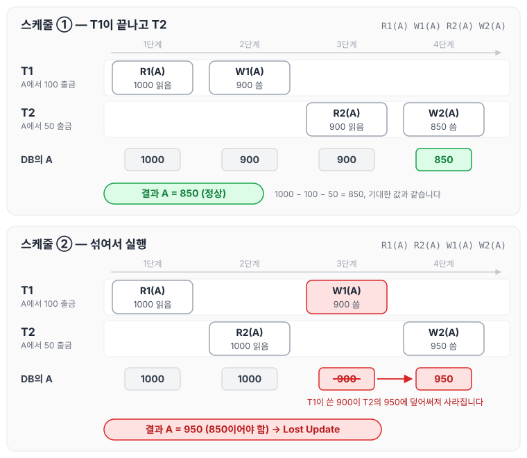
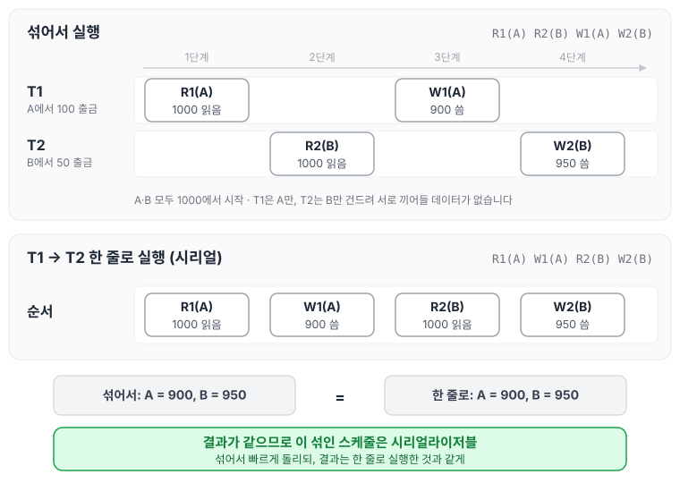
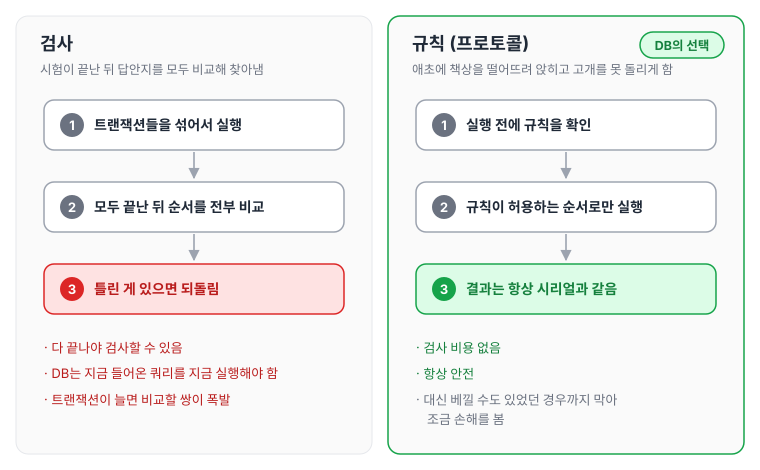
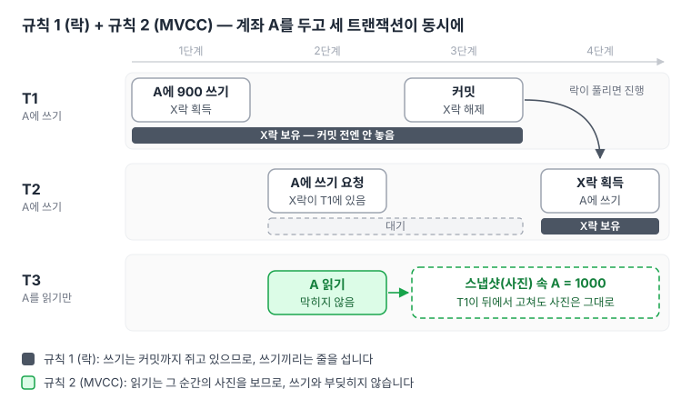
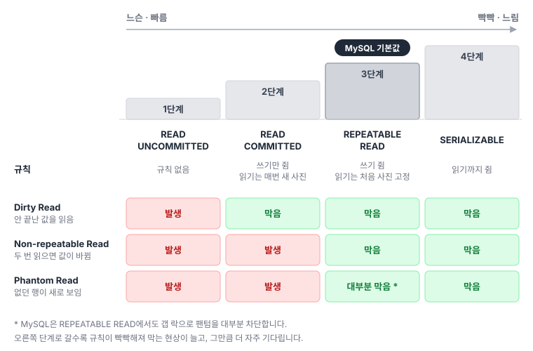
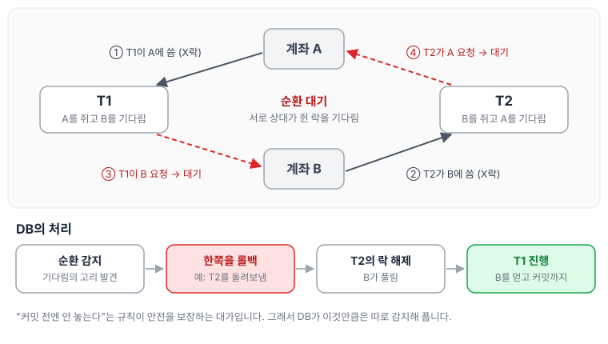

이전에 [MVCC](../mvcc/)와 [비관적 락](../pessimistic-lock/)에 대해 작성하였습니다. 이번에는 그 바탕이 되는 트랜잭션 스케줄과 격리 수준에 대해 정리하도록 하겠습니다.

내용을 요약하자면 아래와 같습니다.

1. 트랜잭션을 섞어서 실행하면 빠르지만, 잘못 섞으면 결과가 틀립니다.
2. DB는 "틀렸는지 나중에 검사"하는 대신 "처음부터 틀리게 섞이지 않는 규칙"을 정해 둡니다.
3. 격리 수준은 그 규칙을 얼마나 빡빡하게 할지 정하는 단계입니다.

---

## 1. 스케줄: 실제로 실행된 순서

트랜잭션 하나는 읽기(R)와 쓰기(W)의 묶음입니다. 여러 트랜잭션이 동시에 들어와도 DB는 결국 연산들을 **한 줄로 세워 하나씩** 실행하는데, 그 순서가 **스케줄**입니다.

```text
T1: 계좌 A에서 100 출금    T2: 계좌 A에서 50 출금

스케줄 ①  R1(A) W1(A) R2(A) W2(A)   ← T1 끝나고 T2
스케줄 ②  R1(A) R2(A) W1(A) W2(A)   ← 섞여서 실행
```

두 스케줄을 단계별로 펼쳐, 각 단계에서 무엇을 읽고 무엇을 썼는지 따라가 보면 차이가 분명해집니다. 계좌 A의 처음 잔액은 1000입니다.



스케줄 ①에서는 T2가 T1이 쓴 900을 읽고 850을 남깁니다. 스케줄 ②에서는 T2가 T1이 쓰기 전의 1000을 읽은 탓에, T1이 쓴 900이 T2의 950에 덮어써져 사라집니다. 이렇게 앞선 쓰기가 사라지는 현상을 Lost Update라고 부릅니다.

같은 트랜잭션들이라도 **섞이는 방식에 따라 결과가 달라질 수 있다**는 게 출발점입니다.

## 2. 시리얼 vs 논시리얼 vs 시리얼라이저블

| 구분 | 뜻 | 결과 | 속도 |
|---|---|---|---|
| 시리얼 | 한 번에 하나씩 끝까지 | 항상 옳음 | 느림 |
| 논시리얼 | 섞어서 실행 | 틀릴 수 있음 | 빠름 |
| **시리얼라이저블** | 섞었는데 결과가 시리얼과 같음 | 옳음 | 빠름 |

스케줄 ②를 보면 둘 다 1000을 읽고 각자 900, 950을 써서 **850이어야 할 값이 950**이 됩니다. 섞었는데 틀린 경우입니다.

반면 T1이 계좌 A, T2가 계좌 B를 건드린다면 아무리 섞어도 "T1 다음 T2"와 결과가 같습니다. 이게 **시리얼라이저블**이고, 우리가 원하는 건 바로 이것입니다. **섞어서 빠르게 돌리되, 결과는 한 줄로 실행한 것과 같게.**

아래 그림은 이 경우를 섞어서 실행한 흐름과 T1 → T2 한 줄로 실행한 흐름으로 나란히 놓은 것입니다. 계좌 B도 1000에서 시작한다고 두었습니다.



두 흐름 모두 A는 900, B는 950으로 끝납니다. 섞어서 실행했어도 결과가 한 줄로 실행한 것과 같으니, 이 스케줄은 시리얼라이저블입니다.

(참고로 "컴플리트 스케줄"은 모든 트랜잭션이 커밋이나 롤백으로 끝까지 마무리된 스케줄을 말합니다. 중간에 끊긴 게 아니라 완료된 스케줄을 놓고 판단한다는 뜻입니다.)

## 3. 왜 ‘검사’가 아니라 ‘규칙’인가

시험 부정행위를 막는 방법이 두 가지 있습니다.

- **검사:** 시험이 끝난 뒤 모든 답안지를 비교해서 베낀 사람을 찾습니다.
- **규칙:** 애초에 책상을 떨어뜨려 앉히고 고개를 못 돌리게 합니다.

DB는 **규칙**을 택합니다. 검사는 다 끝나야 할 수 있는데 DB는 지금 들어온 쿼리를 지금 실행해야 하고, 트랜잭션이 많아지면 비교할 쌍이 폭발적으로 늘기 때문입니다. 규칙은 "베낄 수도 있었던 사람"까지 떨어뜨려 앉히니 조금 손해는 보지만, 검사 비용 없이 **항상 안전**합니다. 이 규칙을 **프로토콜**이라고 부릅니다.

두 방식을 흐름으로 나란히 놓으면 차이가 어디서 생기는지 보입니다.



검사는 일이 다 끝난 뒤에야 맞고 틀림을 판단할 수 있고, 규칙은 실행하기 전에 이미 안전한 순서만 허용합니다.

## 4. DB가 쓰는 규칙은 딱 두 가지

**규칙 1: 쓸 거면 끝날 때까지 쥐고 있어라 (락)**
공용 공책에 어떤 페이지를 쓰기 시작했으면, 내 할 일이 다 끝날 때까지(커밋) 그 페이지를 놓지 않습니다. 그래서 남이 끼어들어 덮어쓸 수 없습니다. 교과서의 "2단계 락"이 이 규칙의 정식 이름인데, 실무에서는 "**커밋 전엔 안 놓는다**"로 기억하면 됩니다.

**규칙 2: 읽기만 할 거면 사진 찍어서 봐라 (MVCC)**
읽는 사람까지 페이지를 붙잡으면 아무도 못 씁니다. 그래서 읽는 사람은 그 순간의 사진을 찍어서 봅니다. 남이 뒤에서 고쳐도 내 사진은 안 변하니 읽기와 쓰기가 부딪히지 않습니다.

이 두 규칙만 지키면 아무리 섞어도 **한 명씩 차례로 한 것과 같은 결과**가 나옵니다. [비관적 락](../pessimistic-lock/) 글에서 다룬 X락, S락, 갭 락은 전부 이 규칙을 구현하는 부품입니다.

계좌 A 하나를 두고 쓰려는 트랜잭션 둘(T1, T2)과 읽기만 하는 트랜잭션 하나(T3)가 동시에 들어왔을 때, 두 규칙이 어떻게 움직이는지 그려 보면 다음과 같습니다.



T2의 쓰기는 T1이 커밋하며 락을 놓을 때까지 기다리지만, T3의 읽기는 사진(스냅샷)을 보므로 누구도 기다리지 않습니다. 쓰기끼리는 줄을 서고, 읽기는 그 줄에 서지 않는 셈입니다.

## 5. 격리 수준: 규칙을 얼마나 빡빡하게 할까

규칙을 완벽히 지키면 너무 자주 기다리게 됩니다. 그래서 DB는 "조금 느슨하게 해도 될까?"라고 묻고, 그 느슨함의 단계가 격리 수준입니다. **아래로 갈수록 빡빡하고 느립니다.**

| 단계 | 규칙 | 생길 수 있는 문제 | 느낌 |
|---|---|---|---|
| READ UNCOMMITTED | 없음 | 아직 안 끝난 값을 읽음 (Dirty Read) | 빠르지만 위험, 거의 안 씀 |
| READ COMMITTED | 쓰기만 쥠, 읽기는 매번 새 사진 | 두 번 읽으면 값이 바뀜 (Non-repeatable Read) | 적당 |
| **REPEATABLE READ** | 쓰기 쥠, 읽기는 처음 사진 고정 | 거의 없음 (MySQL은 갭 락으로 팬텀도 대부분 차단) | **MySQL 기본값** |
| SERIALIZABLE | 읽기까지 쥠 | 없음 | 안전하지만 가장 느림 |

같은 내용을 네 단계의 계단으로 놓고, 단계마다 어떤 현상이 막히는지 표시하면 다음과 같습니다.



오른쪽 단계로 갈수록 막는 현상이 늘어나는 대신 그만큼 더 자주 기다립니다.

격리 수준은 "DB가 얼마나 똑똑하게 검사하느냐"가 아니라, "**어떤 규칙을 적용해서 어디까지 섞는 걸 허용할까**"를 개발자가 고르는 다이얼입니다.

## 6. 데드락은 규칙의 부작용

"쓸 거면 끝까지 쥐어라" 때문에 두 트랜잭션이 **서로 상대가 쥔 페이지를 기다리는** 상황이 생길 수 있습니다. 규칙이 안전을 보장하는 대가입니다. 그래서 DB는 이것만큼은 따로 감지해서 한쪽을 돌려보냅니다(롤백).

T1과 T2가 계좌 A와 B를 엇갈려 쓰는 경우를 그려 보면 다음과 같습니다.



그림에서 롤백되는 T2는 예시입니다. 어느 쪽이든 한쪽을 돌려보내면 기다림의 고리가 풀리고, 남은 트랜잭션이 끝까지 진행합니다.

---

## 한 줄로

> 트랜잭션이 섞여 실행된 순서가 **스케줄**이고, 섞여도 한 줄로 한 것과 결과가 같으면 **시리얼라이저블**입니다. DB는 매번 검사하지 않고 "**쓸 거면 끝까지 쥐고, 읽을 거면 사진 찍어라**"라는 규칙으로 안전하게 섞어 돌리며, **격리 수준**은 그 규칙을 1단계(느슨)부터 4단계(빡빡)까지 고르는 다이얼입니다. MySQL 기본값은 3단계 REPEATABLE READ입니다.
